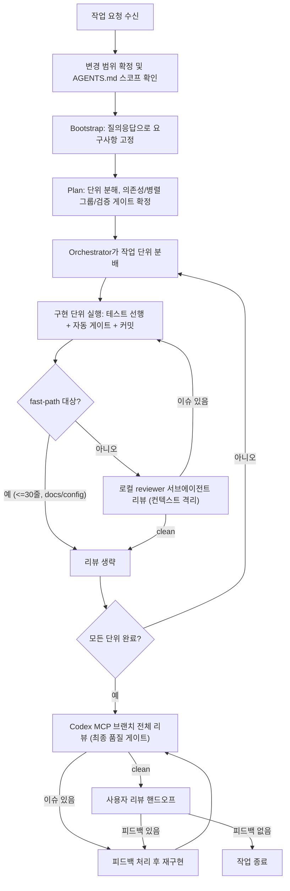
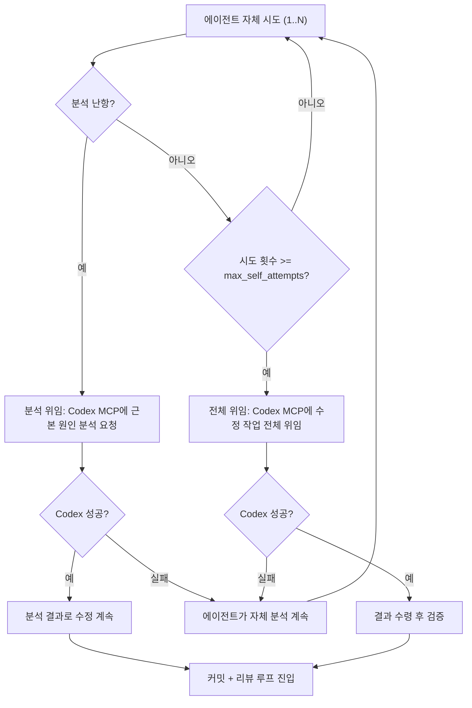

# 코딩 에이전트와 Sonamu를 개발하기 위한 매뉴얼

## 작업 전 준비사항

1. 작업 환경에 `ast-grep`과 `gritql`을 추가로 설치해주세요.
2. Codex를 활용해 플래닝 / 코드 리뷰를 진행할 경우, 다음 작업들을 수행해주세요.
   - Claude Code 등의 코딩 에이전트에서 다음과 같이 Codex MCP를 추가해주세요. 다음 명령어는 사용자 스코프로 Codex MCP 서버를 설치합니다. `claude mcp add -s user -t stdio codex -- codex mcp-server`
   - 아래 내용을 참고해서 `~/.codex/config.toml` 파일을 업데이트해주세요.
3. 공통적인 Skills의 경우 Git Repository에서 관리하지 않습니다. 첫 실행 시에는 코딩 에이전트(종류 불문)에게 다음과 같이 프롬프트를 입력해서 Skills를 설치해주세요.
   - "지금 에이전틱 워크플로우에 필요한 skills가 모두 설치되었는지 확인해주세요. 설치되지 않았으면 npx skills를 활용해 설치해주세요."

### `~/.codex/config.toml` 예시

```toml
model = "gpt-5.3-codex"
model_reasoning_effort = "xhigh"
personality = "pragmatic"

# Reasoning 결과를 에이전트에서도 출력해주게 합니다.
model_reasoning_summary = "detailed"
hide_agent_reasoning = false

# 전체 Reasoning 출력은 우선 비활성화
# show_raw_agent_reasoning = true

[features]
collab = true                       # 서브 에이전트 실행을 활성화합니다.
memory_tool = true                  # Codex가 작업 기억을 위해 메모리를 쓸 수 있게 됩니다.
sqlite = true                       # 메모리 툴을 쓰기 위한 데이터베이스를 켭니다.
responses_websockets_v2 = true      # SSE API 대신 효율적 실시간 처리를 위해 새로운 웹소켓 API를 사용합니다.
child_agents_md = true              # 서브 디렉토리의 AGENTS.md도 자동으로 읽을 수 있게 합니다.
undo = true                         # 에이전트의 작업을 취소할 수 있게 합니다.

[notice]
hide_full_access_warning = true

# 피드백 코맨드를 통한 데이터 수집을 막습니다.
[feedback]
enabled = false

# Linear, Notion, Playwright MCP 전역 설정
[mcp_servers.linear]
url = "https://mcp.linear.app/mcp"

[mcp_servers.notion]
url = "https://mcp.notion.com/mcp"

[mcp_servers.playwright]
command = "npx"
args = ["@playwright/mcp@latest"]
```

## 전체 작업 플로우



## 문서의 목적

이 문서는 에이전트로 실제 개발을 수행하는 순서를 안내합니다.
핵심은 아래 세 가지입니다.

1. 계획을 충분히 만든 뒤 구현합니다.
2. 구현마다 리뷰를 닫고 다음으로 진행합니다.
3. 브랜치 리뷰까지 닫은 뒤 사용자에게 전달합니다.

## 코딩 에이전트별 차이

### Claude Code
- `.claude/agents/*.md` preset(subagent)을 사용할 수 있습니다.
- Orchestrator는 preset 기반 역할 분배를 우선 사용합니다.
- Orchestrator는 코드를 직접 수정하지 않습니다.

### 기타 코딩 에이전트(Codex, OpenCode, Amp, Cursor 등)
- preset 미지원 환경을 기본으로 보고 inline fallback으로 운영합니다.
- 아래 파일 참조를 spawn payload에 명시합니다.
  - `/Users/Nebuleto/Workspace/sonamu/.agents/workflow/subagents/00_agent_roles.md`
  - `/Users/Nebuleto/Workspace/sonamu/.agents/workflow/prompts/*.md`

## 실제 개발 절차

### 1. Bootstrap 단계

1. 스펙, 이슈, 요구사항을 읽습니다.
2. 궁금한 점이 있다면 질문하여 요구사항을 고정합니다.
3. 다음 항목을 확정합니다.
  - 성공 기준
  - In-scope/Out-of-scope
  - 제약/Non-goal
  - 영향 패키지
  - 프레임워크 분류(기본은 프로젝트 구조/AGENTS 패키지 맵 기준, 신규/예외만 재분류)
  - 필수 도구/필수 스킬

### 2. Plan 단계

1. 작업을 커밋 가능한 최소 단위로 분해합니다.
2. 단위 간 의존성과 병렬 그룹을 정합니다.
3. 단위별 소유자와 검증 명령을 정합니다.
4. 백엔드/라이브러리 작업에는 회귀 테스트 항목을 포함합니다.
5. 플랜에 대해선 작업자와의 질의응답을 반복하며 최대한 자세하게 해상도를 높입니다.

### 3. 구현 단계

1. 구현 단위별로 작업합니다.
2. 검증해야하는 항목에 대해 테스트를 먼저 추가합니다.
3. 최소 변경으로 구현합니다.
4. 단위 테스트 및 통과 조건을 완료하면 즉시 리뷰를 요청합니다.

### 4. 리뷰 단계

리뷰는 반드시 두 단계로 닫습니다.
리뷰 우선순위는 아래 순서를 고정으로 사용합니다.

1. 잠재 버그
2. 요구사항 충족 여부
3. 성능/보안 위험

#### 1) 단위 작업에 대한 리뷰 루프
- 구현 서브 에이전트가 자동 게이트(lint, type-check, test)를 통과하고 커밋한 뒤 Orchestrator에 반환합니다.
- Orchestrator가 **별도의 reviewer 서브 에이전트**를 스폰하여 유닛 리뷰를 수행합니다.
- reviewer는 구현 에이전트의 컨텍스트를 공유하지 않으며, diff와 `must_verify_behaviors`, 게이트 결과만 받습니다 (컨텍스트 격리).
- 이슈가 있으면 수정 후 재리뷰합니다. 미해결 항목이 0이 될 때까지 반복합니다.
- **fast-path**: 사소한 변경(30줄 이하, docs/formatting/config만 변경, 모든 게이트 통과)은 reviewer 스폰을 건너뛰고 바로 통과합니다.

#### 2) 브랜치 리뷰 루프
- 모든 유닛 리뷰가 종료된 후 Codex MCP로 브랜치 전체 리뷰를 수행합니다 (최종 품질 게이트).
- 이슈가 있으면 피드백 처리 후 재리뷰합니다.
- 미해결 항목이 0이 될 때까지 반복합니다.

### 5. 사용자 리뷰 단계

아래 조건이 모두 충족되면 전달합니다.

1. 단위 리뷰 종료
2. 브랜치 리뷰 종료
3. 미해결 항목 0건

전달 시 아래를 포함합니다.

- 무엇을 변경했는지
- 왜 변경했는지
- 어떤 검증을 통과했는지
- 남은 리스크가 있는지

## 에이전트의 Git 커밋

에이전트는 직접 Git에 커밋할 수 있으며, 다음과 같은 커밋 메세지 가이드라인을 가집니다.

1. 형식: `[scope] type: short title`
2. 진행 중 형식: `[scope] type(wip): short title`
3. `type`은 필수입니다.
4. `Phase`, `Wave` 같은 작업 순서 태그는 금지합니다.
5. 커밋 메시지는 한국어로 작성합니다.
6. 다중 scope도 허용하며 전체 하위 프로젝트 영향 시 `[*]`를 사용합니다.
7. sync나 자동 생성 파일은 scope 산정에서 제외합니다.
8. Linear 티켓 번호/PR 번호 레퍼런스는 허용합니다. 오히려 Linear 티켓 번호 레퍼런스는 권장합니다.
9. 커밋에 `Co-Authored-By` trailer를 추가하지 않습니다.

## 몇 가지 에이전트의 규칙

1. generated 파일(`*.generated.ts`, `sonamu.generated.*`, `queries.generated.ts`)은 직접 수정하지 않습니다.
2. `entity.json` 변경/마이그레이션 실행은 원칙적으로 사용자 주도(Sonamu UI/CLI)로 진행하며, 에이전트 직접 수행 시 사전 확인을 받습니다.
3. 다음 작업은 에이전트가 직접 수행할 수 없습니다.
  - 에이전트에 의한 사용자의 명시적 동의 없는 배포와 마이그레이션 실행 (`entity.json` 및 마이그레이션은 원칙적으로 Sonamu UI나 CLI로 수행합니다.)
  - 로컬 DB의 수정 작업
  - 원격 DB 직접 접속 / 조회 / 수정
  - Terraform / AWS CLI를 이용한 Infrastructure 변경 적용
4. 리뷰 출력이 길어지면 임시 파일 경로만 본문에 남기고, 메타데이터만 대화에 포함합니다.
5. 서브에이전트에서 분해가 필요해지면 leaf worker가 직접 재분해하지 말고 orchestrator로 승격합니다.
6. 구현보다 계획 해상도가 낮다면 구현을 늦추고 Bootstrap/Plan 품질을 먼저 끌어올립니다.

## 자율주행 모드 운영

다음 조건 중 하나라도 만족하면 자율주행으로 간주합니다.
- 사용자 메시지에 `[자율주행]` 포함
- “묻지 말고 끝까지 진행” 같은 명시적 요청

자율주행 중 규칙:
1. 중간 질문 없이 완료까지 진행합니다.
2. 금지사항은 그대로 유지합니다.
3. 불확실성은 `검토 필요 사항`으로 기록하고 진행합니다.
4. 빌드/타입체크 실패 시 해결 시도 + 결과 기록 후 종료합니다.
5. 확신 60% 이상이면 진행하고, 미만이면 `검토 필요 사항`으로 남깁니다.
6. Codex MCP 응답에 대한 human-in-the-loop가 면제됩니다. 응답을 자동 처리하고 `review_metadata`에 기록합니다.

## 사용법 예시

아래는 목표 얼라인부터 플래닝, Orchestrator 실행까지의 전체 흐름 예시입니다.

### 1단계: 목표 얼라인 (Bootstrap)

작업 시작 시 요구사항을 명확히 전달하고, 에이전트가 궁금한 점이 있으면 질문으로 범위를 확정합니다.

```
사용자:
  modules/sonamu에 엔티티 동기화 동작 개선이 필요합니다.
  관련 이슈를 참고하고, 먼저 요구사항을 분석한 뒤 궁금한 점이 있으면 질문해주세요.
```

에이전트는 `.agents/workflow/prompts/00_bootstrap.md`에 따라 성공 기준/비목표/영향 패키지/제약사항을 확정합니다. 계획에 영향을 주는 모호점이 있으면 질의응답을 반복해 해소합니다.

### 2단계: 플래닝 지시

Bootstrap에서 요구사항이 고정되면 플래닝을 지시합니다. 플래닝은 `planner` 서브 에이전트가 수행합니다.

```
사용자:
  요구사항이 확정되었습니다.
  이 기준으로 플래닝을 진행해주세요.
```

`planner` 서브 에이전트는 `.agents/workflow/prompts/01_plan.md`에 따라 다음을 만듭니다.

- `plan_document`: 단위 작업 분해, 의존성 그래프, 병렬 그룹, 검증 매트릭스
- `spawn_manifest`: 각 단위의 `objective_packet`, `gate_profile`, `must_verify_behaviors`, 실행 모드

플래닝 결과를 검토하고, 수정이 필요하면 피드백 후 플랜을 확정합니다.

> [!TIP]
> 플래닝 단계에서도 사용자와 에이전트 간 질의응답이 가능합니다. 플랜 해상도를 높이기 위해 필요한 질문을 충분히 반영한 뒤 확정합니다.

```
사용자:
  U-002 범위에 modules/sonamu/ui-web 영향 점검을 추가해주세요.
  나머지는 괜찮습니다.
```

### 3단계: Orchestrator로 작업 시작

플랜이 확정되면 Orchestrator 실행을 지시합니다.

```
사용자:
  플랜이 확정되었습니다. Orchestrator로 작업을 시작해주세요.
```

이 지시를 받으면 메인 에이전트는 다음을 수행합니다.

1. `.agents/agents/orchestrator.md`와 `.agents/workflow/prompts/07_orchestrator.md`를 읽고 Orchestrator 역할을 수행합니다.
2. `spawn_manifest`의 의존성과 병렬 그룹에 따라 구현 서브 에이전트를 분배합니다.
3. 각 구현 서브 에이전트는 구현 -> 자동 게이트 -> 커밋 후 반환합니다.
4. Orchestrator가 유닛별로 별도의 reviewer 서브 에이전트를 스폰하여 리뷰합니다 (fast-path 대상은 건너뜀).
5. 모든 유닛 리뷰 완료 후 Codex MCP로 브랜치 전체 리뷰를 수행합니다.
6. 미해결 항목이 0건이면 사용자에게 결과를 전달합니다.

### 전체 흐름 요약

| 단계 | 사용자 액션 | 에이전트 동작 |
|------|------------|--------------|
| Bootstrap | 요구사항 전달, 질의응답 | 질문으로 범위 확정 |
| Plan | 플래닝 지시, 결과 검토/피드백 | `planner`가 단위 분해 |
| Orchestrate | Orchestrator 실행 지시 | 메인 에이전트가 Orchestrator로 전환 및 분배 |
| Unit Review | (자율주행 시 자동) | 로컬 reviewer 서브에이전트가 컨텍스트 격리 리뷰 |
| Branch Review | Codex MCP 리뷰 응답 확인 (일반 모드) | Codex MCP 브랜치 전체 리뷰 |
| Handoff | 최종 결과 확인/피드백 | 미해결 0건 확인 후 전달 |

## 핫픽스/버그 수정 시 Codex MCP 문제 해결 에스컬레이션

핫픽스나 인시던트 버그 수정 작업에서 에이전트가 자체적으로 문제를 해결하지 못하는 경우, Codex MCP에 문제 해결을 위임할 수 있습니다.

### 에스컬레이션 흐름



### 2단계 위임 모델

| 단계 | 트리거 | Codex가 받는 것 | 에이전트 역할 |
|------|--------|----------------|-------------|
| 분석 위임 | 근본 원인 파악 난항 | 에러 로그, 재현 경로, 시도한 가설 | progress file 모니터링, 분석 결과 적용 |
| 전체 위임 | `self_attempt_count >= max_self_attempts` | 전체 버그 컨텍스트 + 코드베이스 참조 + 시도 이력 | progress file 모니터링, 완성된 수정 수령 및 검증 |

### 사용자 확인 모드

- **일반 모드**: 에스컬레이션 시점에 사용자에게 Codex MCP 위임 여부를 확인합니다.
- **자율 주행 모드** (`autonomous: true`): 확인 없이 바로 위임을 시도합니다.

Orchestrator가 핫픽스 단위를 spawn할 때 `objective_packet`에 다음을 설정합니다.

- `max_self_attempts`: 전체 위임 전까지 허용하는 자체 시도 횟수 (기본값: 3)
- `autonomous`: 사용자 확인 없이 위임을 진행할지 여부

### Codex MCP 실패 시

Codex MCP 호출이 실패(타임아웃, 연결 오류, 미설치 등)하면 에이전트는 멈추지 않고 자체 시도를 계속합니다. 실패 이력은 `unit_execution_report`에 기록됩니다.

### 진행 상황 확인

Codex MCP에 위임하면 progress file(`/tmp/codex-troubleshoot-XXXXXX.md`)이 생성됩니다. 사용자는 작업 중 언제든지 이 파일을 읽어 Codex의 진행 상황을 확인할 수 있습니다.

> [!TIP]
> 전체 프로토콜은 `.agents/workflow/prompts/06_codex_output_and_sessions.md`의 "Problem-solving escalation session protocol" 섹션을 참고해주세요.

## FAQ

### `classifyHandoffIfNeeded is not defined` 오류가 발생합니다

브랜치 레벨 코드 리뷰 과정에서 이 오류가 발생할 수 있습니다. 이 문제는 Claude Code의 알려진 버그이며 다음 릴리즈에서 수정될 예정입니다. 자세한 내용은 [claude-code#22087](https://github.com/anthropics/claude-code/issues/22087)을 참고해주세요.
