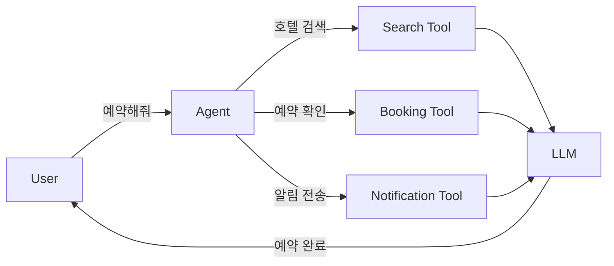

Sonamu는 **Vercel AI SDK**를 기반으로 AI 에이전트를 구축할 수 있습니다. OpenAI, Anthropic 등 다양한 LLM 프로바이더를 지원하며, 커스텀 도구(tools)를 정의하여 에이전트가 특정 작업을 수행하도록 할 수 있습니다.

## AI 에이전트란?

**AI 에이전트**는 대화형 AI 모델(LLM)에 **도구(tools)**를 제공하여 복잡한 작업을 자동으로 수행하도록 하는 시스템입니다.



**특징**:
- LLM이 상황에 맞는 도구를 선택하여 실행
- 여러 단계의 작업을 자동으로 수행
- 컨텍스트를 유지하며 대화

## 필수 패키지 설치

AI 에이전트를 사용하려면 **Vercel AI SDK**와 LLM 프로바이더 패키지를 설치해야 합니다.

### OpenAI 사용

```bash
pnpm add ai @ai-sdk/openai
```

### Anthropic 사용

```bash
pnpm add ai @ai-sdk/anthropic
```

### 둘 다 사용

```bash
pnpm add ai @ai-sdk/openai @ai-sdk/anthropic
```

## 기본 설정

### 환경변수 설정

```.env
# OpenAI
OPENAI_API_KEY=sk-...

# Anthropic
ANTHROPIC_API_KEY=sk-ant-...
```

### LLM 모델 초기화

<Tabs>
  <Tab title="OpenAI" icon="brain">
    ```typescript
    import { openai } from '@ai-sdk/openai';

    const model = openai('gpt-4o');  // GPT-4 Optimized
    ```
    
    **지원 모델**:
    - `gpt-4o`: GPT-4 Optimized (최신)
    - `gpt-4-turbo`: GPT-4 Turbo
    - `gpt-4`: GPT-4
    - `gpt-3.5-turbo`: GPT-3.5 Turbo
  </Tab>
  
  <Tab title="Anthropic" icon="robot">
    ```typescript
    import { anthropic } from '@ai-sdk/anthropic';

    const model = anthropic('claude-3-5-sonnet-20241022');  // Claude 3.5 Sonnet
    ```
    
    **지원 모델**:
    - `claude-3-5-sonnet-20241022`: Claude 3.5 Sonnet (최신)
    - `claude-3-opus-20240229`: Claude 3 Opus
    - `claude-3-sonnet-20240229`: Claude 3 Sonnet
    - `claude-3-haiku-20240307`: Claude 3 Haiku
  </Tab>
  
  <Tab title="커스텀" icon="screwdriver-wrench">
    ```typescript
    import { openai } from '@ai-sdk/openai';

    const model = openai('gpt-4o', {
      baseURL: 'https://api.custom.com/v1',
      apiKey: process.env.CUSTOM_API_KEY,
    });
    ```
  </Tab>
</Tabs>

## AgentConfig

에이전트 설정 객체입니다.

```typescript
import type { AgentConfig } from "sonamu/ai";

const config: AgentConfig = {
  model: openai('gpt-4o'),
  instructions: "당신은 호텔 예약 도우미입니다.",
  toolChoice: 'auto',
  temperature: 0.7,
  maxOutputTokens: 1000,
};
```

### 주요 옵션

<Tabs>
  <Tab title="model" icon="brain">
    **LLM 모델** (필수)
    
    ```typescript
    import { openai } from '@ai-sdk/openai';
    import { anthropic } from '@ai-sdk/anthropic';

    config: {
      model: openai('gpt-4o'),
      // model: anthropic('claude-3-5-sonnet-20241022'),
    }
    ```
  </Tab>
  
  <Tab title="instructions" icon="book">
    **시스템 프롬프트**
    
    ```typescript
    config: {
      model: openai('gpt-4o'),
      instructions: `
        당신은 친절한 고객 지원 챗봇입니다.
        항상 정중하게 답변하고, 필요한 경우 도구를 사용하세요.
      `,
    }
    ```
  </Tab>
  
  <Tab title="toolChoice" icon="wrench">
    **도구 사용 전략**
    
    ```typescript
    config: {
      model: openai('gpt-4o'),
      toolChoice: 'auto',  // 'auto' | 'none' | 'required'
    }
    ```
    
    **옵션**:
    - `'auto'`: AI가 필요 시 도구 사용 (기본값)
    - `'none'`: 도구 사용 안 함
    - `'required'`: 반드시 도구 사용
  </Tab>
  
  <Tab title="temperature" icon="temperature-half">
    **창의성 조절**
    
    ```typescript
    config: {
      model: openai('gpt-4o'),
      temperature: 0.7,  // 0.0 ~ 2.0
    }
    ```
    
    **범위**: 0.0 ~ 2.0
    - `0.0`: 결정적 (일관된 답변)
    - `0.7`: 균형 (기본값)
    - `1.5+`: 창의적 (다양한 답변)
  </Tab>
</Tabs>

### 추가 옵션

```typescript
const config: AgentConfig = {
  model: openai('gpt-4o'),
  
  // 토큰 제한
  maxOutputTokens: 1000,
  
  // 고급 파라미터
  topP: 0.9,                    // 상위 P 샘플링
  topK: 50,                     // 상위 K 샘플링
  presencePenalty: 0.0,         // 주제 반복 억제
  frequencyPenalty: 0.0,        // 단어 반복 억제
  
  // 정지 조건
  stopSequences: ['\n\n'],      // 정지 시퀀스
  
  // 재현성
  seed: 12345,                  // 고정 시드
  
  // HTTP 헤더
  headers: {
    'X-Custom-Header': 'value',
  },
};
```

## 실전 설정 예제

### 1. 고객 지원 챗봇

```typescript
import { openai } from '@ai-sdk/openai';
import type { AgentConfig } from "sonamu/ai";

const config: AgentConfig = {
  model: openai('gpt-4o'),
  instructions: `
    당신은 전자상거래 고객 지원 챗봇입니다.
    - 주문 조회, 배송 추적, 환불 처리를 도와줍니다.
    - 항상 정중하고 명확하게 답변하세요.
    - 필요한 경우 도구를 사용하여 정확한 정보를 제공하세요.
  `,
  toolChoice: 'auto',
  temperature: 0.3,  // 일관된 답변
  maxOutputTokens: 500,
};
```

### 2. 창의적 콘텐츠 생성

```typescript
import { anthropic } from '@ai-sdk/anthropic';
import type { AgentConfig } from "sonamu/ai";

const config: AgentConfig = {
  model: anthropic('claude-3-5-sonnet-20241022'),
  instructions: `
    당신은 블로그 글 작성 도우미입니다.
    - 주제에 맞는 창의적인 글을 작성합니다.
    - SEO 최적화를 고려하세요.
    - 필요 시 관련 정보를 검색하세요.
  `,
  toolChoice: 'auto',
  temperature: 1.0,  // 창의적
  maxOutputTokens: 2000,
};
```

### 3. 데이터 분석 에이전트

```typescript
import { openai } from '@ai-sdk/openai';
import type { AgentConfig } from "sonamu/ai";

const config: AgentConfig = {
  model: openai('gpt-4o'),
  instructions: `
    당신은 데이터 분석 전문가입니다.
    - SQL 쿼리를 생성하고 실행합니다.
    - 데이터를 분석하고 인사이트를 제공합니다.
    - 시각화 차트를 생성합니다.
  `,
  toolChoice: 'required',  // 항상 도구 사용
  temperature: 0.0,  // 정확한 쿼리
  maxOutputTokens: 1500,
};
```

### 4. 멀티모달 에이전트

```typescript
import { openai } from '@ai-sdk/openai';
import type { AgentConfig } from "sonamu/ai";

const config: AgentConfig = {
  model: openai('gpt-4o'),  // 이미지 지원
  instructions: `
    당신은 이미지 분석 및 설명 전문가입니다.
    - 이미지를 분석하고 자세히 설명합니다.
    - 필요 시 관련 정보를 검색합니다.
  `,
  toolChoice: 'auto',
  temperature: 0.5,
  maxOutputTokens: 1000,
};
```

## 환경별 설정

### 개발 환경

```typescript
const isDevelopment = process.env.NODE_ENV === 'development';

const config: AgentConfig = {
  model: isDevelopment
    ? openai('gpt-3.5-turbo')  // 빠르고 저렴
    : openai('gpt-4o'),        // 프로덕션용
  
  instructions: "...",
  
  temperature: isDevelopment ? 0.0 : 0.7,  // 개발: 일관성
  maxOutputTokens: isDevelopment ? 500 : 2000,
};
```

### 프로덕션 환경

```typescript
const config: AgentConfig = {
  model: openai('gpt-4o', {
    apiKey: process.env.OPENAI_API_KEY,
  }),
  
  instructions: "...",
  
  // 안정적인 설정
  temperature: 0.5,
  maxOutputTokens: 1000,
  
  // 재현성
  seed: parseInt(process.env.AGENT_SEED || '0'),
  
  // 모니터링 헤더
  headers: {
    'X-Environment': 'production',
    'X-Version': process.env.APP_VERSION,
  },
};
```

## 비용 최적화

### 모델 선택

| 모델 | 성능 | 비용 | 속도 | 권장 용도 |
|------|------|------|------|-----------|
| GPT-4o | 최고 | 높음 | 중간 | 복잡한 작업 |
| GPT-4 Turbo | 높음 | 중간 | 빠름 | 일반적인 작업 |
| GPT-3.5 Turbo | 중간 | 낮음 | 매우 빠름 | 간단한 작업 |
| Claude 3.5 Sonnet | 최고 | 중간 | 빠름 | 코딩, 분석 |
| Claude 3 Haiku | 낮음 | 매우 낮음 | 매우 빠름 | 간단한 작업 |

### 토큰 제한

```typescript
const config: AgentConfig = {
  model: openai('gpt-4o'),
  
  // 출력 토큰 제한
  maxOutputTokens: 500,  // 비용 절약
  
  // 간결한 지시사항
  instructions: "간단히 답변하세요.",
};
```

## 주의사항

<Warning>
**Agent 설정 시 주의사항**:

1. **API 키 보안**: 환경변수 사용 필수
   ```typescript
   // ❌ 하드코딩
   model: openai('gpt-4o', { apiKey: 'sk-...' })
   
   // ✅ 환경변수
   model: openai('gpt-4o', { apiKey: process.env.OPENAI_API_KEY })
   ```

2. **토큰 제한**: maxOutputTokens 설정
   ```typescript
   maxOutputTokens: 1000,  // 비용 제어
   ```

3. **Temperature 범위**: 0.0 ~ 2.0
   ```typescript
   temperature: 0.7,  // 적절한 값
   ```

4. **toolChoice 선택**: 용도에 맞게 설정
   ```typescript
   // 데이터 분석: required
   // 일반 대화: auto
   // 순수 대화: none
   ```

5. **instructions 명확성**: 구체적인 지시
   ```typescript
   // ❌ 모호함
   instructions: "도와주세요"
   
   // ✅ 명확함
   instructions: "주문 조회, 배송 추적, 환불 처리를 도와주는 고객 지원 챗봇"
   ```

6. **비용 모니터링**: 프로덕션에서 토큰 사용량 추적 필요
</Warning>

## 다음 단계

<CardGroup cols={2}>
  <Card title="Agent 생성하기" icon="robot" href="/advanced-features/ai-agents/creating-agents">
    BaseAgentClass로 에이전트 구축
  </Card>
  <Card title="AI SDK 사용하기" icon="code" href="/advanced-features/ai-agents/using-ai-sdk">
    Vercel AI SDK 활용하기
  </Card>
</CardGroup>
