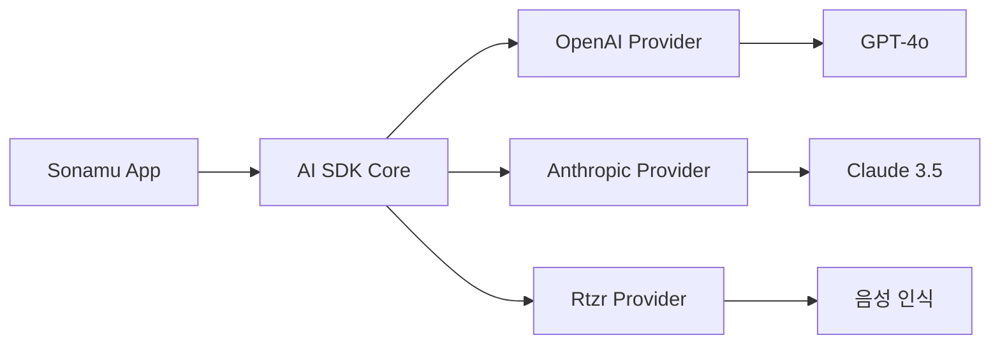

Sonamu는 **Vercel AI SDK**를 기반으로 하며, 다양한 AI 기능을 제공합니다. 텍스트 생성, 스트리밍, 도구 호출, 음성 인식 등을 쉽게 구현할 수 있습니다.

## Vercel AI SDK

Sonamu가 사용하는 AI 프레임워크입니다.



**주요 기능**:
- 텍스트 생성 (Text Generation)
- 스트리밍 응답 (Streaming)
- 도구 호출 (Tool Calling)
- 구조화된 출력 (Structured Output)
- 음성 인식 (Transcription)

## 텍스트 생성

### generateText()

일반 텍스트를 생성합니다.

```typescript
import { openai } from '@ai-sdk/openai';
import { generateText } from 'ai';

const result = await generateText({
  model: openai('gpt-4o'),
  prompt: 'TypeScript로 Express 서버를 만드는 방법을 알려줘',
});

console.log(result.text);
// => "Express 서버를 만들려면..."
```

### 메시지 기반 대화

```typescript
const result = await generateText({
  model: openai('gpt-4o'),
  messages: [
    { role: 'system', content: '당신은 친절한 프로그래밍 도우미입니다.' },
    { role: 'user', content: 'TypeScript란?' },
    { role: 'assistant', content: 'TypeScript는 JavaScript에 타입을 추가한...' },
    { role: 'user', content: '장점이 뭐야?' },
  ],
});
```

## 스트리밍 응답

### streamText()

실시간으로 텍스트를 스트리밍합니다.

```typescript
import { openai } from '@ai-sdk/openai';
import { streamText } from 'ai';

const result = streamText({
  model: openai('gpt-4o'),
  prompt: '긴 이야기를 들려줘',
});

// 스트림 처리
for await (const chunk of result.textStream) {
  process.stdout.write(chunk);
}
```

### SSE와 통합

```typescript
import { BaseModel, stream, api } from "sonamu";
import { openai } from '@ai-sdk/openai';
import { streamText } from 'ai';
import { z } from "zod";

class ChatModelClass extends BaseModel {
  @stream({
    type: 'sse',
    events: z.object({
      chunk: z.object({
        text: z.string(),
      }),
      complete: z.object({
        totalTokens: z.number(),
      }),
    })
  })
  @api({ compress: false })
  async *streamChat(message: string, ctx: Context) {
    const sse = ctx.createSSE(
      z.object({
        chunk: z.object({
          text: z.string(),
        }),
        complete: z.object({
          totalTokens: z.number(),
        }),
      })
    );
    
    try {
      const result = streamText({
        model: openai('gpt-4o'),
        messages: [
          { role: 'user', content: message },
        ],
      });
      
      // 실시간 전송
      for await (const chunk of result.textStream) {
        sse.publish('chunk', { text: chunk });
      }
      
      // 완료 통계
      const usage = await result.usage;
      sse.publish('complete', {
        totalTokens: usage.totalTokens,
      });
    } finally {
      await sse.end();
    }
  }
}
```

## 도구 호출

### 단일 도구

```typescript
import { openai } from '@ai-sdk/openai';
import { generateText, tool } from 'ai';
import { z } from 'zod';

const result = await generateText({
  model: openai('gpt-4o'),
  prompt: '서울의 현재 날씨를 알려줘',
  tools: {
    getWeather: tool({
      description: '특정 도시의 현재 날씨를 조회합니다',
      parameters: z.object({
        city: z.string().describe('도시 이름'),
      }),
      execute: async ({ city }) => {
        // 날씨 API 호출
        const weather = await fetchWeather(city);
        return {
          temperature: weather.temp,
          condition: weather.condition,
        };
      },
    }),
  },
  maxSteps: 5,  // 최대 도구 호출 횟수
});

console.log(result.text);
// => "서울의 현재 날씨는 맑고 기온은 15도입니다."
```

### 다중 도구

```typescript
const result = await generateText({
  model: openai('gpt-4o'),
  prompt: '서울의 날씨를 보고 우산이 필요한지 알려줘',
  tools: {
    getWeather: tool({
      description: '날씨 조회',
      parameters: z.object({
        city: z.string(),
      }),
      execute: async ({ city }) => {
        return await fetchWeather(city);
      },
    }),
    checkUmbrella: tool({
      description: '날씨 정보를 기반으로 우산 필요 여부 판단',
      parameters: z.object({
        condition: z.string().describe('날씨 상태'),
      }),
      execute: async ({ condition }) => {
        return {
          needUmbrella: ['rain', 'snow'].includes(condition),
        };
      },
    }),
  },
  maxSteps: 10,
});
```

## 구조화된 출력

### generateObject()

JSON 형식의 구조화된 데이터를 생성합니다.

```typescript
import { openai } from '@ai-sdk/openai';
import { generateObject } from 'ai';
import { z } from 'zod';

const result = await generateObject({
  model: openai('gpt-4o'),
  schema: z.object({
    name: z.string(),
    age: z.number(),
    hobbies: z.array(z.string()),
    address: z.object({
      city: z.string(),
      country: z.string(),
    }),
  }),
  prompt: '홍길동에 대한 정보를 생성해줘',
});

console.log(result.object);
// {
//   name: "홍길동",
//   age: 30,
//   hobbies: ["독서", "여행"],
//   address: {
//     city: "서울",
//     country: "대한민국"
//   }
// }
```

### 실전 예제

```typescript
import { BaseModel, api } from "sonamu";
import { openai } from '@ai-sdk/openai';
import { generateObject } from 'ai';
import { z } from 'zod';

class ProductModelClass extends BaseModel {
  @api({ httpMethod: 'POST' })
  async generateProductDescription(productName: string) {
    const result = await generateObject({
      model: openai('gpt-4o'),
      schema: z.object({
        title: z.string(),
        description: z.string(),
        features: z.array(z.string()),
        price: z.number(),
        tags: z.array(z.string()),
      }),
      prompt: `${productName}에 대한 상품 설명을 생성해줘`,
    });
    
    // DB에 저장
    const product = await this.saveOne({
      name: result.object.title,
      description: result.object.description,
      features: result.object.features,
      price: result.object.price,
      tags: result.object.tags,
    });
    
    return product;
  }
}
```

## Rtzr Provider (음성 인식)

Sonamu는 **Rtzr** (한국어 음성 인식 서비스)를 기본 제공합니다.

### 설정

```.env
RTZR_CLIENT_ID=your_client_id
RTZR_CLIENT_SECRET=your_client_secret
```

### 기본 사용법

```typescript
import { rtzr } from 'sonamu/ai/providers/rtzr';

const model = rtzr.transcription('whisper');

const result = await model.doGenerate({
  audio: audioBuffer,  // Uint8Array 또는 Base64
  mediaType: 'audio/wav',
});

console.log(result.text);
// => "안녕하세요, 오늘 날씨가 좋네요"

console.log(result.segments);
// [
//   { text: "안녕하세요", startSecond: 0, endSecond: 1 },
//   { text: "오늘 날씨가 좋네요", startSecond: 1, endSecond: 3 }
// ]
```

### 파일 업로드 + 음성 인식

```typescript
import { BaseModel, upload, api } from "sonamu";
import { rtzr } from 'sonamu/ai/providers/rtzr';

class TranscriptionModelClass extends BaseModel {
  @upload({ mode: 'single' })
  @api({ httpMethod: 'POST' })
  async transcribeAudio() {
    const { file } = Sonamu.getUploadContext();
    
    if (!file) {
      throw new Error('오디오 파일이 없습니다');
    }
    
    // 음성 인식
    const model = rtzr.transcription('whisper');
    const buffer = await file.toBuffer();
    
    const result = await model.doGenerate({
      audio: buffer,
      mediaType: file.mimetype,
    });
    
    // DB에 저장
    await this.saveOne({
      audio_url: file.url,
      transcription: result.text,
      segments: result.segments,
      language: result.language,
      duration: result.durationInSeconds,
    });
    
    return {
      text: result.text,
      segments: result.segments,
    };
  }
}
```

### Rtzr 옵션

```typescript
const result = await model.doGenerate({
  audio: audioBuffer,
  mediaType: 'audio/wav',
  providerOptions: {
    rtzr: {
      domain: 'GENERAL',  // 'CALL' | 'GENERAL'
      language: 'ko',
      diarization: true,  // 화자 분리
      wordTimestamp: true,  // 단어별 타임스탬프
      profanityFilter: false,  // 욕설 필터
    }
  }
});
```

## 멀티모달 (이미지 처리)

GPT-4o는 이미지를 입력으로 받을 수 있습니다.

```typescript
import { openai } from '@ai-sdk/openai';
import { generateText } from 'ai';

const result = await generateText({
  model: openai('gpt-4o'),
  messages: [
    {
      role: 'user',
      content: [
        { type: 'text', text: '이 이미지에 무엇이 있나요?' },
        {
          type: 'image',
          image: imageBuffer,  // Uint8Array 또는 URL
        },
      ],
    },
  ],
});

console.log(result.text);
// => "이미지에는 고양이가 있습니다..."
```

### 이미지 업로드 + 분석

```typescript
import { BaseModel, upload, api } from "sonamu";
import { openai } from '@ai-sdk/openai';
import { generateText } from 'ai';

class ImageAnalysisModelClass extends BaseModel {
  @upload({ mode: 'single' })
  @api({ httpMethod: 'POST' })
  async analyzeImage() {
    const { file } = Sonamu.getUploadContext();
    
    if (!file || !file.mimetype.startsWith('image/')) {
      throw new Error('이미지 파일이 필요합니다');
    }
    
    const buffer = await file.toBuffer();
    
    const result = await generateText({
      model: openai('gpt-4o'),
      messages: [
        {
          role: 'user',
          content: [
            { type: 'text', text: '이 이미지를 자세히 분석해줘' },
            { type: 'image', image: buffer },
          ],
        },
      ],
    });
    
    return {
      analysis: result.text,
      imageUrl: file.url,
    };
  }
}
```

## 에러 처리

```typescript
import { openai } from '@ai-sdk/openai';
import { generateText } from 'ai';

try {
  const result = await generateText({
    model: openai('gpt-4o'),
    prompt: '...',
  });
  
  return result.text;
} catch (error) {
  if (error.name === 'AI_APICallError') {
    // API 호출 에러
    console.error('API Error:', error.message);
    console.error('Status:', error.statusCode);
  } else if (error.name === 'AI_InvalidPromptError') {
    // 프롬프트 에러
    console.error('Invalid Prompt:', error.message);
  } else {
    // 기타 에러
    console.error('Unknown Error:', error);
  }
  
  throw error;
}
```

## 비용 추적

```typescript
const result = await generateText({
  model: openai('gpt-4o'),
  prompt: '...',
});

// 토큰 사용량
console.log('Prompt Tokens:', result.usage.promptTokens);
console.log('Completion Tokens:', result.usage.completionTokens);
console.log('Total Tokens:', result.usage.totalTokens);

// 비용 계산 (예시)
const costPerToken = 0.00003;  // GPT-4o 가격
const cost = result.usage.totalTokens * costPerToken;
console.log('Cost:', cost);
```

## 실전 통합 예제

### AI 채팅 API

```typescript
import { BaseModel, api } from "sonamu";
import { openai } from '@ai-sdk/openai';
import { generateText } from 'ai';
import { z } from 'zod';

class ChatModelClass extends BaseModel {
  @api({ httpMethod: 'POST' })
  async chat(
    message: string,
    conversationId: number | null,
    ctx: Context
  ) {
    // 대화 이력 조회
    const history = conversationId
      ? await ConversationModel.findById(conversationId)
      : null;
    
    const messages = history?.messages || [];
    messages.push({
      role: 'user',
      content: message,
    });
    
    // AI 응답 생성
    const result = await generateText({
      model: openai('gpt-4o'),
      messages: [
        {
          role: 'system',
          content: '당신은 친절한 고객 지원 챗봇입니다.',
        },
        ...messages,
      ],
      temperature: 0.7,
      maxTokens: 500,
    });
    
    // 응답 저장
    messages.push({
      role: 'assistant',
      content: result.text,
    });
    
    const conversation = await ConversationModel.saveOne({
      id: conversationId,
      user_id: ctx.user.id,
      messages,
      token_usage: result.usage.totalTokens,
    });
    
    return {
      conversationId: conversation.id,
      message: result.text,
      usage: result.usage,
    };
  }
}
```

## 주의사항

<Warning>
**AI SDK 사용 시 주의사항**:

1. **API 키 보안**: 환경변수 사용
   ```typescript
   // ❌ 하드코딩
   const model = openai('gpt-4o', { apiKey: 'sk-...' });
   
   // ✅ 환경변수
   const model = openai('gpt-4o');  // OPENAI_API_KEY 자동 사용
   ```

2. **에러 처리**: 항상 try-catch
   ```typescript
   try {
     const result = await generateText({ ... });
   } catch (error) {
     console.error(error);
   }
   ```

3. **토큰 제한**: maxTokens 설정
   ```typescript
   generateText({
     model: openai('gpt-4o'),
     prompt: '...',
     maxTokens: 1000,  // 비용 제어
   });
   ```

4. **스트리밍 정리**: 에러 시에도 스트림 종료
   ```typescript
   try {
     for await (const chunk of result.textStream) {
       // ...
     }
   } finally {
     // 정리 작업
   }
   ```

5. **Rtzr 파일 크기**: 큰 파일은 청킹 필요
   ```typescript
   if (file.size > 10 * 1024 * 1024) {
     throw new Error('파일 크기는 10MB 이하여야 합니다');
   }
   ```

6. **이미지 크기**: GPT-4o 이미지 제한 확인
   ```typescript
   // 이미지 크기 제한 (20MB)
   if (imageBuffer.length > 20 * 1024 * 1024) {
     throw new Error('이미지가 너무 큽니다');
   }
   ```
</Warning>

## Vercel AI SDK 문서

더 많은 기능은 공식 문서를 참고하세요:

- [Vercel AI SDK 문서](https://sdk.vercel.ai/docs)
- [OpenAI Provider](https://sdk.vercel.ai/providers/ai-sdk-providers/openai)
- [Anthropic Provider](https://sdk.vercel.ai/providers/ai-sdk-providers/anthropic)

## 다음 단계

<CardGroup cols={2}>
  <Card title="Agent 설정" icon="gear" href="/advanced-features/ai-agents/agent-configuration">
    Agent 기본 설정하기
  </Card>
  <Card title="Agent 생성하기" icon="robot" href="/advanced-features/ai-agents/creating-agents">
    BaseAgentClass로 에이전트 구축
  </Card>
</CardGroup>
