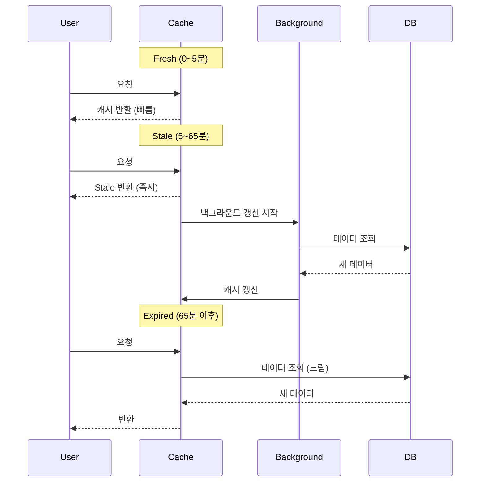

효과적인 캐싱을 위해서는 데이터 특성에 맞는 전략을 선택해야 합니다. 이 가이드에서는 다양한 캐시 전략과 활용 방법을 알아봅니다.

## TTL (Time To Live) 전략

### TTL이란?

TTL은 캐시가 **유효한 시간**을 의미합니다. TTL이 지나면 캐시가 만료되어 새로운 데이터를 가져옵니다.

```typescript
@cache({ ttl: "10m" })  // 10분 후 만료
async getData() {
  return await this.expensiveQuery();
}
```

### 데이터 특성별 TTL 설정

<Tabs>
  <Tab title="정적 데이터" icon="lock">
    **변경이 거의 없는 데이터**
    
    ```typescript
    // 설정 데이터 (거의 변경 안됨)
    @cache({ ttl: "forever", tags: ["config"] })
    async getConfig() {
      return this.findOne(['key', 'app_config']);
    }
    
    // 카테고리 (가끔 변경)
    @cache({ ttl: "1d", tags: ["category"] })
    async getCategoryTree() {
      return this.buildCategoryTree();
    }
    ```
    
    **TTL**: `"forever"`, `"1d"`, `"1w"`
  </Tab>
  
  <Tab title="준정적 데이터" icon="hourglass-half">
    **주기적으로 변경되는 데이터**
    
    ```typescript
    // 사용자 프로필 (가끔 변경)
    @cache({ ttl: "1h", tags: ["user"] })
    async getUserProfile(id: number) {
      return this.findOne(['id', id]);
    }
    
    // 상품 정보 (재고/가격 변경)
    @cache({ ttl: "30m", tags: ["product"] })
    async getProduct(id: number) {
      return this.findOne(['id', id]);
    }
    ```
    
    **TTL**: `"30m"`, `"1h"`, `"6h"`
  </Tab>
  
  <Tab title="동적 데이터" icon="bolt">
    **자주 변경되는 데이터**
    
    ```typescript
    // 게시글 목록 (자주 추가)
    @cache({ ttl: "5m", tags: ["post", "list"] })
    async getPostList() {
      return this.findMany({ num: 20, page: 1 });
    }
    
    // 실시간 통계 (계속 변경)
    @cache({ ttl: "1m", tags: ["stats"] })
    async getLiveStats() {
      return this.calculateStats();
    }
    ```
    
    **TTL**: `"1m"`, `"5m"`, `"10m"`
  </Tab>
  
  <Tab title="초단기 데이터" icon="gauge-high">
    **초 단위로 변경되는 데이터**
    
    ```typescript
    // API 레이트 리미팅
    @cache({ ttl: "10s" })
    async getRateLimitStatus(userId: number) {
      return this.checkRateLimit(userId);
    }
    
    // 실시간 순위
    @cache({ ttl: "5s", tags: ["ranking"] })
    async getRealtimeRanking() {
      return this.calculateRanking();
    }
    ```
    
    **TTL**: `"5s"`, `"10s"`, `"30s"`
  </Tab>
</Tabs>

### TTL 단위

```typescript
// 초 (seconds)
@cache({ ttl: "30s" })

// 분 (minutes)
@cache({ ttl: "10m" })

// 시간 (hours)
@cache({ ttl: "2h" })

// 일 (days)
@cache({ ttl: "7d" })

// 주 (weeks)
@cache({ ttl: "2w" })

// 영구
@cache({ ttl: "forever" })

// 밀리초 (숫자)
@cache({ ttl: 60000 })  // 60000ms = 1분
```

## Grace Period (Stale-While-Revalidate)

### Grace란?

Grace는 TTL 만료 후에도 **오래된 캐시(Stale)를 반환**하면서 백그라운드에서 갱신하는 전략입니다.

```typescript
@cache({ 
  ttl: "5m",     // 5분 후 만료
  grace: "1h"    // 만료 후 1시간 동안 Stale 값 사용
})
async getExpensiveData() {
  return await this.heavyComputation();
}
```

### 작동 방식



### Grace 사용 시기

<CardGroup cols={2}>
  <Card title="Grace 사용 ✅" icon="check">
    **무거운 계산/쿼리**
    
    - 집계 통계
    - 복잡한 Join 쿼리
    - 외부 API 호출
    - 대용량 데이터 처리
    
    ```typescript
    @cache({ 
      ttl: "10m", 
      grace: "1h" 
    })
    async getDashboard() {
      return await this.complexAggregation();
    }
    ```
  </Card>
  
  <Card title="Grace 불필요 ❌" icon="xmark">
    **빠른 조회**
    
    - 단순 SELECT
    - 인덱스 조회
    - 캐시된 데이터
    
    ```typescript
    @cache({ ttl: "5m" })
    // grace 없음
    async getUser(id: number) {
      return this.findOne(['id', id]);
    }
    ```
  </Card>
</CardGroup>

### Grace 실전 예제

```typescript
class AnalyticsModelClass extends BaseModel {
  // 대시보드 통계 (무거운 집계)
  @cache({ 
    ttl: "5m",      // 5분마다 갱신
    grace: "2h",    // 2시간 동안 Stale 허용
    tags: ["analytics"]
  })
  @api()
  async getDashboardStats() {
    const [userCount, orderCount, revenue] = await Promise.all([
      this.countUsers(),
      this.countOrders(),
      this.calculateRevenue(),
    ]);
    
    return { userCount, orderCount, revenue };
  }
  
  // 실시간 순위 (매우 무거움)
  @cache({ 
    ttl: "1m",      // 1분마다 갱신
    grace: "10m",   // 10분 동안 Stale 허용
    tags: ["ranking"]
  })
  @api()
  async getRealTimeRanking() {
    // 수백만 건의 데이터 집계
    return await this.calculateRankingWithHeavyComputation();
  }
}
```

### Grace vs 긴 TTL

**Grace 전략**:
```typescript
@cache({ ttl: "5m", grace: "1h" })
```
- 대부분 신선한 데이터 (5분 이내)
- 만료 시 Stale 즉시 반환 (빠름)
- 백그라운드 갱신

**긴 TTL**:
```typescript
@cache({ ttl: "1h" })
```
- 최대 1시간 오래된 데이터
- 만료 시 새로 계산 (느림)

**권장**: 무거운 작업은 Grace 사용

## Namespace 전략

### Namespace란?

Namespace는 캐시를 **논리적으로 분리**하는 기능입니다.

```typescript
const userCache = Sonamu.cache.namespace("user:123");
const adminCache = Sonamu.cache.namespace("admin");

// 같은 키라도 다른 namespace면 다른 캐시
await userCache.set({ key: "data", value: "user data" });
await adminCache.set({ key: "data", value: "admin data" });

await userCache.get({ key: "data" });   // "user data"
await adminCache.get({ key: "data" });  // "admin data"
```

### 사용자별 격리

```typescript
class UserDataModelClass extends BaseModel {
  @api()
  async getMyData(ctx: Context) {
    const userId = ctx.user.id;
    
    // 사용자별 namespace
    const userCache = Sonamu.cache.namespace(`user:${userId}`);
    
    return userCache.getOrSet({
      key: "preferences",
      ttl: "1h",
      factory: async () => {
        return this.getUserPreferences(userId);
      }
    });
  }
  
  @api()
  async updateMyData(ctx: Context, data: any) {
    const userId = ctx.user.id;
    const result = await this.saveUserData(userId, data);
    
    // 해당 사용자의 캐시만 삭제
    const userCache = Sonamu.cache.namespace(`user:${userId}`);
    await userCache.clear();
    
    return result;
  }
}
```

**장점**:
- 사용자 A의 변경이 사용자 B에 영향 없음
- 선택적 무효화 가능

### 멀티 테넌트

```typescript
class TenantServiceModelClass extends BaseModel {
  @api()
  async getData(tenantId: number) {
    // 테넌트별 namespace
    const tenantCache = Sonamu.cache.namespace(`tenant:${tenantId}`);
    
    return tenantCache.getOrSet({
      key: "service-data",
      ttl: "1h",
      tags: ["service"],
      factory: async () => {
        return this.findMany({ 
          where: [['tenant_id', tenantId]] 
        });
      }
    });
  }
  
  @api()
  async clearTenantCache(tenantId: number) {
    const tenantCache = Sonamu.cache.namespace(`tenant:${tenantId}`);
    
    // 특정 테넌트 캐시만 삭제
    await tenantCache.clear();
  }
}
```

### 기능별 격리

```typescript
// 인증 관련
const authCache = Sonamu.cache.namespace("auth");
await authCache.set({ key: `session:${sessionId}`, value: session, ttl: "1h" });

// 통계 관련
const statsCache = Sonamu.cache.namespace("stats");
await statsCache.set({ key: "daily", value: stats, ttl: "1d" });

// API 레이트 리밋
const rateLimitCache = Sonamu.cache.namespace("ratelimit");
await rateLimitCache.set({ key: `user:${userId}`, value: count, ttl: "1m" });
```

## 캐시 패턴

### 1. Cache-Aside (Lazy Loading)

**가장 기본적인 패턴**: 필요할 때 조회하고 캐싱

```typescript
async getData(id: number) {
  // 1. 캐시 확인
  const cached = await Sonamu.cache.get({ key: `data:${id}` });
  if (cached) return cached;
  
  // 2. DB 조회
  const data = await this.findOne(['id', id]);
  
  // 3. 캐싱
  await Sonamu.cache.set({ 
    key: `data:${id}`, 
    value: data, 
    ttl: "10m" 
  });
  
  return data;
}
```

**@cache 데코레이터가 이 패턴을 자동 구현**

### 2. Write-Through

**쓰기 시 캐시도 갱신**: 데이터 변경과 동시에 캐시 업데이트

```typescript
@api()
async update(id: number, data: Partial<DataSave>) {
  // 1. DB 업데이트
  const result = await this.updateOne(['id', id], data);
  
  // 2. 캐시 갱신
  await Sonamu.cache.set({ 
    key: `data:${id}`, 
    value: result, 
    ttl: "10m",
    tags: ["data"]
  });
  
  return result;
}
```

**장점**: 캐시 항상 최신 상태
**단점**: 쓰기 성능 저하

### 3. Write-Behind (Write-Back)

**쓰기를 캐시에 먼저**: 캐시 업데이트 후 비동기로 DB 저장

```typescript
@api()
async updateCounter(id: number) {
  const key = `counter:${id}`;
  
  // 1. 캐시 증가
  let count = await Sonamu.cache.get({ key });
  count = (count ?? 0) + 1;
  await Sonamu.cache.set({ key, value: count, ttl: "10m" });
  
  // 2. 비동기 DB 저장 (큐에 넣기)
  await this.queueCounterUpdate(id, count);
  
  return count;
}
```

**장점**: 빠른 응답
**단점**: 구현 복잡, 데이터 유실 가능

### 4. Refresh-Ahead

**만료 전 미리 갱신**: TTL이 거의 끝날 때 미리 새 데이터 준비

```typescript
@cache({ 
  ttl: "10m",
  grace: "1h"  // Grace가 Refresh-Ahead와 유사
})
async getData() {
  return await this.expensiveQuery();
}
```

**Grace period가 이 역할을 수행**

## 조합 전략

### 레이어별 TTL

```typescript
class ProductModelClass extends BaseModel {
  // L1 (메모리): 짧은 TTL
  // L2 (Redis): 긴 TTL
  @cache({ 
    ttl: "5m",      // L1은 5분
    // L2는 자동으로 더 길게 유지됨
    tags: ["product"] 
  })
  @api()
  async findById(id: number) {
    return this.findOne(['id', id]);
  }
}
```

### 중요도별 전략

<Tabs>
  <Tab title="Critical Data" icon="exclamation-triangle">
    **항상 정확해야 하는 데이터**
    
    ```typescript
    // 결제 정보 (캐싱 없음 또는 짧은 TTL)
    @cache({ ttl: "30s", grace: false })
    async getPaymentInfo(id: number) {
      return this.findOne(['id', id]);
    }
    
    // 재고 정보 (짧은 TTL + 즉시 무효화)
    @cache({ ttl: "1m", tags: ["inventory"] })
    async getInventory(productId: number) {
      return this.getStock(productId);
    }
    ```
  </Tab>
  
  <Tab title="Important Data" icon="star">
    **정확성이 중요하지만 약간의 지연 허용**
    
    ```typescript
    // 사용자 프로필 (적당한 TTL)
    @cache({ ttl: "10m", tags: ["user"] })
    async getUserProfile(id: number) {
      return this.findOne(['id', id]);
    }
    
    // 주문 상태 (짧은 TTL + Grace)
    @cache({ ttl: "2m", grace: "10m", tags: ["order"] })
    async getOrderStatus(id: number) {
      return this.findOne(['id', id]);
    }
    ```
  </Tab>
  
  <Tab title="Nice-to-have Data" icon="circle-check">
    **오래되어도 괜찮은 데이터**
    
    ```typescript
    // 통계 (긴 TTL + 긴 Grace)
    @cache({ ttl: "1h", grace: "6h", tags: ["stats"] })
    async getStatistics() {
      return this.calculateStats();
    }
    
    // 인기 게시글 (긴 TTL)
    @cache({ ttl: "6h", tags: ["popular"] })
    async getPopularPosts() {
      return this.findPopular();
    }
    ```
  </Tab>
</Tabs>

### 시간대별 전략

```typescript
class DynamicCacheModelClass extends BaseModel {
  @api()
  async getData() {
    const hour = new Date().getHours();
    
    // 피크 시간 (오전 9시~오후 6시): 짧은 TTL
    const ttl = (hour >= 9 && hour <= 18) ? "5m" : "30m";
    
    return Sonamu.cache.getOrSet({
      key: "dynamic-data",
      ttl,
      tags: ["data"],
      factory: async () => {
        return this.expensiveQuery();
      }
    });
  }
}
```

## 성능 최적화

### 캐시 워밍

서버 시작 시 미리 캐시를 채웁니다.

```typescript
class CacheWarmerModelClass extends BaseModel {
  async warmupCache() {
    console.log("Warming up cache...");
    
    // 자주 사용되는 데이터 미리 캐싱
    await Promise.all([
      this.getCategoryTree(),  // @cache 적용됨
      this.getPopularProducts(),
      this.getConfig(),
    ]);
    
    console.log("Cache warmed up!");
  }
  
  @cache({ ttl: "1d", tags: ["category"] })
  async getCategoryTree() {
    return this.buildTree();
  }
  
  @cache({ ttl: "1h", tags: ["popular"] })
  async getPopularProducts() {
    return this.findPopular();
  }
}

// 서버 시작 시 실행
await cacheWarmerModel.warmupCache();
```

### 배치 캐싱

여러 항목을 한 번에 캐싱합니다.

```typescript
class BatchCacheModelClass extends BaseModel {
  async batchCache(ids: number[]) {
    // 1. 캐시되지 않은 ID 찾기
    const cacheKeys = ids.map(id => `item:${id}`);
    const cached = await Promise.all(
      cacheKeys.map(key => Sonamu.cache.get({ key }))
    );
    
    const uncachedIds = ids.filter((_, i) => !cached[i]);
    
    if (uncachedIds.length === 0) {
      return cached.filter(Boolean);
    }
    
    // 2. DB에서 조회
    const items = await this.findMany({ 
      where: [['id', 'in', uncachedIds]] 
    });
    
    // 3. 배치 캐싱
    await Promise.all(
      items.rows.map(item =>
        Sonamu.cache.set({ 
          key: `item:${item.id}`, 
          value: item, 
          ttl: "10m" 
        })
      )
    );
    
    // 4. 결과 반환
    return [...cached.filter(Boolean), ...items.rows];
  }
}
```

### 선택적 캐싱

조건에 따라 캐싱 여부를 결정합니다.

```typescript
class ConditionalCacheModelClass extends BaseModel {
  @api()
  async getData(id: number, useCache: boolean = true) {
    const cacheKey = `data:${id}`;
    
    // 캐시 사용 여부 선택
    if (!useCache) {
      return this.findOne(['id', id]);
    }
    
    return Sonamu.cache.getOrSet({
      key: cacheKey,
      ttl: "10m",
      factory: async () => {
        return this.findOne(['id', id]);
      }
    });
  }
}
```

## 주의사항

<Warning>
**캐시 전략 선택 시 주의사항**:

1. **TTL이 너무 길면**: 오래된 데이터 제공
   ```typescript
   // ❌ 자주 변경되는데 TTL이 너무 김
   @cache({ ttl: "1d" })  
   async getLiveStock() { ... }
   
   // ✅ 적절한 TTL
   @cache({ ttl: "1m" })
   async getLiveStock() { ... }
   ```

2. **TTL이 너무 짧으면**: 캐시 효과 감소
   ```typescript
   // ❌ 거의 변경 안 되는데 TTL이 너무 짧음
   @cache({ ttl: "10s" })
   async getConfig() { ... }
   
   // ✅ 적절한 TTL
   @cache({ ttl: "1d", tags: ["config"] })
   async getConfig() { ... }
   ```

3. **Grace 오남용**: 빠른 쿼리에 Grace 불필요
   ```typescript
   // ❌ 불필요한 Grace
   @cache({ ttl: "5m", grace: "1h" })
   async getUser(id: number) {
     return this.findOne(['id', id]);  // 빠른 조회
   }
   
   // ✅ Grace 없이 충분
   @cache({ ttl: "5m" })
   async getUser(id: number) { ... }
   ```

4. **Namespace 남용**: 너무 많은 namespace는 관리 어려움
   ```typescript
   // ❌ 과도한 namespace
   const cache1 = Sonamu.cache.namespace("a:b:c:d:e");
   
   // ✅ 적절한 namespace
   const userCache = Sonamu.cache.namespace(`user:${userId}`);
   ```
</Warning>

## 전략 요약표

| 데이터 유형 | TTL | Grace | Tags | 무효화 |
|------------|-----|-------|------|--------|
| 정적 설정 | `forever` | ❌ | `["config"]` | 수동 |
| 사용자 프로필 | `1h` | ❌ | `["user"]` | 변경 시 |
| 상품 정보 | `30m` | `1h` | `["product"]` | 변경 시 |
| 게시글 목록 | `5m` | `30m` | `["post", "list"]` | 생성/수정 시 |
| 실시간 통계 | `1m` | `10m` | `["stats"]` | TTL 의존 |
| 집계 대시보드 | `10m` | `2h` | `["dashboard"]` | TTL 의존 |

## 다음 단계

<CardGroup cols={2}>
  <Card title="캐시 설정" icon="gear" href="/advanced-features/caching/cache-configuration">
    Stores와 Drivers 설정하기
  </Card>
  <Card title="@cache 데코레이터" icon="at" href="/advanced-features/caching/cache-decorator">
    메서드에 캐시 적용하기
  </Card>
  <Card title="캐시 무효화" icon="trash" href="/advanced-features/caching/cache-invalidation">
    Tag 기반 캐시 무효화
  </Card>
</CardGroup>
