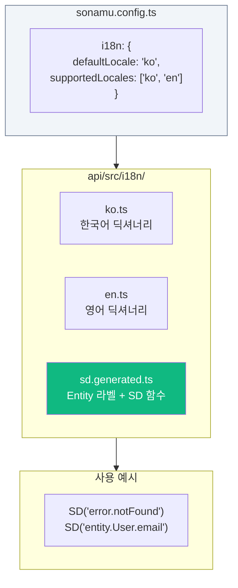
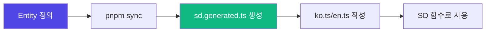

Sonamu는 타입 안전한 다국어(i18n) 시스템을 내장하고 있습니다. **SD (Sonamu Dictionary)** 함수를 통해 컴파일 타임에 키 오타를 감지하고, Entity 라벨을 자동으로 추출하여 번역 작업을 간소화합니다.

## 핵심 특징

- **타입 안전성**: 존재하지 않는 키 사용 시 컴파일 에러
- **Entity 라벨 자동 추출**: title, prop.desc, enum 라벨이 자동으로 딕셔너리에 포함
- **함수형 값 지원**: 동적 메시지 생성 (`(count) => \`${count}개\``)
- **한국어 헬퍼**: 조사 처리(은/는, 이/가), 복수형 등
- **Excel import/export**: Sonamu UI에서 번역 파일 관리
- **Locale별 컬럼 지원**: `name_ko`, `name_en` 같은 다국어 DB 컬럼

## 아키텍처

## 자동 생성 파일

`sd.generated.ts`는 다음을 포함합니다:

| 항목 | 설명 | 예시 키 |
|------|------|---------|
| Entity 타이틀 | Entity의 title 속성 | `entity.User` |
| Prop 라벨 | prop의 desc 속성 | `entity.User.email` |
| Enum 라벨 | enumLabels 정의 | `enum.UserRole.admin` |
| SD 함수 | 타입 안전한 번역 함수 | - |
| localizedColumn | DB 컬럼 다국어 지원 | - |

## 워크플로우

1. Entity에서 title, prop.desc, enumLabels 정의
2. `pnpm sync` 실행 시 `sd.generated.ts` 자동 생성
3. `ko.ts`, `en.ts`에서 프로젝트 딕셔너리 작성
4. `SD("key")` 함수로 현재 locale에 맞는 텍스트 사용

<CardGroup cols={2}>
  <Card title="설정하기" icon="gear" href="/advanced-features/i18n/setup">
    i18n 초기 설정
  </Card>
  <Card title="SD 함수 사용법" icon="code" href="/advanced-features/i18n/dictionary">
    딕셔너리 작성 및 사용
  </Card>
</CardGroup>
