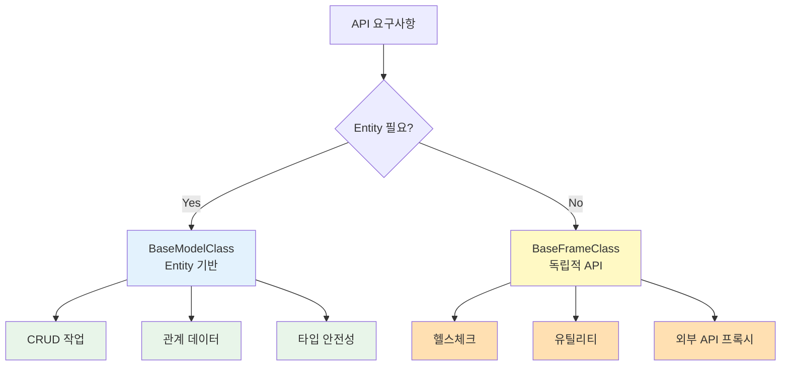

Frame은 데이터베이스 Entity와 연결되지 않은 독립적인 API 엔드포인트를 만들 때 사용합니다.

## Frame 개요

<CardGroup cols={2}>
  <Card title="Entity 불필요" icon="circle-xmark">
    DB 테이블 없이 작동
    
    자유로운 API 구현
  </Card>
  <Card title="간단한 구조" icon="diagram-project">
    BaseFrameClass 상속
    
    @api 데코레이터 사용
  </Card>
  <Card title="다양한 용도" icon="wand-magic-sparkles">
    헬스체크, 유틸리티
    
    외부 API 프록시
  </Card>
  <Card title="독립적 로직" icon="code">
    비즈니스 로직만 구현
    
    Entity 제약 없음
  </Card>
</CardGroup>

## Model vs Frame

### Model (BaseModelClass)

```typescript
// Entity 기반 API
class UserModel extends BaseModelClass {
  modelName = "User"; // ← Entity와 연결
  
  @api({ httpMethod: "GET" })
  async list(): Promise<User[]> {
    // users 테이블 조회
    const rdb = this.getPuri("r");
    return rdb.table("users").select("*");
  }
  
  @api({ httpMethod: "POST" })
  async create(params: UserSaveParams): Promise<{ userId: number }> {
    // users 테이블에 삽입
    const wdb = this.getPuri("w");
    wdb.ubRegister("users", params);
    const [userId] = await wdb.ubUpsert("users");
    return { userId };
  }
}
```

**Model의 특징**:
- Entity(DB 테이블)와 1:1 매핑
- CRUD 작업 중심
- UpsertBuilder, Subset 활용
- 타입 안전성 보장

### Frame (BaseFrameClass)

```typescript
// Entity 없는 독립적 API
class HealthFrame extends BaseFrameClass {
  frameName = "Health"; // ← Entity와 무관
  
  @api({ httpMethod: "GET" })
  async check(): Promise<{
    status: "ok" | "error";
    timestamp: Date;
    uptime: number;
  }> {
    // DB 접근 없이 서버 상태만 반환
    return {
      status: "ok",
      timestamp: new Date(),
      uptime: process.uptime(),
    };
  }
  
  @api({ httpMethod: "GET" })
  async ping(): Promise<{ pong: string }> {
    return { pong: "pong" };
  }
}
```

**Frame의 특징**:
- Entity와 무관한 독립적 로직
- 유틸리티, 헬스체크, 프록시 등
- 자유로운 API 구조
- 간단한 구현

## 비교 표

| 특징 | Model | Frame |
|------|-------|-------|
| Entity 연결 | ✅ 필수 | ❌ 불필요 |
| DB 접근 | CRUD 중심 | 선택적 |
| 사용 사례 | 데이터 관리 | 유틸리티, 프록시 |
| 복잡도 | 높음 | 낮음 |
| UpsertBuilder | ✅ 사용 | ❌ 불필요 |
| Subset | ✅ 사용 | ❌ 불필요 |



## Frame 사용 시기

### ✅ Frame을 사용해야 하는 경우

1. **헬스체크 API**
   ```typescript
   // GET /api/health/check
   // Entity 없이 서버 상태만 확인
   ```

2. **유틸리티 API**
   ```typescript
   // POST /api/utils/hash
   // 문자열 해시 계산 등 단순 기능
   ```

3. **외부 API 프록시**
   ```typescript
   // GET /api/weather/current
   // 외부 날씨 API를 내부 API로 래핑
   ```

4. **집계 통계**
   ```typescript
   // GET /api/stats/dashboard
   // 여러 테이블의 통계를 집계
   ```

5. **인증/권한 체크**
   ```typescript
   // POST /api/auth/verify-token
   // JWT 토큰 검증만 수행
   ```

### ❌ Model을 사용해야 하는 경우

1. **Entity CRUD 작업**
   ```typescript
   // User, Product, Order 등의 생성/조회/수정/삭제
   ```

2. **관계 데이터 처리**
   ```typescript
   // User → Profile, Order → OrderItems
   ```

3. **복잡한 비즈니스 로직**
   ```typescript
   // 주문 처리, 결제 등 여러 Entity 조작
   ```

## 구조 차이

### Model 구조

```
api/src/application/
  user/
    ├── user.entity.json       # ← Entity 정의
    ├── user.model.ts          # ← Model 클래스
    ├── user.types.ts          # ← 타입 정의
    └── subsets/
        └── user-list.subset.json
```

### Frame 구조

```
api/src/frames/
  health/
    └── health.frame.ts        # ← Frame 클래스만
  utils/
    └── utils.frame.ts
```

<Info>
Frame은 Entity 정의 없이 `.frame.ts` 파일만 있으면 됩니다.
</Info>

## 간단한 예제

### 헬스체크 Frame

```typescript
class HealthFrame extends BaseFrameClass {
  frameName = "Health";
  
  @api({ httpMethod: "GET" })
  async check(): Promise<{
    status: "ok" | "error";
    timestamp: Date;
    database: "connected" | "disconnected";
  }> {
    // DB 연결 체크
    let dbStatus: "connected" | "disconnected" = "disconnected";
    
    try {
      const rdb = this.getPuri("r");
      await rdb.raw("SELECT 1");
      dbStatus = "connected";
    } catch (error) {
      console.error("Database connection failed:", error);
    }
    
    return {
      status: dbStatus === "connected" ? "ok" : "error",
      timestamp: new Date(),
      database: dbStatus,
    };
  }
  
  @api({ httpMethod: "GET" })
  async ping(): Promise<{ message: string }> {
    return { message: "pong" };
  }
}

// 엔드포인트:
// GET /api/health/check
// GET /api/health/ping
```

### 유틸리티 Frame

```typescript
import crypto from "crypto";

class UtilsFrame extends BaseFrameClass {
  frameName = "Utils";
  
  @api({ httpMethod: "POST" })
  async hash(params: {
    text: string;
    algorithm: "md5" | "sha256" | "sha512";
  }): Promise<{ hash: string }> {
    const hash = crypto
      .createHash(params.algorithm)
      .update(params.text)
      .digest("hex");
    
    return { hash };
  }
  
  @api({ httpMethod: "POST" })
  async uuid(): Promise<{ uuid: string }> {
    return { uuid: crypto.randomUUID() };
  }
}

// 엔드포인트:
// POST /api/utils/hash
// POST /api/utils/uuid
```

## 장단점

### 장점

<CardGroup cols={2}>
  <Card title="빠른 구현" icon="rocket">
    Entity 정의 불필요
    
    간단한 구조
  </Card>
  <Card title="유연성" icon="arrows-turn-to-dots">
    제약 없는 로직
    
    자유로운 API 설계
  </Card>
  <Card title="독립성" icon="shield">
    DB 스키마 독립적
    
    외부 API 연동 용이
  </Card>
  <Card title="테스트 용이" icon="flask">
    단순한 로직
    
    Mock 불필요
  </Card>
</CardGroup>

### 단점

<CardGroup cols={2}>
  <Card title="타입 안전성 감소" icon="triangle-exclamation">
    Entity 타입 미사용
    
    수동 타입 관리
  </Card>
  <Card title="자동 생성 미지원" icon="circle-xmark">
    Subset, Types 자동 생성 없음
    
    수동 작성 필요
  </Card>
</CardGroup>

## 실전 팁

### 1. Frame은 간단하게 유지

```typescript
// ✅ 좋음: 단순한 로직
class HealthFrame extends BaseFrameClass {
  @api({ httpMethod: "GET" })
  async check(): Promise<{ status: string }> {
    return { status: "ok" };
  }
}

// ❌ 나쁨: 복잡한 비즈니스 로직
class OrderFrame extends BaseFrameClass {
  @api({ httpMethod: "POST" })
  async process(params: ComplexOrderParams): Promise<OrderResult> {
    // 100줄의 복잡한 로직...
    // 이런 경우는 Model로 만들어야 함
  }
}
```

### 2. 적절한 네이밍

```typescript
// ✅ 좋음: 명확한 이름
class HealthFrame extends BaseFrameClass {
  frameName = "Health";
}

class UtilsFrame extends BaseFrameClass {
  frameName = "Utils";
}

// ❌ 나쁨: 모호한 이름
class MiscFrame extends BaseFrameClass {
  frameName = "Misc";
}
```

### 3. 관련 기능 그룹화

```typescript
// ✅ 좋음: 관련된 기능을 하나의 Frame에
class CryptoUtilsFrame extends BaseFrameClass {
  frameName = "CryptoUtils";
  
  @api({ httpMethod: "POST" })
  async hash(params: HashParams): Promise<{ hash: string }> { /* ... */ }
  
  @api({ httpMethod: "POST" })
  async encrypt(params: EncryptParams): Promise<{ encrypted: string }> { /* ... */ }
  
  @api({ httpMethod: "POST" })
  async decrypt(params: DecryptParams): Promise<{ decrypted: string }> { /* ... */ }
}
```

## 언제 Model로 전환할까?

Frame으로 시작했지만 다음 상황이 되면 Model로 전환 고려:

1. **DB 데이터를 자주 조회/수정**
   - 처음엔 단순 조회였지만 CRUD가 필요해짐

2. **타입 안전성이 중요해짐**
   - 복잡한 데이터 구조가 생김
   - Entity 타입 자동 생성이 필요

3. **관계 데이터 처리 필요**
   - 여러 테이블 간의 관계 처리
   - JOIN, 외래키 등

4. **비즈니스 로직이 복잡해짐**
   - 단순 유틸리티를 넘어섬
   - 트랜잭션 처리 필요

## 다음 단계

<CardGroup cols={2}>
  <Card title="Frame 생성하기" icon="plus" href="/api-development/frames/creating-frames">
    BaseFrameClass 사용법
  </Card>
  <Card title="사용 사례" icon="lightbulb" href="/api-development/frames/use-cases">
    헬스체크, 유틸리티 예제
  </Card>
  <Card title="@api 데코레이터" icon="at" href="/api-development/creating-apis/api-decorator">
    API 기본 사용법
  </Card>
  <Card title="Model" icon="database" href="/core-concepts/entities">
    Entity 기반 API
  </Card>
</CardGroup>
