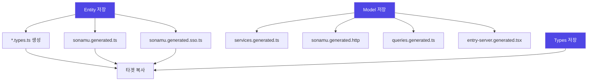

Sonamu는 파일 변경에 따라 관련 파일을 자동으로 재생성합니다. 이 문서는 각 파일 변경 시 어떤 파일이 재생성되는지 명확하게 설명합니다.

## 재생성 흐름도



## Entity 저장 시

`.entity.json` 파일을 저장하면 다음 파일들이 재생성됩니다.

### 재생성되는 파일

<Steps>
<Step title="1. {Entity}.types.ts">
Entity별 TypeScript 타입과 Zod 스키마

**위치**: `api/src/application/{entity}/{entity}.types.ts`

**생성 조건**: Entity가 처음 생성될 때 (이후 자동 재생성 안됨)

```typescript title="user.types.ts"
// Base 타입
export type User = {
  id: number;
  email: string;
  // ...
};

// Zod 스키마
export const User = z.object({
  id: z.number(),
  email: z.string(),
  // ...
});
```
</Step>

<Step title="2. sonamu.generated.ts">
프로젝트 전체의 베이스 타입과 Enum

**위치**: `api/src/application/sonamu.generated.ts`

**항상 재생성**: ✅

```typescript
// 모든 Entity의 Enum
export const UserRole = z.enum(["admin", "normal"]);

// Subset 타입
export type UserSubsetKey = "A" | "P" | "SS";
export type UserSubsetMapping = { ... };

// Model exports
export * from "./user/user.model";
```
</Step>

<Step title="3. sonamu.generated.sso.ts">
Subset 쿼리 함수들

**위치**: `api/src/application/sonamu.generated.sso.ts`

**항상 재생성**: ✅

```typescript
export const userSubsetQueries = {
  A: (puri) => puri.table("users").select([...]),
  P: (puri) => puri.table("users").leftJoin(...).select([...]),
};

export const userLoaderQueries = { ... };
```
</Step>

<Step title="4. 타겟 복사">
위 파일들이 타겟 프로젝트에 복사됨

**위치**:
- `web/src/services/user/user.types.ts`
- `web/src/services/sonamu.generated.ts`
- `web/src/services/sonamu.generated.sso.ts`
- `app/src/services/...` (동일)
</Step>
</Steps>

### 트리거 예시

<CodeGroup>
```json title="user.entity.json 저장"
{
  "id": "User",
  "table": "users",
  "props": [
    { "name": "id", "type": "integer" },
    { "name": "email", "type": "string" }
  ],
  "subsets": {
    "A": ["id", "email"]
  },
  "enums": {
    "UserRole": {
      "admin": "관리자",
      "normal": "일반 사용자"
    }
  }
}
```

```bash title="실행 결과"
✅ Generated: user.types.ts (첫 생성 시만)
✅ Generated: sonamu.generated.ts
✅ Generated: sonamu.generated.sso.ts
✅ Copied: web/src/services/user/user.types.ts
✅ Copied: web/src/services/sonamu.generated.ts
✅ Copied: web/src/services/sonamu.generated.sso.ts
```
</CodeGroup>

<Warning>
`{entity}.types.ts`는 **처음 Entity 생성 시에만** 자동 생성됩니다. 이후에는 수동으로 관리해야 합니다.

이미 존재하는 `user.types.ts`를 재생성하려면:
```bash
rm api/src/application/user/user.types.ts
# Entity 다시 저장
```
</Warning>

## Model 저장 시

`.model.ts` 파일을 저장하면 다음 파일들이 재생성됩니다.

### 재생성되는 파일

<Steps>
<Step title="1. services.generated.ts">
API 클라이언트 함수와 TanStack Query hooks

**위치**:
- `web/src/services/services.generated.ts`
- `app/src/services/services.generated.ts`

**항상 재생성**: ✅

```typescript
// Axios 클라이언트
export async function findUserById(id: number): Promise<User> { ... }

// TanStack Query hooks
export function useUserById(id: number) { ... }
export function useSaveUser() { ... }
```

**생성 기준**: Model의 `@api` 데코레이터가 있는 메서드
</Step>

<Step title="2. sonamu.generated.http">
REST Client용 HTTP 테스트 파일

**위치**: `api/sonamu.generated.http`

**항상 재생성**: ✅

```http
### User.findById
GET http://localhost:3000/user/findById?id=1

### User.save
POST http://localhost:3000/user/save
Content-Type: application/json

{ "params": [...] }
```
</Step>

<Step title="3. queries.generated.ts">
SSR용 Query Options

**위치**: `web/src/queries.generated.ts`

**항상 재생성**: ✅

```typescript
export const userQueries = {
  findById: (id: number) => queryOptions({
    queryKey: ["User", "findById", id],
    queryFn: () => findUserById(id),
  }),
};
```
</Step>

<Step title="4. entry-server.generated.tsx">
SSR Entry Server 코드

**위치**: `web/src/entry-server.generated.tsx`

**항상 재생성**: ✅

```tsx
export async function loader({ params }) {
  const queryClient = new QueryClient();
  
  // SSR 데이터 프리페칭
  if (params.userId) {
    await queryClient.prefetchQuery(
      userQueries.findById(Number(params.userId))
    );
  }
  
  return { dehydratedState: dehydrate(queryClient) };
}
```
</Step>
</Steps>

### 트리거 예시

<CodeGroup>
```typescript title="user.model.ts 저장"
class UserModelClass extends BaseModelClass {
  @api({ httpMethod: "GET", clients: ["axios", "tanstack-query"] })
  async findById(id: number): Promise<User> {
    // ...
  }

  @api({ httpMethod: "POST", clients: ["axios", "tanstack-mutation"] })
  async save(params: UserSaveParams[]): Promise<number[]> {
    // ...
  }
}
```

```bash title="실행 결과"
🔄 Invalidated:
- src/application/user/user.model.ts (with 2 APIs)

✅ Generated: services.generated.ts
✅ Generated: sonamu.generated.http
✅ Generated: queries.generated.ts
✅ Generated: entry-server.generated.tsx

✨ HMR completed in 234ms
```
</CodeGroup>

## Types 저장 시

`.types.ts` 파일을 저장하면 타겟에 복사됩니다.

### 재생성되는 파일

<Steps>
<Step title="타겟 복사">
수정된 Types 파일이 타겟 프로젝트에 복사

**위치**:
- `web/src/services/{entity}/{entity}.types.ts`
- `app/src/services/{entity}/{entity}.types.ts`

**항상 복사**: ✅

**import 변환**: `sonamu` → `./sonamu.shared`
</Step>
</Steps>

### 트리거 예시

<CodeGroup>
```typescript title="user.types.ts 수정"
import { z } from "zod";

// 커스텀 타입 추가
export const UserLoginParams = z.object({
  email: z.string().email(),
  password: z.string().min(8),
});

export type UserLoginParams = z.infer<typeof UserLoginParams>;
```

```bash title="실행 결과"
✅ Copied: web/src/services/user/user.types.ts
✅ Copied: app/src/services/user/user.types.ts
```
</CodeGroup>

## Config 저장 시

`sonamu.config.ts` 파일을 저장하면 환경 변수가 동기화됩니다.

### 재생성되는 파일

<Steps>
<Step title=".sonamu.env">
API 서버 정보를 담은 환경 변수 파일

**위치**:
- `web/.sonamu.env`
- `app/.sonamu.env`

**항상 재생성**: ✅

```env
API_HOST=localhost
API_PORT=3000
```
</Step>
</Steps>

### 트리거 예시

<CodeGroup>
```typescript title="sonamu.config.ts 수정"
export default {
  server: {
    listen: {
      host: "0.0.0.0",  // 변경
      port: 4000,       // 변경
    },
  },
};
```

```bash title="실행 결과"
✅ Updated: web/.sonamu.env
✅ Updated: app/.sonamu.env
```
</CodeGroup>

## i18n 파일 저장 시

`src/i18n/**/*.ts` 파일을 저장하면 SD 파일이 재생성됩니다.

### 재생성되는 파일

<Steps>
<Step title="1. Locale 파일 복사">
i18n 파일이 타겟에 복사됨

**위치**:
- `web/src/i18n/{locale}.ts`
- `app/src/i18n/{locale}.ts`
</Step>

<Step title="2. sd.generated.ts">
Sonamu Dictionary 파일 생성

**위치**:
- `api/src/sd.generated.ts`
- `web/src/sd.generated.ts`
- `app/src/sd.generated.ts`

**항상 재생성**: ✅

```typescript
export const SD = {
  User: "사용자",
  user: {
    id: "ID",
    email: "이메일",
  },
} as const;
```
</Step>
</Steps>

## 재생성 매트릭스

파일 변경과 재생성 관계를 한눈에 보여주는 표입니다.

| 변경 파일 | {entity}.types.ts | sonamu.generated.ts | sonamu.generated.sso.ts | services.generated.ts | sonamu.generated.http | queries.generated.ts | entry-server.generated.tsx | .sonamu.env | sd.generated.ts |
|-----------|-------------------|---------------------|-------------------------|----------------------|----------------------|---------------------|---------------------------|-------------|-----------------|
| **{entity}.entity.json** | ✅ (첫 생성) | ✅ | ✅ | - | - | - | - | - | - |
| **{entity}.model.ts** | - | - | - | ✅ | ✅ | ✅ | ✅ | - | - |
| **{entity}.types.ts** | *복사* | - | - | - | - | - | - | - | - |
| **sonamu.config.ts** | - | - | - | - | - | - | - | ✅ | - |
| **i18n/{locale}.ts** | - | - | - | - | - | - | - | - | ✅ |

**범례**:
- ✅ = 항상 재생성
- ✅ (첫 생성) = 첫 생성 시에만
- *복사* = 타겟에 복사
- - = 재생성 안됨

## 재생성 방지하기

생성된 파일을 수정하면 다음 재생성 시 덮어씌워집니다.

### ❌ 잘못된 방법

```typescript title="services.generated.ts 직접 수정"
// ❌ 이렇게 하지 마세요!
export async function findUserById(id: number): Promise<User> {
  // 커스텀 로직 추가
  console.log("Finding user:", id);
  
  const { data } = await axios.get("/user/findById", { params: { id } });
  return data;
}
// → Model 변경 시 덮어씌워짐 💥
```

### ✅ 올바른 방법

<Tabs>
<Tab title="별도 파일 생성">
```typescript title="services/user/user.custom.ts"
import { findUserById } from "../services.generated";

// 래퍼 함수 생성
export async function findUserByIdWithLog(id: number) {
  console.log("Finding user:", id);
  return findUserById(id);
}
```

**장점**: 생성 파일 건드리지 않음
</Tab>

<Tab title="Types 파일 활용">
```typescript title="api/src/application/user/user.types.ts"
// Entity 기본 타입 외 커스텀 타입 추가
export const UserLoginParams = z.object({
  email: z.string().email(),
  password: z.string().min(8),
});

// 이 파일은 재생성되지 않음!
```

**장점**: Types와 함께 관리
</Tab>

<Tab title="Model에서 처리">
```typescript title="api/src/application/user/user.model.ts"
@api({ httpMethod: "GET" })
async findByIdWithLog(id: number): Promise<User> {
  this.logger.info("Finding user:", id);
  return this.findById("A", id);
}
```

**장점**: API로 자동 노출됨
</Tab>
</Tabs>

## 재생성 강제하기

파일이 재생성되지 않을 때 강제로 재생성하는 방법입니다.

### Checksum 초기화

```bash
# Checksum 파일 삭제
rm .sonamu-checksums.json

# 전체 재동기화
pnpm sonamu sync
```

### 특정 파일 재생성

```bash
# Entity 파일 재저장 (Sonamu UI에서)
# 또는 파일 내용 변경 후 저장

# Model 파일 재저장
# → services.generated.ts 등 자동 재생성
```

### 강제 Overwrite

```typescript
import { Sonamu } from "sonamu";

// overwrite 옵션으로 강제 재생성
await Sonamu.syncer.generateTemplate(
  "services",
  {},
  { overwrite: true }  // 기존 파일 덮어쓰기
);
```

## 재생성 최적화

재생성 시간을 줄이는 팁입니다.

<AccordionGroup>
  <Accordion title="필요한 파일만 변경">
    Types만 수정했다면 Entity를 다시 저장할 필요 없음
    
    - Types 변경 → 타겟 복사만 (빠름)
    - Entity 변경 → 모든 스키마 재생성 (느림)
  </Accordion>
  
  <Accordion title="불필요한 타겟 제거">
    사용하지 않는 타겟을 `sonamu.config.ts`에서 제거
    
    ```typescript
    export default {
      sync: {
        targets: ["web"],  // app 제거
      },
    };
    ```
  </Accordion>
  
  <Accordion title="@api 데코레이터 최소화">
    필요한 메서드에만 `@api` 추가
    
    - 내부 메서드는 `@api` 불필요
    - API 수가 적을수록 빠른 재생성
  </Accordion>
  
  <Accordion title="HMR 최적화">
    Node.js v22+ 사용 및 SSD 활용
    
    ```json
    {
      "engines": {
        "node": ">=22.0.0"
      }
    }
    ```
  </Accordion>
</AccordionGroup>

## 다음 단계

<CardGroup cols={2}>
  <Card title="Customizing Generated Code" icon="pen-to-square" href="/core-concepts/auto-generation/customizing-generated-code">
    생성된 코드를 안전하게 커스터마이징하기
  </Card>
  <Card title="Syncer" icon="rotate" href="/core-concepts/auto-generation/syncer">
    Syncer 시스템 깊이 이해하기
  </Card>
  <Card title="Templates" icon="file-code" href="/advanced/templates/creating-templates">
    커스텀 템플릿 만들기
  </Card>
  <Card title="Testing" icon="flask" href="/testing/model-testing/unit-tests">
    생성된 코드 테스트하기
  </Card>
</CardGroup>
