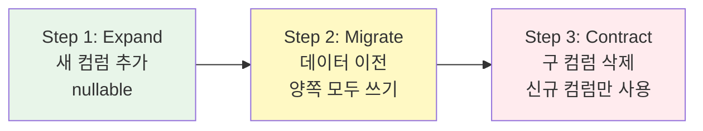
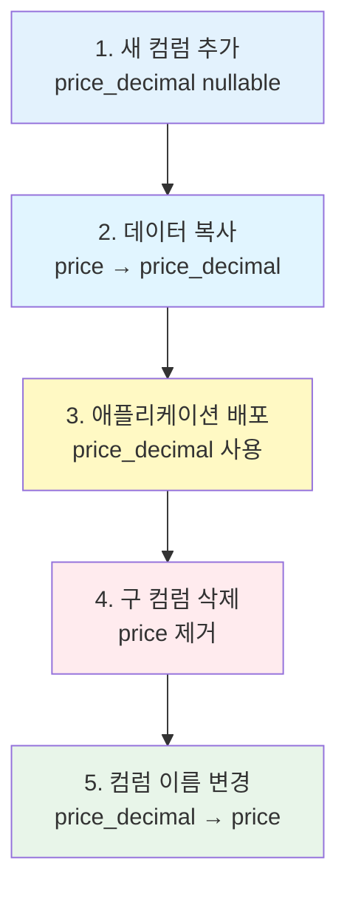
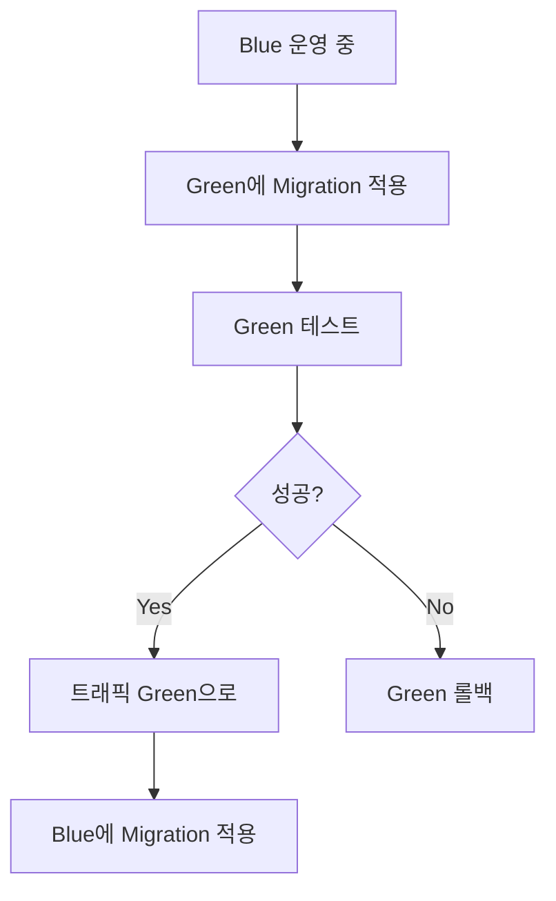

프로덕션 환경에서 안전하게 데이터베이스 스키마를 변경하는 전략입니다.

## 기본 원칙

<CardGroup cols={2}>
  <Card title="Zero Downtime" icon="circle-check">
    무중단 배포
    
    호환성 유지
  </Card>
  <Card title="Backward Compatible" icon="arrow-left">
    하위 호환성
    
    점진적 변경
  </Card>
  <Card title="Rollback Ready" icon="rotate-left">
    롤백 가능
    
    항상 준비
  </Card>
  <Card title="Test First" icon="vial">
    테스트 우선
    
    스테이징 검증
  </Card>
</CardGroup>

## 무중단 배포 패턴

### 패턴 1: Expand-Contract

새 구조 추가 → 마이그레이션 → 구 구조 제거



**Step 1: Expand (확장)** - 새 컬럼 추가
```typescript
// Migration 1: 새 컬럼 추가 (nullable)
export async function up(knex: Knex): Promise<void> {
  await knex.schema.alterTable("users", (table) => {
    table.string("email_verified", 20).nullable();  // 새 컬럼
  });
}

// 애플리케이션: 양쪽 모두 쓰기
await knex("users").update({
  is_verified: true,
  email_verified: "verified",  // 새 컬럼에도 쓰기
});
```

**Step 2: Migrate (데이터 마이그레이션)**
```typescript
// Migration 2: 데이터 이전
export async function up(knex: Knex): Promise<void> {
  await knex.raw(`
    UPDATE users 
    SET email_verified = CASE 
      WHEN is_verified THEN 'verified'
      ELSE 'unverified'
    END
    WHERE email_verified IS NULL
  `);
}
```

**Step 3: Contract (축소)** - 구 컬럼 제거
```typescript
// Migration 3: 구 컬럼 삭제
export async function up(knex: Knex): Promise<void> {
  await knex.schema.alterTable("users", (table) => {
    table.dropColumns("is_verified");  // 구 컬럼 제거
  });
}
```

<Info>
**Expand-Contract 장점**:
- 무중단 배포 가능
- 언제든지 롤백 가능
- 데이터 손실 없음
</Info>

### 패턴 2: 점진적 마이그레이션

```typescript
// Phase 1: 새 컬럼 추가 (nullable)
export async function up(knex: Knex): Promise<void> {
  await knex.schema.alterTable("users", (table) => {
    table.jsonb("settings").nullable();
  });
}

// Phase 2: 애플리케이션 배포 (settings 사용 시작)

// Phase 3: 데이터 마이그레이션 (백그라운드)
async function migrateSettings() {
  const users = await knex("users")
    .whereNull("settings")
    .limit(100);
  
  for (const user of users) {
    await knex("users")
      .where("id", user.id)
      .update({
        settings: { theme: "light", language: "ko" },
      });
  }
}

// Phase 4: NOT NULL 제약 추가
export async function up(knex: Knex): Promise<void> {
  await knex.raw(
    `ALTER TABLE users ALTER COLUMN settings SET NOT NULL`
  );
}
```

## 위험한 변경 피하기

### ❌ 위험: 직접 컬럼 삭제

```typescript
// 🚨 위험: 즉시 데이터 손실
export async function up(knex: Knex): Promise<void> {
  await knex.schema.alterTable("users", (table) => {
    table.dropColumns("old_field");
  });
}
```

### ✅ 안전: 단계적 삭제

```typescript
// Step 1: 컬럼을 nullable로 변경
export async function up(knex: Knex): Promise<void> {
  await knex.raw(
    `ALTER TABLE users ALTER COLUMN old_field DROP NOT NULL`
  );
}

// Step 2: 애플리케이션에서 사용 중지

// Step 3: 일정 기간 후 삭제
export async function up(knex: Knex): Promise<void> {
  await knex.schema.alterTable("users", (table) => {
    table.dropColumns("old_field");
  });
}
```

### ❌ 위험: NOT NULL 즉시 추가

```typescript
// 🚨 위험: 기존 null 데이터 에러
export async function up(knex: Knex): Promise<void> {
  await knex.schema.alterTable("users", (table) => {
    table.string("phone", 20).notNullable();  // 기존 row는 null
  });
}
```

### ✅ 안전: nullable → 마이그레이션 → NOT NULL

```typescript
// Step 1: nullable로 추가
export async function up(knex: Knex): Promise<void> {
  await knex.schema.alterTable("users", (table) => {
    table.string("phone", 20).nullable();
  });
}

// Step 2: 기본값 설정
await knex("users")
  .whereNull("phone")
  .update({ phone: "000-0000-0000" });

// Step 3: NOT NULL 추가
export async function up(knex: Knex): Promise<void> {
  await knex.raw(
    `ALTER TABLE users ALTER COLUMN phone SET NOT NULL`
  );
}
```

## 데이터 타입 변경

### 안전한 타입 변경 순서

```typescript
// Step 1: 새 컬럼 추가
export async function up(knex: Knex): Promise<void> {
  await knex.schema.alterTable("products", (table) => {
    table.decimal("price_decimal", 10, 2).nullable();
  });
}

// Step 2: 데이터 복사
await knex.raw(`
  UPDATE products 
  SET price_decimal = price::decimal(10,2)
`);

// Step 3: 애플리케이션 변경 (price_decimal 사용)

// Step 4: 구 컬럼 삭제
export async function up(knex: Knex): Promise<void> {
  await knex.schema.alterTable("products", (table) => {
    table.dropColumns("price");
  });
  
  // 컬럼 이름 변경
  await knex.raw(
    `ALTER TABLE products RENAME COLUMN price_decimal TO price`
  );
}
```



## 인덱스 전략

### 동시성 인덱스 생성

```typescript
// ❌ 잘못됨: 테이블 잠금
export async function up(knex: Knex): Promise<void> {
  await knex.schema.alterTable("users", (table) => {
    table.index(["email"], "users_email_index");
  });
}

// ✅ 올바름: CONCURRENTLY 사용
export async function up(knex: Knex): Promise<void> {
  await knex.raw(`
    CREATE INDEX CONCURRENTLY users_email_index 
    ON users(email)
  `);
}
```

<Warning>
**CONCURRENTLY 주의사항**:
- 트랜잭션 외부에서 실행
- 시간이 더 오래 걸림
- 실패 시 INVALID 인덱스 남음
</Warning>

### 인덱스 생성 모니터링

```sql
-- 진행 상황 확인
SELECT
  schemaname,
  tablename,
  indexname,
  pg_size_pretty(pg_relation_size(indexrelid)) AS index_size
FROM pg_stat_user_indexes
WHERE indexrelname = 'users_email_index';

-- INVALID 인덱스 확인
SELECT *
FROM pg_indexes
WHERE indexdef LIKE '%INVALID%';
```

## 외래 키 전략

### 대용량 테이블 FK 추가

```typescript
// Step 1: NOT VALID 제약 추가 (빠름)
export async function up(knex: Knex): Promise<void> {
  await knex.raw(`
    ALTER TABLE employees 
    ADD CONSTRAINT fk_employees_user_id 
    FOREIGN KEY (user_id) 
    REFERENCES users(id) 
    NOT VALID
  `);
}

// Step 2: 제약 검증 (백그라운드)
export async function up(knex: Knex): Promise<void> {
  await knex.raw(`
    ALTER TABLE employees 
    VALIDATE CONSTRAINT fk_employees_user_id
  `);
}
```

<Info>
**NOT VALID + VALIDATE 장점**:
- 기존 데이터 검증 스킵 (빠름)
- 새 데이터만 즉시 검증
- 나중에 백그라운드로 전체 검증
</Info>

## 대용량 데이터 마이그레이션

### Batch 처리

```typescript
export async function up(knex: Knex): Promise<void> {
  const batchSize = 1000;
  let offset = 0;
  
  while (true) {
    const users = await knex("users")
      .whereNull("normalized_email")
      .limit(batchSize)
      .offset(offset);
    
    if (users.length === 0) break;
    
    for (const user of users) {
      await knex("users")
        .where("id", user.id)
        .update({
          normalized_email: user.email.toLowerCase(),
        });
    }
    
    offset += batchSize;
    console.log(`Processed ${offset} users`);
  }
}
```

### 백그라운드 워커

```typescript
// migration에서는 컬럼만 추가
export async function up(knex: Knex): Promise<void> {
  await knex.schema.alterTable("users", (table) => {
    table.string("normalized_email").nullable();
  });
}

// 별도 스크립트로 데이터 마이그레이션
// scripts/migrate-emails.ts
async function migrateEmails() {
  const queue = new Queue("email-migration");
  
  const users = await knex("users").whereNull("normalized_email");
  
  for (const user of users) {
    await queue.add({
      userId: user.id,
      email: user.email,
    });
  }
}
```

## 배포 전략

### Blue-Green Deployment



### Rolling Deployment

```typescript
// Version N: 구 스키마 호환
app.get("/users/:id", async (req, res) => {
  const user = await knex("users")
    .select("id", "email", "is_verified")  // 구 컬럼
    .where("id", req.params.id)
    .first();
  
  res.json(user);
});

// Migration: 새 컬럼 추가

// Version N+1: 신구 스키마 모두 호환
app.get("/users/:id", async (req, res) => {
  const user = await knex("users")
    .select("id", "email", "is_verified", "email_verified")  // 양쪽 모두
    .where("id", req.params.id)
    .first();
  
  res.json({
    ...user,
    verified: user.email_verified || (user.is_verified ? "verified" : "unverified"),
  });
});

// Migration: 구 컬럼 삭제

// Version N+2: 새 스키마만
app.get("/users/:id", async (req, res) => {
  const user = await knex("users")
    .select("id", "email", "email_verified")  // 새 컬럼만
    .where("id", req.params.id)
    .first();
  
  res.json(user);
});
```

## 테스트 전략

### Migration 테스트

```typescript
// migration.test.ts
describe("20251220143200_alter_users_add1", () => {
  beforeEach(async () => {
    await knex.migrate.latest();
  });
  
  afterEach(async () => {
    await knex.migrate.rollback(null, true);
  });
  
  test("up: phone 컬럼 추가", async () => {
    const hasColumn = await knex.schema.hasColumn("users", "phone");
    expect(hasColumn).toBe(true);
  });
  
  test("down: phone 컬럼 제거", async () => {
    await knex.migrate.down();
    const hasColumn = await knex.schema.hasColumn("users", "phone");
    expect(hasColumn).toBe(false);
  });
  
  test("reversibility: up → down → up", async () => {
    await knex.migrate.down();
    await knex.migrate.up();
    
    const hasColumn = await knex.schema.hasColumn("users", "phone");
    expect(hasColumn).toBe(true);
  });
});
```

### 데이터 마이그레이션 테스트

```typescript
test("데이터 마이그레이션", async () => {
  // Given: 구 스키마 데이터
  await knex("users").insert([
    { email: "test@test.com", is_verified: true },
    { email: "test2@test.com", is_verified: false },
  ]);
  
  // When: Migration 실행
  await knex.migrate.up();
  
  // Then: 데이터 검증
  const users = await knex("users").select("*");
  
  expect(users[0].email_verified).toBe("verified");
  expect(users[1].email_verified).toBe("unverified");
});
```

## 모니터링

### Migration 성능 추적

```typescript
export async function up(knex: Knex): Promise<void> {
  const startTime = Date.now();
  
  await knex.schema.alterTable("users", (table) => {
    table.string("phone", 20).nullable();
  });
  
  const duration = Date.now() - startTime;
  
  // 로깅
  console.log(`Migration completed in ${duration}ms`);
  
  // 메트릭 전송
  await sendMetric("migration.duration", duration, {
    migration: "alter_users_add1",
  });
}
```

### 롱 러닝 쿼리 모니터링

```sql
-- 실행 중인 Migration 쿼리 확인
SELECT 
  pid,
  now() - query_start AS duration,
  state,
  query
FROM pg_stat_activity
WHERE state = 'active'
AND query LIKE 'ALTER TABLE%'
ORDER BY duration DESC;
```

## 체크리스트

### Migration 실행 전

- [ ] 스테이징 환경 테스트 완료
- [ ] 프로덕션 백업 완료
- [ ] 롤백 계획 수립
- [ ] 다운타임 계획 (필요시)
- [ ] 팀 공지
- [ ] 모니터링 준비

### Migration 실행 중

- [ ] 에러 로그 모니터링
- [ ] 성능 메트릭 확인
- [ ] 애플리케이션 헬스체크
- [ ] 사용자 피드백 확인

### Migration 실행 후

- [ ] 데이터 정합성 검증
- [ ] 애플리케이션 기능 테스트
- [ ] 성능 확인
- [ ] 문서 업데이트
- [ ] 롤백 테스트 (스테이징)

## 실전 사례

### 사례 1: 대용량 테이블 컬럼 추가

```typescript
// 100M 행 테이블에 인덱스 컬럼 추가

// Step 1: 컬럼 추가 (1초)
await knex.schema.alterTable("posts", (table) => {
  table.integer("user_id").nullable();
});

// Step 2: 백그라운드로 데이터 채우기 (30분)
// 별도 워커에서 배치 처리

// Step 3: 인덱스 생성 CONCURRENTLY (15분)
await knex.raw(`
  CREATE INDEX CONCURRENTLY posts_user_id_idx 
  ON posts(user_id)
`);

// Step 4: NOT NULL 제약 (1초)
await knex.raw(`
  ALTER TABLE posts 
  ALTER COLUMN user_id SET NOT NULL
`);
```

### 사례 2: 컬럼 이름 변경

```typescript
// Step 1: 새 컬럼 추가
await knex.schema.alterTable("products", (table) => {
  table.string("product_name", 200).nullable();
});

// Step 2: 데이터 복사
await knex.raw(`
  UPDATE products 
  SET product_name = name
`);

// Step 3: 애플리케이션 배포 (product_name 사용)

// Step 4: 구 컬럼 삭제
await knex.schema.alterTable("products", (table) => {
  table.dropColumns("name");
});
```

## 다음 단계

<CardGroup cols={2}>
  <Card title="마이그레이션 생성" icon="plus" href="/database/migrations/creating-migrations">
    Sonamu UI에서 생성
  </Card>
  <Card title="마이그레이션 실행" icon="play" href="/database/migrations/running-migrations">
    migrate run 명령어
  </Card>
  <Card title="롤백하기" icon="rotate-left" href="/database/migrations/rolling-back">
    변경 사항 되돌리기
  </Card>
  <Card title="동작 원리" icon="gear" href="/database/migrations/how-migrations-work">
    자동 생성 이해하기
  </Card>
</CardGroup>
