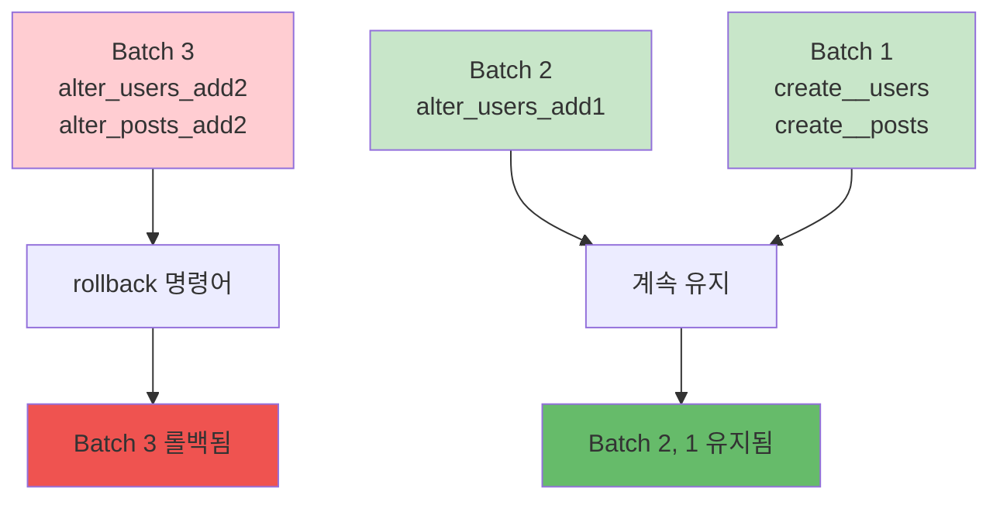

Migration을 롤백하여 데이터베이스를 이전 상태로 되돌릴 수 있습니다.

## 롤백 명령어

<CardGroup cols={2}>
  <Card title="rollback" icon="rotate-left">
    최근 batch 롤백
    
    한 번에 여러 개
  </Card>
  <Card title="rollback --all" icon="arrows-rotate">
    모든 Migration 롤백
    
    초기 상태로
  </Card>
  <Card title="down" icon="arrow-down">
    한 번에 하나씩
    
    단계별 롤백
  </Card>
  <Card title="status" icon="list-check">
    롤백 전 상태 확인
    
    batch 확인
  </Card>
</CardGroup>

## 기본 롤백

### 최근 batch 롤백

```bash
pnpm sonamu migrate rollback
```

**실행 결과**:
```
Batch 2 rolled back: 1 migration
✅ 20251220143200_alter_users_add1.ts
```

<Info>
`migrate rollback`은 가장 최근 batch의 모든 Migration을 롤백합니다.
</Info>

### 현재 상태 확인

```bash
pnpm sonamu migrate status
```

**출력**:
```
Executed migrations (Batch 1):
  ✅ 20251220143022_create__users.ts
  ✅ 20251220143100_create__posts.ts

Executed migrations (Batch 2):
  ✅ 20251220143200_alter_users_add1.ts  ← 이 batch가 롤백됨

Pending migrations:
  ⏳ 20251220143300_alter_posts_add1.ts
```

## 롤백 방식

### Batch 단위 롤백

```bash
# 상태 확인
pnpm sonamu migrate status

# Batch 3 (가장 최근)
✅ 20251220150000_alter_users_add2.ts
✅ 20251220150100_alter_posts_add2.ts

# Batch 2
✅ 20251220143200_alter_users_add1.ts

# 롤백 (Batch 3만)
pnpm sonamu migrate rollback

# 결과: Batch 3의 2개 Migration 롤백
Batch 3 rolled back: 2 migrations
✅ 20251220150000_alter_users_add2.ts
✅ 20251220150100_alter_posts_add2.ts
```

### 한 번에 하나씩

```bash
pnpm sonamu migrate down
```

**첫 번째 실행**:
```
Batch 2 rolled back: 1 migration
✅ 20251220143200_alter_users_add1.ts
```

**두 번째 실행**:
```
Batch 1 rolled back: 1 migration
✅ 20251220143100_create__posts.ts
```

### 전체 롤백

```bash
pnpm sonamu migrate rollback --all
```

**실행 결과**:
```
Batch 2 rolled back: 1 migration
✅ 20251220143200_alter_users_add1.ts

Batch 1 rolled back: 2 migrations
✅ 20251220143100_create__posts.ts
✅ 20251220143022_create__users.ts

All migrations rolled back successfully
```

<Warning>
`rollback --all`은 모든 테이블을 삭제합니다!
프로덕션에서는 절대 사용하지 마세요.
</Warning>

## down 함수

### 기본 구조

```typescript
export async function down(knex: Knex): Promise<void> {
  // up의 역작업 수행
}
```

### CREATE TABLE 롤백

```typescript
// up: 테이블 생성
export async function up(knex: Knex): Promise<void> {
  await knex.schema.createTable("users", (table) => {
    table.increments().primary();
    table.string("email", 255).notNullable();
  });
}

// down: 테이블 삭제
export async function down(knex: Knex): Promise<void> {
  return knex.schema.dropTable("users");
}
```

### ALTER TABLE 롤백

```typescript
// up: 컬럼 추가
export async function up(knex: Knex): Promise<void> {
  await knex.schema.alterTable("users", (table) => {
    table.string("phone", 20).nullable();
  });
}

// down: 컬럼 삭제
export async function down(knex: Knex): Promise<void> {
  await knex.schema.alterTable("users", (table) => {
    table.dropColumns("phone");
  });
}
```

### FOREIGN KEY 롤백

```typescript
// up: 외래 키 추가
export async function up(knex: Knex): Promise<void> {
  return knex.schema.alterTable("employees", (table) => {
    table
      .foreign("user_id")
      .references("users.id")
      .onUpdate("CASCADE")
      .onDelete("CASCADE");
  });
}

// down: 외래 키 삭제
export async function down(knex: Knex): Promise<void> {
  return knex.schema.alterTable("employees", (table) => {
    table.dropForeign(["user_id"]);
  });
}
```

## 롤백 시나리오

### 시나리오 1: 잘못된 Migration 수정

```bash
# 1. Migration 실행
pnpm sonamu migrate run
✅ 20251220143200_alter_users_add1.ts

# 2. 문제 발견 (잘못된 컬럼 타입)

# 3. 롤백
pnpm sonamu migrate rollback

# 4. Migration 파일 수정
vim src/migrations/20251220143200_alter_users_add1.ts

# 5. 다시 실행
pnpm sonamu migrate run
```

### 시나리오 2: 프로덕션 긴급 롤백

```bash
# 1. 프로덕션 배포 후 문제 발견

# 2. 즉시 롤백
NODE_ENV=production pnpm sonamu migrate rollback

# 3. 이전 버전 애플리케이션 배포

# 4. 문제 수정 후 재배포
```

### 시나리오 3: 부분 롤백

```bash
# 현재 상태
Batch 3: alter_users_add2.ts, alter_posts_add2.ts
Batch 2: alter_users_add1.ts
Batch 1: create__users.ts, create__posts.ts

# Batch 3만 롤백 (Batch 2, 1은 유지)
pnpm sonamu migrate rollback

# 결과
Batch 2: alter_users_add1.ts  ← 유지
Batch 1: create__users.ts, create__posts.ts  ← 유지
```



## 데이터 보존

### 롤백 시 데이터 손실

```typescript
// up: 컬럼 추가
export async function up(knex: Knex): Promise<void> {
  await knex.schema.alterTable("users", (table) => {
    table.string("phone", 20).nullable();
  });
}

// down: 컬럼 삭제 (데이터 손실!)
export async function down(knex: Knex): Promise<void> {
  await knex.schema.alterTable("users", (table) => {
    table.dropColumns("phone");  // ← phone 데이터 모두 삭제됨
  });
}
```

<Warning>
**데이터 손실 주의!**

컬럼/테이블 삭제 시 데이터는 복구되지 않습니다.
프로덕션에서는 백업 필수!
</Warning>

### 안전한 롤백 패턴

```typescript
// Step 1: 컬럼 추가 (nullable)
export async function up(knex: Knex): Promise<void> {
  await knex.schema.alterTable("users", (table) => {
    table.string("new_phone", 20).nullable();
  });
}

// Step 2: 데이터 마이그레이션
await knex("users").update({
  new_phone: knex.raw("old_phone"),
});

// Step 3: old_phone 컬럼 유지 (롤백 대비)
// → 나중에 별도 Migration으로 삭제
```

## 롤백 불가능한 경우

### 데이터 변환

```typescript
// up: 타입 변경
export async function up(knex: Knex): Promise<void> {
  await knex.raw(
    `ALTER TABLE users 
     ALTER COLUMN age TYPE integer 
     USING age::integer`
  );
}

// down: 원본 데이터 복구 불가능
export async function down(knex: Knex): Promise<void> {
  await knex.raw(
    `ALTER TABLE users 
     ALTER COLUMN age TYPE varchar(255)`
  );
  // "25" → 25 → "25" (원본이 "025"였다면 손실)
}
```

### 데이터 삭제

```typescript
// up: 특정 데이터 삭제
export async function up(knex: Knex): Promise<void> {
  await knex("users")
    .where("is_deleted", true)
    .delete();
}

// down: 삭제된 데이터 복구 불가능
export async function down(knex: Knex): Promise<void> {
  // 복구 불가능!
}
```

## 롤백 전략

### 1. 백업 우선

```bash
# PostgreSQL 백업
pg_dump -U postgres -d mydb > backup_before_rollback.sql

# 롤백
pnpm sonamu migrate rollback

# 문제 발생 시 복원
psql -U postgres -d mydb < backup_before_rollback.sql
```

### 2. 스테이징 테스트

```bash
# 스테이징에서 롤백 테스트
NODE_ENV=staging pnpm sonamu migrate rollback

# 문제 없으면 프로덕션
NODE_ENV=production pnpm sonamu migrate rollback
```

### 3. 점진적 롤백

```bash
# 한 번에 하나씩 롤백
pnpm sonamu migrate down

# 상태 확인
pnpm sonamu migrate status

# 애플리케이션 테스트

# 다음 롤백
pnpm sonamu migrate down
```

## 에러 처리

### 롤백 실패

```bash
pnpm sonamu migrate rollback
```

**에러**:
```
❌ Error rolling back 20251220143200_alter_users_add1.ts
   Error: column "phone" does not exist
```

**원인**:
- Migration이 부분적으로만 적용됨
- down 함수가 up과 일치하지 않음
- 수동으로 DB 변경함

**해결**:
1. DB 상태 수동 확인
2. knex_migrations 테이블 수정
3. down 함수 수정 후 재시도

### 강제 롤백

```sql
-- knex_migrations에서 제거
DELETE FROM knex_migrations 
WHERE name = '20251220143200_alter_users_add1.ts';

-- 수동으로 변경 사항 되돌리기
ALTER TABLE users DROP COLUMN phone;
```

## 롤백 로그

### 상세 로그

```bash
pnpm sonamu migrate rollback --verbose
```

**출력**:
```
Rolling back migration: 20251220143200_alter_users_add1.ts
SQL: ALTER TABLE "users" DROP COLUMN "phone"
✅ Completed in 23ms

Batch 2 rolled back: 1 migration
```

### 롤백 기록 조회

```sql
-- 최근 롤백된 Migration 확인
SELECT * FROM knex_migrations 
WHERE batch = (SELECT MAX(batch) + 1 FROM knex_migrations);
```

## 실전 팁

### 1. down 함수 검증

```typescript
// 테스트: up → down → up
test("migration reversibility", async () => {
  await migration.up(knex);
  await migration.down(knex);
  await migration.up(knex);  // 다시 실행 가능해야 함
});
```

### 2. 롤백 계획 문서화

```markdown
# Rollback Plan

## Migration: 20251220143200_alter_users_add1.ts

### Changes
- Add column: users.phone

### Rollback Impact
- Data loss: users.phone 데이터 삭제
- Estimated time: 5 seconds
- Downtime: None (nullable 컬럼)

### Rollback Steps
1. `pnpm sonamu migrate rollback`
2. Deploy previous app version
3. Verify phone field not used
```

### 3. 자동 롤백 스크립트

```bash
#!/bin/bash
# auto-rollback.sh

echo "Creating backup..."
pg_dump -U postgres -d mydb > backup.sql

echo "Rolling back..."
pnpm sonamu migrate rollback

if [ $? -eq 0 ]; then
  echo "✅ Rollback successful"
else
  echo "❌ Rollback failed, restoring backup..."
  psql -U postgres -d mydb < backup.sql
fi
```

## 다음 단계

<CardGroup cols={2}>
  <Card title="전략" icon="chess" href="/database/migrations/migration-strategies">
    안전한 마이그레이션 전략
  </Card>
  <Card title="마이그레이션 실행" icon="play" href="/database/migrations/running-migrations">
    migrate run으로 적용
  </Card>
  <Card title="마이그레이션 생성" icon="plus" href="/database/migrations/creating-migrations">
    Sonamu UI에서 생성
  </Card>
  <Card title="동작 원리" icon="gear" href="/database/migrations/how-migrations-work">
    자동 생성 이해하기
  </Card>
</CardGroup>
