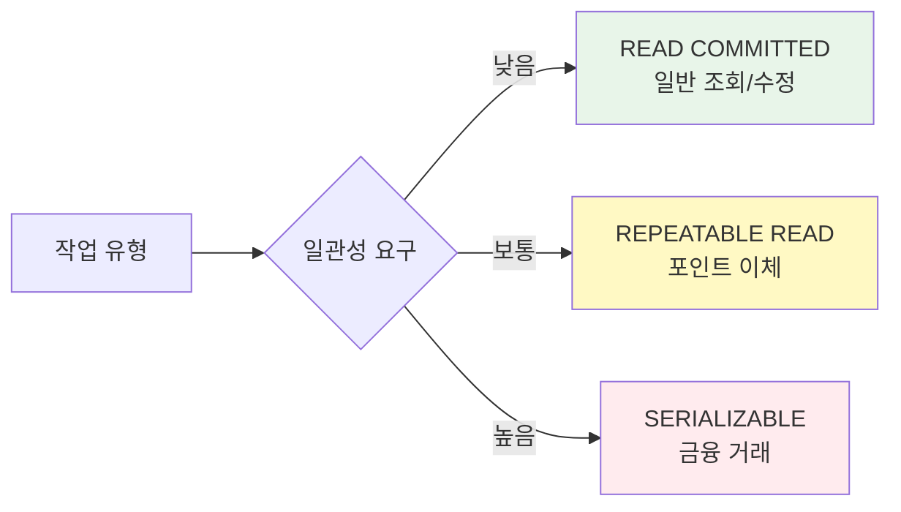
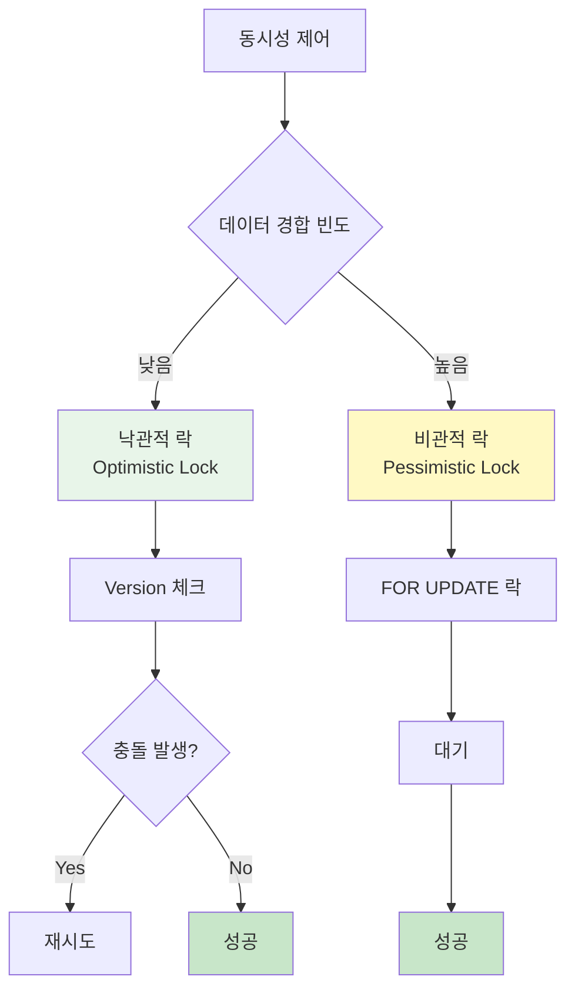

트랜잭션을 올바르게 사용하면 데이터 무결성을 보장하면서도 성능을 최적화할 수 있습니다.

## 핵심 원칙

<CardGroup cols={2}>
  <Card title="ACID 보장" icon="shield-check">
    원자성, 일관성, 격리성, 지속성
    
    데이터 무결성 유지
  </Card>
  <Card title="짧은 트랜잭션" icon="clock">
    필요한 만큼만
    
    락 대기 최소화
  </Card>
  <Card title="적절한 격리 수준" icon="sliders">
    요구사항에 맞게
    
    성능과 일관성 균형
  </Card>
  <Card title="에러 처리" icon="triangle-exclamation">
    명확한 롤백 전략
    
    일관된 상태 유지
  </Card>
</CardGroup>

## 트랜잭션 범위

### ✅ 좋은 패턴: 짧고 명확한 범위

```typescript
class OrderModel extends BaseModelClass {
  @transactional()
  async createOrder(
    userId: number,
    items: OrderItem[]
  ): Promise<number> {
    const wdb = this.getPuri("w");
    
    // 트랜잭션 내: 데이터 변경만
    const orderRef = wdb.ubRegister("orders", {
      user_id: userId,
      status: "pending",
      total_amount: this.calculateTotal(items),
    });
    
    items.forEach((item) => {
      wdb.ubRegister("order_items", {
        order_id: orderRef,
        product_id: item.productId,
        quantity: item.quantity,
        price: item.price,
      });
    });
    
    const [orderId] = await wdb.ubUpsert("orders");
    await wdb.ubUpsert("order_items");
    
    return orderId;
  }
  
  async placeOrder(
    userId: number,
    items: OrderItem[]
  ): Promise<number> {
    // 1. 검증 (트랜잭션 밖)
    await this.validateUser(userId);
    await this.checkInventory(items);
    
    // 2. 주문 생성 (트랜잭션)
    const orderId = await this.createOrder(userId, items);
    
    // 3. 후속 작업 (트랜잭션 밖)
    await this.sendOrderConfirmation(orderId);
    
    return orderId;
  }
}
```

### ❌ 나쁜 패턴: 긴 트랜잭션

```typescript
class OrderModel extends BaseModelClass {
  @transactional()
  async placeOrderBad(
    userId: number,
    items: OrderItem[]
  ): Promise<number> {
    const wdb = this.getPuri("w");
    
    // ❌ 트랜잭션 안에서 외부 API 호출
    const user = await this.fetchUserFromExternalAPI(userId);
    
    // ❌ 트랜잭션 안에서 복잡한 계산
    await this.calculateComplexPricing(items);
    
    // ❌ 트랜잭션 안에서 이메일 발송
    await this.sendEmail(user.email);
    
    // 실제 데이터 저장
    const [orderId] = await wdb
      .table("orders")
      .insert({ user_id: userId })
      .returning({ id: "id" });
    
    return orderId.id;
  }
}
```

<Warning>
**트랜잭션 안에 포함하지 말아야 할 것**:
- 외부 API 호출
- 파일 I/O
- 이메일/SMS 발송
- 복잡한 계산
- 느린 쿼리
</Warning>

## 격리 수준 선택

### 용도별 권장 격리 수준

```typescript
class ExampleModel extends BaseModelClass {
  // 일반 조회/수정 - READ COMMITTED
  @transactional({ isolation: "read committed" })
  async updateProfile(userId: number, bio: string): Promise<void> {
    const wdb = this.getPuri("w");
    await wdb.table("users").where("id", userId).update({ bio });
  }
  
  // 일관성 중요 - REPEATABLE READ (기본값)
  @transactional({ isolation: "repeatable read" })
  async transferPoints(
    fromUserId: number,
    toUserId: number,
    amount: number
  ): Promise<void> {
    const wdb = this.getPuri("w");
    
    // 같은 트랜잭션 내에서 일관된 데이터 보장
    const fromUser = await wdb.table("users").where("id", fromUserId).first();
    
    if (fromUser.points < amount) {
      throw new Error("Insufficient points");
    }
    
    await wdb.table("users").where("id", fromUserId).decrement("points", amount);
    await wdb.table("users").where("id", toUserId).increment("points", amount);
  }
  
  // 금융 거래 - SERIALIZABLE
  @transactional({ isolation: "serializable" })
  async processPayment(
    orderId: number,
    amount: number
  ): Promise<void> {
    const wdb = this.getPuri("w");
    
    // 최고 수준의 격리 보장
    const order = await wdb.table("orders").where("id", orderId).first();
    
    if (order.status !== "pending") {
      throw new Error("Order already processed");
    }
    
    await wdb.table("orders").where("id", orderId).update({
      status: "paid",
      paid_amount: amount,
      paid_at: new Date(),
    });
  }
}
```



## 에러 처리 전략

### 패턴 1: Try-Catch로 명확한 처리

```typescript
class UserModel extends BaseModelClass {
  async createUserSafe(data: UserSaveParams): Promise<Result<number>> {
    try {
      const userId = await this.createUserTransaction(data);
      return { success: true, data: userId };
    } catch (error) {
      if (error instanceof DuplicateEmailError) {
        return { success: false, error: "Email already exists" };
      }
      
      if (error instanceof ValidationError) {
        return { success: false, error: error.message };
      }
      
      // 예상치 못한 에러는 로깅 후 재전파
      console.error("Unexpected error:", error);
      throw error;
    }
  }
  
  @transactional()
  private async createUserTransaction(data: UserSaveParams): Promise<number> {
    const wdb = this.getPuri("w");
    
    // 중복 체크
    const existing = await wdb.table("users").where("email", data.email).first();
    if (existing) {
      throw new DuplicateEmailError();
    }
    
    // 검증
    if (!this.isValidEmail(data.email)) {
      throw new ValidationError("Invalid email format");
    }
    
    wdb.ubRegister("users", data);
    const [userId] = await wdb.ubUpsert("users");
    return userId;
  }
}

type Result<T> = 
  | { success: true; data: T }
  | { success: false; error: string };
```

### 패턴 2: 부분 롤백으로 복구

```typescript
class OrderModel extends BaseModelClass {
  @transactional()
  async createOrderWithRetry(
    userId: number,
    items: OrderItem[]
  ): Promise<number> {
    const wdb = this.getPuri("w");
    
    // 1. 주문 생성 (메인 트랜잭션)
    const [orderId] = await wdb
      .table("orders")
      .insert({ user_id: userId, status: "pending" })
      .returning({ id: "id" });
    
    // 2. 주문 아이템 생성 (부분 트랜잭션)
    for (const item of items) {
      try {
        await wdb.transaction(async (trx) => {
          // 재고 확인
          const product = await trx
            .table("products")
            .where("id", item.productId)
            .first();
          
          if (!product || product.stock < item.quantity) {
            throw new Error("Insufficient stock");
          }
          
          // 주문 아이템 생성
          await trx.table("order_items").insert({
            order_id: orderId.id,
            product_id: item.productId,
            quantity: item.quantity,
          });
          
          // 재고 차감
          await trx
            .table("products")
            .where("id", item.productId)
            .decrement("stock", item.quantity);
        });
      } catch (error) {
        console.warn(`Failed to add item ${item.productId}:`, error);
        // 실패한 아이템은 건너뜀 (부분 롤백)
        continue;
      }
    }
    
    return orderId.id;
  }
}
```

## 동시성 제어

### 낙관적 락 (Optimistic Lock)

```typescript
class ProductModel extends BaseModelClass {
  @transactional({ isolation: "repeatable read" })
  async updateStockOptimistic(
    productId: number,
    quantity: number
  ): Promise<void> {
    const wdb = this.getPuri("w");
    
    // 1. 현재 버전 조회
    const product = await wdb
      .table("products")
      .select({ id: "id", stock: "stock", version: "version" })
      .where("id", productId)
      .first();
    
    if (!product) {
      throw new Error("Product not found");
    }
    
    if (product.stock < quantity) {
      throw new Error("Insufficient stock");
    }
    
    // 2. 버전 체크와 함께 업데이트
    const updated = await wdb
      .table("products")
      .where("id", productId)
      .where("version", product.version) // 낙관적 락
      .update({
        stock: product.stock - quantity,
        version: product.version + 1,
      });
    
    // 3. 업데이트 실패 = 다른 트랜잭션이 먼저 변경
    if (updated === 0) {
      throw new Error("Concurrent modification detected. Please retry.");
    }
  }
}
```

### 비관적 락 (Pessimistic Lock)

```typescript
class AccountModel extends BaseModelClass {
  @transactional({ isolation: "serializable" })
  async transferMoney(
    fromAccountId: number,
    toAccountId: number,
    amount: number
  ): Promise<void> {
    const wdb = this.getPuri("w");
    
    // FOR UPDATE: 행 락 획득
    const fromAccount = await wdb
      .table("accounts")
      .where("id", fromAccountId)
      .forUpdate() // 비관적 락
      .first();
    
    const toAccount = await wdb
      .table("accounts")
      .where("id", toAccountId)
      .forUpdate() // 비관적 락
      .first();
    
    if (!fromAccount || !toAccount) {
      throw new Error("Account not found");
    }
    
    if (fromAccount.balance < amount) {
      throw new Error("Insufficient balance");
    }
    
    // 락이 걸린 상태에서 안전하게 업데이트
    await wdb
      .table("accounts")
      .where("id", fromAccountId)
      .decrement("balance", amount);
    
    await wdb
      .table("accounts")
      .where("id", toAccountId)
      .increment("balance", amount);
  }
}
```



## 데드락 방지

### 일관된 순서로 락 획득

```typescript
class TransferModel extends BaseModelClass {
  @transactional()
  async transferBetweenAccounts(
    accountId1: number,
    accountId2: number,
    amount: number
  ): Promise<void> {
    const wdb = this.getPuri("w");
    
    // ✅ 좋음: ID 순서대로 락 획득 (데드락 방지)
    const [fromId, toId] = accountId1 < accountId2 
      ? [accountId1, accountId2] 
      : [accountId2, accountId1];
    
    const fromAccount = await wdb
      .table("accounts")
      .where("id", fromId)
      .forUpdate()
      .first();
    
    const toAccount = await wdb
      .table("accounts")
      .where("id", toId)
      .forUpdate()
      .first();
    
    // 잔액 이체 로직
    // ...
  }
}
```

### 타임아웃 설정

```typescript
class OrderModel extends BaseModelClass {
  async processOrderWithTimeout(orderId: number): Promise<void> {
    const wdb = this.getPuri("w");
    
    // 타임아웃 설정 (5초)
    const timeoutPromise = new Promise((_, reject) =>
      setTimeout(() => reject(new Error("Transaction timeout")), 5000)
    );
    
    const transactionPromise = wdb.transaction(async (trx) => {
      // 트랜잭션 로직
      await trx.table("orders").where("id", orderId).update({ status: "processing" });
      // ...
    });
    
    try {
      await Promise.race([transactionPromise, timeoutPromise]);
    } catch (error) {
      console.error("Transaction failed or timed out:", error);
      throw error;
    }
  }
}
```

## 성능 최적화

### 배치 처리

```typescript
class UserModel extends BaseModelClass {
  // ❌ 나쁨: 각 User마다 트랜잭션
  async createUsersBad(users: UserSaveParams[]): Promise<number[]> {
    const ids: number[] = [];
    
    for (const user of users) {
      const id = await this.createUser(user); // 각각 트랜잭션
      ids.push(id);
    }
    
    return ids;
  }
  
  // ✅ 좋음: 단일 트랜잭션으로 배치 처리
  @transactional()
  async createUsersGood(users: UserSaveParams[]): Promise<number[]> {
    const wdb = this.getPuri("w");
    
    users.forEach((user) => {
      wdb.ubRegister("users", user);
    });
    
    const ids = await wdb.ubUpsert("users");
    return ids;
  }
}
```

### 읽기/쓰기 분리

```typescript
class ProductModel extends BaseModelClass {
  async updateProductWithReadReplica(
    productId: number,
    data: Partial<Product>
  ): Promise<void> {
    // 1. 조회는 READ DB (트랜잭션 불필요)
    const rdb = this.getPuri("r");
    const product = await rdb
      .table("products")
      .where("id", productId)
      .first();
    
    if (!product) {
      throw new Error("Product not found");
    }
    
    // 2. 검증 로직 (트랜잭션 밖)
    this.validateProductData(data);
    
    // 3. 쓰기는 WRITE DB (짧은 트랜잭션)
    const wdb = this.getPuri("w");
    await wdb.transaction(async (trx) => {
      await trx
        .table("products")
        .where("id", productId)
        .update(data);
    });
  }
}
```

## 테스트 전략

### 트랜잭션 롤백 테스트

```typescript
import { describe, test, expect } from "vitest";

describe("UserModel.createUser", () => {
  test("should rollback on duplicate email", async () => {
    // Given: 기존 User
    const email = "test@example.com";
    await UserModel.createUser({
      email,
      username: "existing",
      password: "pass",
      role: "normal",
    });
    
    // When: 중복 이메일로 생성 시도
    const promise = UserModel.createUser({
      email, // 중복
      username: "new",
      password: "pass",
      role: "normal",
    });
    
    // Then: 에러 발생
    await expect(promise).rejects.toThrow("Email already exists");
    
    // 롤백 확인: 새 User가 생성되지 않음
    const users = await UserModel.getPuri("r")
      .table("users")
      .where("email", email)
      .select({ username: "username" });
    
    expect(users).toHaveLength(1);
    expect(users[0].username).toBe("existing");
  });
});
```

### 동시성 테스트

```typescript
describe("ProductModel.updateStock", () => {
  test("should handle concurrent updates correctly", async () => {
    // Given: 재고 100개
    const productId = await createProduct({ stock: 100 });
    
    // When: 동시에 10명이 10개씩 구매
    const promises = Array(10).fill(null).map(() =>
      ProductModel.updateStock(productId, 10)
    );
    
    await Promise.all(promises);
    
    // Then: 재고는 0이어야 함
    const product = await ProductModel.getPuri("r")
      .table("products")
      .where("id", productId)
      .first();
    
    expect(product.stock).toBe(0);
  });
});
```

## 체크리스트

### 트랜잭션 설계 시

- [ ] 트랜잭션 범위가 최소화되어 있는가?
- [ ] 외부 API 호출이 트랜잭션 밖에 있는가?
- [ ] 적절한 격리 수준을 선택했는가?
- [ ] 에러 처리가 명확한가?
- [ ] 데드락 가능성을 고려했는가?

### 코드 리뷰 시

- [ ] 중첩 트랜잭션이 필요한가?
- [ ] 락 순서가 일관되는가?
- [ ] 롤백 시나리오가 명확한가?
- [ ] 성능 영향을 고려했는가?
- [ ] 테스트 코드가 있는가?

## 안티패턴

### 1. 트랜잭션 남용

```typescript
// ❌ 나쁨: 단순 조회에 트랜잭션
@transactional()
async getUser(userId: number): Promise<User> {
  const wdb = this.getPuri("w");
  return wdb.table("users").where("id", userId).first();
}

// ✅ 좋음: 조회는 트랜잭션 불필요
async getUser(userId: number): Promise<User> {
  const rdb = this.getPuri("r");
  return rdb.table("users").where("id", userId).first();
}
```

### 2. 에러 무시

```typescript
// ❌ 나쁨: 에러를 catch로 숨김
@transactional()
async createUserBad(data: UserSaveParams): Promise<number | null> {
  try {
    const wdb = this.getPuri("w");
    // ...
    return userId;
  } catch (error) {
    console.error(error);
    return null; // 에러 숨김 → 롤백 안 됨
  }
}

// ✅ 좋음: 에러 재전파
@transactional()
async createUserGood(data: UserSaveParams): Promise<number> {
  const wdb = this.getPuri("w");
  // 에러 발생 시 자동 롤백
  // ...
  return userId;
}
```

### 3. 불필요한 중첩

```typescript
// ❌ 나쁨: 불필요한 중첩 트랜잭션
@transactional()
async outerTransaction(): Promise<void> {
  const wdb = this.getPuri("w");
  
  await wdb.transaction(async (trx) => {
    // 이미 @transactional 안이므로 불필요
    // ...
  });
}

// ✅ 좋음: 단순하게
@transactional()
async simpleTransaction(): Promise<void> {
  const wdb = this.getPuri("w");
  // 직접 작업
  // ...
}
```

## 다음 단계

<CardGroup cols={2}>
  <Card title="@transactional" icon="at" href="/database/transactions/transactional-decorator">
    데코레이터 사용법
  </Card>
  <Card title="수동 트랜잭션" icon="hand" href="/database/transactions/manual-transactions">
    transaction() 직접 사용
  </Card>
  <Card title="UpsertBuilder" icon="database" href="/database/upsert-builder/basic-usage">
    트랜잭션 내 데이터 저장
  </Card>
  <Card title="에러 처리" icon="triangle-exclamation" href="/api-development/error-handling">
    API 에러 처리하기
  </Card>
</CardGroup>
