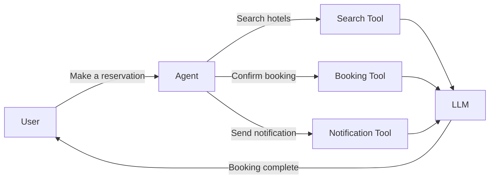

Sonamu allows you to build AI agents based on the **Vercel AI SDK**. It supports various LLM providers like OpenAI and Anthropic, and you can define custom tools to enable agents to perform specific tasks.

## What is an AI Agent?

An **AI Agent** is a system that provides **tools** to a conversational AI model (LLM), allowing it to automatically perform complex tasks.



**Characteristics**:
- LLM selects and executes appropriate tools based on context
- Automatically performs multi-step tasks
- Maintains context throughout conversations

## Required Package Installation

To use AI agents, you need to install the **Vercel AI SDK** and LLM provider packages.

### Using OpenAI

```bash
pnpm add ai @ai-sdk/openai
```

### Using Anthropic

```bash
pnpm add ai @ai-sdk/anthropic
```

### Using Both

```bash
pnpm add ai @ai-sdk/openai @ai-sdk/anthropic
```

## Basic Configuration

### Environment Variables

```.env
# OpenAI
OPENAI_API_KEY=sk-...

# Anthropic
ANTHROPIC_API_KEY=sk-ant-...
```

### LLM Model Initialization

<Tabs>
  <Tab title="OpenAI" icon="brain">
    ```typescript
    import { openai } from '@ai-sdk/openai';

    const model = openai('gpt-4o');  // GPT-4 Optimized
    ```

    **Supported Models**:
    - `gpt-4o`: GPT-4 Optimized (latest)
    - `gpt-4-turbo`: GPT-4 Turbo
    - `gpt-4`: GPT-4
    - `gpt-3.5-turbo`: GPT-3.5 Turbo
  </Tab>

  <Tab title="Anthropic" icon="robot">
    ```typescript
    import { anthropic } from '@ai-sdk/anthropic';

    const model = anthropic('claude-3-5-sonnet-20241022');  // Claude 3.5 Sonnet
    ```

    **Supported Models**:
    - `claude-3-5-sonnet-20241022`: Claude 3.5 Sonnet (latest)
    - `claude-3-opus-20240229`: Claude 3 Opus
    - `claude-3-sonnet-20240229`: Claude 3 Sonnet
    - `claude-3-haiku-20240307`: Claude 3 Haiku
  </Tab>

  <Tab title="Custom" icon="screwdriver-wrench">
    ```typescript
    import { openai } from '@ai-sdk/openai';

    const model = openai('gpt-4o', {
      baseURL: 'https://api.custom.com/v1',
      apiKey: process.env.CUSTOM_API_KEY,
    });
    ```
  </Tab>
</Tabs>

## AgentConfig

The agent configuration object.

```typescript
import type { AgentConfig } from "sonamu/ai";

const config: AgentConfig = {
  model: openai('gpt-4o'),
  instructions: "You are a hotel booking assistant.",
  toolChoice: 'auto',
  temperature: 0.7,
  maxOutputTokens: 1000,
};
```

### Key Options

<Tabs>
  <Tab title="model" icon="brain">
    **LLM Model** (required)

    ```typescript
    import { openai } from '@ai-sdk/openai';
    import { anthropic } from '@ai-sdk/anthropic';

    config: {
      model: openai('gpt-4o'),
      // model: anthropic('claude-3-5-sonnet-20241022'),
    }
    ```
  </Tab>

  <Tab title="instructions" icon="book">
    **System Prompt**

    ```typescript
    config: {
      model: openai('gpt-4o'),
      instructions: `
        You are a friendly customer support chatbot.
        Always respond politely and use tools when necessary.
      `,
    }
    ```
  </Tab>

  <Tab title="toolChoice" icon="wrench">
    **Tool Usage Strategy**

    ```typescript
    config: {
      model: openai('gpt-4o'),
      toolChoice: 'auto',  // 'auto' | 'none' | 'required'
    }
    ```

    **Options**:
    - `'auto'`: AI uses tools when needed (default)
    - `'none'`: No tool usage
    - `'required'`: Must use tools
  </Tab>

  <Tab title="temperature" icon="temperature-half">
    **Creativity Control**

    ```typescript
    config: {
      model: openai('gpt-4o'),
      temperature: 0.7,  // 0.0 ~ 2.0
    }
    ```

    **Range**: 0.0 ~ 2.0
    - `0.0`: Deterministic (consistent responses)
    - `0.7`: Balanced (default)
    - `1.5+`: Creative (varied responses)
  </Tab>
</Tabs>

### Additional Options

```typescript
const config: AgentConfig = {
  model: openai('gpt-4o'),

  // Token limits
  maxOutputTokens: 1000,

  // Advanced parameters
  topP: 0.9,                    // Top-P sampling
  topK: 50,                     // Top-K sampling
  presencePenalty: 0.0,         // Topic repetition suppression
  frequencyPenalty: 0.0,        // Word repetition suppression

  // Stop conditions
  stopSequences: ['\n\n'],      // Stop sequences

  // Reproducibility
  seed: 12345,                  // Fixed seed

  // HTTP headers
  headers: {
    'X-Custom-Header': 'value',
  },
};
```

## Practical Configuration Examples

### 1. Customer Support Chatbot

```typescript
import { openai } from '@ai-sdk/openai';
import type { AgentConfig } from "sonamu/ai";

const config: AgentConfig = {
  model: openai('gpt-4o'),
  instructions: `
    You are an e-commerce customer support chatbot.
    - Help with order lookup, delivery tracking, and refund processing.
    - Always respond politely and clearly.
    - Use tools when needed to provide accurate information.
  `,
  toolChoice: 'auto',
  temperature: 0.3,  // Consistent responses
  maxOutputTokens: 500,
};
```

### 2. Creative Content Generation

```typescript
import { anthropic } from '@ai-sdk/anthropic';
import type { AgentConfig } from "sonamu/ai";

const config: AgentConfig = {
  model: anthropic('claude-3-5-sonnet-20241022'),
  instructions: `
    You are a blog writing assistant.
    - Write creative content on given topics.
    - Consider SEO optimization.
    - Search for related information when needed.
  `,
  toolChoice: 'auto',
  temperature: 1.0,  // Creative
  maxOutputTokens: 2000,
};
```

### 3. Data Analysis Agent

```typescript
import { openai } from '@ai-sdk/openai';
import type { AgentConfig } from "sonamu/ai";

const config: AgentConfig = {
  model: openai('gpt-4o'),
  instructions: `
    You are a data analysis expert.
    - Generate and execute SQL queries.
    - Analyze data and provide insights.
    - Create visualization charts.
  `,
  toolChoice: 'required',  // Always use tools
  temperature: 0.0,  // Accurate queries
  maxOutputTokens: 1500,
};
```

### 4. Multimodal Agent

```typescript
import { openai } from '@ai-sdk/openai';
import type { AgentConfig } from "sonamu/ai";

const config: AgentConfig = {
  model: openai('gpt-4o'),  // Image support
  instructions: `
    You are an image analysis and description expert.
    - Analyze images and describe them in detail.
    - Search for related information when needed.
  `,
  toolChoice: 'auto',
  temperature: 0.5,
  maxOutputTokens: 1000,
};
```

## Environment-Specific Configuration

### Development Environment

```typescript
const isDevelopment = process.env.NODE_ENV === 'development';

const config: AgentConfig = {
  model: isDevelopment
    ? openai('gpt-3.5-turbo')  // Fast and cheap
    : openai('gpt-4o'),        // For production

  instructions: "...",

  temperature: isDevelopment ? 0.0 : 0.7,  // Development: consistency
  maxOutputTokens: isDevelopment ? 500 : 2000,
};
```

### Production Environment

```typescript
const config: AgentConfig = {
  model: openai('gpt-4o', {
    apiKey: process.env.OPENAI_API_KEY,
  }),

  instructions: "...",

  // Stable settings
  temperature: 0.5,
  maxOutputTokens: 1000,

  // Reproducibility
  seed: parseInt(process.env.AGENT_SEED || '0'),

  // Monitoring headers
  headers: {
    'X-Environment': 'production',
    'X-Version': process.env.APP_VERSION,
  },
};
```

## Cost Optimization

### Model Selection

| Model | Performance | Cost | Speed | Recommended Use |
|-------|-------------|------|-------|-----------------|
| GPT-4o | Highest | High | Medium | Complex tasks |
| GPT-4 Turbo | High | Medium | Fast | General tasks |
| GPT-3.5 Turbo | Medium | Low | Very fast | Simple tasks |
| Claude 3.5 Sonnet | Highest | Medium | Fast | Coding, analysis |
| Claude 3 Haiku | Low | Very low | Very fast | Simple tasks |

### Token Limits

```typescript
const config: AgentConfig = {
  model: openai('gpt-4o'),

  // Output token limit
  maxOutputTokens: 500,  // Cost savings

  // Concise instructions
  instructions: "Respond briefly.",
};
```

## Precautions

<Warning>
**Important considerations when configuring agents**:

1. **API Key Security**: Environment variables required
   ```typescript
   // ❌ Hardcoded
   model: openai('gpt-4o', { apiKey: 'sk-...' })

   // ✅ Environment variable
   model: openai('gpt-4o', { apiKey: process.env.OPENAI_API_KEY })
   ```

2. **Token Limits**: Set maxOutputTokens
   ```typescript
   maxOutputTokens: 1000,  // Cost control
   ```

3. **Temperature Range**: 0.0 ~ 2.0
   ```typescript
   temperature: 0.7,  // Appropriate value
   ```

4. **toolChoice Selection**: Configure based on use case
   ```typescript
   // Data analysis: required
   // General conversation: auto
   // Pure conversation: none
   ```

5. **Instructions Clarity**: Specific instructions
   ```typescript
   // ❌ Vague
   instructions: "Help me"

   // ✅ Clear
   instructions: "Customer support chatbot that helps with order lookup, delivery tracking, and refund processing"
   ```

6. **Cost Monitoring**: Track token usage in production
</Warning>

## Next Steps

<CardGroup cols={2}>
  <Card title="Creating Agents" icon="robot" href="/en/advanced-features/ai-agents/creating-agents">
    Build agents with BaseAgentClass
  </Card>
  <Card title="Using the AI SDK" icon="code" href="/en/advanced-features/ai-agents/using-ai-sdk">
    Leverage the Vercel AI SDK
  </Card>
</CardGroup>
