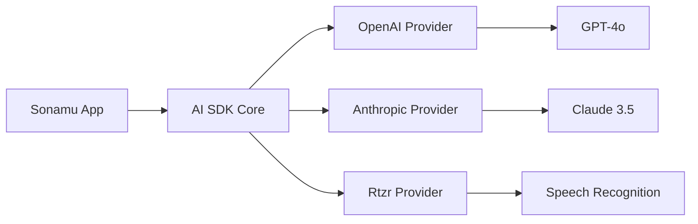

Sonamu is built on the **Vercel AI SDK** and provides various AI capabilities. You can easily implement text generation, streaming, tool calling, speech recognition, and more.

## Vercel AI SDK

This is the AI framework that Sonamu uses.



**Key Features**:
- Text Generation
- Streaming Responses
- Tool Calling
- Structured Output
- Transcription

## Text Generation

### generateText()

Generates plain text.

```typescript
import { openai } from '@ai-sdk/openai';
import { generateText } from 'ai';

const result = await generateText({
  model: openai('gpt-4o'),
  prompt: 'Tell me how to create an Express server with TypeScript',
});

console.log(result.text);
// => "To create an Express server..."
```

### Message-Based Conversation

```typescript
const result = await generateText({
  model: openai('gpt-4o'),
  messages: [
    { role: 'system', content: 'You are a friendly programming assistant.' },
    { role: 'user', content: 'What is TypeScript?' },
    { role: 'assistant', content: 'TypeScript is JavaScript with types added...' },
    { role: 'user', content: 'What are its advantages?' },
  ],
});
```

## Streaming Responses

### streamText()

Streams text in real-time.

```typescript
import { openai } from '@ai-sdk/openai';
import { streamText } from 'ai';

const result = streamText({
  model: openai('gpt-4o'),
  prompt: 'Tell me a long story',
});

// Process stream
for await (const chunk of result.textStream) {
  process.stdout.write(chunk);
}
```

### Integration with SSE

```typescript
import { BaseModel, stream, api } from "sonamu";
import { openai } from '@ai-sdk/openai';
import { streamText } from 'ai';
import { z } from "zod";

class ChatModelClass extends BaseModel {
  @stream({
    type: 'sse',
    events: z.object({
      chunk: z.object({
        text: z.string(),
      }),
      complete: z.object({
        totalTokens: z.number(),
      }),
    })
  })
  @api({ compress: false })
  async *streamChat(message: string, ctx: Context) {
    const sse = ctx.createSSE(
      z.object({
        chunk: z.object({
          text: z.string(),
        }),
        complete: z.object({
          totalTokens: z.number(),
        }),
      })
    );

    try {
      const result = streamText({
        model: openai('gpt-4o'),
        messages: [
          { role: 'user', content: message },
        ],
      });

      // Real-time transmission
      for await (const chunk of result.textStream) {
        sse.publish('chunk', { text: chunk });
      }

      // Completion statistics
      const usage = await result.usage;
      sse.publish('complete', {
        totalTokens: usage.totalTokens,
      });
    } finally {
      await sse.end();
    }
  }
}
```

## Tool Calling

### Single Tool

```typescript
import { openai } from '@ai-sdk/openai';
import { generateText, tool } from 'ai';
import { z } from 'zod';

const result = await generateText({
  model: openai('gpt-4o'),
  prompt: 'Tell me the current weather in Seoul',
  tools: {
    getWeather: tool({
      description: 'Fetches the current weather for a specific city',
      parameters: z.object({
        city: z.string().describe('City name'),
      }),
      execute: async ({ city }) => {
        // Call weather API
        const weather = await fetchWeather(city);
        return {
          temperature: weather.temp,
          condition: weather.condition,
        };
      },
    }),
  },
  maxSteps: 5,  // Maximum number of tool calls
});

console.log(result.text);
// => "The current weather in Seoul is clear with a temperature of 15 degrees."
```

### Multiple Tools

```typescript
const result = await generateText({
  model: openai('gpt-4o'),
  prompt: 'Check the weather in Seoul and tell me if I need an umbrella',
  tools: {
    getWeather: tool({
      description: 'Get weather information',
      parameters: z.object({
        city: z.string(),
      }),
      execute: async ({ city }) => {
        return await fetchWeather(city);
      },
    }),
    checkUmbrella: tool({
      description: 'Determine if an umbrella is needed based on weather information',
      parameters: z.object({
        condition: z.string().describe('Weather condition'),
      }),
      execute: async ({ condition }) => {
        return {
          needUmbrella: ['rain', 'snow'].includes(condition),
        };
      },
    }),
  },
  maxSteps: 10,
});
```

## Structured Output

### generateObject()

Generates structured data in JSON format.

```typescript
import { openai } from '@ai-sdk/openai';
import { generateObject } from 'ai';
import { z } from 'zod';

const result = await generateObject({
  model: openai('gpt-4o'),
  schema: z.object({
    name: z.string(),
    age: z.number(),
    hobbies: z.array(z.string()),
    address: z.object({
      city: z.string(),
      country: z.string(),
    }),
  }),
  prompt: 'Generate information about John Doe',
});

console.log(result.object);
// {
//   name: "John Doe",
//   age: 30,
//   hobbies: ["reading", "traveling"],
//   address: {
//     city: "New York",
//     country: "USA"
//   }
// }
```

### Practical Example

```typescript
import { BaseModel, api } from "sonamu";
import { openai } from '@ai-sdk/openai';
import { generateObject } from 'ai';
import { z } from 'zod';

class ProductModelClass extends BaseModel {
  @api({ httpMethod: 'POST' })
  async generateProductDescription(productName: string) {
    const result = await generateObject({
      model: openai('gpt-4o'),
      schema: z.object({
        title: z.string(),
        description: z.string(),
        features: z.array(z.string()),
        price: z.number(),
        tags: z.array(z.string()),
      }),
      prompt: `Generate a product description for ${productName}`,
    });

    // Save to DB
    const product = await this.saveOne({
      name: result.object.title,
      description: result.object.description,
      features: result.object.features,
      price: result.object.price,
      tags: result.object.tags,
    });

    return product;
  }
}
```

## Rtzr Provider (Speech Recognition)

Sonamu provides built-in support for **Rtzr** (a Korean speech recognition service).

### Configuration

```.env
RTZR_CLIENT_ID=your_client_id
RTZR_CLIENT_SECRET=your_client_secret
```

### Basic Usage

```typescript
import { rtzr } from 'sonamu/ai/providers/rtzr';

const model = rtzr.transcription('whisper');

const result = await model.doGenerate({
  audio: audioBuffer,  // Uint8Array or Base64
  mediaType: 'audio/wav',
});

console.log(result.text);
// => "Hello, the weather is nice today"

console.log(result.segments);
// [
//   { text: "Hello", startSecond: 0, endSecond: 1 },
//   { text: "the weather is nice today", startSecond: 1, endSecond: 3 }
// ]
```

### File Upload + Speech Recognition

```typescript
import { BaseModel, upload, api } from "sonamu";
import { rtzr } from 'sonamu/ai/providers/rtzr';

class TranscriptionModelClass extends BaseModel {
  @upload({ mode: 'single' })
  @api({ httpMethod: 'POST' })
  async transcribeAudio() {
    const { file } = Sonamu.getUploadContext();

    if (!file) {
      throw new Error('No audio file provided');
    }

    // Speech recognition
    const model = rtzr.transcription('whisper');
    const buffer = await file.toBuffer();

    const result = await model.doGenerate({
      audio: buffer,
      mediaType: file.mimetype,
    });

    // Save to DB
    await this.saveOne({
      audio_url: file.url,
      transcription: result.text,
      segments: result.segments,
      language: result.language,
      duration: result.durationInSeconds,
    });

    return {
      text: result.text,
      segments: result.segments,
    };
  }
}
```

### Rtzr Options

```typescript
const result = await model.doGenerate({
  audio: audioBuffer,
  mediaType: 'audio/wav',
  providerOptions: {
    rtzr: {
      domain: 'GENERAL',  // 'CALL' | 'GENERAL'
      language: 'ko',
      diarization: true,  // Speaker separation
      wordTimestamp: true,  // Word-level timestamps
      profanityFilter: false,  // Profanity filter
    }
  }
});
```

## Multimodal (Image Processing)

GPT-4o can accept images as input.

```typescript
import { openai } from '@ai-sdk/openai';
import { generateText } from 'ai';

const result = await generateText({
  model: openai('gpt-4o'),
  messages: [
    {
      role: 'user',
      content: [
        { type: 'text', text: 'What is in this image?' },
        {
          type: 'image',
          image: imageBuffer,  // Uint8Array or URL
        },
      ],
    },
  ],
});

console.log(result.text);
// => "The image contains a cat..."
```

### Image Upload + Analysis

```typescript
import { BaseModel, upload, api } from "sonamu";
import { openai } from '@ai-sdk/openai';
import { generateText } from 'ai';

class ImageAnalysisModelClass extends BaseModel {
  @upload({ mode: 'single' })
  @api({ httpMethod: 'POST' })
  async analyzeImage() {
    const { file } = Sonamu.getUploadContext();

    if (!file || !file.mimetype.startsWith('image/')) {
      throw new Error('An image file is required');
    }

    const buffer = await file.toBuffer();

    const result = await generateText({
      model: openai('gpt-4o'),
      messages: [
        {
          role: 'user',
          content: [
            { type: 'text', text: 'Analyze this image in detail' },
            { type: 'image', image: buffer },
          ],
        },
      ],
    });

    return {
      analysis: result.text,
      imageUrl: file.url,
    };
  }
}
```

## Error Handling

```typescript
import { openai } from '@ai-sdk/openai';
import { generateText } from 'ai';

try {
  const result = await generateText({
    model: openai('gpt-4o'),
    prompt: '...',
  });

  return result.text;
} catch (error) {
  if (error.name === 'AI_APICallError') {
    // API call error
    console.error('API Error:', error.message);
    console.error('Status:', error.statusCode);
  } else if (error.name === 'AI_InvalidPromptError') {
    // Prompt error
    console.error('Invalid Prompt:', error.message);
  } else {
    // Other errors
    console.error('Unknown Error:', error);
  }

  throw error;
}
```

## Cost Tracking

```typescript
const result = await generateText({
  model: openai('gpt-4o'),
  prompt: '...',
});

// Token usage
console.log('Prompt Tokens:', result.usage.promptTokens);
console.log('Completion Tokens:', result.usage.completionTokens);
console.log('Total Tokens:', result.usage.totalTokens);

// Cost calculation (example)
const costPerToken = 0.00003;  // GPT-4o pricing
const cost = result.usage.totalTokens * costPerToken;
console.log('Cost:', cost);
```

## Practical Integration Example

### AI Chat API

```typescript
import { BaseModel, api } from "sonamu";
import { openai } from '@ai-sdk/openai';
import { generateText } from 'ai';
import { z } from 'zod';

class ChatModelClass extends BaseModel {
  @api({ httpMethod: 'POST' })
  async chat(
    message: string,
    conversationId: number | null,
    ctx: Context
  ) {
    // Retrieve conversation history
    const history = conversationId
      ? await ConversationModel.findById(conversationId)
      : null;

    const messages = history?.messages || [];
    messages.push({
      role: 'user',
      content: message,
    });

    // Generate AI response
    const result = await generateText({
      model: openai('gpt-4o'),
      messages: [
        {
          role: 'system',
          content: 'You are a friendly customer support chatbot.',
        },
        ...messages,
      ],
      temperature: 0.7,
      maxTokens: 500,
    });

    // Save response
    messages.push({
      role: 'assistant',
      content: result.text,
    });

    const conversation = await ConversationModel.saveOne({
      id: conversationId,
      user_id: ctx.user.id,
      messages,
      token_usage: result.usage.totalTokens,
    });

    return {
      conversationId: conversation.id,
      message: result.text,
      usage: result.usage,
    };
  }
}
```

## Precautions

<Warning>
**Important considerations when using the AI SDK**:

1. **API Key Security**: Use environment variables
   ```typescript
   // ❌ Hardcoded
   const model = openai('gpt-4o', { apiKey: 'sk-...' });

   // ✅ Environment variable
   const model = openai('gpt-4o');  // Automatically uses OPENAI_API_KEY
   ```

2. **Error Handling**: Always use try-catch
   ```typescript
   try {
     const result = await generateText({ ... });
   } catch (error) {
     console.error(error);
   }
   ```

3. **Token Limits**: Set maxTokens
   ```typescript
   generateText({
     model: openai('gpt-4o'),
     prompt: '...',
     maxTokens: 1000,  // Cost control
   });
   ```

4. **Streaming Cleanup**: Terminate stream even on errors
   ```typescript
   try {
     for await (const chunk of result.textStream) {
       // ...
     }
   } finally {
     // Cleanup work
   }
   ```

5. **Rtzr File Size**: Large files require chunking
   ```typescript
   if (file.size > 10 * 1024 * 1024) {
     throw new Error('File size must be 10MB or less');
   }
   ```

6. **Image Size**: Check GPT-4o image limits
   ```typescript
   // Image size limit (20MB)
   if (imageBuffer.length > 20 * 1024 * 1024) {
     throw new Error('Image is too large');
   }
   ```
</Warning>

## Vercel AI SDK Documentation

For more features, refer to the official documentation:

- [Vercel AI SDK Documentation](https://sdk.vercel.ai/docs)
- [OpenAI Provider](https://sdk.vercel.ai/providers/ai-sdk-providers/openai)
- [Anthropic Provider](https://sdk.vercel.ai/providers/ai-sdk-providers/anthropic)

## Next Steps

<CardGroup cols={2}>
  <Card title="Agent Configuration" icon="gear" href="/advanced-features/ai-agents/agent-configuration">
    Configure agent basics
  </Card>
  <Card title="Creating Agents" icon="robot" href="/advanced-features/ai-agents/creating-agents">
    Build agents with BaseAgentClass
  </Card>
</CardGroup>
