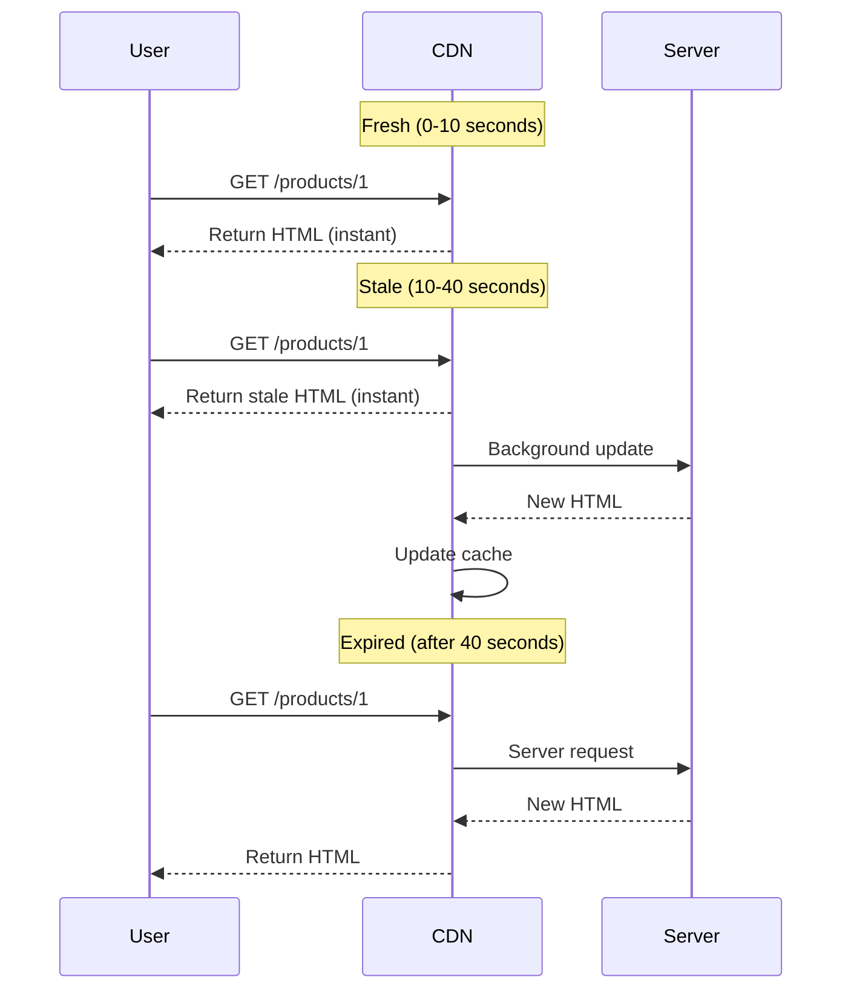
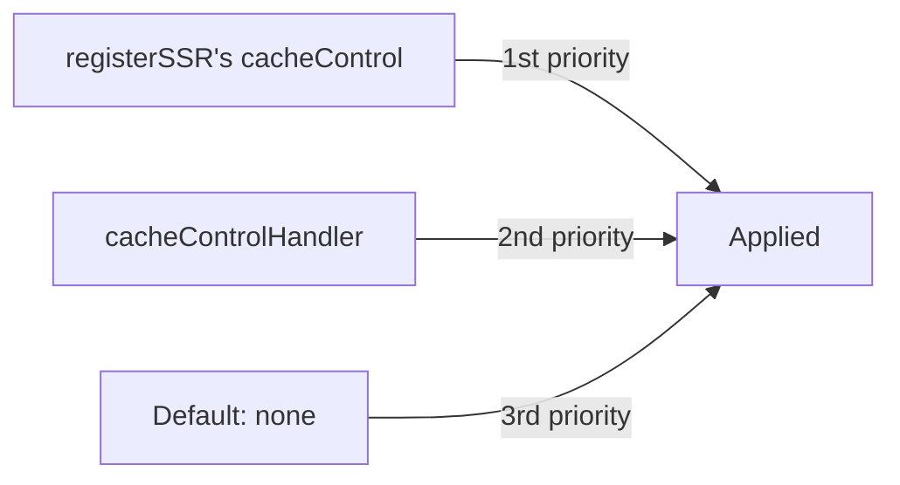

You can set **Cache-Control headers on SSR page responses** by adding the `cacheControl` option to Sonamu's SSR routes.

## Basic Usage

### Adding to registerSSR

```typescript
import { registerSSR, CachePresets } from "sonamu";
import ProductList from "./pages/ProductList";

registerSSR({
  path: "/products",
  Component: ProductList,
  cacheControl: CachePresets.ssr, // SSR optimized
});
```

**Result**:

```http
HTTP/1.1 200 OK
Cache-Control: public, max-age=10, stale-while-revalidate=30
Content-Type: text/html

<!DOCTYPE html>
<html>...</html>
```

## SSR Caching Strategy

### SSR Preset

**The most recommended approach** is using `CachePresets.ssr`.

```typescript
registerSSR({
  path: "/products/:id",
  Component: ProductDetail,
  cacheControl: CachePresets.ssr,
});
```

**CachePresets.ssr**:

```typescript
{
  visibility: 'public',
  maxAge: 10,  // Fresh for 10 seconds
  staleWhileRevalidate: 30  // Use stale for the next 30 seconds
}
```

### How It Works



**Benefits**:

- Most requests get instant response (CDN cache)
- Fast response even during stale period
- Background updates keep content fresh

## Strategies by Page Type

<Tabs>
  <Tab title="Dynamic Pages" icon="bolt">
    **Frequently changing content**

    ```typescript
    // Post list
    registerSSR({
      path: '/posts',
      Component: PostList,
      cacheControl: CachePresets.shortLived,  // 1 minute
    });

    // Real-time dashboard
    registerSSR({
      path: '/dashboard',
      Component: Dashboard,
      cacheControl: CachePresets.noCache,  // Revalidate every time
    });
    ```

  </Tab>

  <Tab title="Semi-dynamic Pages" icon="clock">
    **Occasionally changing content**

    ```typescript
    // Product detail
    registerSSR({
      path: '/products/:id',
      Component: ProductDetail,
      cacheControl: CachePresets.ssr,  // 10 seconds + SWR 30 seconds
    });

    // Blog post
    registerSSR({
      path: '/blog/:slug',
      Component: BlogPost,
      cacheControl: {
        visibility: 'public',
        maxAge: 300,  // 5 minutes
        staleWhileRevalidate: 900,  // 15 minutes
      }
    });
    ```

  </Tab>

  <Tab title="Static Pages" icon="file">
    **Rarely changing content**

    ```typescript
    // About page
    registerSSR({
      path: '/about',
      Component: About,
      cacheControl: CachePresets.longLived,  // 1 hour
    });

    // Terms of service
    registerSSR({
      path: '/terms',
      Component: Terms,
      cacheControl: {
        visibility: 'public',
        maxAge: 86400,  // 1 day
      }
    });
    ```

  </Tab>

  <Tab title="Personalized Pages" icon="user">
    **Different content per user**

    ```typescript
    // My profile page
    registerSSR({
      path: '/my/profile',
      Component: MyProfile,
      cacheControl: CachePresets.private,  // Browser only caching
    });

    // Shopping cart
    registerSSR({
      path: '/cart',
      Component: Cart,
      cacheControl: CachePresets.noStore,  // No caching
    });
    ```

  </Tab>
</Tabs>

## Practical Examples

### 1. E-commerce Site

```typescript
// Homepage: SSR optimized
registerSSR({
  path: "/",
  Component: HomePage,
  cacheControl: CachePresets.ssr, // 10 seconds + SWR 30 seconds
});

// Product list: Short cache
registerSSR({
  path: "/products",
  Component: ProductList,
  cacheControl: CachePresets.shortLived, // 1 minute
});

// Product detail: SSR optimized
registerSSR({
  path: "/products/:id",
  Component: ProductDetail,
  cacheControl: CachePresets.ssr,
});

// Category: Long cache
registerSSR({
  path: "/categories/:id",
  Component: CategoryPage,
  cacheControl: CachePresets.mediumLived, // 5 minutes
});

// Shopping cart: Personalized
registerSSR({
  path: "/cart",
  Component: Cart,
  cacheControl: CachePresets.private,
});

// Order complete: No caching
registerSSR({
  path: "/orders/:id/complete",
  Component: OrderComplete,
  cacheControl: CachePresets.noStore,
});
```

### 2. Blog

```typescript
// Homepage
registerSSR({
  path: "/",
  Component: HomePage,
  cacheControl: {
    visibility: "public",
    maxAge: 300, // 5 minutes
    staleWhileRevalidate: 900, // 15 minutes
  },
});

// Category posts
registerSSR({
  path: "/category/:slug",
  Component: CategoryPosts,
  cacheControl: CachePresets.mediumLived, // 5 minutes
});

// Post detail
registerSSR({
  path: "/posts/:slug",
  Component: PostDetail,
  cacheControl: {
    visibility: "public",
    maxAge: 600, // 10 minutes
    staleWhileRevalidate: 1800, // 30 minutes
  },
});

// Search results
registerSSR({
  path: "/search",
  Component: SearchResults,
  cacheControl: CachePresets.shortLived, // 1 minute
});
```

### 3. SaaS Dashboard

```typescript
// Public landing page
registerSSR({
  path: "/",
  Component: Landing,
  cacheControl: CachePresets.longLived, // 1 hour
});

// Dashboard after login
registerSSR({
  path: "/dashboard",
  Component: Dashboard,
  cacheControl: CachePresets.private, // Browser only
});

// User settings
registerSSR({
  path: "/settings",
  Component: Settings,
  cacheControl: CachePresets.noStore, // No caching
});
```

## CSR Fallback

All requests that don't match SSR routes are handled by CSR fallback.

```typescript
// CSR fallback route (catch-all)
registerSSR({
  path: "/*",
  Component: App,
  cacheControl: CachePresets.shortLived, // 1 minute
});
```

**How it works**:

```
/products/1 → SSR route matched → Uses that cacheControl
/random-page → SSR route not matched → Uses fallback cacheControl
```

## Global Handler

You can apply Cache-Control to all SSR pages at once.

```typescript
// sonamu.config.ts
import { CachePresets, type SonamuConfig } from "sonamu";

export const config: SonamuConfig = {
  server: {
    apiConfig: {
      cacheControlHandler: (req) => {
        // Only handle SSR requests
        if (req.type !== "ssr") {
          return undefined;
        }

        // Handle by path
        if (req.path === "/") {
          return CachePresets.ssr; // Homepage
        }

        if (req.path.startsWith("/admin/")) {
          return CachePresets.noStore; // Admin pages
        }

        if (req.path.startsWith("/my/")) {
          return CachePresets.private; // Personal pages
        }

        // Default: SSR preset
        return CachePresets.ssr;
      },
    },
  },
};
```

### Using SSRRoute Object

```typescript
cacheControlHandler: (req) => {
  if (req.type !== "ssr") return undefined;

  // Use SSRRoute information
  if (req.route) {
    const { path } = req.route;

    // Check for dynamic routes
    if (path.includes(":")) {
      return CachePresets.ssr; // Detail pages
    }

    // Static routes
    return CachePresets.mediumLived; // List pages
  }

  return CachePresets.shortLived;
};
```

## Priority Order

SSR Cache-Control settings are applied in the following order:



1. **registerSSR's cacheControl** (highest priority)
2. **cacheControlHandler return value**
3. **Default** (no Cache-Control header)

## Vary Header

Use Vary header for multi-language SSR pages.

```typescript
registerSSR({
  path: "/products/:id",
  Component: ProductDetail,
  cacheControl: {
    visibility: "public",
    maxAge: 300,
    vary: ["Accept-Language"], // Separate cache by language
  },
});
```

**Result**:

```
GET /products/1 (Accept-Language: ko) → Korean HTML cached
GET /products/1 (Accept-Language: en) → English HTML cached
```

## CDN Optimization

### CloudFront + Stale-While-Revalidate

AWS CloudFront supports `stale-while-revalidate`.

```typescript
registerSSR({
  path: "/products/:id",
  Component: ProductDetail,
  cacheControl: {
    visibility: "public",
    maxAge: 60, // 1 minute
    sMaxAge: 300, // CDN: 5 minutes
    staleWhileRevalidate: 600, // Use stale for 10 minutes
  },
});
```

**Effect**:

- Browser: Requests CDN every minute
- CDN: Requests server every 5 minutes
- Stale: Fast response for up to 15 minutes (5 min + 10 min)

### Combining with Static Assets

```typescript
// SSR page
registerSSR({
  path: "/products/:id",
  cacheControl: CachePresets.ssr, // 10 seconds
});

// Static files (separate configuration)
server.get("/assets/:filename", (req, reply) => {
  if (req.params.filename.includes("-")) {
    // Contains hash
    applyCacheHeaders(reply, CachePresets.immutable); // 1 year
  }
  return reply.sendFile(req.params.filename);
});
```

**Result**:

- HTML: Updates every 10 seconds (fresh content)
- JS/CSS: 1 year cache (fast loading)

## Preloading and Caching

Combine SSR's `preload` feature with Cache-Control.

```typescript
registerSSR({
  path: "/products/:id",
  Component: ProductDetail,
  preload: (params) => [
    {
      modelName: "ProductModel",
      methodName: "findById",
      params: ["A", Number(params.id)],
      serviceKey: ["Product", "getProduct"],
    },
  ],
  cacheControl: CachePresets.ssr,
});
```

**Effect**:

1. **During SSR**: Preload data on server → Generate HTML → Cache
2. **Cache hit**: CDN returns HTML instantly (fast)
3. **Hydration**: Client uses preloaded data

## Handling Personalized Pages

### Pages Requiring Authentication

```typescript
// Pages requiring login
registerSSR({
  path: "/my/profile",
  Component: MyProfile,
  cacheControl: CachePresets.private, // Browser only caching
});

// Or no caching
registerSSR({
  path: "/my/orders",
  Component: MyOrders,
  cacheControl: CachePresets.noStore,
});
```

### Conditional SSR

When rendering different pages based on user state:

```typescript
registerSSR({
  path: "/dashboard",
  Component: Dashboard,
  cacheControl: {
    visibility: "private", // private required
    noCache: true, // Revalidate every time
    vary: ["Cookie"], // Separate cache by cookie
  },
});
```

## Precautions

<Warning>
**Precautions when using SSR Cache-Control**:

1. **Personalized pages must be private or no-store**: Prevent CDN caching

   ```typescript
   // ❌ Dangerous: Personal page cached on CDN
   registerSSR({
     path: "/my/profile",
     cacheControl: { visibility: "public", maxAge: 60 },
   });

   // ✅ Safe
   registerSSR({
     path: "/my/profile",
     cacheControl: CachePresets.private,
   });
   ```

2. **Short TTL for dynamic content**: Prevent stale HTML

   ```typescript
   // ❌ Real-time dashboard but cached for 1 hour
   registerSSR({
     path: "/dashboard",
     cacheControl: CachePresets.longLived,
   });

   // ✅ Short TTL or no-cache
   registerSSR({
     path: "/dashboard",
     cacheControl: CachePresets.shortLived,
   });
   ```

3. **Consider authentication cookies**: Separate with Vary header

   ```typescript
   registerSSR({
     path: "/dashboard",
     cacheControl: {
       visibility: "private",
       maxAge: 60,
       vary: ["Cookie"], // Separate cache by cookie
     },
   });
   ```

4. **Configure CSR fallback**: Handle unmatched routes
   ```typescript
   // Add catch-all route at the end
   registerSSR({
     path: "/*",
     Component: App,
     cacheControl: CachePresets.shortLived,
   });
   ```
   </Warning>

## Debugging

### Checking Cache-Control Header

Check in browser developer tools:

```
Network tab → Select request → Headers tab
Response Headers:
  Cache-Control: public, max-age=10, stale-while-revalidate=30
  Vary: Accept-Language
```

### CDN Cache Status

CDNs provide cache status headers:

**CloudFront**:

```
X-Cache: Hit from cloudfront
Age: 5
```

**Cloudflare**:

```
CF-Cache-Status: HIT
Age: 5
```

## Next Steps

<CardGroup cols={2}>
  <Card
    title="What is Cache-Control?"
    icon="circle-question"
    href="/en/advanced-features/cache-control/what-is-cache-control"
  >
    HTTP caching fundamentals
  </Card>
  <Card title="Cache Presets" icon="list" href="/en/advanced-features/cache-control/cache-presets">
    Predefined cache configurations
  </Card>
  <Card title="Using in APIs" icon="code" href="/en/advanced-features/cache-control/using-in-apis">
    Apply to @api decorators
  </Card>
</CardGroup>
