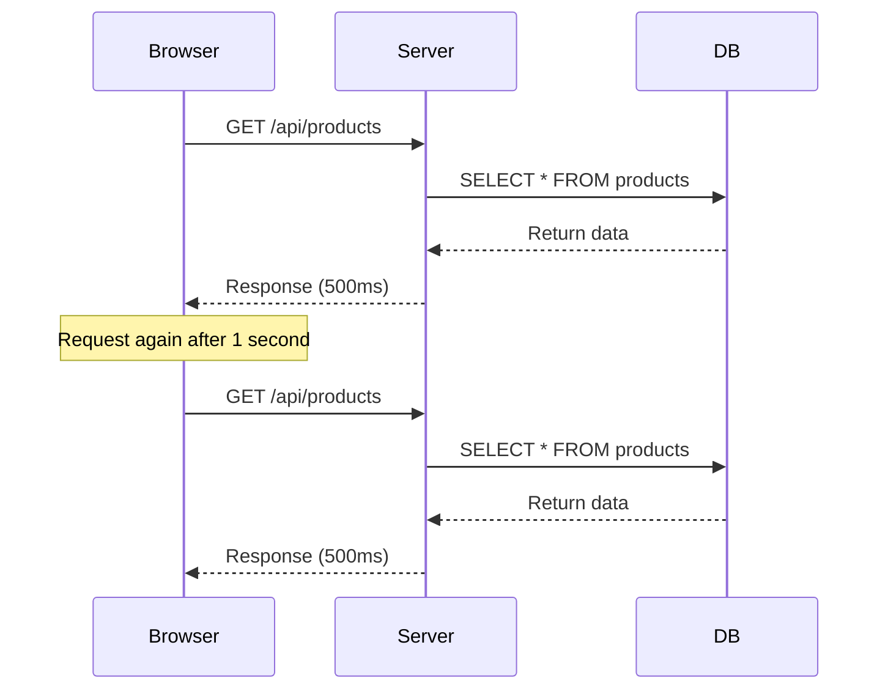
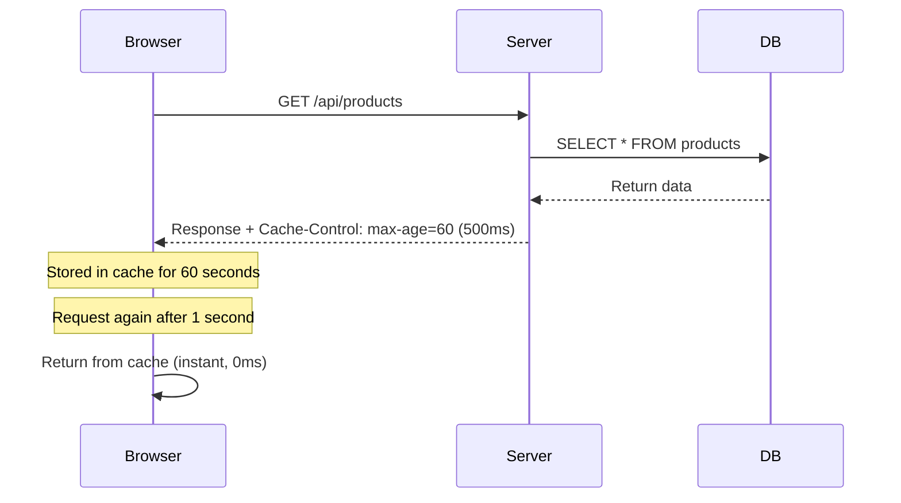
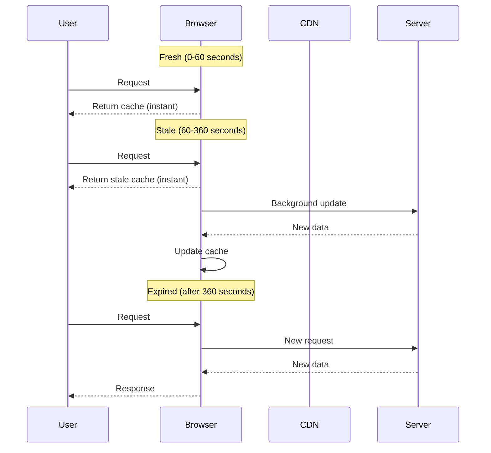

Cache-Control is an **HTTP response header** that controls how long browsers and CDNs can cache responses. Sonamu makes it easy to set Cache-Control headers on API and SSR responses.

## What is HTTP Caching?

HTTP caching is a mechanism that improves performance by **reusing responses for identical requests**.

### Without Caching



**Problem**: Queries the DB for the same data every time (slow, server load)

### With Caching



**Benefits**: Instant response without server request (fast, reduced server load)

## Cache-Control Header

### Basic Structure

```http
Cache-Control: public, max-age=3600
```

**Meaning**:
- `public`: Can be stored by all caches (browser, CDN)
- `max-age=3600`: Valid for 3600 seconds (1 hour)

### Key Directives

<Tabs>
  <Tab title="Storage Location" icon="location-dot">
    **public vs private**

    ```http
    Cache-Control: public, max-age=3600
    ```
    - **public**: Can be stored by all caches (browser, CDN, proxy)
    - Use case: Same response for all users (product lists, announcements)

    ```http
    Cache-Control: private, max-age=3600
    ```
    - **private**: Can only be stored in browser (not CDN/proxy)
    - Use case: Different response per user (my page, shopping cart)
  </Tab>

  <Tab title="No Caching" icon="ban">
    **no-store vs no-cache**

    ```http
    Cache-Control: no-store
    ```
    - **no-store**: Completely prohibits cache storage
    - Use case: Sensitive data, personal information
    - Effect: Always requests from server

    ```http
    Cache-Control: no-cache
    ```
    - **no-cache**: Stores cache but **requires revalidation every time**
    - Use case: Data where freshness is important
    - Effect: Asks server "Has it changed?" → Returns 304 Not Modified if unchanged
  </Tab>

  <Tab title="Expiration Time" icon="clock">
    **max-age**

    ```http
    Cache-Control: public, max-age=60
    ```
    - Browser cache validity time (in seconds)
    - 60 seconds = 1 minute, 3600 seconds = 1 hour

    **s-maxage**

    ```http
    Cache-Control: public, max-age=60, s-maxage=300
    ```
    - CDN/proxy cache validity time
    - Browser: 60 seconds, CDN: 300 seconds (5 minutes)
    - Use case: When you want CDN to cache longer
  </Tab>

  <Tab title="Revalidation" icon="rotate">
    **must-revalidate**

    ```http
    Cache-Control: public, max-age=3600, must-revalidate
    ```
    - **Must revalidate** after expiration
    - Cannot use stale response

    **immutable**

    ```http
    Cache-Control: public, max-age=31536000, immutable
    ```
    - Cached response will **never change**
    - Use case: Static files with hash (`bundle-abc123.js`)
    - Effect: Uses only cache without revalidation
  </Tab>
</Tabs>

## Stale-While-Revalidate

A strategy that returns expired cache (stale) immediately while updating in the background.

```http
Cache-Control: public, max-age=60, stale-while-revalidate=300
```

### How It Works



**Benefits**:
- User always gets fast response (returns stale immediately)
- Background update ensures fresh data for next user

**CloudFront Support**: AWS CloudFront supports `stale-while-revalidate`.

## Stale-If-Error

Uses stale cache when errors occur.

```http
Cache-Control: public, max-age=60, stale-if-error=86400
```

**How it works**:
1. Normal situation: Updates every 60 seconds
2. Server error occurs: Uses stale cache for up to 86400 seconds (1 day)
3. Server recovers: Returns to normal updates

**Use case**: Maintain service even during server failures

## Vary Header

Allows **different caches based on request headers** for the same URL.

```http
Cache-Control: public, max-age=3600
Vary: Accept-Language
```

**Meaning**: Separate cache by `Accept-Language` header value

**Example**:
```
GET /api/products (Accept-Language: ko) → Korean response cached
GET /api/products (Accept-Language: en) → English response cached
```

**Commonly used Vary**:
- `Accept-Language`: Multi-language support
- `Accept-Encoding`: Compression method (gzip, br)
- `Authorization`: Authentication status

## Sonamu vs BentoCache

Sonamu has two caching mechanisms:

<Tabs>
  <Tab title="Cache-Control (HTTP)" icon="network-wired">
    **Browser/CDN Caching**

    ```typescript
    @api({
      httpMethod: 'GET',
      cacheControl: { maxAge: 3600 }
    })
    async getProducts() {
      return this.findMany({});
    }
    ```

    **Location**: Browser, CDN, Proxy
    **Control**: HTTP headers
    **Target**: **Final response** received by client
    **Characteristics**:
    - Reduces network traffic
    - Client controlled (browser manages cache)
    - Difficult to invalidate
  </Tab>

  <Tab title="BentoCache (Server)" icon="server">
    **Server-side Caching**

    ```typescript
    @cache({ ttl: "10m" })
    @api()
    async getProducts() {
      return this.findMany({});
    }
    ```

    **Location**: Server memory, Redis
    **Control**: Decorators
    **Target**: **Server internal operations** like DB queries
    **Characteristics**:
    - Reduces DB load
    - Server controlled (instant invalidation possible)
    - Tag-based invalidation
  </Tab>
</Tabs>

### Combined Usage

Using both together provides **maximum performance**:

```typescript
@cache({ ttl: "10m", tags: ["product"] })  // Server cache
@api({
  httpMethod: 'GET',
  cacheControl: { maxAge: 60 }  // HTTP cache
})
async getProducts() {
  return this.findMany({});
}
```

**Effect**:
1. **First request**: DB query (slow) → Server cache + HTTP cache
2. **Within 60 seconds**: Returns from browser cache (very fast, no server request)
3. **60 seconds - 10 minutes**: Server request but uses server cache (fast, no DB query)
4. **After 10 minutes**: DB query (slow) → Cache again

## Caching Layers

```mermaid
graph TD
    Client[Client] --> Browser[Browser Cache<br/>Cache-Control: max-age]
    Browser --> CDN[CDN Cache<br/>Cache-Control: s-maxage]
    CDN --> Server[Server]
    Server --> BentoCache[BentoCache<br/>@cache decorator]
    BentoCache --> DB[(Database)]

    style Browser fill:#e3f2fd
    style CDN fill:#fff3e0
    style BentoCache fill:#e8f5e9
```

**Role of each layer**:
1. **Browser Cache**: Per-user cache, fastest
2. **CDN Cache**: Regional cache, reduces network latency
3. **Server Cache**: Reduces DB load, instant invalidation possible
4. **Database**: Source of truth

## Practical Examples

### 1. Public API (Same for all users)

```typescript
@api({
  httpMethod: 'GET',
  cacheControl: {
    visibility: 'public',
    maxAge: 300,  // 5 minutes
  }
})
async getProducts() {
  return this.findMany({});
}
```

### 2. Personalized API (Different per user)

```typescript
@api({
  httpMethod: 'GET',
  cacheControl: {
    visibility: 'private',
    maxAge: 60,  // 1 minute
  }
})
async getMyOrders(ctx: Context) {
  return this.findMany({
    where: [['user_id', ctx.user.id]]
  });
}
```

### 3. SSR Page

```typescript
registerSSR({
  path: '/products',
  cacheControl: {
    visibility: 'public',
    maxAge: 10,
    staleWhileRevalidate: 30,  // Use stale for 30 seconds after expiration
  }
});
```

### 4. Static Files (With Hash)

```typescript
// Filename: bundle-abc123.js
{
  cacheControl: {
    visibility: 'public',
    maxAge: 31536000,  // 1 year
    immutable: true,  // Never changes
  }
}
```

### 5. Sensitive Data

```typescript
@api({
  httpMethod: 'POST',  // Mutation
  cacheControl: {
    noStore: true,  // No cache storage
  }
})
async createPayment(data: PaymentSave) {
  return this.saveOne(data);
}
```

## Precautions

<Warning>
**Precautions when using Cache-Control**:

1. **No caching for mutation requests**: Use `no-store` for POST, PUT, DELETE requests
   ```typescript
   // ❌ Wrong example
   @api({
     httpMethod: 'POST',
     cacheControl: { maxAge: 60 }  // Caching a mutation
   })

   // ✅ Correct example
   @api({
     httpMethod: 'POST',
     cacheControl: { noStore: true }
   })
   ```

2. **Private or no-store for personal information**: Data that should not be exposed to other users
   ```typescript
   // ❌ Dangerous: public can be cached on CDN
   @api({
     cacheControl: { visibility: 'public', maxAge: 60 }
   })
   async getMyProfile() { ... }

   // ✅ Safe: private or no-store
   @api({
     cacheControl: { visibility: 'private', maxAge: 60 }
   })
   async getMyProfile() { ... }
   ```

3. **Short TTL for frequently changing data**: Prevent stale data
   ```typescript
   // ❌ Stock changes frequently but cached for 1 hour
   @api({
     cacheControl: { maxAge: 3600 }
   })
   async getStock() { ... }

   // ✅ Use short TTL
   @api({
     cacheControl: { maxAge: 10 }
   })
   async getStock() { ... }
   ```

4. **Consider s-maxage when using CDN**: CDN can cache longer
   ```typescript
   @api({
     cacheControl: {
       maxAge: 60,      // Browser: 1 minute
       sMaxAge: 300,    // CDN: 5 minutes
     }
   })
   async getData() { ... }
   ```
</Warning>

## Next Steps

<CardGroup cols={2}>
  <Card title="Cache Presets" icon="list" href="/en/advanced-features/cache-control/cache-presets">
    Using predefined cache configurations
  </Card>
  <Card title="Using in APIs" icon="code" href="/en/advanced-features/cache-control/using-in-apis">
    Apply Cache-Control to @api decorators
  </Card>
  <Card title="Using in SSR" icon="window" href="/en/advanced-features/cache-control/using-in-ssr">
    Apply Cache-Control to SSR pages
  </Card>
</CardGroup>
