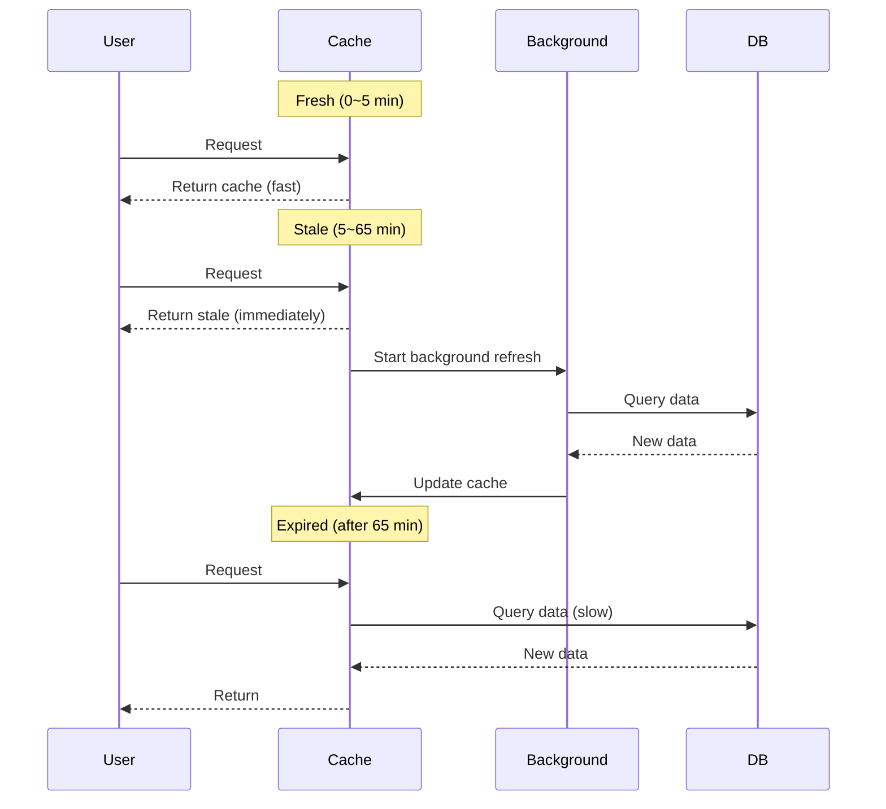

Effective caching requires choosing strategies that match data characteristics. This guide covers various cache strategies and how to use them.

## TTL (Time To Live) Strategy

### What is TTL?

TTL is the **duration a cache remains valid**. Once TTL expires, the cache is invalidated and fresh data is fetched.

```typescript
@cache({ ttl: "10m" })  // Expires after 10 minutes
async getData() {
  return await this.expensiveQuery();
}
```

### TTL Settings by Data Characteristics

<Tabs>
  <Tab title="Static Data" icon="lock">
    **Data that rarely changes**

    ```typescript
    // Configuration data (almost never changes)
    @cache({ ttl: "forever", tags: ["config"] })
    async getConfig() {
      return this.findOne(['key', 'app_config']);
    }

    // Categories (occasionally changes)
    @cache({ ttl: "1d", tags: ["category"] })
    async getCategoryTree() {
      return this.buildCategoryTree();
    }
    ```

    **TTL**: `"forever"`, `"1d"`, `"1w"`
  </Tab>

  <Tab title="Semi-static Data" icon="hourglass-half">
    **Data that changes periodically**

    ```typescript
    // User profile (occasionally changes)
    @cache({ ttl: "1h", tags: ["user"] })
    async getUserProfile(id: number) {
      return this.findOne(['id', id]);
    }

    // Product info (inventory/price changes)
    @cache({ ttl: "30m", tags: ["product"] })
    async getProduct(id: number) {
      return this.findOne(['id', id]);
    }
    ```

    **TTL**: `"30m"`, `"1h"`, `"6h"`
  </Tab>

  <Tab title="Dynamic Data" icon="bolt">
    **Data that changes frequently**

    ```typescript
    // Post list (frequently added)
    @cache({ ttl: "5m", tags: ["post", "list"] })
    async getPostList() {
      return this.findMany({ num: 20, page: 1 });
    }

    // Real-time stats (constantly changing)
    @cache({ ttl: "1m", tags: ["stats"] })
    async getLiveStats() {
      return this.calculateStats();
    }
    ```

    **TTL**: `"1m"`, `"5m"`, `"10m"`
  </Tab>

  <Tab title="Very Short-lived Data" icon="gauge-high">
    **Data that changes by the second**

    ```typescript
    // API rate limiting
    @cache({ ttl: "10s" })
    async getRateLimitStatus(userId: number) {
      return this.checkRateLimit(userId);
    }

    // Real-time ranking
    @cache({ ttl: "5s", tags: ["ranking"] })
    async getRealtimeRanking() {
      return this.calculateRanking();
    }
    ```

    **TTL**: `"5s"`, `"10s"`, `"30s"`
  </Tab>
</Tabs>

### TTL Units

```typescript
// Seconds
@cache({ ttl: "30s" })

// Minutes
@cache({ ttl: "10m" })

// Hours
@cache({ ttl: "2h" })

// Days
@cache({ ttl: "7d" })

// Weeks
@cache({ ttl: "2w" })

// Permanent
@cache({ ttl: "forever" })

// Milliseconds (number)
@cache({ ttl: 60000 })  // 60000ms = 1 minute
```

## Grace Period (Stale-While-Revalidate)

### What is Grace?

Grace is a strategy that **returns stale cache** even after TTL expiration while refreshing in the background.

```typescript
@cache({
  ttl: "5m",     // Expires after 5 minutes
  grace: "1h"    // Use stale value for 1 hour after expiration
})
async getExpensiveData() {
  return await this.heavyComputation();
}
```

### How It Works



### When to Use Grace

<CardGroup cols={2}>
  <Card title="Use Grace ✅" icon="check">
    **Heavy computations/queries**

    - Aggregate statistics
    - Complex join queries
    - External API calls
    - Large data processing

    ```typescript
    @cache({
      ttl: "10m",
      grace: "1h"
    })
    async getDashboard() {
      return await this.complexAggregation();
    }
    ```
  </Card>

  <Card title="Grace Unnecessary ❌" icon="xmark">
    **Fast queries**

    - Simple SELECT
    - Index lookups
    - Cached data

    ```typescript
    @cache({ ttl: "5m" })
    // No grace
    async getUser(id: number) {
      return this.findOne(['id', id]);
    }
    ```
  </Card>
</CardGroup>

### Grace Practical Examples

```typescript
class AnalyticsModelClass extends BaseModel {
  // Dashboard stats (heavy aggregation)
  @cache({
    ttl: "5m",      // Refresh every 5 minutes
    grace: "2h",    // Allow stale for 2 hours
    tags: ["analytics"]
  })
  @api()
  async getDashboardStats() {
    const [userCount, orderCount, revenue] = await Promise.all([
      this.countUsers(),
      this.countOrders(),
      this.calculateRevenue(),
    ]);

    return { userCount, orderCount, revenue };
  }

  // Real-time ranking (very heavy)
  @cache({
    ttl: "1m",      // Refresh every minute
    grace: "10m",   // Allow stale for 10 minutes
    tags: ["ranking"]
  })
  @api()
  async getRealTimeRanking() {
    // Aggregate millions of records
    return await this.calculateRankingWithHeavyComputation();
  }
}
```

### Grace vs Long TTL

**Grace Strategy**:
```typescript
@cache({ ttl: "5m", grace: "1h" })
```
- Mostly fresh data (within 5 minutes)
- Returns stale immediately on expiration (fast)
- Background refresh

**Long TTL**:
```typescript
@cache({ ttl: "1h" })
```
- Data up to 1 hour old
- Recalculates on expiration (slow)

**Recommendation**: Use Grace for heavy operations

## Namespace Strategy

### What is Namespace?

Namespace is a feature that **logically isolates** caches.

```typescript
const userCache = Sonamu.cache.namespace("user:123");
const adminCache = Sonamu.cache.namespace("admin");

// Same key but different namespace means different cache
await userCache.set({ key: "data", value: "user data" });
await adminCache.set({ key: "data", value: "admin data" });

await userCache.get({ key: "data" });   // "user data"
await adminCache.get({ key: "data" });  // "admin data"
```

### Per-User Isolation

```typescript
class UserDataModelClass extends BaseModel {
  @api()
  async getMyData(ctx: Context) {
    const userId = ctx.user.id;

    // Per-user namespace
    const userCache = Sonamu.cache.namespace(`user:${userId}`);

    return userCache.getOrSet({
      key: "preferences",
      ttl: "1h",
      factory: async () => {
        return this.getUserPreferences(userId);
      }
    });
  }

  @api()
  async updateMyData(ctx: Context, data: any) {
    const userId = ctx.user.id;
    const result = await this.saveUserData(userId, data);

    // Delete only that user's cache
    const userCache = Sonamu.cache.namespace(`user:${userId}`);
    await userCache.clear();

    return result;
  }
}
```

**Advantages**:
- User A's changes don't affect User B
- Selective invalidation possible

### Multi-Tenant

```typescript
class TenantServiceModelClass extends BaseModel {
  @api()
  async getData(tenantId: number) {
    // Per-tenant namespace
    const tenantCache = Sonamu.cache.namespace(`tenant:${tenantId}`);

    return tenantCache.getOrSet({
      key: "service-data",
      ttl: "1h",
      tags: ["service"],
      factory: async () => {
        return this.findMany({
          where: [['tenant_id', tenantId]]
        });
      }
    });
  }

  @api()
  async clearTenantCache(tenantId: number) {
    const tenantCache = Sonamu.cache.namespace(`tenant:${tenantId}`);

    // Delete only specific tenant's cache
    await tenantCache.clear();
  }
}
```

### Per-Feature Isolation

```typescript
// Authentication related
const authCache = Sonamu.cache.namespace("auth");
await authCache.set({ key: `session:${sessionId}`, value: session, ttl: "1h" });

// Statistics related
const statsCache = Sonamu.cache.namespace("stats");
await statsCache.set({ key: "daily", value: stats, ttl: "1d" });

// API rate limiting
const rateLimitCache = Sonamu.cache.namespace("ratelimit");
await rateLimitCache.set({ key: `user:${userId}`, value: count, ttl: "1m" });
```

## Cache Patterns

### 1. Cache-Aside (Lazy Loading)

**Most basic pattern**: Query and cache when needed

```typescript
async getData(id: number) {
  // 1. Check cache
  const cached = await Sonamu.cache.get({ key: `data:${id}` });
  if (cached) return cached;

  // 2. DB query
  const data = await this.findOne(['id', id]);

  // 3. Cache
  await Sonamu.cache.set({
    key: `data:${id}`,
    value: data,
    ttl: "10m"
  });

  return data;
}
```

**@cache decorator automatically implements this pattern**

### 2. Write-Through

**Update cache on write**: Update cache simultaneously with data change

```typescript
@api()
async update(id: number, data: Partial<DataSave>) {
  // 1. DB update
  const result = await this.updateOne(['id', id], data);

  // 2. Cache refresh
  await Sonamu.cache.set({
    key: `data:${id}`,
    value: result,
    ttl: "10m",
    tags: ["data"]
  });

  return result;
}
```

**Advantage**: Cache always up-to-date
**Disadvantage**: Write performance degradation

### 3. Write-Behind (Write-Back)

**Write to cache first**: Update cache then asynchronously save to DB

```typescript
@api()
async updateCounter(id: number) {
  const key = `counter:${id}`;

  // 1. Increment cache
  let count = await Sonamu.cache.get({ key });
  count = (count ?? 0) + 1;
  await Sonamu.cache.set({ key, value: count, ttl: "10m" });

  // 2. Async DB save (queue it)
  await this.queueCounterUpdate(id, count);

  return count;
}
```

**Advantage**: Fast response
**Disadvantage**: Complex implementation, potential data loss

### 4. Refresh-Ahead

**Pre-refresh before expiration**: Prepare fresh data before TTL ends

```typescript
@cache({
  ttl: "10m",
  grace: "1h"  // Grace is similar to Refresh-Ahead
})
async getData() {
  return await this.expensiveQuery();
}
```

**Grace period serves this role**

## Combined Strategies

### TTL by Layer

```typescript
class ProductModelClass extends BaseModel {
  // L1 (memory): Short TTL
  // L2 (Redis): Long TTL
  @cache({
    ttl: "5m",      // L1 is 5 minutes
    // L2 automatically retained longer
    tags: ["product"]
  })
  @api()
  async findById(id: number) {
    return this.findOne(['id', id]);
  }
}
```

### Strategies by Priority

<Tabs>
  <Tab title="Critical Data" icon="exclamation-triangle">
    **Data that must always be accurate**

    ```typescript
    // Payment info (no caching or short TTL)
    @cache({ ttl: "30s", grace: false })
    async getPaymentInfo(id: number) {
      return this.findOne(['id', id]);
    }

    // Inventory info (short TTL + immediate invalidation)
    @cache({ ttl: "1m", tags: ["inventory"] })
    async getInventory(productId: number) {
      return this.getStock(productId);
    }
    ```
  </Tab>

  <Tab title="Important Data" icon="star">
    **Accuracy important but slight delay acceptable**

    ```typescript
    // User profile (moderate TTL)
    @cache({ ttl: "10m", tags: ["user"] })
    async getUserProfile(id: number) {
      return this.findOne(['id', id]);
    }

    // Order status (short TTL + Grace)
    @cache({ ttl: "2m", grace: "10m", tags: ["order"] })
    async getOrderStatus(id: number) {
      return this.findOne(['id', id]);
    }
    ```
  </Tab>

  <Tab title="Nice-to-have Data" icon="circle-check">
    **Data that can be stale**

    ```typescript
    // Statistics (long TTL + long Grace)
    @cache({ ttl: "1h", grace: "6h", tags: ["stats"] })
    async getStatistics() {
      return this.calculateStats();
    }

    // Popular posts (long TTL)
    @cache({ ttl: "6h", tags: ["popular"] })
    async getPopularPosts() {
      return this.findPopular();
    }
    ```
  </Tab>
</Tabs>

### Time-Based Strategy

```typescript
class DynamicCacheModelClass extends BaseModel {
  @api()
  async getData() {
    const hour = new Date().getHours();

    // Peak hours (9 AM ~ 6 PM): Short TTL
    const ttl = (hour >= 9 && hour <= 18) ? "5m" : "30m";

    return Sonamu.cache.getOrSet({
      key: "dynamic-data",
      ttl,
      tags: ["data"],
      factory: async () => {
        return this.expensiveQuery();
      }
    });
  }
}
```

## Performance Optimization

### Cache Warming

Pre-populate cache on server start.

```typescript
class CacheWarmerModelClass extends BaseModel {
  async warmupCache() {
    console.log("Warming up cache...");

    // Pre-cache frequently used data
    await Promise.all([
      this.getCategoryTree(),  // @cache applied
      this.getPopularProducts(),
      this.getConfig(),
    ]);

    console.log("Cache warmed up!");
  }

  @cache({ ttl: "1d", tags: ["category"] })
  async getCategoryTree() {
    return this.buildTree();
  }

  @cache({ ttl: "1h", tags: ["popular"] })
  async getPopularProducts() {
    return this.findPopular();
  }
}

// Run on server start
await cacheWarmerModel.warmupCache();
```

### Batch Caching

Cache multiple items at once.

```typescript
class BatchCacheModelClass extends BaseModel {
  async batchCache(ids: number[]) {
    // 1. Find uncached IDs
    const cacheKeys = ids.map(id => `item:${id}`);
    const cached = await Promise.all(
      cacheKeys.map(key => Sonamu.cache.get({ key }))
    );

    const uncachedIds = ids.filter((_, i) => !cached[i]);

    if (uncachedIds.length === 0) {
      return cached.filter(Boolean);
    }

    // 2. Query from DB
    const items = await this.findMany({
      where: [['id', 'in', uncachedIds]]
    });

    // 3. Batch cache
    await Promise.all(
      items.rows.map(item =>
        Sonamu.cache.set({
          key: `item:${item.id}`,
          value: item,
          ttl: "10m"
        })
      )
    );

    // 4. Return results
    return [...cached.filter(Boolean), ...items.rows];
  }
}
```

### Conditional Caching

Decide whether to cache based on conditions.

```typescript
class ConditionalCacheModelClass extends BaseModel {
  @api()
  async getData(id: number, useCache: boolean = true) {
    const cacheKey = `data:${id}`;

    // Choose whether to use cache
    if (!useCache) {
      return this.findOne(['id', id]);
    }

    return Sonamu.cache.getOrSet({
      key: cacheKey,
      ttl: "10m",
      factory: async () => {
        return this.findOne(['id', id]);
      }
    });
  }
}
```

## Cautions

<Warning>
**Cache Strategy Selection Cautions**:

1. **TTL Too Long**: Serves stale data
   ```typescript
   // ❌ Frequently changing but TTL too long
   @cache({ ttl: "1d" })
   async getLiveStock() { ... }

   // ✅ Appropriate TTL
   @cache({ ttl: "1m" })
   async getLiveStock() { ... }
   ```

2. **TTL Too Short**: Reduced cache effectiveness
   ```typescript
   // ❌ Rarely changes but TTL too short
   @cache({ ttl: "10s" })
   async getConfig() { ... }

   // ✅ Appropriate TTL
   @cache({ ttl: "1d", tags: ["config"] })
   async getConfig() { ... }
   ```

3. **Grace Overuse**: Grace unnecessary for fast queries
   ```typescript
   // ❌ Unnecessary Grace
   @cache({ ttl: "5m", grace: "1h" })
   async getUser(id: number) {
     return this.findOne(['id', id]);  // Fast query
   }

   // ✅ Sufficient without Grace
   @cache({ ttl: "5m" })
   async getUser(id: number) { ... }
   ```

4. **Namespace Overuse**: Too many namespaces are hard to manage
   ```typescript
   // ❌ Excessive namespace
   const cache1 = Sonamu.cache.namespace("a:b:c:d:e");

   // ✅ Appropriate namespace
   const userCache = Sonamu.cache.namespace(`user:${userId}`);
   ```
</Warning>

## Strategy Summary Table

| Data Type | TTL | Grace | Tags | Invalidation |
|-----------|-----|-------|------|--------------|
| Static Config | `forever` | ❌ | `["config"]` | Manual |
| User Profile | `1h` | ❌ | `["user"]` | On change |
| Product Info | `30m` | `1h` | `["product"]` | On change |
| Post List | `5m` | `30m` | `["post", "list"]` | On create/update |
| Real-time Stats | `1m` | `10m` | `["stats"]` | TTL dependent |
| Aggregated Dashboard | `10m` | `2h` | `["dashboard"]` | TTL dependent |

## Next Steps

<CardGroup cols={2}>
  <Card title="Cache Configuration" icon="gear" href="/advanced-features/caching/cache-configuration">
    Configure Stores and Drivers
  </Card>
  <Card title="@cache Decorator" icon="at" href="/advanced-features/caching/cache-decorator">
    Apply caching to methods
  </Card>
  <Card title="Cache Invalidation" icon="trash" href="/advanced-features/caching/cache-invalidation">
    Tag-based cache invalidation
  </Card>
</CardGroup>
