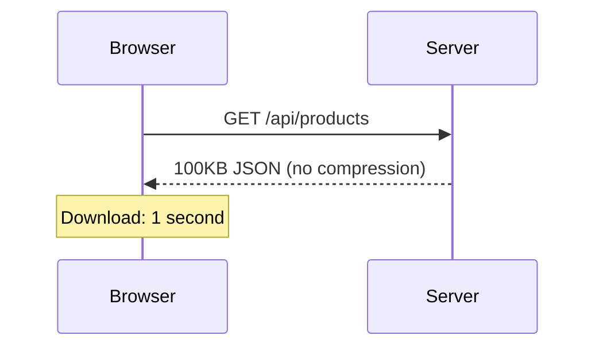
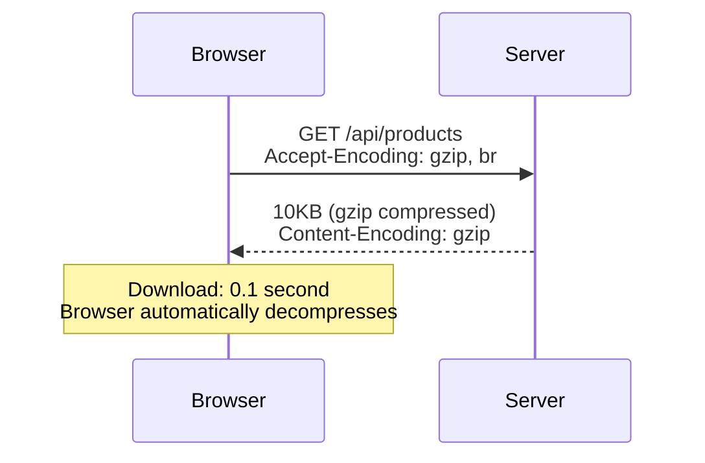

Sonamu uses the `@fastify/compress` plugin to **automatically compress HTTP responses**. It supports various compression algorithms including gzip, brotli (br), and deflate.

## Why is Compression Needed?

Compression reduces the size of data transmitted over the network.

### Without Compression



### With Compression



**Benefits**:
- Transfer size: 100KB to 10KB (90% reduction)
- Download time: 1 second to 0.1 second (10x faster)
- Bandwidth savings

## Basic Configuration

### sonamu.config.ts

```typescript
import { type SonamuConfig } from "sonamu";

export const config: SonamuConfig = {
  server: {
    plugins: {
      compress: true,  // Enable compression (default settings)
    },
  },
};
```

**Default behavior**:
- threshold: 1024 (only compress 1KB or larger)
- encodings: `["br", "gzip", "deflate"]` (in priority order)
- Automatically applied to all APIs

## Configuration Options

<Tabs>
  <Tab title="boolean" icon="toggle-on">
    **Simple enable/disable**

    ```typescript
    plugins: {
      compress: true,   // Enable (default settings)
      compress: false,  // Disable
    }
    ```
  </Tab>

  <Tab title="CompressOptions" icon="gear">
    **Detailed configuration**

    ```typescript
    import type { FastifyCompressOptions } from "@fastify/compress";

    plugins: {
      compress: {
        threshold: 1024,  // Minimum compression size (bytes)
        encodings: ["br", "gzip", "deflate"],  // Compression algorithm priority
        customTypes: /^text\/|application\/json/,  // Content-Type to compress
      } as FastifyCompressOptions
    }
    ```
  </Tab>
</Tabs>

## Compression Algorithms

### Brotli (br)

**The algorithm with the highest compression ratio**

```typescript
plugins: {
  compress: {
    threshold: 1024,
    encodings: ["br"],  // Use Brotli only
  }
}
```

**Characteristics**:
- Compression ratio: Best (15-20% better than gzip)
- Speed: Slow (high CPU usage)
- Support: Modern browsers (not supported in IE)

**Suitable for**:
- Static content (can be pre-compressed)
- When bandwidth is critical
- When server CPU has capacity

### Gzip

**The most universal algorithm**

```typescript
plugins: {
  compress: {
    threshold: 1024,
    encodings: ["gzip"],  // Use Gzip only
  }
}
```

**Characteristics**:
- Compression ratio: Medium
- Speed: Fast
- Support: All browsers

**Suitable for**:
- Dynamic API responses
- Real-time compression
- When compatibility is important

### Deflate

**Legacy algorithm**

```typescript
plugins: {
  compress: {
    threshold: 1024,
    encodings: ["deflate"],
  }
}
```

**Characteristics**:
- Compression ratio: Similar to gzip
- Speed: Fast
- Support: Most browsers

**Recommendation**: Use gzip (more stable)

## Compression Priority

Set priority when the browser supports multiple encodings.

```typescript
plugins: {
  compress: {
    encodings: ["br", "gzip", "deflate"],  // Priority: br > gzip > deflate
  }
}
```

**How it works**:
```
Browser request: Accept-Encoding: br, gzip, deflate

1. Supports br? -> Compress with br
2. No br, supports gzip? -> Compress with gzip
3. No gzip, supports deflate? -> Compress with deflate
4. None supported? -> No compression
```

## Threshold (Minimum Size)

Small responses are not compressed.

```typescript
plugins: {
  compress: {
    threshold: 1024,  // Only compress 1KB or larger
  }
}
```

**Reasons**:
- Small data has low compression efficiency
- Compression/decompression overhead may be larger
- HTTP header size increases

**Recommended values**:
- Default: `1024` (1KB)
- Aggressive: `256` (256B)
- Conservative: `4096` (4KB)

### Example

```typescript
// 100 byte response
threshold: 1024  // No compression (too small)

// 2KB response
threshold: 1024  // Compress (>= 1KB)
```

## Custom Types

Compress only specific Content-Types.

```typescript
plugins: {
  compress: {
    customTypes: /^text\/|application\/json/,  // Regex
  }
}
```

**Default behavior**: Compresses most text-based responses
- `text/*` (text/html, text/css, text/plain)
- `application/json`
- `application/javascript`
- `application/xml`

**Images/videos are already compressed**:
- `image/png`, `image/jpeg` (already compressed formats)
- `video/mp4` (already compressed format)
- Additional compression has no effect

### Control with Function

```typescript
plugins: {
  compress: {
    customTypes: (contentType: string) => {
      // Only compress JSON
      return contentType === 'application/json';
    }
  }
}
```

## Practical Configuration Examples

### 1. Basic Configuration (Recommended)

```typescript
export const config: SonamuConfig = {
  server: {
    plugins: {
      compress: true,  // Simply enable
    },
  },
};
```

**Settings used**:
- threshold: 1024 (1KB)
- encodings: `["br", "gzip", "deflate"]`

### 2. High-Performance API Server

```typescript
export const config: SonamuConfig = {
  server: {
    plugins: {
      compress: {
        threshold: 256,  // Compress small responses too
        encodings: ["br", "gzip", "deflate"],  // All algorithms
      }
    },
  },
};
```

**Characteristics**:
- Maximum compression ratio (brotli priority)
- Compress everything 256 bytes and above
- Bandwidth optimization

### 3. Legacy Browser Support

```typescript
export const config: SonamuConfig = {
  server: {
    plugins: {
      compress: {
        threshold: 1024,
        encodings: ["gzip", "deflate"],  // Exclude brotli
      }
    },
  },
};
```

**Characteristics**:
- Support for old browsers like IE
- Use gzip only (stable)

### 4. Selective Compression

When you want to control compression per API:

```typescript
export const config: SonamuConfig = {
  server: {
    plugins: {
      compress: {
        global: false,  // No compression by default
        threshold: 1024,
        encodings: ["br", "gzip", "deflate"],
      }
    },
  },
};

// Per-API settings
@api({
  httpMethod: 'GET',
  compress: true,  // Compress only this API
})
async getData() {
  return this.findMany({});
}
```

**Use case**:
- Most APIs don't need compression
- Selectively compress specific APIs

### 5. CPU Saving (Conservative)

```typescript
export const config: SonamuConfig = {
  server: {
    plugins: {
      compress: {
        threshold: 4096,  // Only compress 4KB or larger
        encodings: ["gzip"],  // gzip only (fast)
      }
    },
  },
};
```

**Characteristics**:
- Minimize CPU usage
- Only compress large responses
- Fast processing

## Environment-Based Configuration

```typescript
export const config: SonamuConfig = {
  server: {
    plugins: {
      compress: process.env.NODE_ENV === 'production'
        ? {
            threshold: 256,
            encodings: ["br", "gzip", "deflate"],
          }
        : false,  // Disable in development environment
    },
  },
};
```

**Development environment**: Disable compression
- Easier debugging
- Fast response (no compression overhead)

**Production**: Aggressive compression
- Bandwidth savings
- Improved user experience

## Verifying Compression

### Browser Developer Tools

```
Network tab -> Select request -> Headers tab

Response Headers:
  Content-Encoding: gzip
  Content-Length: 1234 (compressed size)

Size:
  10.5 KB (compressed size)
  52.3 KB (original size)
```

### curl Command

```bash
# Request with gzip compression
curl -H "Accept-Encoding: gzip" http://localhost:3000/api/products -v

# Check response headers
< Content-Encoding: gzip
< Content-Length: 1234
```

## Precautions

<Warning>
**Precautions when using compression**:

1. **Exclude already compressed files**: Images and videos have no compression benefit
   ```typescript
   compress: {
     customTypes: /^text\/|application\/json/,  // Text only
   }
   ```

2. **Don't compress small responses**: Use threshold setting
   ```typescript
   compress: {
     threshold: 1024,  // Don't compress under 1KB
   }
   ```

3. **Consider CPU load**: brotli has high CPU usage
   ```typescript
   // Avoid using brotli on low-spec servers
   encodings: ["br"]

   // Use gzip (fast)
   encodings: ["gzip"]
   ```

4. **brotli only supported over HTTPS**: Use gzip over HTTP

5. **Watch for decompression errors**: Verify that the client decompresses properly
</Warning>

## Performance Impact

### Advantages

- **Bandwidth savings**: 70-90% size reduction
- **Download speed**: Especially effective on slow networks
- **Cost reduction**: Reduced CDN transfer volume

### Disadvantages

- **Increased CPU usage**: Compression/decompression overhead
- **Response latency**: Additional compression time (usually a few ms)
- **Memory usage**: Compression buffers

### Recommendations

```typescript
// Recommended: Large JSON responses
@api({ compress: true })
async getLargeData() {
  return this.findMany({ num: 1000 });  // 100KB+
}

// Not recommended: Small responses
@api({ compress: true })
async getStatus() {
  return { status: "ok" };  // 10 bytes
}
```

## Next Steps

<CardGroup cols={2}>
  <Card title="Compression Presets" icon="list" href="/en/advanced-features/compress/compress-presets">
    Predefined compression settings
  </Card>
  <Card title="Per-API Control" icon="code" href="/en/advanced-features/compress/per-api-control">
    Compression settings in @api decorator
  </Card>
  <Card title="Performance Optimization" icon="gauge-high" href="/en/advanced-features/compress/performance-optimization">
    Compression optimization strategies
  </Card>
</CardGroup>
