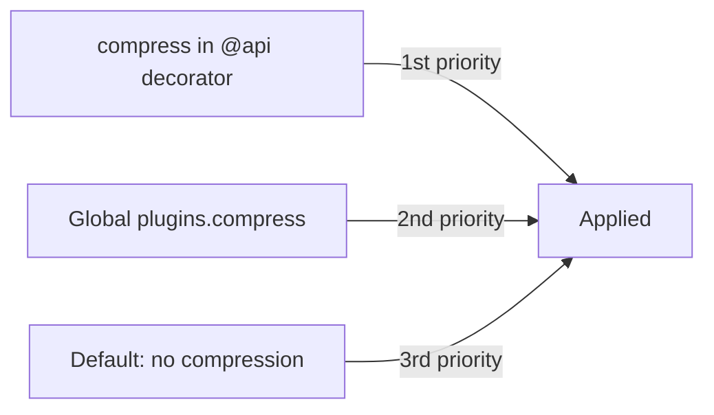

By adding the `compress` option to Sonamu's `@api` decorator, you can **finely control compression on a per-API basis**.

## Basic Usage

### Adding to @api Decorator

```typescript
import { BaseModelClass, api, CompressPresets } from "sonamu";

class ProductModelClass extends BaseModelClass {
  @api({
    httpMethod: 'GET',
    compress: CompressPresets.aggressive,  // Aggressive compression for this API only
  })
  async findAll() {
    return this.findMany({});
  }
}
```

## Configuration Methods

<Tabs>
  <Tab title="Using Presets" icon="list">
    **The simplest method**

    ```typescript
    @api({
      httpMethod: 'GET',
      compress: CompressPresets.aggressive,
    })
    async getData() {
      return this.findMany({});
    }
    ```
  </Tab>

  <Tab title="boolean" icon="toggle-on">
    **Enable/disable compression**

    ```typescript
    // Disable compression
    @api({
      httpMethod: 'GET',
      compress: false,
    })
    async getImage() {
      return this.sendImageFile();
    }

    // Enable compression (when global: false)
    @api({
      httpMethod: 'GET',
      compress: true,
    })
    async getLargeData() {
      return this.findMany({ num: 10000 });
    }
    ```
  </Tab>

  <Tab title="Custom Options" icon="screwdriver-wrench">
    **Fine-grained control**

    ```typescript
    @api({
      httpMethod: 'GET',
      compress: {
        threshold: 512,  // Only compress 512B or larger
        encodings: ["br", "gzip"],  // brotli and gzip only
      }
    })
    async getData() {
      return this.findMany({});
    }
    ```
  </Tab>
</Tabs>

## Priority

Compression settings are applied in the following order:



1. **compress in @api decorator** (highest priority)
2. **Global plugins.compress setting**
3. **Default** (no compression)

### Example

```typescript
// sonamu.config.ts
plugins: {
  compress: CompressPresets.default,  // Global: default compression
}

// Model
@api({
  httpMethod: 'GET',
  compress: CompressPresets.aggressive,  // This API only: aggressive compression
})
async getData() { ... }
```

**Result**: `aggressive` applied (decorator takes priority)

## Disabling Compression

To not compress a specific API:

```typescript
@api({
  httpMethod: 'GET',
  compress: false,  // Ignore global settings, no compression
})
async getAlreadyCompressed() {
  return this.sendCompressedFile();
}
```

**Use cases**:
- Already compressed files (images, videos, zip)
- Very small responses (< 100 bytes)
- Real-time streaming
- Avoiding decompression errors

## Selective Compression (global: false)

To not compress by default and selectively compress specific APIs:

```typescript
// sonamu.config.ts
export const config: SonamuConfig = {
  server: {
    plugins: {
      compress: {
        global: false,  // No compression by default
        threshold: 1024,
        encodings: ["br", "gzip", "deflate"],
      }
    }
  }
};

// Model - selective compression
class DataModelClass extends BaseModelClass {
  // Compress only this API
  @api({
    httpMethod: 'GET',
    compress: true,
  })
  async getLargeData() {
    return this.findMany({ num: 10000 });
  }

  // No compression (default)
  @api({
    httpMethod: 'GET',
  })
  async getSmallData() {
    return { status: "ok" };
  }
}
```

**Advantages**:
- Prevent unnecessary compression
- Minimize CPU usage
- Precise control

## Strategy by Response Size

### Small Responses (< 1KB)

```typescript
@api({
  httpMethod: 'GET',
  compress: false,  // Disable compression
})
async getStatus() {
  return { status: "ok", timestamp: Date.now() };
}
```

**Reason**: Compression overhead is greater than the benefit

### Medium Responses (1KB-100KB)

```typescript
@api({
  httpMethod: 'GET',
  compress: CompressPresets.default,  // Default compression
})
async getList() {
  return this.findMany({ num: 100 });
}
```

**Reason**: Good compression effectiveness

### Large Responses (> 100KB)

```typescript
@api({
  httpMethod: 'GET',
  compress: CompressPresets.aggressive,  // Aggressive compression
})
async exportData() {
  return this.findMany({ num: 10000 });
}
```

**Reason**: Network time savings far outweigh compression time

## Strategy by Content Type

### JSON API

```typescript
@api({
  httpMethod: 'GET',
  compress: CompressPresets.default,
})
async getProducts() {
  return this.findMany({});
}
```

**Characteristic**: JSON compresses very well (70-90% reduction)

### Images/Binary

```typescript
@api({
  httpMethod: 'GET',
  compress: false,  // Disable compression
})
async getImage(id: number) {
  return this.sendFile(`images/${id}.jpg`);
}
```

**Reason**: Already compressed formats (JPEG, PNG, MP4, etc.)

### HTML/CSS

```typescript
@api({
  httpMethod: 'GET',
  compress: CompressPresets.aggressive,
})
async getHTML() {
  return this.renderTemplate();
}
```

**Characteristic**: Text-based, very good compression effectiveness

## Practical Examples

### 1. E-commerce API

```typescript
class ProductModelClass extends BaseModelClass {
  // Product list: default compression
  @api({
    httpMethod: 'GET',
    compress: CompressPresets.default,
  })
  async findAll(page: number) {
    return this.findMany({ page, num: 20 });
  }

  // Product detail: default compression
  @api({
    httpMethod: 'GET',
    compress: CompressPresets.default,
  })
  async findById(id: number) {
    return this.findOne(['id', id]);
  }

  // Bulk data export: aggressive compression
  @api({
    httpMethod: 'GET',
    compress: CompressPresets.aggressive,
  })
  async exportAll() {
    return this.findMany({ num: 100000 });
  }

  // Product image: no compression
  @api({
    httpMethod: 'GET',
    compress: false,
  })
  async getImage(id: number) {
    return this.sendFile(`products/${id}.jpg`);
  }

  // Create/update: no compression (small response)
  @api({
    httpMethod: 'POST',
    compress: false,
  })
  async create(data: ProductSave) {
    return this.saveOne(data);
  }
}
```

### 2. File Download API

```typescript
class FileModelClass extends BaseModelClass {
  // JSON file: aggressive compression
  @api({
    httpMethod: 'GET',
    compress: CompressPresets.aggressive,
  })
  async downloadJSON(id: number) {
    return this.getJSONFile(id);
  }

  // Already compressed file: no compression
  @api({
    httpMethod: 'GET',
    compress: false,
  })
  async downloadZip(id: number) {
    return this.getZipFile(id);
  }

  // Text file: default compression
  @api({
    httpMethod: 'GET',
    compress: CompressPresets.default,
  })
  async downloadText(id: number) {
    return this.getTextFile(id);
  }
}
```

### 3. Statistics/Report API

```typescript
class ReportModelClass extends BaseModelClass {
  // Real-time stats: conservative compression (fast response)
  @api({
    httpMethod: 'GET',
    compress: CompressPresets.conservative,
  })
  async getRealTimeStats() {
    return this.calculateRealTimeStats();
  }

  // Daily report: default compression
  @api({
    httpMethod: 'GET',
    compress: CompressPresets.default,
  })
  async getDailyReport(date: string) {
    return this.generateDailyReport(date);
  }

  // Large-scale analysis: aggressive compression
  @api({
    httpMethod: 'GET',
    compress: CompressPresets.aggressive,
  })
  async getFullAnalysis(startDate: string, endDate: string) {
    return this.generateFullAnalysis(startDate, endDate);
  }
}
```

### 4. Streaming API

```typescript
class StreamModelClass extends BaseModelClass {
  // SSE stream: no compression
  @stream({
    type: 'sse',
    events: z.object({
      message: z.string(),
    }),
  })
  @api({
    compress: false,  // No compression for streaming
  })
  async *streamUpdates() {
    yield { message: "update 1" };
    yield { message: "update 2" };
  }
}
```

## SSR Page Compression

Compression settings are also available for SSR routes.

```typescript
import { registerSSR, CompressPresets } from "sonamu";

// HTML page: aggressive compression
registerSSR({
  path: '/products/:id',
  Component: ProductDetail,
  compress: CompressPresets.aggressive,
});

// Small page: default compression
registerSSR({
  path: '/about',
  Component: About,
  compress: CompressPresets.default,
});

// Disable compression
registerSSR({
  path: '/stream',
  Component: StreamPage,
  compress: false,
});
```

## Conditional Compression

While you cannot control compression at runtime based on conditions, you can separate into multiple APIs:

```typescript
// Compressed version
@api({
  httpMethod: 'GET',
  path: '/products',
  compress: CompressPresets.aggressive,
})
async getProducts() {
  return this.findMany({});
}

// Uncompressed version (for special clients)
@api({
  httpMethod: 'GET',
  path: '/products/raw',
  compress: false,
})
async getProductsRaw() {
  return this.findMany({});
}
```

## Compression Option Override

You can change only part of the global settings:

```typescript
// Global: default preset
plugins: {
  compress: CompressPresets.default,  // threshold: 1024
}

// API: change threshold only
@api({
  httpMethod: 'GET',
  compress: {
    threshold: 2048,  // Change to 2KB
    // encodings keeps global settings
  }
})
async getData() {
  return this.findMany({});
}
```

## Monitoring

To verify compression effectiveness:

```typescript
@api({
  httpMethod: 'GET',
  compress: CompressPresets.default,
})
async getData() {
  const data = this.findMany({});

  // Log size in development environment
  if (process.env.NODE_ENV === 'development') {
    const size = JSON.stringify(data).length;
    console.log(`Response size: ${size} bytes`);
  }

  return data;
}
```

Check in browser developer tools:
```
Network tab -> Select request -> Headers tab

Response Headers:
  Content-Encoding: gzip
  Content-Length: 1234 (compressed size)

Size:
  1.2 KB (compressed)
  10.5 KB (original)
```

## Precautions

<Warning>
**Precautions for per-API compression control**:

1. **Disable for already compressed content**: images, videos, zip
   ```typescript
   // Good example
   @api({ compress: false })
   async getImage() { return this.sendImageFile(); }
   ```

2. **Compression is inefficient for small responses**: Better not to compress < 1KB
   ```typescript
   // Small response
   @api({ compress: false })
   async getStatus() { return { status: "ok" }; }
   ```

3. **Disable compression for streaming**: SSE, WebSocket
   ```typescript
   // Streaming
   @stream({ type: 'sse', events: ... })
   @api({ compress: false })
   async *streamData() { ... }
   ```

4. **Use consistent strategy**: Similar APIs should have the same settings
   ```typescript
   // Consistency
   // All query APIs: default
   // All bulk exports: aggressive
   // All binary: false
   ```

5. **Monitor performance**: Check CPU load due to compression
   ```typescript
   // Server CPU usage monitoring needed when using aggressive
   ```
</Warning>

## Debugging Tips

### 1. Verify Compression is Applied

```bash
# Check with curl
curl -H "Accept-Encoding: gzip" http://localhost:3000/api/products -v

# Check response header
< Content-Encoding: gzip
```

### 2. Compare Compression Sizes

```bash
# Without compression
curl http://localhost:3000/api/products > uncompressed.json
ls -lh uncompressed.json  # 100KB

# With compression
curl -H "Accept-Encoding: gzip" http://localhost:3000/api/products --compressed > compressed.json
ls -lh compressed.json  # 10KB
```

### 3. Check Compression Algorithm

```typescript
// Check in test code
const response = await server.inject({
  method: 'GET',
  url: '/api/products',
  headers: { 'accept-encoding': 'br, gzip' }
});

console.log(response.headers['content-encoding']);  // "br" or "gzip"
```

## Next Steps

<CardGroup cols={2}>
  <Card title="Compression Configuration" icon="gear" href="/en/advanced-features/compress/compress-configuration">
    Global compression plugin settings
  </Card>
  <Card title="Compression Presets" icon="list" href="/en/advanced-features/compress/compress-presets">
    Predefined compression settings
  </Card>
  <Card title="Performance Optimization" icon="gauge-high" href="/en/advanced-features/compress/performance-optimization">
    Compression optimization strategies
  </Card>
</CardGroup>
