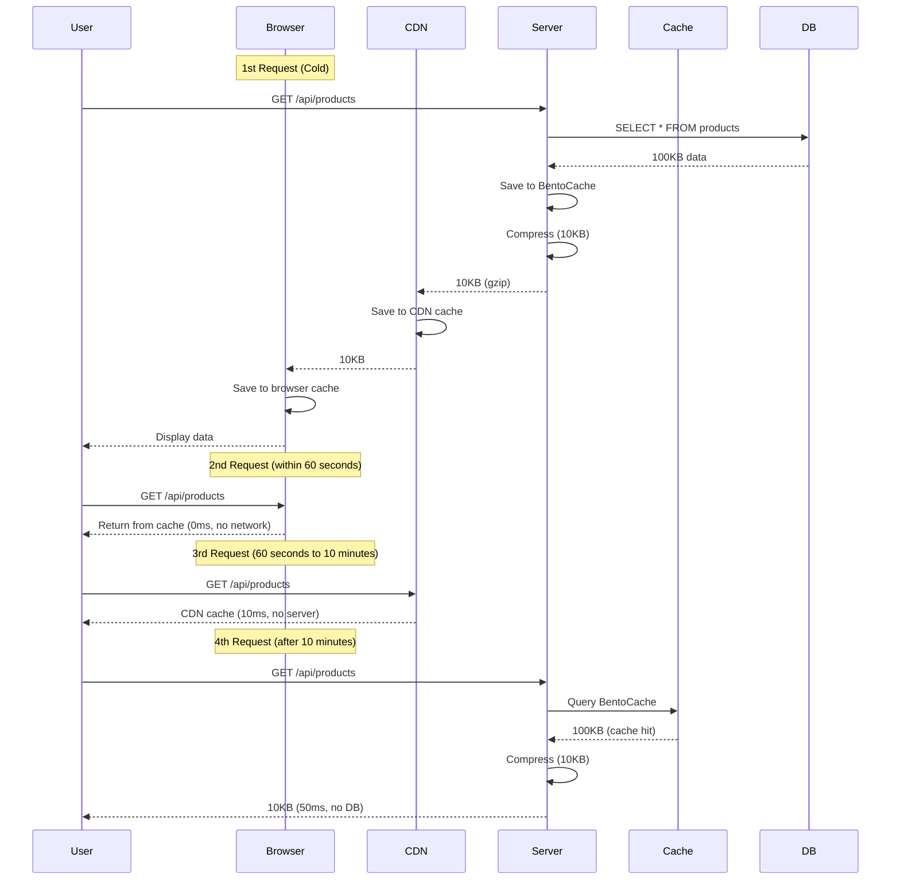

Compression can significantly improve network performance, but **improper use can actually degrade performance**. This document explains optimization strategies for using compression effectively.

## The Trade-offs of Compression

Compression trades **CPU time** for **network time**.


### Break-even Point

```typescript
// Without compression
Total time = Network time
           = 100KB / 1MB/s = 100ms

// With compression
Total time = Compression time + Network time + Decompression time
           = 5ms + (10KB / 1MB/s) + 2ms
           = 5ms + 10ms + 2ms = 17ms

Benefit = 100ms - 17ms = 83ms (83% improvement)
```

**Conclusion**: The slower the network and larger the data, the greater the compression benefit

## Finding the Optimal Threshold

Threshold is the minimum size to compress.

### Effects by Threshold

| Size | Threshold: 256 | Threshold: 1024 | Threshold: 4096 |
|------|---------------|----------------|----------------|
| 100B | No compression (overhead) | No compression | No compression |
| 500B | Compress (small effect) | No compression | No compression |
| 2KB | Compress | Compress | No compression |
| 10KB | Compress | Compress | Compress |

### Recommended Thresholds

<Tabs>
  <Tab title="Aggressive (256B)" icon="fire">
    ```typescript
    compress: {
      threshold: 256,
      encodings: ["br", "gzip", "deflate"],
    }
    ```

    **Suitable for**:
    - Mobile networks (slow speeds)
    - Expensive bandwidth costs
    - Most responses are small (< 10KB)

    **Disadvantage**: Increased CPU usage
  </Tab>

  <Tab title="Default (1KB)" icon="check">
    ```typescript
    compress: {
      threshold: 1024,
      encodings: ["br", "gzip", "deflate"],
    }
    ```

    **Suitable for**:
    - General cases (recommended)
    - Balanced performance

    **Advantage**: Balance between compression benefit and overhead
  </Tab>

  <Tab title="Conservative (4KB)" icon="shield">
    ```typescript
    compress: {
      threshold: 4096,
      encodings: ["gzip", "deflate"],
    }
    ```

    **Suitable for**:
    - Limited CPU resources
    - Fast networks (LAN, 5G)
    - Most responses are large (> 100KB)

    **Advantage**: Minimized CPU usage
  </Tab>
</Tabs>

### Finding Optimal Value Through Experimentation

```typescript
// Test configuration
const thresholds = [256, 512, 1024, 2048, 4096];

for (const threshold of thresholds) {
  console.time(`threshold-${threshold}`);

  // 100 requests
  for (let i = 0; i < 100; i++) {
    await fetch('/api/products', {
      headers: { 'Accept-Encoding': 'gzip' }
    });
  }

  console.timeEnd(`threshold-${threshold}`);
}

// Analyze results: Select the fastest threshold
```

## Algorithm Selection Strategy

### Brotli vs Gzip

| Criteria | Brotli (br) | Gzip |
|------|------------|------|
| Compression ratio | Best (15-20% better) | Medium |
| Compression speed | Slow (higher CPU usage) | Fast |
| Decompression speed | Fast | Fast |
| Browser support | Modern browsers | All browsers |

### Usage Strategies

<Tabs>
  <Tab title="Static Content" icon="file">
    **Pre-compression -> Use Brotli**

    ```bash
    # Pre-compress with brotli at build time
    brotli -q 11 bundle.js  # Highest quality
    # -> Creates bundle.js.br

    # Serve pre-compressed files from server
    ```

    **Advantages**:
    - No compression time concerns (pre-compressed)
    - Best compression ratio (quality 11)
    - No runtime CPU load
  </Tab>

  <Tab title="Dynamic API" icon="bolt">
    **Real-time compression -> Use Gzip**

    ```typescript
    compress: {
      threshold: 1024,
      encodings: ["gzip"],  // Fast gzip
    }
    ```

    **Reasons**:
    - API responses differ each time (cannot pre-compress)
    - Gzip is faster than Brotli
    - Sufficient compression ratio (70-80%)
  </Tab>

  <Tab title="Hybrid" icon="layer-group">
    **Mixed static + dynamic**

    ```typescript
    // Static files: brotli (pre-compressed)
    server.get('/assets/:filename', (req, reply) => {
      const filename = req.params.filename;
      const brFile = `${filename}.br`;

      if (fs.existsSync(brFile)) {
        reply.header('Content-Encoding', 'br');
        return reply.sendFile(brFile);
      }

      return reply.sendFile(filename);
    });

    // API: gzip (real-time compression)
    plugins: {
      compress: {
        encodings: ["gzip"],
      }
    }
    ```
  </Tab>
</Tabs>

### Environment-Based Strategy

```typescript
const isProduction = process.env.NODE_ENV === 'production';
const isFastNetwork = process.env.NETWORK_SPEED === 'fast';

export const config: SonamuConfig = {
  server: {
    plugins: {
      compress: isProduction
        ? isFastNetwork
          ? {
              // Fast network: conservative
              threshold: 4096,
              encodings: ["gzip"],
            }
          : {
              // Slow network: aggressive
              threshold: 256,
              encodings: ["br", "gzip", "deflate"],
            }
        : false  // Development: no compression
    }
  }
};
```

## Combining Caching and Compression

Using compression with caching achieves the best performance.

```typescript
@cache({ ttl: "10m" })  // Server cache
@api({
  httpMethod: 'GET',
  cacheControl: { maxAge: 60 },  // HTTP cache
  compress: CompressPresets.aggressive,  // Compression
})
async getProducts() {
  return this.findMany({});
}
```

### Effect



**Per-layer optimization**:
1. **Browser cache**: 0ms (fastest)
2. **CDN cache**: 10ms (network only)
3. **Server cache**: 50ms (compression only, no DB)
4. **DB query**: 500ms (compression + DB)

## CDN and Compression

### CloudFront Optimization

```typescript
@api({
  httpMethod: 'GET',
  cacheControl: {
    visibility: 'public',
    maxAge: 60,        // Browser: 1 minute
    sMaxAge: 300,      // CDN: 5 minutes
  },
  compress: {
    threshold: 1024,
    encodings: ["br", "gzip"],  // CloudFront supports brotli
  }
})
async getData() {
  return this.findMany({});
}
```

**CloudFront configuration**:
- Receive compressed response from origin
- CloudFront caches as-is
- Serve quickly from edge

### Vary Header Consideration

When using compression, responses differ based on `Accept-Encoding`:

```typescript
@api({
  cacheControl: {
    vary: ['Accept-Encoding'],  // Separate cache by encoding
  },
  compress: true,
})
async getData() {
  return this.findMany({});
}
```

## Pre-compression

Pre-compressing static files at build time eliminates runtime CPU load.

### Build Script

```typescript
// scripts/compress-assets.ts
import { brotliCompressSync, gzipSync } from "zlib";
import { readdirSync, readFileSync, writeFileSync } from "fs";

const assetsDir = "./dist/assets";
const files = readdirSync(assetsDir);

for (const file of files) {
  if (/\.(js|css|html|json|svg)$/.test(file)) {
    const content = readFileSync(`${assetsDir}/${file}`);

    // Brotli (best compression ratio)
    const br = brotliCompressSync(content, {
      params: {
        [zlib.constants.BROTLI_PARAM_QUALITY]: 11  // Highest quality
      }
    });
    writeFileSync(`${assetsDir}/${file}.br`, br);

    // Gzip (compatibility)
    const gz = gzipSync(content, { level: 9 });
    writeFileSync(`${assetsDir}/${file}.gz`, gz);

    console.log(`${file}: ${content.length} -> br: ${br.length}, gz: ${gz.length}`);
  }
}
```

### Server Configuration

```typescript
// Serve pre-compressed files
server.get('/assets/:filename', async (req, reply) => {
  const { filename } = req.params;
  const acceptEncoding = req.headers['accept-encoding'] || '';

  // Brotli support
  if (acceptEncoding.includes('br')) {
    const brFile = `./dist/assets/${filename}.br`;
    if (fs.existsSync(brFile)) {
      reply.header('Content-Encoding', 'br');
      return reply.sendFile(`${filename}.br`, { root: './dist/assets' });
    }
  }

  // Gzip support
  if (acceptEncoding.includes('gzip')) {
    const gzFile = `./dist/assets/${filename}.gz`;
    if (fs.existsSync(gzFile)) {
      reply.header('Content-Encoding', 'gzip');
      return reply.sendFile(`${filename}.gz`, { root: './dist/assets' });
    }
  }

  // No compression
  return reply.sendFile(filename, { root: './dist/assets' });
});
```

**Advantages**:
- No runtime CPU load
- Best compression ratio (quality 11)
- Instant response

## Performance Measurement

### 1. Browser Developer Tools

```
Network tab -> Select request

Size:
  1.2 KB (transferred)  <- Compressed size
  10.5 KB (size)        <- Original size

Time:
  Waiting (TTFB): 50ms  <- Server processing (including compression)
  Content Download: 10ms <- Network transfer
```

### 2. Server Logging

```typescript
import { performance } from "perf_hooks";

@api({
  httpMethod: 'GET',
  compress: CompressPresets.aggressive,
})
async getData() {
  const start = performance.now();
  const data = await this.findMany({});
  const dbTime = performance.now() - start;

  console.log(`DB: ${dbTime.toFixed(2)}ms`);
  // Compression time is handled automatically by Fastify

  return data;
}
```

### 3. Load Testing

```bash
# Load test with Apache Bench
ab -n 1000 -c 10 -H "Accept-Encoding: gzip" http://localhost:3000/api/products

# Without compression
ab -n 1000 -c 10 http://localhost:3000/api/products

# Compare results:
# - Time per request (average response time)
# - Transfer rate
```

## Practical Optimization Checklist

<Tabs>
  <Tab title="Initial Setup" icon="1">
    **Enable global compression**
    ```typescript
    plugins: {
      compress: CompressPresets.default
    }
    ```

    **Set threshold**
    - General: 1024 (1KB)
    - Mobile: 256 (256B)
    - High-performance: 4096 (4KB)

    **Select algorithm**
    - Static: brotli (pre-compressed)
    - Dynamic: gzip (real-time)
  </Tab>

  <Tab title="API Optimization" icon="2">
    **Aggressive compression for large responses**
    ```typescript
    @api({ compress: CompressPresets.aggressive })
    async exportData() { ... }
    ```

    **Disable compression for small responses**
    ```typescript
    @api({ compress: false })
    async getStatus() { ... }
    ```

    **Exclude already compressed files**
    ```typescript
    @api({ compress: false })
    async getImage() { ... }
    ```
  </Tab>

  <Tab title="Combining Caching" icon="3">
    **Add server cache**
    ```typescript
    @cache({ ttl: "10m" })
    @api({ compress: true })
    async getData() { ... }
    ```

    **Configure HTTP cache**
    ```typescript
    @api({
      cacheControl: { maxAge: 60 },
      compress: true,
    })
    async getData() { ... }
    ```

    **Set Vary header**
    ```typescript
    cacheControl: {
      vary: ['Accept-Encoding']
    }
    ```
  </Tab>

  <Tab title="Monitoring" icon="4">
    **Check compression ratio**
    - Compare sizes in developer tools
    - Verify 70% or more compression

    **Monitor CPU usage**
    - Check CPU increase due to compression
    - Adjust threshold if over 30% increase

    **Measure response time**
    - Compare before and after compression
    - Review settings if slower
  </Tab>
</Tabs>

## Common Mistakes

<Warning>
**Mistakes to avoid**:

1. **Compressing all responses**: Inefficient for small responses
   ```typescript
   // Bad example
   threshold: 0  // Compress all responses

   // Good example
   threshold: 1024  // Only 1KB or larger
   ```

2. **Re-compressing already compressed files**: No benefit
   ```typescript
   // Compressing JPEG, PNG, MP4
   @api({ compress: true })
   async getImage() { ... }

   // Exclude from compression
   @api({ compress: false })
   async getImage() { ... }
   ```

3. **Compressing streams**: Causes delays
   ```typescript
   // SSE compression
   @stream({ type: 'sse' })
   @api({ compress: true })
   async *streamData() { ... }

   // Disable compression
   @api({ compress: false })
   async *streamData() { ... }
   ```

4. **Compression in development environment**: Difficult debugging
   ```typescript
   // Environment-based settings
   compress: process.env.NODE_ENV === 'production'
     ? CompressPresets.default
     : false
   ```

5. **Brotli for real-time compression**: High CPU load
   ```typescript
   // Warning: brotli for API responses
   compress: {
     encodings: ["br"]  // Slow
   }

   // Use gzip
   compress: {
     encodings: ["gzip"]  // Fast
   }
   ```
</Warning>

## Performance Benchmark

Based on actual 100KB JSON response:

| Configuration | Compression Time | Transfer Size | Network Time | Total Time |
|------|----------|----------|-------------|---------|
| No compression | 0ms | 100KB | 1000ms | 1000ms |
| Gzip | 2ms | 14KB | 140ms | 142ms |
| Brotli | 5ms | 12KB | 120ms | 125ms |
| Pre-compressed | 0ms | 12KB | 120ms | 120ms |

**Conclusion**:
- Gzip: 85% time savings
- Brotli: 87% time savings
- Pre-compressed: 88% time savings (best)

## Next Steps

<CardGroup cols={2}>
  <Card title="Compression Configuration" icon="gear" href="/en/advanced-features/compress/compress-configuration">
    Global compression plugin settings
  </Card>
  <Card title="Compression Presets" icon="list" href="/en/advanced-features/compress/compress-presets">
    Predefined compression settings
  </Card>
  <Card title="Per-API Control" icon="code" href="/en/advanced-features/compress/per-api-control">
    Compression settings in @api decorator
  </Card>
</CardGroup>
