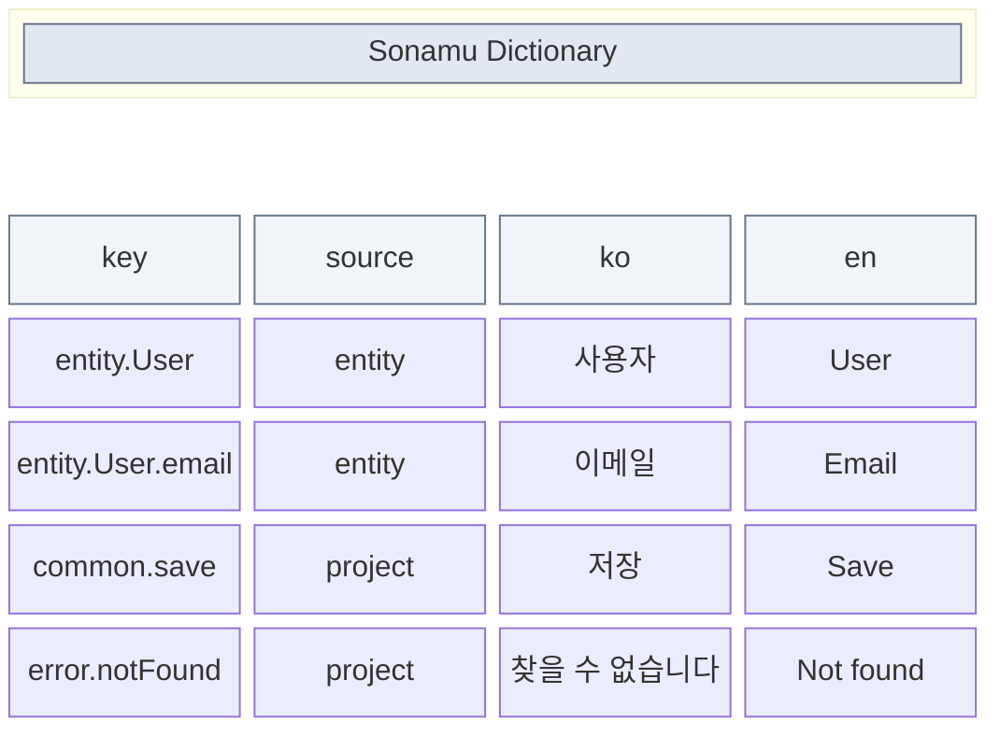
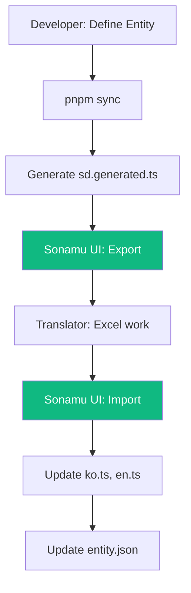

Sonamu UI provides functionality to export and import i18n dictionaries as Excel files. Translators or planners can work in spreadsheets and apply changes all at once.

## Excel Export

### Exporting from Sonamu UI

1. Access Sonamu UI (`http://localhost:34900/sonamu-ui`)
2. Click **i18n** in the left menu
3. Click the **Export** button in the top right
4. Download the Excel file

### Excel File Structure

| Column | Description |
|--------|-------------|
| `key` | Dictionary key |
| `source` | `entity` (auto-extracted) or `project` (manually written) |
| `ko`, `en`, ... | Translation values for each locale |

## Excel Import

### Importing After Translation Work

1. Perform translation work in the exported Excel file
2. Click the **Import** button on the i18n page in Sonamu UI
3. Select the Excel file
4. Review and apply the changes

### Import Behavior

| source | defaultLocale (ko) | Other locales (en) |
|--------|-------------------|-------------------|
| `entity` | Updates `entity.json` | Saved to `en.ts` |
| `project` | Saved to `ko.ts` | Saved to `en.ts` |

<Note>
The defaultLocale values for `entity` source directly modify the Entity's title, prop.desc, and enumLabels.
</Note>

## Translation Workflow

### Recommended Workflow

1. **Development phase**: Only write defaultLocale (ko) labels when defining Entities
2. **Translation phase**: Excel export -> Deliver to translation team -> Import after translation is complete
3. **Maintenance**: Repeat the same process when adding new keys

## Handling Function Values

Function values are preserved as-is in Excel:

| key | ko |
|-----|----|
| `common.results` | `(count: number) => \`${count}개 결과\`` |
| `validation.required` | `(field: string) => \`${field}은(는) 필수\`` |

During import, arrow function patterns (`(...) => ...`) are automatically detected and saved as functions.

## Important Notes

- **Key changes**: Changing an existing key adds it as a new key; the original key is retained
- **Key deletion**: Deleting a row in Excel does not remove it from the existing dictionary
- **Source change not allowed**: Changes from `entity` to `project` are ignored
- **Empty values**: Empty cells are ignored (the key is not removed from that locale)

<CardGroup cols={2}>
  <Card title="Using the SD Function" icon="code" href="/advanced-features/i18n/dictionary">
    Writing and using dictionaries
  </Card>
  <Card title="Entity Labels" icon="tag" href="/advanced-features/i18n/entity-labels">
    Auto-extracted labels
  </Card>
</CardGroup>
