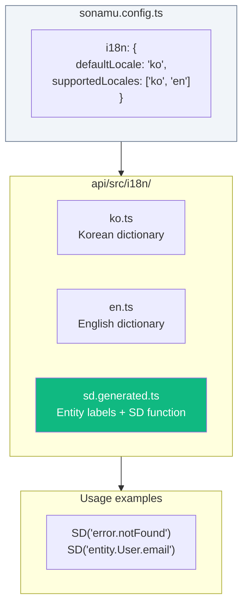
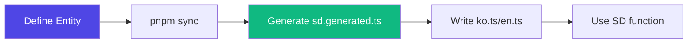

Sonamu has a built-in type-safe internationalization (i18n) system. Through the **SD (Sonamu Dictionary)** function, it detects key typos at compile time and automatically extracts Entity labels to simplify translation work.

## Key Features

- **Type Safety**: Compile-time errors when using non-existent keys
- **Automatic Entity Label Extraction**: title, prop.desc, and enum labels are automatically included in the dictionary
- **Function Value Support**: Dynamic message generation (`(count) => \`${count} items\``)
- **Korean Helpers**: Particle handling (은/는, 이/가), pluralization, etc.
- **Excel import/export**: Manage translation files through Sonamu UI
- **Locale-specific Column Support**: Multilingual DB columns like `name_ko`, `name_en`

## Architecture

## Auto-generated Files

`sd.generated.ts` includes the following:

| Item | Description | Example Key |
|------|-------------|-------------|
| Entity Title | Entity's title property | `entity.User` |
| Prop Label | prop's desc property | `entity.User.email` |
| Enum Label | enumLabels definition | `enum.UserRole.admin` |
| SD Function | Type-safe translation function | - |
| localizedColumn | Multilingual DB column support | - |

## Workflow

1. Define title, prop.desc, and enumLabels in Entity
2. Run `pnpm sync` to auto-generate `sd.generated.ts`
3. Write project dictionaries in `ko.ts`, `en.ts`
4. Use `SD("key")` function to get text matching the current locale

<CardGroup cols={2}>
  <Card title="Setup" icon="gear" href="/en/advanced-features/i18n/setup">
    Initial i18n configuration
  </Card>
  <Card title="Using the SD Function" icon="code" href="/en/advanced-features/i18n/dictionary">
    Writing and using dictionaries
  </Card>
</CardGroup>
