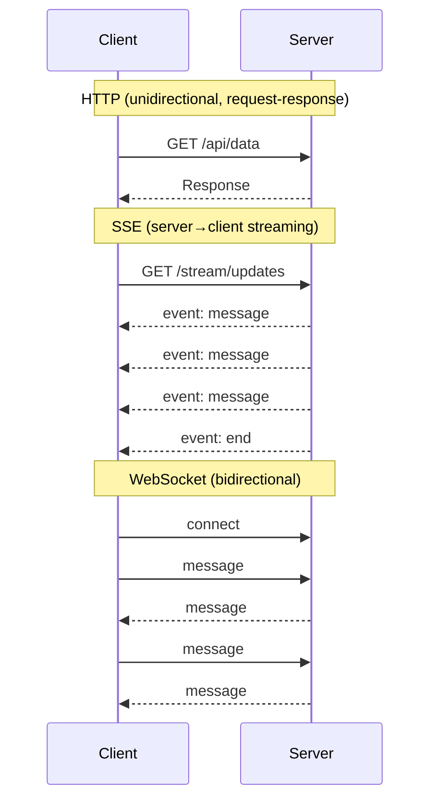
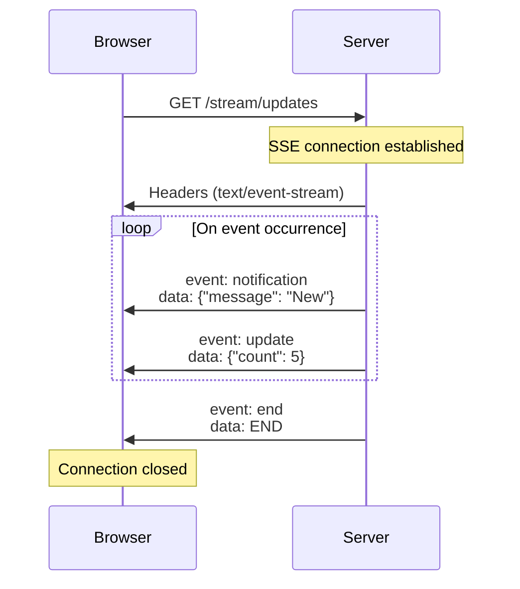

Sonamu supports **Server-Sent Events (SSE)** based on the **fastify-sse-v2** plugin. With SSE, you can push real-time data from the server to the client.

## What is SSE?

**Server-Sent Events** is a technology that provides **unidirectional real-time communication** from server to client.

### HTTP vs SSE vs WebSocket



### Comparison Table

| Feature | HTTP | SSE | WebSocket |
|---------|------|-----|-----------|
| Direction | Request→Response | Server→Client | Bidirectional |
| Protocol | HTTP | HTTP | WebSocket |
| Reconnection | X | Automatic | Manual |
| Complexity | Low | Medium | High |
| Use case | General API | Real-time push | Real-time chat |

### SSE Use Cases

<CardGroup cols={2}>
  <Card title="Real-time Notifications" icon="bell">
    New messages, likes, comments, etc.
  </Card>
  <Card title="Progress Updates" icon="spinner">
    File uploads, task processing progress
  </Card>
  <Card title="Live Feeds" icon="rss">
    News feeds, social media updates
  </Card>
  <Card title="Monitoring" icon="chart-line">
    Server status, log streaming
  </Card>
</CardGroup>

## Basic Setup

### sonamu.config.ts

```typescript
import { type SonamuConfig } from "sonamu";

export const config: SonamuConfig = {
  server: {
    plugins: {
      sse: true,  // Enable SSE plugin
    }
  }
};
```

**Default behavior**:
- Automatic SSE endpoint registration
- Automatic reconnection support
- Automatic keep-alive sending

## SSE Plugin Options

<Tabs>
  <Tab title="boolean" icon="toggle-on">
    **Simple enable/disable**

    ```typescript
    plugins: {
      sse: true,   // Enable
      sse: false,  // Disable
    }
    ```
  </Tab>

  <Tab title="SsePluginOptions" icon="gear">
    **Detailed configuration**

    ```typescript
    import type { SsePluginOptions } from "fastify-sse-v2/lib/types";

    plugins: {
      sse: {
        // Configure options (if needed)
      } as SsePluginOptions
    }
    ```

    **Note**: Default settings are sufficient in most cases.
  </Tab>
</Tabs>

## How SSE Works

### Connection Flow



### HTTP Headers

SSE uses special HTTP headers:

```http
Content-Type: text/event-stream
Cache-Control: no-cache
Connection: keep-alive
```

**Characteristics**:
- `text/event-stream`: SSE-specific Content-Type
- `no-cache`: Prevents caching
- `keep-alive`: Maintains connection

## Practical Configuration Examples

### 1. Basic Setup (Recommended)

```typescript
export const config: SonamuConfig = {
  server: {
    plugins: {
      sse: true,  // Simply enable
    }
  }
};
```

### 2. Development/Production Separation

```typescript
const isDevelopment = process.env.NODE_ENV === 'development';

export const config: SonamuConfig = {
  server: {
    plugins: {
      sse: !isDevelopment,  // Enable only in production
    }
  }
};
```

**Reason**: In development, connections frequently disconnect due to HMR

### 3. Conditional Activation

```typescript
export const config: SonamuConfig = {
  server: {
    plugins: {
      sse: process.env.ENABLE_SSE === 'true',
    }
  }
};
```

```.env
ENABLE_SSE=true
```

## Disabling Compression

SSE is a streaming response, so **compression must be disabled**.

```typescript
export const config: SonamuConfig = {
  server: {
    plugins: {
      sse: true,
      compress: {
        global: true,  // Enable global compression
        threshold: 1024,
        encodings: ["gzip"],
      }
    }
  }
};
```

**Handled automatically in @stream decorator**:
```typescript
@stream({
  type: 'sse',
  events: z.object({
    message: z.string(),
  })
})
@api({
  compress: false,  // Automatically disable compression (recommended)
})
async *streamUpdates() {
  // ...
}
```

## CORS Configuration

CORS configuration is required to use SSE from different domains.

```typescript
export const config: SonamuConfig = {
  server: {
    plugins: {
      sse: true,
      cors: {
        origin: ['https://example.com', 'https://app.example.com'],
        credentials: true,
      }
    }
  }
};
```

**Note**: SSE can send authentication cookies, so `credentials: true` is required

## Environment-specific Strategies

### Development Environment

```typescript
export const config: SonamuConfig = {
  server: {
    plugins: {
      sse: true,
      cors: {
        origin: 'http://localhost:5173',  // Vite dev server
        credentials: true,
      }
    }
  }
};
```

### Production Environment

```typescript
export const config: SonamuConfig = {
  server: {
    plugins: {
      sse: true,
      cors: {
        origin: process.env.FRONTEND_URL,
        credentials: true,
      }
    }
  }
};
```

```.env
FRONTEND_URL=https://app.example.com
```

## Timeout Configuration

SSE connections are maintained for long periods, so timeout configuration is important.

```typescript
export const config: SonamuConfig = {
  server: {
    fastify: {
      connectionTimeout: 0,  // Disable timeout
      keepAliveTimeout: 5000,  // Keep-alive: 5 seconds
    },
    plugins: {
      sse: true,
    }
  }
};
```

**Configuration values**:
- `connectionTimeout: 0`: Disable connection timeout (SSE maintains long connections)
- `keepAliveTimeout`: Keep-alive interval (default: 5 seconds)

## Proxy Configuration (Nginx)

When using Nginx, SSE-specific configuration is required.

```nginx
server {
    listen 80;
    server_name api.example.com;

    location /stream/ {
        proxy_pass http://localhost:3000;

        # SSE required settings
        proxy_set_header Connection '';
        proxy_http_version 1.1;
        chunked_transfer_encoding off;

        # Disable buffering
        proxy_buffering off;
        proxy_cache off;

        # Timeout
        proxy_read_timeout 24h;
        proxy_send_timeout 24h;
    }
}
```

**Key settings**:
- `proxy_buffering off`: Disable buffering (immediate transmission)
- `proxy_cache off`: Disable caching
- `proxy_read_timeout 24h`: Read timeout (long duration)

## Debugging

### Browser Developer Tools

```
Network tab → Select stream request → Headers tab

Request Headers:
  Accept: text/event-stream

Response Headers:
  Content-Type: text/event-stream
  Cache-Control: no-cache
  Connection: keep-alive

EventStream tab:
  event: message
  data: {"text": "Hello"}

  event: update
  data: {"count": 5}
```

### curl Test

```bash
# Test SSE connection
curl -N http://localhost:3000/stream/updates

# Result:
# event: message
# data: {"text": "Hello"}
#
# event: update
# data: {"count": 5}
#
# event: end
# data: END
```

**Options**:
- `-N`: Disable buffering (immediate output)

## Important Notes

<Warning>
**Important considerations when configuring SSE**:

1. **Disable compression**: SSE is streaming, so compression is prohibited
   ```typescript
   @api({ compress: false })
   async *streamData() { ... }
   ```

2. **Timeout settings**: Maintain long connections
   ```typescript
   fastify: {
     connectionTimeout: 0,
   }
   ```

3. **CORS configuration**: Required when using from different domains
   ```typescript
   cors: {
     origin: 'https://example.com',
     credentials: true,
   }
   ```

4. **Reconnection handling**: Clients need to implement auto-reconnection
   ```typescript
   // EventSource handles this automatically
   const source = new EventSource('/stream/updates');
   ```

5. **Browser limitations**: Concurrent SSE connection limit (6 per domain)
   - Solution: Use HTTP/2 or reuse connections

6. **Proxy buffering**: Must disable buffering in Nginx, etc.
   ```nginx
   proxy_buffering off;
   ```
</Warning>

## Browser Support

SSE is supported in all modern browsers:

| Browser | Support |
|---------|---------|
| Chrome | ✅ |
| Firefox | ✅ |
| Safari | ✅ |
| Edge | ✅ |
| IE 11 | ❌ (polyfill required) |

**IE 11 support**: [event-source-polyfill](https://www.npmjs.com/package/event-source-polyfill)

## Next Steps

<CardGroup cols={2}>
  <Card title="Creating SSE Endpoints" icon="code" href="/advanced-features/sse/creating-sse-endpoints">
    Build SSE APIs with the @stream decorator
  </Card>
  <Card title="Client Integration" icon="browser" href="/advanced-features/sse/client-integration">
    Using SSE in the frontend
  </Card>
</CardGroup>
