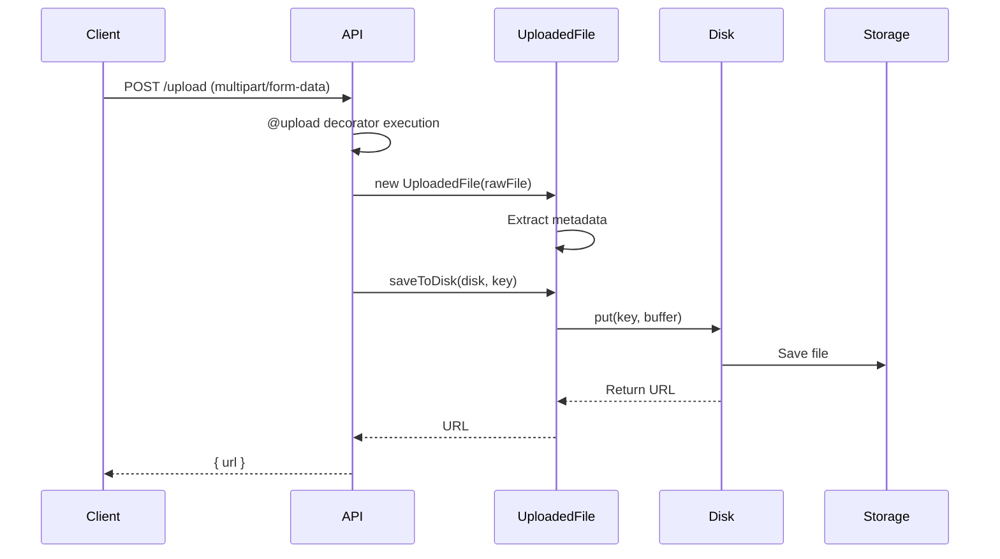

Sonamu makes file uploads easy to handle with the **@upload** decorator and **UploadedFile** class.

## File Upload Flow



## @upload Decorator

Used when creating file upload APIs.

### Single File Upload

```typescript
import { BaseModelClass, api, upload, Sonamu } from "sonamu";

class UserModelClass extends BaseModelClass {
  @upload()
  async uploadAvatar(ctx: Context) {
    const { bufferedFiles } = Sonamu.getContext();
    const file = bufferedFiles?.[0]; // Use first file

    if (!file) {
      throw new Error('No file provided');
    }

    // Save file
    const url = await file.saveToDisk('fs', `avatars/${ctx.user.id}.png`);

    return { url };
  }
}
```

**Client request**:
```typescript
const formData = new FormData();
formData.append('file', file);

await fetch('/api/user/uploadAvatar', {
  method: 'POST',
  body: formData,
});
```

### Multiple File Upload

```typescript
class PostModelClass extends BaseModelClass {
  @upload()
  async uploadImages(postId: number) {
    const { bufferedFiles } = Sonamu.getContext();

    if ((bufferedFiles?.length ?? 0) === 0) {
      throw new Error('No files provided');
    }

    // Save all files
    const urls = await Promise.all(
      (bufferedFiles ?? []).map(async (file, index) => {
        const key = `posts/${postId}/image-${index}.${file.extname}`;
        return await file.saveToDisk('fs', key);
      })
    );

    return { urls };
  }
}
```

**Client request**:
```typescript
const formData = new FormData();
formData.append('file', file1);
formData.append('file', file2);
formData.append('file', file3);

await fetch('/api/post/uploadImages?postId=1', {
  method: 'POST',
  body: formData,
});
```

## Accessing Files

Access uploaded files through the `files` property of **Sonamu.getContext()**.

```typescript
// Access uploaded files from Context
const { bufferedFiles } = Sonamu.getContext();

// bufferedFiles is BufferedFile[] (optional array)
type Context = {
  // ...
  bufferedFiles?: BufferedFile[];
};
```

**Single file access**: Use the first element of the array
```typescript
const file = bufferedFiles?.[0];  // First file
```

**Multiple file access**: Iterate through the array
```typescript
for (const file of (bufferedFiles ?? [])) {
  // Process each file
}
```

### Usage Example

```typescript
@upload()
async upload() {
  const { bufferedFiles } = Sonamu.getContext();
  const file = bufferedFiles?.[0]; // Use first file

  if (!file) {
    throw new Error('File is required');
  }

  // file is a BufferedFile instance
  console.log(file.filename);   // Original filename
  console.log(file.mimetype);   // MIME type
  console.log(file.size);       // File size

  return await file.saveToDisk('fs', 'uploads/file.pdf');
}
```

## UploadedFile Class

A class that wraps uploaded files.

### Properties

<Tabs>
  <Tab title="filename" icon="file">
    **Original filename**

    ```typescript
    const { bufferedFiles } = Sonamu.getContext();
    const file = bufferedFiles?.[0]; // Use first file
    console.log(file.filename);  // 'avatar.png'
    ```
  </Tab>

  <Tab title="mimetype" icon="file-code">
    **MIME type**

    ```typescript
    console.log(file.mimetype);
    // 'image/png'
    // 'application/pdf'
    // 'video/mp4'
    ```
  </Tab>

  <Tab title="size" icon="weight">
    **File size** (bytes)

    ```typescript
    console.log(file.size);  // 1024000 (1MB)
    console.log(`${(file.size / 1024 / 1024).toFixed(2)}MB`);  // '0.98MB'
    ```
  </Tab>

  <Tab title="extname" icon="file-zipper">
    **Extension** (without dot)

    ```typescript
    console.log(file.extname);
    // 'png'
    // 'pdf'
    // 'mp4'
    // false (no extension)
    ```
  </Tab>

  <Tab title="url" icon="link">
    **URL after saving** (unsigned)

    ```typescript
    await file.saveToDisk('uploads/file.pdf');
    console.log(file.url);
    // '/uploads/file.pdf' (fs)
    // 'https://bucket.s3.amazonaws.com/uploads/file.pdf' (s3)
    ```
  </Tab>

  <Tab title="signedUrl" icon="lock">
    **Signed URL after saving** (S3)

    ```typescript
    await file.saveToDisk('uploads/file.pdf');
    console.log(file.signedUrl);
    // 'https://bucket.s3.amazonaws.com/uploads/file.pdf?X-Amz-...'
    ```

    **Use case**: Temporary access URL (with expiration)
  </Tab>
</Tabs>

### Methods

#### buffer

Accesses the file data as a Buffer.

```typescript
const { bufferedFiles } = Sonamu.getContext();
const file = bufferedFiles?.[0]; // Use first file
const buffer = file.buffer;

console.log(buffer instanceof Buffer);  // true
console.log(buffer.length);  // File size (bytes)
```

#### md5()

Calculates the MD5 hash of the file.

```typescript
const { bufferedFiles } = Sonamu.getContext();
const file = bufferedFiles?.[0]; // Use first file
const hash = await file.md5();

console.log(hash);  // '5d41402abc4b2a76b9719d911017c592'
```

**Use cases**:
- File deduplication check
- File integrity verification
- Unique filename generation

#### saveToDisk(diskName, key)

Saves the file to disk.

```typescript
const { bufferedFiles } = Sonamu.getContext();
const file = bufferedFiles?.[0]; // Use first file

// Save to fs disk
const url = await file.saveToDisk('fs', 'uploads/file.pdf');

// Save to specific disk
const url = await file.saveToDisk('s3', 'uploads/file.pdf');
```

**Return value**: URL of the saved file (unsigned)

## Practical Examples

### 1. Profile Photo Upload

```typescript
class UserModelClass extends BaseModelClass {
  @upload()
  async uploadAvatar(ctx: Context) {
    const { bufferedFiles } = Sonamu.getContext();
    const file = bufferedFiles?.[0]; // Use first file

    if (!file) {
      throw new Error('No file provided');
    }

    // Allow only image files
    if (!file.mimetype.startsWith('image/')) {
      throw new Error('Only image files can be uploaded');
    }

    // File size limit (5MB)
    const maxSize = 5 * 1024 * 1024;  // 5MB
    if (file.size > maxSize) {
      throw new Error('File size must be 5MB or less');
    }

    // Filename: user-{id}-{timestamp}.{ext}
    const timestamp = Date.now();
    const ext = file.extname || 'png';
    const key = `avatars/user-${ctx.user.id}-${timestamp}.${ext}`;

    // Save
    const url = await file.saveToDisk('fs', key);

    // Update DB
    await this.updateOne(['id', ctx.user.id], {
      avatar_url: url,
      updated_at: new Date(),
    });

    return { url };
  }
}
```

### 2. Multiple Image Upload

```typescript
class PostModelClass extends BaseModelClass {
  @upload()
  async uploadImages(postId: number, ctx: Context) {
    const { bufferedFiles } = Sonamu.getContext();

    // Limit number of files
    if ((bufferedFiles?.length ?? 0) > 10) {
      throw new Error('Maximum 10 files can be uploaded');
    }

    // Filter images only
    const imageFiles = (bufferedFiles ?? []).filter(file =>
      file.mimetype.startsWith('image/')
    );

    if (imageFiles.length === 0) {
      throw new Error('No image files found');
    }

    // Save all images
    const urls = await Promise.all(
      imageFiles.map(async (file, index) => {
        const timestamp = Date.now();
        const ext = file.extname || 'png';
        const key = `posts/${postId}/image-${index}-${timestamp}.${ext}`;
        return await file.saveToDisk('fs', key);
      })
    );

    return { urls, count: urls.length };
  }
}
```

### 3. File Type Validation

```typescript
class FileModelClass extends BaseModelClass {
  @upload()
  async uploadDocument(type: 'pdf' | 'excel' | 'word') {
    const { bufferedFiles } = Sonamu.getContext();
    const file = bufferedFiles?.[0]; // Use first file

    if (!file) {
      throw new Error('No file provided');
    }

    // MIME type validation
    const allowedMimeTypes = {
      pdf: ['application/pdf'],
      excel: [
        'application/vnd.ms-excel',
        'application/vnd.openxmlformats-officedocument.spreadsheetml.sheet'
      ],
      word: [
        'application/msword',
        'application/vnd.openxmlformats-officedocument.wordprocessingml.document'
      ],
    };

    if (!allowedMimeTypes[type].includes(file.mimetype)) {
      throw new Error(`Only ${type} files can be uploaded`);
    }

    // Save file
    const key = `documents/${type}/${Date.now()}-${file.filename}`;
    const url = await file.saveToDisk('fs', key);

    return { url, type, filename: file.filename };
  }
}
```

### 4. Deduplication Check with MD5 Hash

```typescript
class MediaModelClass extends BaseModelClass {
  @upload()
  @api({ httpMethod: 'POST' })
  async uploadMedia() {
    const { files } = Sonamu.getContext();
    const file = files?.[0]; // Use first file

    if (!file) {
      throw new Error('No file provided');
    }

    // Calculate MD5 hash
    const hash = await file.md5();

    // Check if file already exists
    const existing = await this.findOne(['md5_hash', hash]);

    if (existing) {
      // Return existing URL if already exists
      return {
        url: existing.url,
        duplicate: true,
      };
    }

    // Save new file
    const key = `media/${hash}.${file.extname}`;
    const url = await file.saveToDisk(key);

    // Save to DB
    await this.saveOne({
      md5_hash: hash,
      url,
      filename: file.filename,
      size: file.size,
      mimetype: file.mimetype,
    });

    return { url, duplicate: false };
  }
}
```

### 5. Disk Selection

```typescript
class FileModelClass extends BaseModelClass {
  @upload()
  @api({ httpMethod: 'POST' })
  async upload(visibility: 'public' | 'private', ctx: Context) {
    const { files } = Sonamu.getContext();
    const file = files?.[0]; // Use first file

    if (!file) {
      throw new Error('No file provided');
    }

    // Use different disk based on visibility
    const disk = visibility === 'public' ? 'public' : 'private';
    const key = `${visibility}/${ctx.user.id}/${Date.now()}-${file.filename}`;

    // Save
    const url = await file.saveToDisk(key, disk);

    // Save to DB
    await this.saveOne({
      user_id: ctx.user.id,
      url,
      visibility,
      filename: file.filename,
    });

    return { url, visibility };
  }
}
```

## File Retrieval

Use Storage Manager to retrieve saved files.

### Reading Files

```typescript
import { Sonamu } from "sonamu";

@api({ httpMethod: 'GET' })
async getFile(key: string) {
  const disk = Sonamu.storage.use();

  // Check file existence
  const exists = await disk.exists(key);
  if (!exists) {
    throw new Error('File not found');
  }

  // Read file
  const content = await disk.get(key);

  return content;  // Buffer
}
```

### File Download API

```typescript
@api({
  httpMethod: 'GET',
  contentType: 'application/octet-stream',
})
async downloadFile(key: string, ctx: Context) {
  const disk = Sonamu.storage.use();

  // Check file existence
  const exists = await disk.exists(key);
  if (!exists) {
    throw new Error('File not found');
  }

  // Read file
  const buffer = await disk.get(key);

  // Extract filename
  const filename = key.split('/').pop() || 'download';

  // Set download headers
  ctx.reply.header('Content-Disposition', `attachment; filename="${filename}"`);

  return buffer;
}
```

### Getting URL

```typescript
@api({ httpMethod: 'GET' })
async getFileUrl(key: string) {
  const disk = Sonamu.storage.use();

  // Check file existence
  const exists = await disk.exists(key);
  if (!exists) {
    throw new Error('File not found');
  }

  // Get URL
  const url = await disk.getUrl(key);

  return { url };
}
```

### Signed URL (S3)

```typescript
@api({ httpMethod: 'GET' })
async getSignedUrl(key: string) {
  const disk = Sonamu.storage.use('s3');

  // Generate Signed URL (valid for 1 hour)
  const signedUrl = await disk.getSignedUrl(key, {
    expiresIn: '1h'
  });

  return { url: signedUrl };
}
```

## File Deletion

```typescript
@api({ httpMethod: 'DELETE' })
async deleteFile(key: string) {
  const disk = Sonamu.storage.use();

  // Check file existence
  const exists = await disk.exists(key);
  if (!exists) {
    throw new Error('File not found');
  }

  // Delete file
  await disk.delete(key);

  return { success: true };
}
```

## Cautions

<Warning>
**Cautions when uploading files**:

1. **File validation is required**: Validate type, size, and extension
   ```typescript
   // ✅ Validation
   if (!file.mimetype.startsWith('image/')) {
     throw new Error('Images only');
   }
   if (file.size > 5 * 1024 * 1024) {
     throw new Error('5MB or less');
   }
   ```

2. **Use unique filenames**: Prevent overwrites
   ```typescript
   // ❌ Using original filename
   await file.saveToDisk('fs', `uploads/${file.filename}`);

   // ✅ Add timestamp
   await file.saveToDisk('fs', `uploads/${Date.now()}-${file.filename}`);

   // ✅ Use UUID
   await file.saveToDisk('fs', `uploads/${uuid()}.${file.extname}`);
   ```

3. **Path validation**: Prevent directory traversal
   ```typescript
   // ❌ Dangerous: Can access parent directories
   const key = userInput;  // '../../../etc/passwd'

   // ✅ Safe: Path validation
   const key = `uploads/${userInput.replace(/\.\./g, '')}`;
   ```

4. **File size limit**: Prevent memory overflow
   ```typescript
   const maxSize = 10 * 1024 * 1024;  // 10MB
   if (file.size > maxSize) {
     throw new Error('File is too large');
   }
   ```

5. **MIME type validation**: Don't trust only the extension
   ```typescript
   // ❌ Only checking extension
   if (file.filename.endsWith('.png')) { ... }

   // ✅ Check MIME type
   if (file.mimetype === 'image/png') { ... }
   ```
</Warning>

## Next Steps

<CardGroup cols={2}>
  <Card title="Storage Manager" icon="database" href="/en/advanced-features/storage/storage-manager">
    Managing multiple disks
  </Card>
  <Card title="Storage Drivers" icon="hard-drive" href="/en/advanced-features/storage/storage-drivers">
    fs, S3 driver configuration
  </Card>
  <Card title="URL Builder" icon="link" href="/en/advanced-features/storage/url-builder">
    Generating file URLs
  </Card>
</CardGroup>
