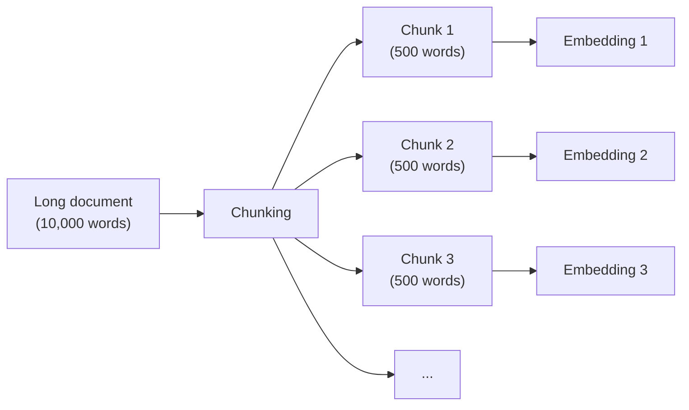

## Handling Long Documents in Sonamu

You're building a feature to upload blog posts or manuals to your Sonamu app:

```typescript
class DocumentModelClass extends BaseModelClass {
  @upload()
  async uploadDocument() {
    const { bufferedFiles } = Sonamu.getContext();
    const file = bufferedFiles?.[0]; // Use first file
    const content = file.buffer.toString();

    // Attempting to generate embedding
    const embedding = await Embedding.embedOne(content, "voyage", "document");
    // Error: Token limit exceeded (32,000 tokens)
  }
}
```

**Problem**:

- Long documents (10,000+ words)
- Exceeds embedding API token limit
- Cannot embed the entire document at once

**Solution**: **Chunking** - splitting documents into smaller pieces

## What is Chunking?



**Key points**:

- Long document -> multiple chunks
- Each chunk -> individual embedding
- During search -> return the most relevant chunks

### Why is it Necessary?

**1. Token Limits**

- Voyage AI: 32,000 tokens
- OpenAI: 8,191 tokens
- Long documents exceed limits

**2. Search Accuracy**

- Shorter chunks yield more accurate results
- Searching "refund method" -> returns only the refund section

**3. Context Preservation**

- Keep related information together
- Split without breaking sentences

## Sonamu's Chunking Class

```typescript
import { Chunking } from "sonamu/vector";

const chunking = new Chunking({
  chunkSize: 500, // chunk size (characters)
  chunkOverlap: 50, // overlap size
  minChunkSize: 50, // minimum size
  skipThreshold: 200, // skip splitting if short
  separators: ["\n\n", "\n", ". "], // separators
});

const chunks = chunking.chunk("Long text...");
```

## Using in Sonamu Model

### Long Document Upload + Chunking

```typescript
class DocumentModelClass extends BaseModelClass {
  @upload()
  async uploadLongDocument() {
    const { bufferedFiles } = Sonamu.getContext();
    const file = bufferedFiles?.[0]; // Use first file
    const content = file.buffer.toString();

    // 1. Chunking
    const chunking = new Chunking({
      chunkSize: 500,
      chunkOverlap: 50,
    });

    const chunks = chunking.chunk(content);

    // 2. Embedding per chunk
    const embeddings = await Embedding.embed(
      chunks.map((c) => c.text),
      "voyage",
      "document",
    );

    // 3. Create parent document
    const parent = await this.saveOne({
      title: file.filename,
      content,
      chunk_count: chunks.length,
    });

    // 4. Save each chunk
    const savedChunks = await Promise.all(
      chunks.map((chunk, i) =>
        DocumentChunkModel.saveOne({
          parent_id: parent.id,
          chunk_index: chunk.index,
          content: chunk.text,
          start_offset: chunk.startOffset,
          end_offset: chunk.endOffset,
          embedding: embeddings[i].embedding,
        }),
      ),
    );

    return {
      parentId: parent.id,
      chunkCount: chunks.length,
    };
  }
}
```

### Table Structure

```sql
-- Parent documents
CREATE TABLE documents (
  id SERIAL PRIMARY KEY,
  title TEXT NOT NULL,
  content TEXT NOT NULL,
  chunk_count INTEGER,
  created_at TIMESTAMP DEFAULT NOW()
);

-- Chunks (store embeddings)
CREATE TABLE document_chunks (
  id SERIAL PRIMARY KEY,
  parent_id INTEGER REFERENCES documents(id),
  chunk_index INTEGER,
  content TEXT NOT NULL,
  start_offset INTEGER,
  end_offset INTEGER,
  embedding vector(1024),
  created_at TIMESTAMP DEFAULT NOW()
);

CREATE INDEX ON document_chunks (parent_id);
CREATE INDEX ON document_chunks USING hnsw (embedding vector_cosine_ops);
```

## Understanding Configuration Options

### chunkSize: Chunk Size

```typescript
const chunking = new Chunking({
  chunkSize: 500, // 500 characters
});
```

**Recommended values**:

- Short search: 200-300 characters
- General: 400-600 characters
- Long context: 800-1000 characters

**Considerations**:

- Korean: ~1 character = ~1 token
- English: ~1 character = ~0.7 tokens

### chunkOverlap: Overlap Size

```typescript
const chunking = new Chunking({
  chunkSize: 500,
  chunkOverlap: 50, // 10%
});
```

**Purpose**: Maintain context at chunk boundaries

```
Chunk 1: [..............................]
Chunk 2:                    [...........]
                           ^ overlap area
```

**Recommended**: 10-20% of chunkSize

### skipThreshold: Skip Splitting

```typescript
const chunking = new Chunking({
  skipThreshold: 200,
});

// Don't split if 200 characters or less
const text = "Short text"; // 50 characters
const chunks = chunking.chunk(text); // [entire text as 1 chunk]
```

**Efficiency**: No chunking needed for short documents

### separators: Separator Priority

```typescript
const chunking = new Chunking({
  separators: [
    "\n\n", // 1st priority: paragraph
    "\n", // 2nd priority: line
    ". ", // 3rd priority: sentence
    ", ", // 4th priority: comma
  ],
});
```

**Behavior**: Tries from left to right

## Practical Scenarios

### Scenario: Technical Documentation Knowledge Base

You're building a development documentation search system with Sonamu.

**Step 1: Conditional Chunking**

```typescript
@upload()
async uploadTechDoc() {
  const { bufferedFiles } = Sonamu.getContext();
  const file = bufferedFiles?.[0]; // Use first file
  const content = file.buffer.toString();

  const chunking = new Chunking({
    chunkSize: 500,
    skipThreshold: 300,
  });

  // Keep as-is if short, chunk if long
  if (chunking.needsChunking(content)) {
    return await this.uploadWithChunking(file.filename, content);
  } else {
    return await this.uploadSimple(file.filename, content);
  }
}

private async uploadSimple(title: string, content: string) {
  const embedding = await Embedding.embedOne(
    `${title}\n\n${content}`,
    'voyage',
    'document'
  );

  return await this.saveOne({
    title,
    content,
    embedding: embedding.embedding,
  });
}

private async uploadWithChunking(title: string, content: string) {
  // Same as the example above
  const chunking = new Chunking({ chunkSize: 500 });
  const chunks = chunking.chunk(content);
  // ...
}
```

**Step 2: Search (Chunk-based)**

```typescript
@api({ httpMethod: 'POST' })
async searchDocs(query: string, limit: number = 5) {
  const embedding = await Embedding.embedOne(query, 'voyage', 'query');

  // Search chunks
  const chunks = await this.getPuri("r").raw(`
    SELECT
      c.id, c.parent_id, c.content, c.chunk_index,
      d.title,
      1 - (c.embedding <=> ?) AS similarity
    FROM document_chunks c
    JOIN documents d ON c.parent_id = d.id
    WHERE c.embedding IS NOT NULL
    ORDER BY c.embedding <=> ?
    LIMIT ?
  `, [
    JSON.stringify(embedding.embedding),
    JSON.stringify(embedding.embedding),
    limit * 2,
  ]);

  // Group by parent document
  const grouped = new Map();

  for (const chunk of chunks.rows) {
    const parentId = chunk.parent_id;

    if (!grouped.has(parentId)) {
      grouped.set(parentId, {
        parentId,
        title: chunk.title,
        bestSimilarity: chunk.similarity,
        relevantChunks: [],
      });
    }

    grouped.get(parentId).relevantChunks.push({
      content: chunk.content,
      chunkIndex: chunk.chunk_index,
      similarity: chunk.similarity,
    });
  }

  return Array.from(grouped.values())
    .sort((a, b) => b.bestSimilarity - a.bestSimilarity)
    .slice(0, limit);
}
```

**Response example**:

```json
[
  {
    "parentId": 123,
    "title": "Getting Started with TypeScript",
    "bestSimilarity": 0.89,
    "relevantChunks": [
      {
        "content": "TypeScript is JavaScript with types...",
        "chunkIndex": 2,
        "similarity": 0.89
      }
    ]
  }
]
```

## Optimizing for Markdown Documents

```typescript
const markdownChunking = new Chunking({
  chunkSize: 600,
  separators: [
    "\n## ", // Heading 2
    "\n### ", // Heading 3
    "\n\n", // Paragraph
    "\n", // Line
    ". ", // Sentence
  ],
});

const markdown = `
# Sonamu

## Overview
Sonamu is a TypeScript framework.

## Installation
\`\`\`bash
pnpm add sonamu
\`\`\`
`;

const chunks = markdownChunking.chunk(markdown);
```

**Effect**: Splits by headings -> preserves context

## Chunking vs Full Document

### When is Chunking Necessary?

| Document Type  | Average Length | Chunking Needed | Reason    |
| -------------- | -------------- | --------------- | --------- |
| FAQ items      | < 200 chars    | No              | Short     |
| Blog posts     | 1,000 chars    | Optional        | Medium    |
| Technical docs | 5,000 chars    | Yes             | Long      |
| Manuals        | 20,000 chars   | Required        | Very long |
| Chat messages  | < 100 chars    | No              | Short     |

### Decision in Sonamu

```typescript
const chunking = new Chunking({
  skipThreshold: 300, // Skip if 300 chars or less
});

if (chunking.needsChunking(content)) {
  // Process with chunking
} else {
  // Process as-is
}
```

## Cautions

<Warning>
**Cautions when using chunking in Sonamu**:

1. **Don't make chunkSize too small**

   ```typescript
   // Too small
   chunkSize: 50;

   // Appropriate
   chunkSize: 400 - 600;
   ```

2. **Keep chunkOverlap reasonable**

   ```typescript
   // Recommended: 10-20%
   chunkSize: 500,
   chunkOverlap: 50,
   ```

3. **Separator order matters**

   ```typescript
   // Correct: larger units first
   separators: ["\n\n", "\n", ". "];

   // Wrong: smaller units first
   separators: [" ", ".", "\n"];
   ```

4. **Maintain parent-child relationship**

   ```sql
   -- Connect with parent_id
   CREATE TABLE document_chunks (
     parent_id INTEGER REFERENCES documents(id)
   );
   ```

5. **Remove duplicates when searching**

   ```typescript
   // Multiple chunks from same document -> group into one
   const grouped = new Map();
   ```

6. **Store offsets** (optional)
   ```typescript
   // Track original position
   start_offset: chunk.startOffset,
   end_offset: chunk.endOffset,
   ```
   </Warning>

## Next Steps

<CardGroup cols={2}>
  <Card
    title="Vector Search"
    icon="magnifying-glass"
    href="/en/advanced-features/vector-search/vector-search"
  >
    Implementing chunk-based search API
  </Card>
  <Card title="Embeddings" icon="brain" href="/en/advanced-features/vector-search/embeddings">
    Generating batch embeddings
  </Card>
</CardGroup>
