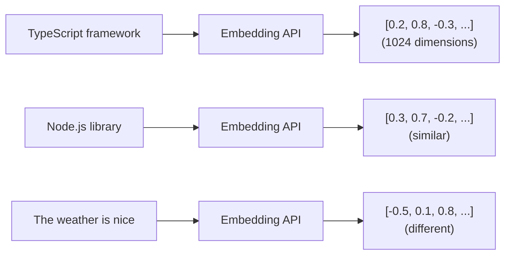

## The Problem with Sonamu Search API

You're building a knowledge base app with Sonamu:

```typescript
class DocumentModelClass extends BaseModelClass {
  @api({ httpMethod: "POST" })
  async search(query: string) {
    // Keyword search
    const results = await this.findMany({
      wq: [
        ["title", "LIKE", `%${query}%`],
        ["content", "LIKE", `%${query}%`],
      ],
    });
    return results;
  }
}
```

What happens when a user searches for "TypeScript framework"?

- "Sonamu is a **TypeScript framework**" - Found
- "Sonamu is a Node.js API **library**" - Not found (different keywords)
- "Sonamu is a **TS framework**" - Not found (abbreviation)
- "TypeScript **framwork**" - Not found (typo)

**Limitations of keyword search**:

- Doesn't handle synonyms
- Fails when expressions differ
- Vulnerable to typos
- Fails when meaning is the same but words differ

## Semantic Search is Needed

"TypeScript framework" and "Node.js API library" are **semantically similar**, even though the keywords are different.

How can computers understand this meaning? **Embeddings**

## What are Embeddings?

**Embeddings** convert text into high-dimensional numerical arrays (vectors). Semantically similar texts are placed close together in vector space.



**Key points**:

- Converting to numbers enables **distance calculation**
- Close vectors = semantically similar texts
- Distant vectors = semantically different texts

### Flow in Sonamu

```typescript
// 1. When saving a document: text -> embedding -> DB
await DocumentModel.saveOne({
  title: "Getting Started with Sonamu",
  content: "...",
  embedding: [0.2, 0.8, -0.3, ...],  // 1024 dimensions
});

// 2. When searching: query -> embedding -> similarity calculation
const queryEmbedding = [0.3, 0.7, -0.2, ...];
const results = await searchSimilar(queryEmbedding);
```

## The Embedding Class

Sonamu provides an `Embedding` class to easily create embeddings:

```typescript
import { Embedding } from "sonamu/vector";

// Single text embedding
const result = await Embedding.embedOne(
  "Sonamu is a TypeScript framework",
  "voyage", // 'voyage' | 'openai'
);

console.log(result.embedding); // [0.123, -0.456, ...] (1024 dimensions)
console.log(result.model); // "voyage-3"
console.log(result.tokenCount); // 8
```

## Which Provider Should You Choose?

### Voyage AI vs OpenAI

Sonamu supports two embedding providers:

| Item                      | Voyage AI                        | OpenAI      |
| ------------------------- | -------------------------------- | ----------- |
| **Korean performance**    | Excellent                        | Good        |
| **English performance**   | Excellent                        | Excellent   |
| **Dimensions**            | 1024                             | 1536        |
| **Max tokens**            | 32,000                           | 8,191       |
| **Batch size**            | 128                              | 100         |
| **Asymmetric embeddings** | Yes (document/query distinction) | No          |
| **Sonamu recommendation** | Highly recommended               | Recommended |

### Selection Criteria for Sonamu Projects

**Recommend Voyage AI**:

- Korean services (excellent Korean performance)
- Long document processing (32,000 tokens)
- Search accuracy matters (asymmetric embeddings)

**Recommend OpenAI**:

- Global services (balanced multilingual support)
- Already using OpenAI API

## Environment Setup

### 1. Install Packages

```bash
pnpm add voyageai
# or
pnpm add @ai-sdk/openai
```

### 2. Configure API Keys

```.env
# Voyage AI (recommended)
VOYAGE_API_KEY=pa-...

# OpenAI (alternative)
OPENAI_API_KEY=sk-...
```

Get API keys from each provider's website:

- Voyage AI: https://www.voyageai.com/
- OpenAI: https://platform.openai.com/

## Using in Sonamu Model

### Generating Embeddings When Saving Documents

```typescript
import { BaseModelClass, api } from "sonamu";
import { Embedding } from "sonamu/vector";

class DocumentModelClass extends BaseModelClass {
  @api({ httpMethod: "POST" })
  async createDocument(title: string, content: string) {
    // 1. Generate embedding
    const result = await Embedding.embedOne(
      `${title}\n\n${content}`,
      "voyage",
      "document", // document embedding
    );

    // 2. Save to DB (Sonamu's saveOne)
    const doc = await this.saveOne({
      title,
      content,
      embedding: result.embedding, // array of 1024 numbers
      token_count: result.tokenCount,
    });

    return doc;
  }
}
```

**Flow**:

1. User uploads document via POST /documents
2. Sonamu API generates embedding via Voyage AI
3. PostgreSQL stores text + embedding together

### Search API (to be implemented later)

```typescript
@api({ httpMethod: 'POST' })
async search(query: string) {
  // 1. Generate query embedding
  const result = await Embedding.embedOne(
    query,
    'voyage',
    'query'  // search embedding
  );

  // 2. Vector search (see vector-search.mdx)
  const results = await this.getPuri().raw(`
    SELECT title, content,
      1 - (embedding <=> ?) AS similarity
    FROM documents
    WHERE embedding IS NOT NULL
    ORDER BY similarity DESC
    LIMIT 10
  `, [JSON.stringify(result.embedding)]);

  return results.rows;
}
```

## Asymmetric Embeddings (Voyage AI)

Voyage AI distinguishes between **document** and **query** embeddings.

### Why the Distinction?

**Document**:

- Long text
- Detailed information
- Storage purpose

**Query**:

- Short text
- Search terms
- Search purpose

Documents and queries have **different characteristics**. Voyage AI considers this to provide more accurate search results (10-15% improvement).

### Usage in Sonamu

```typescript
// When saving documents: document
const docEmbedding = await Embedding.embedOne(
  "Sonamu is a TypeScript full-stack framework. It provides API, DB, authentication, and more.",
  "voyage",
  "document", // for documents
);

// When searching: query
const queryEmbedding = await Embedding.embedOne(
  "TypeScript framework",
  "voyage",
  "query", // for search
);
```

**OpenAI does not support asymmetric embeddings**:

```typescript
// OpenAI ignores inputType
await Embedding.embedOne(text, "openai", "document"); // 'document' is ignored
```

## Batch Processing

When processing multiple documents at once:

```typescript
@api({ httpMethod: 'POST' })
async batchCreateDocuments(documents: Array<{
  title: string;
  content: string;
}>) {
  // 1. Prepare text array
  const texts = documents.map(doc =>
    `${doc.title}\n\n${doc.content}`
  );

  // 2. Batch embedding (automatically splits into batches of 128)
  const embeddings = await Embedding.embed(
    texts,
    'voyage',
    'document'
  );

  // 3. Save to DB
  const savedDocs = await Promise.all(
    documents.map((doc, i) =>
      this.saveOne({
        title: doc.title,
        content: doc.content,
        embedding: embeddings[i].embedding,
        token_count: embeddings[i].tokenCount,
      })
    )
  );

  return savedDocs;
}
```

**Automatic splitting**:

- Voyage AI: 128 at a time
- OpenAI: 100 at a time

Even 1000 documents are automatically split and processed.

## Progress Display

You can show progress when processing many documents:

```typescript
@api({ httpMethod: 'POST' })
async importDocuments(files: string[]) {
  const texts = files.map(f => readFile(f));

  const embeddings = await Embedding.embed(
    texts,
    'voyage',
    'document',
    (processed, total) => {
      const percent = Math.round((processed / total) * 100);
      console.log(`Progress: ${processed}/${total} (${percent}%)`);
    }
  );

  // Progress: 128/1000 (13%)
  // Progress: 256/1000 (26%)
  // ...
  // Progress: 1000/1000 (100%)
}
```

## Practical Scenario

### Scenario: Customer Support Knowledge Base

You're building a customer support system with Sonamu.

**Step 1: Document Upload API**

```typescript
class KnowledgeBaseModelClass extends BaseModelClass {
  @upload()
  async uploadDocument() {
    const { bufferedFiles } = Sonamu.getContext();
    const file = bufferedFiles?.[0]; // Use first file

    // Read file
    const content = file.buffer.toString();

    // Generate embedding
    const embedding = await Embedding.embedOne(content, "voyage", "document");

    // Save
    return await this.saveOne({
      title: file.filename,
      content,
      embedding: embedding.embedding,
    });
  }
}
```

**Step 2: Search API**

```typescript
@api({ httpMethod: 'POST' })
async searchSimilar(query: string) {
  // Query embedding
  const embedding = await Embedding.embedOne(query, 'voyage', 'query');

  // Search similar documents
  const results = await this.getPuri().raw(`
    SELECT id, title, content,
      1 - (embedding <=> ?) AS similarity
    FROM knowledge_base
    WHERE embedding IS NOT NULL
    ORDER BY similarity DESC
    LIMIT 5
  `, [JSON.stringify(embedding.embedding)]);

  return results.rows;
}
```

**Step 3: Handling User Requests**

```
POST /api/knowledge-base/search
{ "query": "What is the refund policy?" }

-> Returns 5 similar documents:
1. "Refund and Exchange Guide" (similarity: 0.89)
2. "How to Cancel a Purchase" (similarity: 0.82)
3. "Refund Periods by Payment Method" (similarity: 0.78)
...
```

## Error Handling

```typescript
@api({ httpMethod: 'POST' })
async createDocument(title: string, content: string) {
  try {
    const embedding = await Embedding.embedOne(
      `${title}\n\n${content}`,
      'voyage',
      'document'
    );

    return await this.saveOne({
      title,
      content,
      embedding: embedding.embedding,
    });
  } catch (error) {
    if (error.message.includes('API_KEY')) {
      throw new Error('Please set your Voyage API key: VOYAGE_API_KEY');
    } else if (error.message.includes('token')) {
      throw new Error('Text is too long (max 32,000 tokens)');
    } else {
      throw new Error(`Failed to generate embedding: ${error.message}`);
    }
  }
}
```

## Cost Considerations

### Token Calculation

```typescript
const result = await Embedding.embedOne("Sonamu is a TypeScript full-stack framework", "voyage");

console.log(`Tokens: ${result.tokenCount}`); // 12
```

### Cost Estimation

**Voyage AI** ($0.13 per 1M tokens):

```typescript
// 1000 documents, average 500 tokens
// = 500,000 tokens
// = $0.065
```

**OpenAI** ($0.02 per 1M tokens):

```typescript
// 1000 documents, average 500 tokens
// = 500,000 tokens
// = $0.01
```

### Cost Reduction Tips

**1. Caching**

```typescript
const cache = new Map<string, number[]>();

async function getCachedEmbedding(text: string) {
  if (cache.has(text)) {
    return cache.get(text)!;
  }

  const result = await Embedding.embedOne(text, "voyage");
  cache.set(text, result.embedding);
  return result.embedding;
}
```

**2. Deduplication**

```typescript
// Embed identical texts only once
const uniqueTexts = [...new Set(texts)];
const embeddings = await Embedding.embed(uniqueTexts, "voyage");
```

## Cautions

<Warning>
**Cautions when using embeddings in Sonamu**:

1. **API key required**: Set environment variables

   ```bash
   VOYAGE_API_KEY=pa-...
   ```

2. **Dimension match**: Must match DB schema

   ```sql
   -- Voyage AI
   CREATE TABLE docs (embedding vector(1024));

   -- OpenAI
   CREATE TABLE docs (embedding vector(1536));
   ```

3. **document vs query**: Voyage distinguishes, OpenAI ignores

   ```typescript
   // When saving
   await Embedding.embedOne(text, "voyage", "document");

   // When searching
   await Embedding.embedOne(text, "voyage", "query");
   ```

4. **Token limits**: Chunking needed for very long texts
   - Voyage AI: 32,000 tokens
   - OpenAI: 8,191 tokens

5. **NULL handling**: Can store NULL on embedding failure

   ```typescript
   embedding: result?.embedding || null;
   ```

6. **Cost monitoring**: Track token usage
   ```typescript
   console.log(`Total tokens: ${result.tokenCount}`);
   ```
   </Warning>

## Next Steps

Embedding generation is complete. Now it's time to implement the search API in Sonamu Model.

<CardGroup cols={3}>
  <Card
    title="pgvector Setup"
    icon="database"
    href="/en/advanced-features/vector-search/pgvector-setup"
  >
    Creating PostgreSQL vector tables
  </Card>
  <Card
    title="Vector Search"
    icon="magnifying-glass"
    href="/en/advanced-features/vector-search/vector-search"
  >
    Implementing search API in Sonamu Model
  </Card>
  <Card title="Chunking" icon="scissors" href="/en/advanced-features/vector-search/chunking">
    Splitting long documents
  </Card>
</CardGroup>
