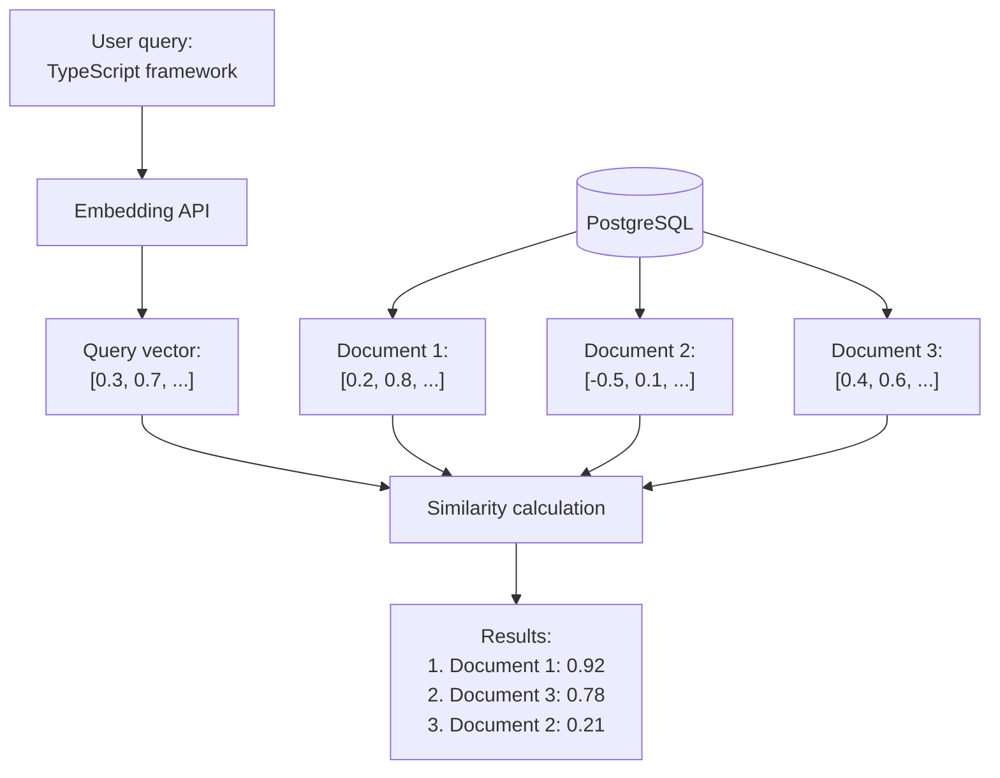

## Building Search API in Sonamu

You've generated embeddings and stored them in the database. Now it's time to build the search API.

```typescript
// You've saved documents
await DocumentModel.saveOne({
  title: "Getting Started with Sonamu",
  content: "...",
  embedding: [0.2, 0.8, ...],  // 1024 dimensions
});

// Now you want to search
// When searching "TypeScript framework"
// -> Should find "Getting Started with Sonamu"
```

**Goal**: Implement vector search API in Sonamu BaseModel.

## How Vector Search Works



**Key points**:

1. Convert query to embedding
2. Calculate distance/similarity with all document vectors in DB
3. Sort by proximity

## Implementation in Sonamu Model

### Basic Search API

```typescript
import { BaseModelClass, api } from "sonamu";
import { Embedding } from "sonamu/vector";

class DocumentModelClass extends BaseModelClass {
  @api({ httpMethod: "POST" })
  async search(query: string, limit: number = 10) {
    // 1. Convert query to embedding
    const embedding = await Embedding.embedOne(
      query,
      "voyage",
      "query", // for search
    );

    // 2. Run the vector search with Puri's vectorSimilarity()
    return this.getPuri("r")
      .table("documents")
      .select({ id: "id", title: "title", content: "content" })
      .vectorSimilarity("embedding", embedding.embedding)
      .limit(limit);
  }
}
```

**Flow**:

1. `POST /api/documents/search` -> Sonamu API
2. Generate query embedding (Voyage AI)
3. Calculate similarity in PostgreSQL (pgvector)
4. Return top N results

### Why Use vectorSimilarity()?

pgvector's special operators (`<=>`) cannot be expressed with ordinary `where` conditions:

```typescript
// Cannot be expressed with findMany's wq
await this.findMany({
  wq: [
    /* how to use pgvector operators? */
  ],
});

// Puri's vectorSimilarity()
await this.getPuri("r")
  .table("documents")
  .select({ id: "id" })
  .vectorSimilarity("embedding", embedding.embedding, { threshold: 0.5 });
```

`vectorSimilarity()` handles all of the following at once:

- Adds a `similarity` column to the SELECT clause
- Adds `WHERE {column} IS NOT NULL`
- Adds a similarity filter when `threshold` is given
- Sets `ORDER BY` on the distance operator (so the HNSW index is used)

The embedding is bound internally, so you never need to concatenate the vector into SQL yourself.

## Understanding Similarity Functions

pgvector calculates distance/similarity between vectors in three ways.

### 1. Cosine Similarity (Recommended)

**Measures by angle between vectors**

```sql
SELECT
  id, title,
  1 - (embedding <=> ?) AS similarity
FROM documents
ORDER BY embedding <=> ?;
```

**Operator**: `<=>` (cosine distance)
**Range**: 0.0 (identical) ~ 2.0 (opposite)
**Similarity conversion**: `1 - distance`

**Advantages**:

- Not affected by vector magnitude (compares direction only)
- Optimal for most embedding models
- **Recommended for Sonamu**

### 2. Euclidean Distance (L2)

**Straight-line distance between vectors**

```sql
SELECT
  id, title,
  embedding <-> ? AS distance
FROM documents
ORDER BY embedding <-> ?;
```

**Operator**: `<->` (L2 distance)
**Range**: 0.0 (identical) ~ infinity

**Use case**: When vector magnitude also matters

### 3. Inner Product (Dot Product)

**Vector inner product (negative)**

```sql
SELECT
  id, title,
  (embedding <#> ?) * -1 AS score
FROM documents
ORDER BY embedding <#> ?;
```

**Operator**: `<#>` (negative inner product)
**Range**: -infinity ~ infinity

**Use case**: Specialized embedding models

### Use Cosine Similarity in Sonamu

All three methods are selected via the `method` option of `vectorSimilarity()`. The default is `"cosine"`.

| method               | Operator | similarity value           |
| -------------------- | -------- | -------------------------- |
| `"cosine"` (default) | `<=>`    | `1 - distance`             |
| `"l2"`               | `<->`    | distance (lower is closer) |
| `"inner_product"`    | `<#>`    | `-distance`                |

```typescript
// Recommended: Cosine similarity (the default when method is omitted)
const results = await this.getPuri("r")
  .table("documents")
  .select({ id: "id", title: "title", content: "content" })
  .vectorSimilarity("embedding", embedding.embedding, { method: "cosine" })
  .limit(limit);
```

## Threshold Filtering

Exclude results with low similarity:

```typescript
@api({ httpMethod: 'POST' })
async searchWithThreshold(
  query: string,
  threshold: number = 0.5,  // only 0.5 and above
  limit: number = 10
) {
  const embedding = await Embedding.embedOne(query, 'voyage', 'query');

  return this.getPuri("r")
    .table("documents")
    .select({ id: "id", title: "title", content: "content" })
    .vectorSimilarity("embedding", embedding.embedding, { threshold })
    .limit(limit);
}
```

**Threshold criteria**:

- `0.8~1.0`: Very similar (almost identical)
- `0.6~0.8`: Similar
- `0.4~0.6`: Related
- `< 0.4`: Unrelated

## Practical Examples

### 1. Knowledge Base Search

```typescript
class KnowledgeBaseModelClass extends BaseModelClass {
  @api({ httpMethod: "POST" })
  async searchKnowledge(query: string, category?: string, limit: number = 5) {
    const embedding = await Embedding.embedOne(query, "voyage", "query");

    const qb = this.getPuri("r")
      .table("knowledge_base")
      .select({
        id: "id",
        title: "title",
        content: "content",
        category: "category",
        createdAt: "created_at",
      });

    // Category filter (optional) — the value is bound, so no string concatenation is needed
    if (category) {
      qb.where("category", category);
    }

    const rows = await qb.vectorSimilarity("embedding", embedding.embedding).limit(limit);

    return rows.map((row) => ({
      ...row,
      similarity: parseFloat(row.similarity.toFixed(3)),
    }));
  }
}
```

**Usage**:

```typescript
// Full search
await KnowledgeBaseModel.searchKnowledge("refund method");

// With category filter
await KnowledgeBaseModel.searchKnowledge("refund method", "FAQ");
```

### 2. Product Recommendations

Implementing "Products similar to this":

```typescript
class ProductModelClass extends BaseModelClass {
  @api({ httpMethod: "POST" })
  async recommendSimilarProducts(productId: number, limit: number = 10) {
    // Get base product
    const baseProduct = await this.findById(productId);

    if (!baseProduct.embedding) {
      throw new Error("Product embedding does not exist");
    }

    // Search similar products (exclude self)
    return this.getPuri("r")
      .table("products")
      .select({ id: "id", name: "name", description: "description", price: "price" })
      .where("id", "!=", productId)
      .vectorSimilarity("embedding", baseProduct.embedding)
      .limit(limit);
  }
}
```

**API response**:

```json
[
  {
    "id": 123,
    "name": "Similar Product 1",
    "price": 29000,
    "similarity": 0.89
  },
  ...
]
```

### 3. Multi-Filter Search

Combining multiple conditions:

```typescript
@api({ httpMethod: 'POST' })
async advancedSearch(
  query: string,
  filters: {
    category?: string;
    minSimilarity?: number;
    dateFrom?: Date;
    dateTo?: Date;
  } = {},
  limit: number = 10
) {
  const embedding = await Embedding.embedOne(query, 'voyage', 'query');

  // Dynamic WHERE conditions
  const qb = this.getPuri("r")
    .table("documents")
    .select({
      id: "id",
      title: "title",
      content: "content",
      category: "category",
      createdAt: "created_at",
    });

  if (filters.category) {
    qb.where("category", filters.category);
  }

  if (filters.dateFrom) {
    qb.where("created_at", ">=", filters.dateFrom);
  }

  if (filters.dateTo) {
    qb.where("created_at", "<=", filters.dateTo);
  }

  // Pass the similarity cutoff through vectorSimilarity's threshold option
  return qb
    .vectorSimilarity("embedding", embedding.embedding, {
      threshold: filters.minSimilarity,
    })
    .limit(limit);
}
```

### 4. Chunk Search + Aggregation

When documents are stored as chunks:

```typescript
@api({ httpMethod: 'POST' })
async searchDocumentChunks(
  query: string,
  limit: number = 5
) {
  const embedding = await Embedding.embedOne(query, 'voyage', 'query');

  // Search by chunk (fetch more)
  const chunks = await this.getPuri("r")
    .table("document_chunks")
    .select({
      id: "id",
      parent_id: "parent_id",
      title: "title",
      content: "content",
      chunk_index: "chunk_index",
    })
    .vectorSimilarity("embedding", embedding.embedding)
    .limit(limit * 3);

  // Group by parent document
  const grouped = new Map();

  for (const chunk of chunks) {
    const parentId = chunk.parent_id;

    if (!grouped.has(parentId)) {
      grouped.set(parentId, {
        parentId,
        title: chunk.title,
        bestSimilarity: chunk.similarity,
        chunks: [],
      });
    }

    grouped.get(parentId).chunks.push({
      chunkIndex: chunk.chunk_index,
      content: chunk.content,
      similarity: chunk.similarity,
    });
  }

  // Return top N documents
  return Array.from(grouped.values())
    .sort((a, b) => b.bestSimilarity - a.bestSimilarity)
    .slice(0, limit);
}
```

## Performance Optimization

### Do You Have an Index?

Vector search is very slow without an index:

```sql
-- Check index
SELECT indexname, indexdef
FROM pg_indexes
WHERE tablename = 'documents'
  AND indexdef LIKE '%hnsw%';
```

Create one if missing (after 100+ data entries):

```sql
CREATE INDEX idx_docs_embedding
ON documents
USING hnsw (embedding vector_cosine_ops);
```

### Verify with EXPLAIN ANALYZE

```typescript
const rdb = this.getPuri("r");

const query = rdb
  .table("documents")
  .select({ id: "id", title: "title" })
  .vectorSimilarity("embedding", embedding.embedding)
  .limit(10);

// Build the finished SQL with toQuery() and pass it to EXPLAIN
const explain = await rdb.raw(`EXPLAIN ANALYZE ${query.toQuery()}`);

console.log(explain.rows);
```

**What to check**:

- `Index Scan using hnsw_...` -> Good
- `Seq Scan` -> Bad (no index)

### Adjusting Index Parameters

Search accuracy vs speed:

```sql
-- Per-session setting
SET LOCAL hnsw.ef_search = 100;  -- default: 40

-- Higher: more accurate, slower
-- Lower: faster, less accurate
```

In Sonamu:

```typescript
const rdb = this.getPuri("r");

// SET LOCAL only applies within a transaction, so run it inside @transactional
await rdb.raw("SET LOCAL hnsw.ef_search = 100");

const results = await rdb
  .table("documents")
  .select({ id: "id", title: "title" })
  .vectorSimilarity("embedding", embedding.embedding)
  .limit(10);
```

## Benchmarks

### Index Effect

| Documents | Sequential Scan | HNSW Index | Speed Improvement |
| --------- | --------------- | ---------- | ----------------- |
| 1K        | 50ms            | 2ms        | 25x               |
| 10K       | 500ms           | 5ms        | 100x              |
| 100K      | 5s              | 8ms        | 625x              |
| 1M        | 50s             | 12ms       | 4166x             |

**Conclusion**: Index is essential!

## Cautions

<Warning>
**Cautions for vector search in Sonamu**:

1. **NULL check**: `vectorSimilarity()` adds `WHERE {column} IS NOT NULL` automatically, so you don't need to write it

2. **Dimension match**: Query and DB vector dimensions must match

   ```typescript
   // Dimension mismatch
   // DB: vector(1024) - Voyage
   // Query: OpenAI (1536) - Error!

   // Dimension match
   // DB: vector(1024)
   // Query: Voyage (1024)
   ```

3. **Pass the embedding as a plain number[]**: `vectorSimilarity()` handles the vector literal conversion

   ```typescript
   qb.vectorSimilarity("embedding", embedding.embedding);
   ```

4. **Use the threshold option for cutoffs**: no need to write WHERE/ORDER BY yourself

   ```typescript
   qb.vectorSimilarity("embedding", embedding.embedding, { threshold: 0.5 });
   ```

5. **Cannot use findMany's wq**: use `vectorSimilarity()` for vector search

   ```typescript
   await this.getPuri("r").table("documents").vectorSimilarity("embedding", vector);
   ```

6. **Index creation timing**: After data

   ```sql
   -- 1. Data first
   INSERT INTO docs ...

   -- 2. Index later
   CREATE INDEX ...
   ```

7. **Appropriate LIMIT**: Don't fetch too many
   ```sql
   LIMIT 10  -- OK
   -- LIMIT 1000  -- Slow
   ```
   </Warning>

## Next Steps

You've implemented vector search in Sonamu Model. For more accurate search, you can add hybrid search (vector + keyword).

<CardGroup cols={2}>
  <Card
    title="Hybrid Search"
    icon="layer-group"
    href="/en/advanced-features/vector-search/hybrid-search"
  >
    Combining vector + FTS for improved accuracy
  </Card>
  <Card title="Chunking" icon="scissors" href="/en/advanced-features/vector-search/chunking">
    Splitting long documents
  </Card>
</CardGroup>
