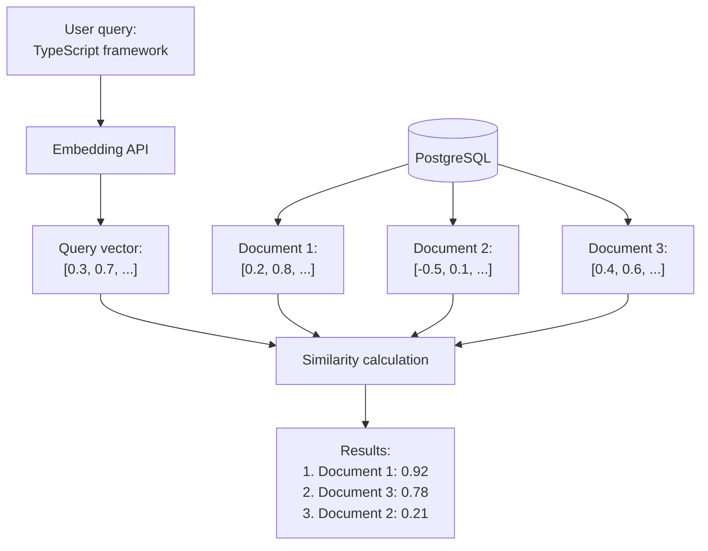

## Building Search API in Sonamu

You've generated embeddings and stored them in the database. Now it's time to build the search API.

```typescript
// You've saved documents
await DocumentModel.saveOne({
  title: "Getting Started with Sonamu",
  content: "...",
  embedding: [0.2, 0.8, ...],  // 1024 dimensions
});

// Now you want to search
// When searching "TypeScript framework"
// -> Should find "Getting Started with Sonamu"
```

**Goal**: Implement vector search API in Sonamu BaseModel.

## How Vector Search Works



**Key points**:
1. Convert query to embedding
2. Calculate distance/similarity with all document vectors in DB
3. Sort by proximity

## Implementation in Sonamu Model

### Basic Search API

```typescript
import { BaseModelClass, api } from "sonamu";
import { Embedding } from "sonamu/vector";

class DocumentModelClass extends BaseModelClass {
  @api({ httpMethod: 'POST' })
  async search(query: string, limit: number = 10) {
    // 1. Convert query to embedding
    const embedding = await Embedding.embedOne(
      query,
      'voyage',
      'query'  // for search
    );

    // 2. Write vector search SQL with Puri
    const results = await this.getPuri().raw(`
      SELECT
        id,
        title,
        content,
        1 - (embedding <=> ?) AS similarity
      FROM documents
      WHERE embedding IS NOT NULL
      ORDER BY embedding <=> ?
      LIMIT ?
    `, [
      JSON.stringify(embedding.embedding),
      JSON.stringify(embedding.embedding),
      limit,
    ]);

    return results.rows;
  }
}
```

**Flow**:
1. `POST /api/documents/search` -> Sonamu API
2. Generate query embedding (Voyage AI)
3. Calculate similarity in PostgreSQL (pgvector)
4. Return top N results

### Why Use Puri's raw()?

Knex doesn't directly support pgvector's special operators (`<=>`):

```typescript
// Hard with Knex
await this.findMany({
  wq: [/* how to use pgvector operators? */]
});

// Write SQL directly with Puri.raw()
await this.getPuri().raw(`
  SELECT * FROM docs
  WHERE embedding <=> ? < 0.5
`);
```

Sonamu's `Puri` wraps Knex and provides the `raw()` method.

## Understanding Similarity Functions

pgvector calculates distance/similarity between vectors in three ways.

### 1. Cosine Similarity (Recommended)

**Measures by angle between vectors**

```sql
SELECT
  id, title,
  1 - (embedding <=> ?) AS similarity
FROM documents
ORDER BY embedding <=> ?;
```

**Operator**: `<=>` (cosine distance)
**Range**: 0.0 (identical) ~ 2.0 (opposite)
**Similarity conversion**: `1 - distance`

**Advantages**:
- Not affected by vector magnitude (compares direction only)
- Optimal for most embedding models
- **Recommended for Sonamu**

### 2. Euclidean Distance (L2)

**Straight-line distance between vectors**

```sql
SELECT
  id, title,
  embedding <-> ? AS distance
FROM documents
ORDER BY embedding <-> ?;
```

**Operator**: `<->` (L2 distance)
**Range**: 0.0 (identical) ~ infinity

**Use case**: When vector magnitude also matters

### 3. Inner Product (Dot Product)

**Vector inner product (negative)**

```sql
SELECT
  id, title,
  (embedding <#> ?) * -1 AS score
FROM documents
ORDER BY embedding <#> ?;
```

**Operator**: `<#>` (negative inner product)
**Range**: -infinity ~ infinity

**Use case**: Specialized embedding models

### Use Cosine Similarity in Sonamu

```typescript
// Recommended: Cosine similarity
const results = await this.getPuri().raw(`
  SELECT
    id, title, content,
    1 - (embedding <=> ?) AS similarity
  FROM documents
  WHERE embedding IS NOT NULL
  ORDER BY embedding <=> ?
  LIMIT ?
`, [
  JSON.stringify(embedding.embedding),
  JSON.stringify(embedding.embedding),
  limit,
]);
```

## Threshold Filtering

Exclude results with low similarity:

```typescript
@api({ httpMethod: 'POST' })
async searchWithThreshold(
  query: string,
  threshold: number = 0.5,  // only 0.5 and above
  limit: number = 10
) {
  const embedding = await Embedding.embedOne(query, 'voyage', 'query');

  const results = await this.getPuri().raw(`
    SELECT
      id, title, content,
      1 - (embedding <=> ?) AS similarity
    FROM documents
    WHERE
      embedding IS NOT NULL
      AND 1 - (embedding <=> ?) > ?
    ORDER BY embedding <=> ?
    LIMIT ?
  `, [
    JSON.stringify(embedding.embedding),
    JSON.stringify(embedding.embedding),
    threshold,
    JSON.stringify(embedding.embedding),
    limit,
  ]);

  return results.rows;
}
```

**Threshold criteria**:
- `0.8~1.0`: Very similar (almost identical)
- `0.6~0.8`: Similar
- `0.4~0.6`: Related
- `< 0.4`: Unrelated

## Practical Examples

### 1. Knowledge Base Search

```typescript
class KnowledgeBaseModelClass extends BaseModelClass {
  @api({ httpMethod: 'POST' })
  async searchKnowledge(
    query: string,
    category?: string,
    limit: number = 5
  ) {
    const embedding = await Embedding.embedOne(query, 'voyage', 'query');

    // Category filter (optional)
    const categoryFilter = category
      ? `AND category = '${category}'`
      : '';

    const results = await this.getPuri().raw(`
      SELECT
        id, title, content, category,
        1 - (embedding <=> ?) AS similarity,
        created_at
      FROM knowledge_base
      WHERE
        embedding IS NOT NULL
        ${categoryFilter}
      ORDER BY embedding <=> ?
      LIMIT ?
    `, [
      JSON.stringify(embedding.embedding),
      JSON.stringify(embedding.embedding),
      limit,
    ]);

    return results.rows.map(row => ({
      id: row.id,
      title: row.title,
      content: row.content,
      category: row.category,
      similarity: parseFloat(row.similarity.toFixed(3)),
      createdAt: row.created_at,
    }));
  }
}
```

**Usage**:
```typescript
// Full search
await KnowledgeBaseModel.searchKnowledge("refund method");

// With category filter
await KnowledgeBaseModel.searchKnowledge("refund method", "FAQ");
```

### 2. Product Recommendations

Implementing "Products similar to this":

```typescript
class ProductModelClass extends BaseModelClass {
  @api({ httpMethod: 'POST' })
  async recommendSimilarProducts(
    productId: number,
    limit: number = 10
  ) {
    // Get base product
    const baseProduct = await this.findById(productId);

    if (!baseProduct.embedding) {
      throw new Error('Product embedding does not exist');
    }

    // Search similar products (exclude self)
    const results = await this.getPuri().raw(`
      SELECT
        id, name, description, price,
        1 - (embedding <=> ?) AS similarity
      FROM products
      WHERE
        embedding IS NOT NULL
        AND id != ?
      ORDER BY embedding <=> ?
      LIMIT ?
    `, [
      JSON.stringify(baseProduct.embedding),
      productId,
      JSON.stringify(baseProduct.embedding),
      limit,
    ]);

    return results.rows;
  }
}
```

**API response**:
```json
[
  {
    "id": 123,
    "name": "Similar Product 1",
    "price": 29000,
    "similarity": 0.89
  },
  ...
]
```

### 3. Multi-Filter Search

Combining multiple conditions:

```typescript
@api({ httpMethod: 'POST' })
async advancedSearch(
  query: string,
  filters: {
    category?: string;
    minSimilarity?: number;
    dateFrom?: Date;
    dateTo?: Date;
  } = {},
  limit: number = 10
) {
  const embedding = await Embedding.embedOne(query, 'voyage', 'query');

  // Dynamic WHERE conditions
  const conditions = ['embedding IS NOT NULL'];
  const params: any[] = [
    JSON.stringify(embedding.embedding),
    JSON.stringify(embedding.embedding),
  ];

  if (filters.category) {
    conditions.push(`category = ?`);
    params.push(filters.category);
  }

  if (filters.minSimilarity) {
    conditions.push(`1 - (embedding <=> ?) > ?`);
    params.push(
      JSON.stringify(embedding.embedding),
      filters.minSimilarity
    );
  }

  if (filters.dateFrom) {
    conditions.push(`created_at >= ?`);
    params.push(filters.dateFrom);
  }

  if (filters.dateTo) {
    conditions.push(`created_at <= ?`);
    params.push(filters.dateTo);
  }

  params.push(limit);

  const results = await this.getPuri().raw(`
    SELECT
      id, title, content, category,
      1 - (embedding <=> ?) AS similarity,
      created_at
    FROM documents
    WHERE ${conditions.join(' AND ')}
    ORDER BY embedding <=> ?
    LIMIT ?
  `, params);

  return results.rows;
}
```

### 4. Chunk Search + Aggregation

When documents are stored as chunks:

```typescript
@api({ httpMethod: 'POST' })
async searchDocumentChunks(
  query: string,
  limit: number = 5
) {
  const embedding = await Embedding.embedOne(query, 'voyage', 'query');

  // Search by chunk (fetch more)
  const chunks = await this.getPuri().raw(`
    SELECT
      id, parent_id, title, content, chunk_index,
      1 - (embedding <=> ?) AS similarity
    FROM document_chunks
    WHERE embedding IS NOT NULL
    ORDER BY embedding <=> ?
    LIMIT ?
  `, [
    JSON.stringify(embedding.embedding),
    JSON.stringify(embedding.embedding),
    limit * 3,
  ]);

  // Group by parent document
  const grouped = new Map();

  for (const chunk of chunks.rows) {
    const parentId = chunk.parent_id;

    if (!grouped.has(parentId)) {
      grouped.set(parentId, {
        parentId,
        title: chunk.title,
        bestSimilarity: chunk.similarity,
        chunks: [],
      });
    }

    grouped.get(parentId).chunks.push({
      chunkIndex: chunk.chunk_index,
      content: chunk.content,
      similarity: chunk.similarity,
    });
  }

  // Return top N documents
  return Array.from(grouped.values())
    .sort((a, b) => b.bestSimilarity - a.bestSimilarity)
    .slice(0, limit);
}
```

## Performance Optimization

### Do You Have an Index?

Vector search is very slow without an index:

```sql
-- Check index
SELECT indexname, indexdef
FROM pg_indexes
WHERE tablename = 'documents'
  AND indexdef LIKE '%hnsw%';
```

Create one if missing (after 100+ data entries):
```sql
CREATE INDEX idx_docs_embedding
ON documents
USING hnsw (embedding vector_cosine_ops);
```

### Verify with EXPLAIN ANALYZE

```typescript
const explain = await this.getPuri().raw(`
  EXPLAIN ANALYZE
  SELECT id, title, 1 - (embedding <=> ?) AS similarity
  FROM documents
  WHERE embedding IS NOT NULL
  ORDER BY embedding <=> ?
  LIMIT 10
`, [
  JSON.stringify(embedding.embedding),
  JSON.stringify(embedding.embedding),
]);

console.log(explain.rows);
```

**What to check**:
- `Index Scan using hnsw_...` -> Good
- `Seq Scan` -> Bad (no index)

### Adjusting Index Parameters

Search accuracy vs speed:

```sql
-- Per-session setting
SET LOCAL hnsw.ef_search = 100;  -- default: 40

-- Higher: more accurate, slower
-- Lower: faster, less accurate
```

In Sonamu:
```typescript
await this.getPuri().raw('SET LOCAL hnsw.ef_search = 100');
const results = await this.getPuri().raw(`SELECT ...`);
```

## Benchmarks

### Index Effect

| Documents | Sequential Scan | HNSW Index | Speed Improvement |
|-----------|-----------------|------------|-------------------|
| 1K | 50ms | 2ms | 25x |
| 10K | 500ms | 5ms | 100x |
| 100K | 5s | 8ms | 625x |
| 1M | 50s | 12ms | 4166x |

**Conclusion**: Index is essential!

## Cautions

<Warning>
**Cautions for vector search in Sonamu**:

1. **NULL check required**: Exclude documents without embeddings
   ```sql
   WHERE embedding IS NOT NULL
   ```

2. **Dimension match**: Query and DB vector dimensions must match
   ```typescript
   // Dimension mismatch
   // DB: vector(1024) - Voyage
   // Query: OpenAI (1536) - Error!

   // Dimension match
   // DB: vector(1024)
   // Query: Voyage (1024)
   ```

3. **JSON.stringify required**: Convert array to JSON string
   ```typescript
   JSON.stringify(embedding.embedding)
   ```

4. **Operator used twice**: In WHERE and ORDER BY
   ```sql
   WHERE 1 - (embedding <=> ?) > 0.5
   ORDER BY embedding <=> ?
   ```

5. **Use Puri.raw()**: Cannot use Knex's wq
   ```typescript
   await this.getPuri().raw(`SELECT ...`);
   ```

6. **Index creation timing**: After data
   ```sql
   -- 1. Data first
   INSERT INTO docs ...

   -- 2. Index later
   CREATE INDEX ...
   ```

7. **Appropriate LIMIT**: Don't fetch too many
   ```sql
   LIMIT 10  -- OK
   -- LIMIT 1000  -- Slow
   ```
</Warning>

## Next Steps

You've implemented vector search in Sonamu Model. For more accurate search, you can add hybrid search (vector + keyword).

<CardGroup cols={2}>
  <Card title="Hybrid Search" icon="layer-group" href="/advanced-features/vector-search/hybrid-search">
    Combining vector + FTS for improved accuracy
  </Card>
  <Card title="Chunking" icon="scissors" href="/advanced-features/vector-search/chunking">
    Splitting long documents
  </Card>
</CardGroup>
