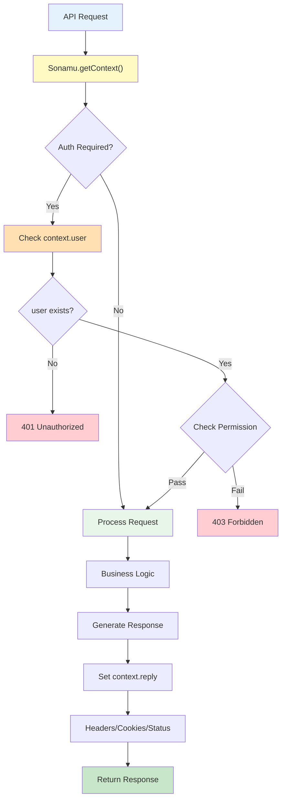

SonamuContext is an object containing the information needed during API request processing.

## Context Overview

<CardGroup cols={2}>
  <Card title="Request Info" icon="arrow-right-to-bracket">
    HTTP request data Headers, body, query
  </Card>
  <Card title="Reply Object" icon="arrow-left-from-line">
    HTTP response control Status code, headers
  </Card>
  <Card title="User Info" icon="user">
    Authenticated user ID, permissions, role
  </Card>
  <Card title="Extensible" icon="puzzle-piece">
    Add custom fields Project-specific data
  </Card>
</CardGroup>

## SonamuContext Structure

### Basic Structure

```typescript
interface SonamuContext {
  // HTTP Request object
  request: FastifyRequest;

  // HTTP Reply object
  reply: FastifyReply;

  // Authenticated user info (optional)
  user?: {
    id: number;
    email: string;
    username: string;
    role: string;
    // Project-specific additional fields
  };

  // Custom fields (extend per project)
  [key: string]: any;
}
```

<Info>Sonamu uses Fastify internally, so request and reply are Fastify objects.</Info>

## Context Components

### 1. Request

Contains all information related to the HTTP request.

```typescript
class UserModel extends BaseModelClass {
  @api({ httpMethod: "GET" })
  async list(): Promise<User[]> {
    const context = Sonamu.getContext();

    // Access Request info
    const headers = context.request.headers;
    const query = context.request.query;
    const body = context.request.body;
    const params = context.request.params;
    const ip = context.request.ip;
    const hostname = context.request.hostname;
    const url = context.request.url;
    const method = context.request.method;

    console.log("Request from IP:", ip);
    console.log("User-Agent:", headers["user-agent"]);

    // ...
  }
}
```

**Key properties**:

- `headers`: HTTP headers (object)
- `query`: URL query parameters (object)
- `body`: Request body (POST/PUT etc.)
- `params`: URL path parameters
- `ip`: Client IP address
- `hostname`: Hostname
- `url`: Request URL
- `method`: HTTP method

### 2. Reply

Controls the HTTP response.

```typescript
class UserModel extends BaseModelClass {
  @api({ httpMethod: "POST" })
  async create(params: CreateUserParams): Promise<{ userId: number }> {
    const context = Sonamu.getContext();

    // Set response header
    context.reply.header("X-Custom-Header", "value");

    // Set response status code
    context.reply.status(201); // Created

    // Set cookie
    context.reply.cookie("session_id", "abc123", {
      httpOnly: true,
      secure: true,
      maxAge: 3600000, // 1 hour
    });

    // Create User
    const wdb = this.getPuri("w");
    const [userId] = await wdb.table("users").insert(params).returning("id");

    return { userId: userId.id };
  }
}
```

**Key methods**:

- `status(code)`: Set status code
- `header(name, value)`: Set response header
- `cookie(name, value, options)`: Set cookie
- `redirect(url)`: Redirect
- `send(data)`: Send response (usually automatic)

### 3. User

Contains authenticated user information.

```typescript
interface ContextUser {
  id: number;
  email: string;
  username: string;
  role: "admin" | "manager" | "normal";
  // Project-specific additional fields
}

class PostModel extends BaseModelClass {
  @api({ httpMethod: "POST" })
  async create(params: PostSaveParams): Promise<{ postId: number }> {
    const context = Sonamu.getContext();

    // Check authentication
    if (!context.user) {
      throw new Error("Authentication required");
    }

    // Check permission
    if (context.user.role !== "admin" && context.user.role !== "manager") {
      throw new Error("Insufficient permissions");
    }

    const wdb = this.getPuri("w");

    // Set current user as author
    const [post] = await wdb
      .table("posts")
      .insert({
        ...params,
        user_id: context.user.id,
        author: context.user.username,
      })
      .returning("id");

    return { postId: post.id };
  }
}
```

<Warning>
  `context.user` is set by the authentication middleware. APIs requiring authentication should
  always check for the existence of `context.user`.
</Warning>

## Practical Usage Examples

### Authentication Check

```typescript
class UserModel extends BaseModelClass {
  @api({ httpMethod: "PUT" })
  async updateProfile(params: ProfileParams): Promise<void> {
    const context = Sonamu.getContext();

    if (!context.user) {
      context.reply.status(401);
      throw new Error("Unauthorized");
    }

    const wdb = this.getPuri("w");

    await wdb.table("users").where("id", context.user.id).update({
      bio: params.bio,
      avatar_url: params.avatarUrl,
    });
  }
}
```

### Permission Check

```typescript
class UserModel extends BaseModelClass {
  @api({ httpMethod: "DELETE" })
  async remove(userId: number): Promise<void> {
    const context = Sonamu.getContext();

    // Check authentication
    if (!context.user) {
      context.reply.status(401);
      throw new Error("Unauthorized");
    }

    // Check permission
    if (context.user.role !== "admin") {
      context.reply.status(403);
      throw new Error("Forbidden: Admin only");
    }

    // Cannot delete yourself
    if (context.user.id === userId) {
      context.reply.status(400);
      throw new Error("Cannot delete yourself");
    }

    const wdb = this.getPuri("w");
    await wdb.table("users").where("id", userId).delete();
  }
}
```

### Logging

```typescript
class OrderModel extends BaseModelClass {
  @api({ httpMethod: "POST" })
  async create(params: OrderParams): Promise<{ orderId: number }> {
    const context = Sonamu.getContext();

    // Request logging
    console.log({
      timestamp: new Date(),
      userId: context.user?.id,
      ip: context.request.ip,
      userAgent: context.request.headers["user-agent"],
      endpoint: context.request.url,
      method: context.request.method,
    });

    // Create order
    const wdb = this.getPuri("w");
    const [order] = await wdb
      .table("orders")
      .insert({
        ...params,
        user_id: context.user!.id,
        ip_address: context.request.ip,
      })
      .returning("id");

    return { orderId: order.id };
  }
}
```

### Custom Headers

```typescript
class FileModel extends BaseModelClass {
  @api({ httpMethod: "GET" })
  async download(fileId: number): Promise<Buffer> {
    const context = Sonamu.getContext();
    const rdb = this.getPuri("r");

    const file = await rdb.table("files").where("id", fileId).first();

    if (!file) {
      throw new Error("File not found");
    }

    // Set file download headers
    context.reply.header("Content-Type", file.mime_type);
    context.reply.header("Content-Disposition", `attachment; filename="${file.filename}"`);
    context.reply.header("Content-Length", file.size.toString());

    // Return file content
    return Buffer.from(file.content);
  }
}
```

### Cookie Handling

```typescript
class AuthModel extends BaseModelClass {
  @api({ httpMethod: "POST" })
  async login(params: LoginParams): Promise<{ token: string }> {
    const context = Sonamu.getContext();
    const rdb = this.getPuri("r");

    // Authenticate user
    const user = await rdb.table("users").where("email", params.email).first();

    if (!user || user.password !== params.password) {
      context.reply.status(401);
      throw new Error("Invalid credentials");
    }

    // Generate JWT token
    const jwt = require("jsonwebtoken");
    const token = jwt.sign({ userId: user.id, role: user.role }, process.env.JWT_SECRET, {
      expiresIn: "24h",
    });

    // Store token in cookie
    context.reply.cookie("auth_token", token, {
      httpOnly: true,
      secure: process.env.NODE_ENV === "production",
      maxAge: 86400000, // 24 hours
      sameSite: "strict",
    });

    return { token };
  }

  @api({ httpMethod: "POST" })
  async logout(): Promise<{ message: string }> {
    const context = Sonamu.getContext();

    // Delete cookie
    context.reply.clearCookie("auth_token");

    return { message: "Logged out successfully" };
  }
}
```

### IP-based Restriction

```typescript
class ApiModel extends BaseModelClass {
  private readonly ALLOWED_IPS = [
    "127.0.0.1",
    "192.168.1.0/24",
    // ...
  ];

  @api({ httpMethod: "POST" })
  async adminAction(params: AdminParams): Promise<void> {
    const context = Sonamu.getContext();

    // Check IP
    const clientIp = context.request.ip;

    if (!this.isAllowedIp(clientIp)) {
      context.reply.status(403);
      throw new Error("Access denied from this IP");
    }

    // Perform admin action
    // ...
  }

  private isAllowedIp(ip: string): boolean {
    // IP check logic
    return this.ALLOWED_IPS.includes(ip);
  }
}
```

### Rate Limiting Info

```typescript
class ApiModel extends BaseModelClass {
  @api({ httpMethod: "GET" })
  async list(): Promise<any[]> {
    const context = Sonamu.getContext();

    // Add rate limit info to response headers
    context.reply.header("X-RateLimit-Limit", "100");
    context.reply.header("X-RateLimit-Remaining", "95");
    context.reply.header("X-RateLimit-Reset", Date.now() + 3600000);

    const rdb = this.getPuri("r");
    return rdb.table("items").select("*");
  }
}
```

## Context Usage Pattern



## Cautions

<Warning>
  **Cautions when using Context**: 1. Only accessible within API methods 2. `context.user` only
  exists after authentication 3. Same Context maintained during async operations 4. Modify Context
  carefully 5. Set response headers before data transmission
</Warning>

### Common Mistakes

```typescript
// ❌ Wrong: Accessing user without Context
class UserModel extends BaseModelClass {
  private currentUserId?: number;

  @api({ httpMethod: "POST" })
  async create(params: UserParams): Promise<void> {
    // Not getting Context
    if (this.currentUserId) {
      // ← Won't work
      // ...
    }
  }
}

// ❌ Wrong: Using user without existence check
class PostModel extends BaseModelClass {
  @api({ httpMethod: "POST" })
  async create(params: PostParams): Promise<void> {
    const context = Sonamu.getContext();

    // context.user can be undefined
    const userId = context.user.id; // ← Possible error
  }
}

// ✅ Correct: Get Context and check user
class PostModel extends BaseModelClass {
  @api({ httpMethod: "POST" })
  async create(params: PostParams): Promise<void> {
    const context = Sonamu.getContext();

    if (!context.user) {
      throw new Error("Authentication required");
    }

    const userId = context.user.id; // ← Safe
    // ...
  }
}
```

## Next Steps

<CardGroup cols={2}>
  <Card title="Getting Context" icon="hand" href="/en/api-development/context/getting-context">
    Using Sonamu.getContext()
  </Card>
  <Card
    title="Custom Context"
    icon="puzzle-piece"
    href="/en/api-development/context/custom-context"
  >
    Extending Context
  </Card>
  <Card title="@api Decorator" icon="at" href="/en/api-development/creating-apis/api-decorator">
    API basic usage
  </Card>
  <Card
    title="Error Handling"
    icon="triangle-exclamation"
    href="/en/api-development/error-handling"
  >
    API error handling
  </Card>
</CardGroup>
