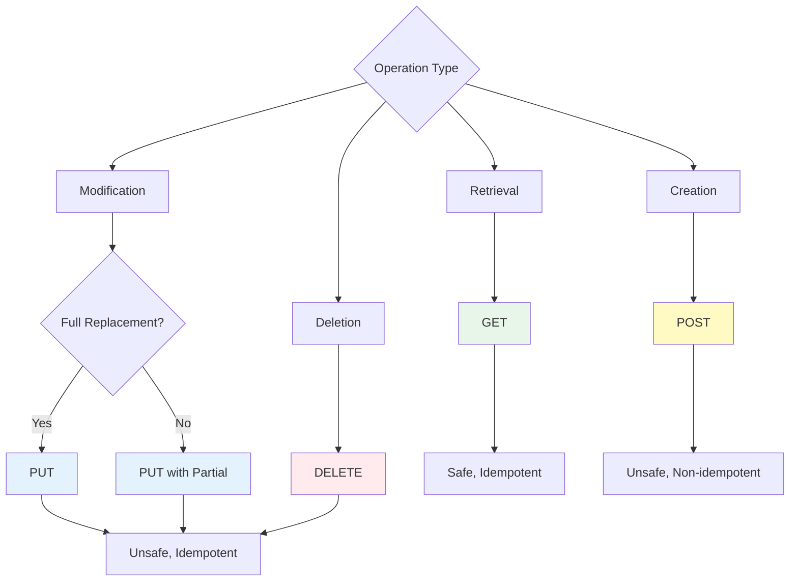

HTTP methods clearly express the intent of an API and help follow RESTful principles.

## HTTP Methods Overview

<CardGroup cols={2}>
  <Card title="GET" icon="magnifying-glass">
    Data retrieval
    
    Safe and idempotent
  </Card>
  <Card title="POST" icon="plus">
    Data creation
    
    Non-idempotent
  </Card>
  <Card title="PUT" icon="pen">
    Data modification
    
    Idempotent
  </Card>
  <Card title="DELETE" icon="trash">
    Data deletion
    
    Idempotent
  </Card>
</CardGroup>

## GET - Retrieval

Used to retrieve data. Does not modify server state.

### Single Resource Retrieval

```typescript
class UserModel extends BaseModelClass {
  @api({ httpMethod: "GET" })
  async get(id: number): Promise<User> {
    const rdb = this.getPuri("r");
    
    const user = await rdb
      .table("users")
      .where("id", id)
      .first();
    
    if (!user) {
      throw new Error("User not found");
    }
    
    return user;
  }
}

// Call: GET /api/user/get?id=1
```

### List Retrieval

```typescript
interface UserListParams {
  page?: number;
  pageSize?: number;
  search?: string;
  role?: UserRole;
  sortBy?: "created_at" | "username";
  sortOrder?: "asc" | "desc";
}

class UserModel extends BaseModelClass {
  @api({ httpMethod: "GET" })
  async list(params: UserListParams): Promise<{
    users: User[];
    total: number;
    page: number;
    pageSize: number;
  }> {
    const rdb = this.getPuri("r");
    
    // Set defaults
    const page = params.page || 1;
    const pageSize = params.pageSize || 20;
    const sortBy = params.sortBy || "created_at";
    const sortOrder = params.sortOrder || "desc";
    
    // Build query
    let query = rdb.table("users");
    
    // Search conditions
    if (params.search) {
      query = query.where((qb) => {
        qb.where("username", "like", `%${params.search}%`)
          .orWhere("email", "like", `%${params.search}%`);
      });
    }
    
    // Role filter
    if (params.role) {
      query = query.where("role", params.role);
    }
    
    // Sorting
    query = query.orderBy(sortBy, sortOrder);
    
    // Pagination
    const users = await query
      .limit(pageSize)
      .offset((page - 1) * pageSize)
      .select("*");
    
    // Total count
    const [{ count }] = await rdb
      .table("users")
      .count({ count: "*" });
    
    return {
      users,
      total: count,
      page,
      pageSize,
    };
  }
}

// Call: GET /api/user/list?page=1&pageSize=20&search=john&role=admin&sortBy=username&sortOrder=asc
```

### Retrieving Related Data

```typescript
class UserModel extends BaseModelClass {
  @api({ httpMethod: "GET" })
  async getWithProfile(id: number): Promise<{
    user: User;
    profile: Profile | null;
    posts: Post[];
  }> {
    const rdb = this.getPuri("r");
    
    // Get User
    const user = await rdb
      .table("users")
      .where("id", id)
      .first();
    
    if (!user) {
      throw new Error("User not found");
    }
    
    // Get Profile (1:1)
    const profile = await rdb
      .table("profiles")
      .where("user_id", id)
      .first();
    
    // Get Posts (1:N)
    const posts = await rdb
      .table("posts")
      .where("user_id", id)
      .orderBy("created_at", "desc")
      .select("*");
    
    return {
      user,
      profile: profile || null,
      posts,
    };
  }
}
```

<Info>
**GET Method Characteristics**:
- Safe: Does not modify server state
- Idempotent: Same request multiple times yields same result
- Cacheable: Can be cached by browser/proxy
- Parameters are passed via URL query string
</Info>

## POST - Creation

Used to create new resources.

### Simple Creation

```typescript
interface CreateUserParams {
  email: string;
  username: string;
  password: string;
  role: UserRole;
}

class UserModel extends BaseModelClass {
  @api({ httpMethod: "POST" })
  @transactional()
  async create(params: CreateUserParams): Promise<{
    userId: number;
  }> {
    const wdb = this.getPuri("w");
    
    // Check duplicates
    const existing = await wdb
      .table("users")
      .where("email", params.email)
      .first();
    
    if (existing) {
      throw new Error("Email already exists");
    }
    
    // Create User
    const [user] = await wdb
      .table("users")
      .insert({
        email: params.email,
        username: params.username,
        password: params.password, // Should be hashed in practice
        role: params.role,
      })
      .returning({ id: "id" });
    
    return { userId: user.id };
  }
}

// Call: POST /api/user/create
// Body: { "email": "...", "username": "...", "password": "...", "role": "normal" }
```

### Complex Creation (With Related Data)

```typescript
interface RegisterParams {
  email: string;
  username: string;
  password: string;
  profile: {
    bio: string;
    avatarUrl?: string;
  };
}

class UserModel extends BaseModelClass {
  @api({ httpMethod: "POST" })
  @transactional()
  async register(params: RegisterParams): Promise<{
    userId: number;
    profileId: number;
  }> {
    const wdb = this.getPuri("w");
    
    // Create User
    const userRef = wdb.ubRegister("users", {
      email: params.email,
      username: params.username,
      password: params.password,
      role: "normal",
    });
    
    // Create Profile
    wdb.ubRegister("profiles", {
      user_id: userRef,
      bio: params.profile.bio,
      avatar_url: params.profile.avatarUrl || null,
    });
    
    // Save
    const [userId] = await wdb.ubUpsert("users");
    const [profileId] = await wdb.ubUpsert("profiles");
    
    return { userId, profileId };
  }
}
```

### Batch Creation

```typescript
class UserModel extends BaseModelClass {
  @api({ httpMethod: "POST" })
  @transactional()
  async createBatch(users: CreateUserParams[]): Promise<{
    userIds: number[];
    count: number;
  }> {
    const wdb = this.getPuri("w");
    
    // Register all Users
    users.forEach((user) => {
      wdb.ubRegister("users", {
        email: user.email,
        username: user.username,
        password: user.password,
        role: user.role,
      });
    });
    
    // Batch save
    const userIds = await wdb.ubUpsert("users");
    
    return {
      userIds,
      count: userIds.length,
    };
  }
}

// Call: POST /api/user/createBatch
// Body: [
//   { "email": "user1@test.com", "username": "user1", ... },
//   { "email": "user2@test.com", "username": "user2", ... }
// ]
```

<Info>
**POST Method Characteristics**:
- Unsafe: Modifies server state
- Non-idempotent: Same request multiple times may create duplicate resources
- Not cacheable
- Parameters are passed via Body
- Typically returns the ID of the created resource
</Info>

## PUT - Modification

Used to modify existing resources.

### Full Update

```typescript
interface UpdateUserParams {
  email: string;
  username: string;
  role: UserRole;
  bio: string | null;
}

class UserModel extends BaseModelClass {
  @api({ httpMethod: "PUT" })
  @transactional()
  async update(
    id: number,
    params: UpdateUserParams
  ): Promise<void> {
    const wdb = this.getPuri("w");
    
    // Verify User exists
    const user = await wdb
      .table("users")
      .where("id", id)
      .first();
    
    if (!user) {
      throw new Error("User not found");
    }
    
    // Update all fields
    await wdb
      .table("users")
      .where("id", id)
      .update({
        email: params.email,
        username: params.username,
        role: params.role,
        bio: params.bio,
      });
  }
}

// Call: PUT /api/user/update?id=1
// Body: { "email": "...", "username": "...", "role": "admin", "bio": "..." }
```

### Partial Update (PATCH Style)

```typescript
class UserModel extends BaseModelClass {
  @api({ httpMethod: "PUT" })
  @transactional()
  async updatePartial(
    id: number,
    params: Partial<UpdateUserParams>
  ): Promise<void> {
    const wdb = this.getPuri("w");
    
    // Verify User exists
    const user = await wdb
      .table("users")
      .where("id", id)
      .first();
    
    if (!user) {
      throw new Error("User not found");
    }
    
    // Update only provided fields
    const updateData: any = {};
    
    if (params.email !== undefined) updateData.email = params.email;
    if (params.username !== undefined) updateData.username = params.username;
    if (params.role !== undefined) updateData.role = params.role;
    if (params.bio !== undefined) updateData.bio = params.bio;
    
    if (Object.keys(updateData).length > 0) {
      await wdb
        .table("users")
        .where("id", id)
        .update(updateData);
    }
  }
}

// Call: PUT /api/user/updatePartial?id=1
// Body: { "bio": "Updated bio" }  // Other fields remain unchanged
```

### Status Change

```typescript
class OrderModel extends BaseModelClass {
  @api({ httpMethod: "PUT" })
  @transactional()
  async updateStatus(
    orderId: number,
    status: "pending" | "paid" | "shipped" | "delivered" | "cancelled"
  ): Promise<void> {
    const wdb = this.getPuri("w");
    
    const order = await wdb
      .table("orders")
      .where("id", orderId)
      .first();
    
    if (!order) {
      throw new Error("Order not found");
    }
    
    // Validate status transition
    if (!this.isValidStatusTransition(order.status, status)) {
      throw new Error(`Cannot change status from ${order.status} to ${status}`);
    }
    
    await wdb
      .table("orders")
      .where("id", orderId)
      .update({ status });
  }
  
  private isValidStatusTransition(
    from: string,
    to: string
  ): boolean {
    const transitions: Record<string, string[]> = {
      pending: ["paid", "cancelled"],
      paid: ["shipped", "cancelled"],
      shipped: ["delivered"],
      delivered: [],
      cancelled: [],
    };
    
    return transitions[from]?.includes(to) || false;
  }
}
```

<Info>
**PUT Method Characteristics**:
- Unsafe: Modifies server state
- Idempotent: Same request multiple times yields same result
- Typically replaces the entire resource
- Parameters are passed via Body
- Returns empty response or updated resource on success
</Info>

## DELETE - Deletion

Used to delete resources.

### Single Deletion

```typescript
class UserModel extends BaseModelClass {
  @api({ httpMethod: "DELETE" })
  @transactional()
  async remove(id: number): Promise<void> {
    const wdb = this.getPuri("w");
    
    // Verify User exists
    const user = await wdb
      .table("users")
      .where("id", id)
      .first();
    
    if (!user) {
      throw new Error("User not found");
    }
    
    // Delete
    await wdb
      .table("users")
      .where("id", id)
      .delete();
  }
}

// Call: DELETE /api/user/remove?id=1
```

### Soft Delete

```typescript
class UserModel extends BaseModelClass {
  @api({ httpMethod: "DELETE" })
  @transactional()
  async softDelete(id: number): Promise<void> {
    const wdb = this.getPuri("w");
    
    const user = await wdb
      .table("users")
      .where("id", id)
      .whereNull("deleted_at")
      .first();
    
    if (!user) {
      throw new Error("User not found");
    }
    
    // Set deleted_at (no actual deletion)
    await wdb
      .table("users")
      .where("id", id)
      .update({
        deleted_at: new Date(),
      });
  }
  
  // Restore soft deleted
  @api({ httpMethod: "PUT" })
  @transactional()
  async restore(id: number): Promise<void> {
    const wdb = this.getPuri("w");
    
    const user = await wdb
      .table("users")
      .where("id", id)
      .whereNotNull("deleted_at")
      .first();
    
    if (!user) {
      throw new Error("User not found or not deleted");
    }
    
    await wdb
      .table("users")
      .where("id", id)
      .update({
        deleted_at: null,
      });
  }
}
```

### Delete With Related Data

```typescript
class UserModel extends BaseModelClass {
  @api({ httpMethod: "DELETE" })
  @transactional()
  async removeWithRelations(id: number): Promise<void> {
    const wdb = this.getPuri("w");
    
    const user = await wdb
      .table("users")
      .where("id", id)
      .first();
    
    if (!user) {
      throw new Error("User not found");
    }
    
    // 1. Delete Profile
    await wdb
      .table("profiles")
      .where("user_id", id)
      .delete();
    
    // 2. Delete Posts
    await wdb
      .table("posts")
      .where("user_id", id)
      .delete();
    
    // 3. Delete User
    await wdb
      .table("users")
      .where("id", id)
      .delete();
  }
}
```

### Batch Deletion

```typescript
class UserModel extends BaseModelClass {
  @api({ httpMethod: "DELETE" })
  @transactional()
  async removeBatch(ids: number[]): Promise<{
    deletedCount: number;
  }> {
    const wdb = this.getPuri("w");
    
    const deletedCount = await wdb
      .table("users")
      .whereIn("id", ids)
      .delete();
    
    return { deletedCount };
  }
}

// Call: DELETE /api/user/removeBatch
// Body: { "ids": [1, 2, 3] }
```

<Info>
**DELETE Method Characteristics**:
- Unsafe: Modifies server state
- Idempotent: Deleting an already deleted resource yields same result
- Generally returns empty response on success (204 No Content)
- Consider soft delete (using deleted_at column)
</Info>

## Method Selection Guide



### Selection Criteria

| Operation | Method | Example |
|-----------|--------|---------|
| Single retrieval | GET | `/api/user/get?id=1` |
| List retrieval | GET | `/api/user/list?page=1` |
| New creation | POST | `/api/user/create` |
| Full update | PUT | `/api/user/update?id=1` |
| Partial update | PUT | `/api/user/updatePartial?id=1` |
| Deletion | DELETE | `/api/user/remove?id=1` |

## RESTful Principles

### Good Examples

```typescript
class UserModel extends BaseModelClass {
  // ✅ GET: Retrieval
  @api({ httpMethod: "GET" })
  async list(): Promise<User[]> { /* ... */ }
  
  // ✅ POST: Creation
  @api({ httpMethod: "POST" })
  async create(params: CreateUserParams): Promise<{ userId: number }> { /* ... */ }
  
  // ✅ PUT: Modification
  @api({ httpMethod: "PUT" })
  async update(id: number, params: UpdateUserParams): Promise<void> { /* ... */ }
  
  // ✅ DELETE: Deletion
  @api({ httpMethod: "DELETE" })
  async remove(id: number): Promise<void> { /* ... */ }
}
```

### Bad Examples

```typescript
class UserModel extends BaseModelClass {
  // ❌ Using GET to modify data
  @api({ httpMethod: "GET" })
  async deleteUser(id: number): Promise<void> {
    // GET should be safe (no state change)
  }
  
  // ❌ Using POST for retrieval
  @api({ httpMethod: "POST" })
  async getUser(id: number): Promise<User> {
    // POST is for creation
  }
  
  // ❌ Using DELETE for modification
  @api({ httpMethod: "DELETE" })
  async updateUser(id: number, params: any): Promise<void> {
    // DELETE is for deletion
  }
}
```

## Next Steps

<CardGroup cols={2}>
  <Card title="Parameters" icon="sliders" href="/api-development/creating-apis/parameters">
    Type definitions and validation
  </Card>
  <Card title="Return Types" icon="arrow-turn-down-left" href="/api-development/creating-apis/return-types">
    Defining response types
  </Card>
  <Card title="@api Decorator" icon="at" href="/api-development/creating-apis/api-decorator">
    Basic usage
  </Card>
  <Card title="Error Handling" icon="triangle-exclamation" href="/api-development/error-handling">
    API error handling
  </Card>
</CardGroup>
