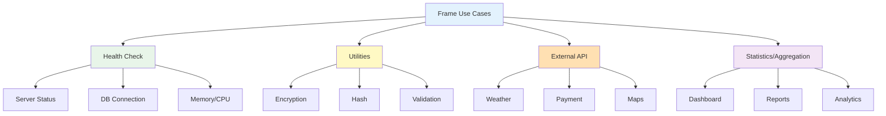

Learn practical use cases utilizing Frame.

## Use Cases Overview

<CardGroup cols={2}>
  <Card title="Health Check" icon="heart-pulse">
    Server status monitoring
    
    DB, memory, uptime
  </Card>
  <Card title="Utilities" icon="wrench">
    Hash, encryption, UUID
    
    String processing
  </Card>
  <Card title="External API" icon="cloud">
    Weather, maps, payments
    
    API proxy
  </Card>
  <Card title="Statistics/Aggregation" icon="chart-line">
    Dashboard data
    
    Multi-table aggregation
  </Card>
</CardGroup>

## 1. Health Check & Monitoring

### Basic Health Check

```typescript
// health.frame.ts
import { BaseFrameClass, api } from "sonamu";

class HealthFrame extends BaseFrameClass {
  frameName = "Health";
  
  @api({ httpMethod: "GET" })
  async check(): Promise<{
    status: "ok" | "error";
    timestamp: Date;
    uptime: number;
  }> {
    return {
      status: "ok",
      timestamp: new Date(),
      uptime: process.uptime(),
    };
  }
  
  @api({ httpMethod: "GET" })
  async ping(): Promise<{ pong: string }> {
    return { pong: "pong" };
  }
}

export const HealthFrameInstance = new HealthFrame();
```

**Usage**:
```bash
# Kubernetes liveness probe
curl http://api.example.com/api/health/ping

# Monitoring system
curl http://api.example.com/api/health/check
```

### Detailed Health Check

```typescript
interface HealthDetailResponse {
  status: "healthy" | "degraded" | "unhealthy";
  timestamp: Date;
  uptime: number;
  system: {
    memory: {
      total: number;
      used: number;
      free: number;
      percentage: number;
    };
    cpu: {
      model: string;
      cores: number;
      loadAverage: number[];
    };
  };
  services: {
    database: {
      status: "connected" | "disconnected";
      responseTime?: number;
    };
    redis?: {
      status: "connected" | "disconnected";
      responseTime?: number;
    };
  };
}

class HealthFrame extends BaseFrameClass {
  frameName = "Health";
  
  @api({ httpMethod: "GET" })
  async detail(): Promise<HealthDetailResponse> {
    const startTime = Date.now();
    
    // DB connection check
    let dbStatus: "connected" | "disconnected" = "disconnected";
    let dbResponseTime: number | undefined;
    
    try {
      const rdb = this.getPuri("r");
      const dbStart = Date.now();
      await rdb.raw("SELECT 1");
      dbResponseTime = Date.now() - dbStart;
      dbStatus = "connected";
    } catch (error) {
      console.error("Database health check failed:", error);
    }
    
    // Memory info
    const memoryUsage = process.memoryUsage();
    const totalMemory = memoryUsage.heapTotal;
    const usedMemory = memoryUsage.heapUsed;
    const freeMemory = totalMemory - usedMemory;
    
    // CPU info
    const os = require("os");
    const cpus = os.cpus();
    
    // Determine overall status
    let overallStatus: "healthy" | "degraded" | "unhealthy";
    
    if (dbStatus === "disconnected") {
      overallStatus = "unhealthy";
    } else if ((usedMemory / totalMemory) > 0.9) {
      overallStatus = "degraded";
    } else {
      overallStatus = "healthy";
    }
    
    return {
      status: overallStatus,
      timestamp: new Date(),
      uptime: process.uptime(),
      system: {
        memory: {
          total: totalMemory,
          used: usedMemory,
          free: freeMemory,
          percentage: (usedMemory / totalMemory) * 100,
        },
        cpu: {
          model: cpus[0]?.model || "unknown",
          cores: cpus.length,
          loadAverage: os.loadavg(),
        },
      },
      services: {
        database: {
          status: dbStatus,
          responseTime: dbResponseTime,
        },
      },
    };
  }
}
```

## 2. Encryption & Security Utilities

### Hash & Encryption

```typescript
// crypto.frame.ts
import { BaseFrameClass, api } from "sonamu";
import crypto from "crypto";
import bcrypt from "bcrypt";

interface HashParams {
  text: string;
  algorithm: "md5" | "sha256" | "sha512" | "bcrypt";
  saltRounds?: number; // for bcrypt
}

interface EncryptParams {
  plaintext: string;
  secret: string;
}

interface DecryptParams {
  ciphertext: string;
  secret: string;
}

class CryptoFrame extends BaseFrameClass {
  frameName = "Crypto";
  
  // Hash generation
  @api({ httpMethod: "POST" })
  async hash(params: HashParams): Promise<{ hash: string }> {
    if (params.algorithm === "bcrypt") {
      const saltRounds = params.saltRounds || 10;
      const hash = await bcrypt.hash(params.text, saltRounds);
      return { hash };
    }
    
    const hash = crypto
      .createHash(params.algorithm)
      .update(params.text)
      .digest("hex");
    
    return { hash };
  }
  
  // bcrypt verification
  @api({ httpMethod: "POST" })
  async verifyHash(params: {
    text: string;
    hash: string;
  }): Promise<{ valid: boolean }> {
    const valid = await bcrypt.compare(params.text, params.hash);
    return { valid };
  }
  
  // AES encryption
  @api({ httpMethod: "POST" })
  async encrypt(params: EncryptParams): Promise<{
    ciphertext: string;
    iv: string;
  }> {
    const algorithm = "aes-256-cbc";
    const key = crypto.scryptSync(params.secret, "salt", 32);
    const iv = crypto.randomBytes(16);
    
    const cipher = crypto.createCipheriv(algorithm, key, iv);
    
    let encrypted = cipher.update(params.plaintext, "utf8", "hex");
    encrypted += cipher.final("hex");
    
    return {
      ciphertext: encrypted,
      iv: iv.toString("hex"),
    };
  }
  
  // AES decryption
  @api({ httpMethod: "POST" })
  async decrypt(params: DecryptParams & {
    iv: string;
  }): Promise<{ plaintext: string }> {
    const algorithm = "aes-256-cbc";
    const key = crypto.scryptSync(params.secret, "salt", 32);
    const iv = Buffer.from(params.iv, "hex");
    
    const decipher = crypto.createDecipheriv(algorithm, key, iv);
    
    let decrypted = decipher.update(params.ciphertext, "hex", "utf8");
    decrypted += decipher.final("utf8");
    
    return { plaintext: decrypted };
  }
  
  // JWT token verification (simple version)
  @api({ httpMethod: "POST" })
  async verifyToken(params: {
    token: string;
    secret: string;
  }): Promise<{
    valid: boolean;
    payload?: any;
    error?: string;
  }> {
    try {
      const jwt = require("jsonwebtoken");
      const payload = jwt.verify(params.token, params.secret);
      
      return {
        valid: true,
        payload,
      };
    } catch (error) {
      return {
        valid: false,
        error: error instanceof Error ? error.message : "Unknown error",
      };
    }
  }
  
  // UUID generation
  @api({ httpMethod: "POST" })
  async uuid(): Promise<{ uuid: string }> {
    return { uuid: crypto.randomUUID() };
  }
  
  // Random string generation
  @api({ httpMethod: "POST" })
  async randomString(params: {
    length: number;
    charset?: "alphanumeric" | "hex" | "base64";
  }): Promise<{ random: string }> {
    const length = Math.min(params.length, 1024);
    const charset = params.charset || "alphanumeric";
    
    let random: string;
    
    switch (charset) {
      case "hex":
        random = crypto.randomBytes(Math.ceil(length / 2))
          .toString("hex")
          .slice(0, length);
        break;
      case "base64":
        random = crypto.randomBytes(Math.ceil(length * 3 / 4))
          .toString("base64")
          .slice(0, length);
        break;
      case "alphanumeric":
      default:
        const chars = "ABCDEFGHIJKLMNOPQRSTUVWXYZabcdefghijklmnopqrstuvwxyz0123456789";
        random = Array.from(crypto.randomBytes(length))
          .map((byte) => chars[byte % chars.length])
          .join("");
        break;
    }
    
    return { random };
  }
}

export const CryptoFrameInstance = new CryptoFrame();
```

## 3. External API Proxy

### Weather API

```typescript
// weather.frame.ts
import { BaseFrameClass, api } from "sonamu";
import axios from "axios";

class WeatherFrame extends BaseFrameClass {
  frameName = "Weather";
  
  private apiKey = process.env.OPENWEATHER_API_KEY || "";
  private baseUrl = "https://api.openweathermap.org/data/2.5";
  
  @api({ httpMethod: "GET" })
  async current(params: {
    city: string;
    country?: string;
    units?: "metric" | "imperial";
  }): Promise<{
    city: string;
    country: string;
    temperature: number;
    feelsLike: number;
    condition: string;
    description: string;
    humidity: number;
    windSpeed: number;
    pressure: number;
    visibility: number;
    timestamp: Date;
  }> {
    const query = params.country
      ? `${params.city},${params.country}`
      : params.city;
    
    try {
      const response = await axios.get(`${this.baseUrl}/weather`, {
        params: {
          q: query,
          appid: this.apiKey,
          units: params.units || "metric",
        },
        timeout: 5000,
      });
      
      const data = response.data;
      
      return {
        city: data.name,
        country: data.sys.country,
        temperature: data.main.temp,
        feelsLike: data.main.feels_like,
        condition: data.weather[0].main,
        description: data.weather[0].description,
        humidity: data.main.humidity,
        windSpeed: data.wind.speed,
        pressure: data.main.pressure,
        visibility: data.visibility,
        timestamp: new Date(),
      };
    } catch (error) {
      if (axios.isAxiosError(error)) {
        throw new Error(`Weather API error: ${error.message}`);
      }
      throw new Error("Failed to fetch weather data");
    }
  }
  
  @api({ httpMethod: "GET" })
  async forecast(params: {
    city: string;
    country?: string;
    days?: number;
  }): Promise<{
    city: string;
    forecast: Array<{
      date: string;
      temperature: {
        min: number;
        max: number;
        avg: number;
      };
      condition: string;
      humidity: number;
      windSpeed: number;
    }>;
  }> {
    const query = params.country
      ? `${params.city},${params.country}`
      : params.city;
    
    const days = Math.min(params.days || 5, 7);
    
    try {
      const response = await axios.get(`${this.baseUrl}/forecast`, {
        params: {
          q: query,
          appid: this.apiKey,
          units: "metric",
          cnt: days * 8, // 3-hour interval data
        },
        timeout: 5000,
      });
      
      const data = response.data;
      
      // Group by day
      const dailyData = new Map<string, any[]>();
      
      data.list.forEach((item: any) => {
        const date = item.dt_txt.split(" ")[0];
        if (!dailyData.has(date)) {
          dailyData.set(date, []);
        }
        dailyData.get(date)!.push(item);
      });
      
      const forecast = Array.from(dailyData.entries()).map(([date, items]) => {
        const temps = items.map((i) => i.main.temp);
        const conditions = items.map((i) => i.weather[0].main);
        
        return {
          date,
          temperature: {
            min: Math.min(...temps),
            max: Math.max(...temps),
            avg: temps.reduce((a, b) => a + b, 0) / temps.length,
          },
          condition: conditions[0], // Use first condition
          humidity: items[0].main.humidity,
          windSpeed: items[0].wind.speed,
        };
      });
      
      return {
        city: data.city.name,
        forecast,
      };
    } catch (error) {
      throw new Error("Failed to fetch forecast data");
    }
  }
}

export const WeatherFrameInstance = new WeatherFrame();
```

### Payment Gateway Proxy

```typescript
// payment.frame.ts
import { BaseFrameClass, api } from "sonamu";
import axios from "axios";

class PaymentFrame extends BaseFrameClass {
  frameName = "Payment";
  
  private stripeApiKey = process.env.STRIPE_SECRET_KEY || "";
  private stripeBaseUrl = "https://api.stripe.com/v1";
  
  @api({ httpMethod: "POST" })
  async createPaymentIntent(params: {
    amount: number; // in cents
    currency: string;
    customerId?: string;
  }): Promise<{
    clientSecret: string;
    paymentIntentId: string;
  }> {
    try {
      const response = await axios.post(
        `${this.stripeBaseUrl}/payment_intents`,
        new URLSearchParams({
          amount: params.amount.toString(),
          currency: params.currency,
          ...(params.customerId && { customer: params.customerId }),
        }),
        {
          headers: {
            Authorization: `Bearer ${this.stripeApiKey}`,
            "Content-Type": "application/x-www-form-urlencoded",
          },
        }
      );
      
      return {
        clientSecret: response.data.client_secret,
        paymentIntentId: response.data.id,
      };
    } catch (error) {
      throw new Error("Failed to create payment intent");
    }
  }
  
  @api({ httpMethod: "POST" })
  async verifyPayment(params: {
    paymentIntentId: string;
  }): Promise<{
    status: string;
    amount: number;
    currency: string;
    paid: boolean;
  }> {
    try {
      const response = await axios.get(
        `${this.stripeBaseUrl}/payment_intents/${params.paymentIntentId}`,
        {
          headers: {
            Authorization: `Bearer ${this.stripeApiKey}`,
          },
        }
      );
      
      return {
        status: response.data.status,
        amount: response.data.amount,
        currency: response.data.currency,
        paid: response.data.status === "succeeded",
      };
    } catch (error) {
      throw new Error("Failed to verify payment");
    }
  }
}

export const PaymentFrameInstance = new PaymentFrame();
```

## 4. Statistics & Dashboard

### Admin Dashboard

```typescript
// admin-stats.frame.ts
import { BaseFrameClass, api } from "sonamu";

interface DashboardStats {
  users: {
    total: number;
    active: number;
    newToday: number;
    newThisWeek: number;
    newThisMonth: number;
    byRole: {
      admin: number;
      manager: number;
      normal: number;
    };
  };
  content: {
    totalPosts: number;
    totalComments: number;
    postsToday: number;
    commentsToday: number;
  };
  engagement: {
    averagePostsPerUser: number;
    averageCommentsPerPost: number;
    mostActiveUsers: Array<{
      userId: number;
      username: string;
      postCount: number;
    }>;
  };
  system: {
    databaseSize: number;
    cacheHitRate: number;
    averageResponseTime: number;
  };
}

class AdminStatsFrame extends BaseFrameClass {
  frameName = "AdminStats";
  
  @api({ httpMethod: "GET" })
  async dashboard(): Promise<DashboardStats> {
    const rdb = this.getPuri("r");
    
    // Date calculations
    const today = new Date();
    today.setHours(0, 0, 0, 0);
    
    const weekAgo = new Date(today);
    weekAgo.setDate(weekAgo.getDate() - 7);
    
    const monthAgo = new Date(today);
    monthAgo.setMonth(monthAgo.getMonth() - 1);
    
    // User statistics
    const [{ totalUsers }] = await rdb
      .table("users")
      .count({ totalUsers: "*" });
    
    const [{ activeUsers }] = await rdb
      .table("users")
      .where("is_active", true)
      .count({ activeUsers: "*" });
    
    const [{ newToday }] = await rdb
      .table("users")
      .where("created_at", ">=", today)
      .count({ newToday: "*" });
    
    const [{ newThisWeek }] = await rdb
      .table("users")
      .where("created_at", ">=", weekAgo)
      .count({ newThisWeek: "*" });
    
    const [{ newThisMonth }] = await rdb
      .table("users")
      .where("created_at", ">=", monthAgo)
      .count({ newThisMonth: "*" });
    
    // Statistics by role
    const roleStats = await rdb
      .table("users")
      .select({ role: "role" })
      .count({ count: "*" })
      .groupBy("role");
    
    const byRole = {
      admin: roleStats.find((s) => s.role === "admin")?.count || 0,
      manager: roleStats.find((s) => s.role === "manager")?.count || 0,
      normal: roleStats.find((s) => s.role === "normal")?.count || 0,
    };
    
    // Content statistics
    const [{ totalPosts }] = await rdb
      .table("posts")
      .count({ totalPosts: "*" });
    
    const [{ totalComments }] = await rdb
      .table("comments")
      .count({ totalComments: "*" });
    
    const [{ postsToday }] = await rdb
      .table("posts")
      .where("created_at", ">=", today)
      .count({ postsToday: "*" });
    
    const [{ commentsToday }] = await rdb
      .table("comments")
      .where("created_at", ">=", today)
      .count({ commentsToday: "*" });
    
    // Engagement statistics
    const averagePostsPerUser = totalUsers > 0
      ? totalPosts / totalUsers
      : 0;
    
    const averageCommentsPerPost = totalPosts > 0
      ? totalComments / totalPosts
      : 0;
    
    // Most active users
    const mostActiveUsers = await rdb
      .table("posts")
      .select({
        userId: "user_id",
        username: "users.username",
      })
      .count({ postCount: "*" })
      .join("users", "posts.user_id", "users.id")
      .groupBy("posts.user_id", "users.username")
      .orderBy("postCount", "desc")
      .limit(5);
    
    return {
      users: {
        total: totalUsers,
        active: activeUsers,
        newToday,
        newThisWeek,
        newThisMonth,
        byRole,
      },
      content: {
        totalPosts,
        totalComments,
        postsToday,
        commentsToday,
      },
      engagement: {
        averagePostsPerUser,
        averageCommentsPerPost,
        mostActiveUsers,
      },
      system: {
        databaseSize: 0, // TODO: implement
        cacheHitRate: 0, // TODO: implement
        averageResponseTime: 0, // TODO: implement
      },
    };
  }
}

export const AdminStatsFrameInstance = new AdminStatsFrame();
```

## 5. Validation & Validity Check

```typescript
// validation.frame.ts
import { BaseFrameClass, api } from "sonamu";
import dns from "dns/promises";

class ValidationFrame extends BaseFrameClass {
  frameName = "Validation";
  
  // Email validation
  @api({ httpMethod: "POST" })
  async validateEmail(params: {
    email: string;
    checkDns?: boolean;
  }): Promise<{
    valid: boolean;
    format: boolean;
    domain: boolean;
    message?: string;
  }> {
    // Format validation
    const emailRegex = /^[^\s@]+@[^\s@]+\.[^\s@]+$/;
    const formatValid = emailRegex.test(params.email);
    
    if (!formatValid) {
      return {
        valid: false,
        format: false,
        domain: false,
        message: "Invalid email format",
      };
    }
    
    // Domain validation
    let domainValid = true;
    const domain = params.email.split("@")[1];
    
    if (params.checkDns) {
      try {
        await dns.resolveMx(domain);
      } catch (error) {
        domainValid = false;
      }
    }
    
    return {
      valid: formatValid && domainValid,
      format: formatValid,
      domain: domainValid,
      message: !domainValid ? "Domain does not exist or has no MX records" : undefined,
    };
  }
  
  // URL validation
  @api({ httpMethod: "POST" })
  async validateUrl(params: {
    url: string;
    checkReachable?: boolean;
  }): Promise<{
    valid: boolean;
    format: boolean;
    reachable?: boolean;
    statusCode?: number;
    message?: string;
  }> {
    // Format validation
    let urlObj: URL;
    try {
      urlObj = new URL(params.url);
    } catch (error) {
      return {
        valid: false,
        format: false,
        message: "Invalid URL format",
      };
    }
    
    // Only allow HTTP/HTTPS
    if (!["http:", "https:"].includes(urlObj.protocol)) {
      return {
        valid: false,
        format: false,
        message: "Only HTTP/HTTPS protocols are supported",
      };
    }
    
    // Check reachability
    let reachable: boolean | undefined;
    let statusCode: number | undefined;
    
    if (params.checkReachable) {
      try {
        const axios = require("axios");
        const response = await axios.head(params.url, {
          timeout: 5000,
          validateStatus: () => true, // Allow all status codes
        });
        
        statusCode = response.status;
        reachable = statusCode >= 200 && statusCode < 400;
      } catch (error) {
        reachable = false;
      }
    }
    
    return {
      valid: true && (reachable !== false),
      format: true,
      reachable,
      statusCode,
    };
  }
  
  // Phone number validation (Korea)
  @api({ httpMethod: "POST" })
  async validatePhoneKR(params: {
    phone: string;
  }): Promise<{
    valid: boolean;
    formatted: string;
    type: "mobile" | "landline" | "unknown";
    message?: string;
  }> {
    // Extract digits only
    const digits = params.phone.replace(/\D/g, "");
    
    // Length check (10-11 digits)
    if (digits.length < 10 || digits.length > 11) {
      return {
        valid: false,
        formatted: params.phone,
        type: "unknown",
        message: "Phone number must be 10-11 digits",
      };
    }
    
    // Determine type
    let type: "mobile" | "landline" | "unknown" = "unknown";
    let formatted: string;
    
    if (digits.startsWith("010") && digits.length === 11) {
      // Mobile
      type = "mobile";
      formatted = `${digits.slice(0, 3)}-${digits.slice(3, 7)}-${digits.slice(7)}`;
    } else if (digits.length === 10) {
      // Area code
      type = "landline";
      formatted = `${digits.slice(0, 2)}-${digits.slice(2, 6)}-${digits.slice(6)}`;
    } else {
      formatted = params.phone;
    }
    
    return {
      valid: type !== "unknown",
      formatted,
      type,
    };
  }
}

export const ValidationFrameInstance = new ValidationFrame();
```

## Usage Patterns Summary



## Next Steps

<CardGroup cols={2}>
  <Card title="Creating Frames" icon="plus" href="/api-development/frames/creating-frames">
    BaseFrameClass usage
  </Card>
  <Card title="What are Frames?" icon="circle-question" href="/api-development/frames/what-are-frames">
    Understanding Frame concept
  </Card>
  <Card title="@api Decorator" icon="at" href="/api-development/creating-apis/api-decorator">
    API basic usage
  </Card>
  <Card title="Model" icon="database" href="/core-concepts/entities">
    Entity-based API
  </Card>
</CardGroup>
