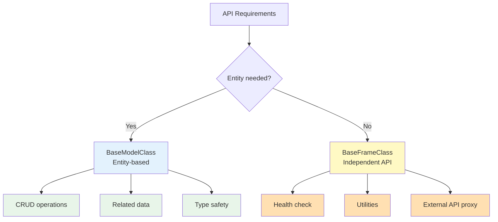

Frame is used to create independent API endpoints that are not connected to database Entities.

## Frame Overview

<CardGroup cols={2}>
  <Card title="No Entity Required" icon="circle-xmark">
    Works without DB tables Free API implementation
  </Card>
  <Card title="Simple Structure" icon="diagram-project">
    Extend BaseFrameClass Use @api decorator
  </Card>
  <Card title="Various Uses" icon="wand-magic-sparkles">
    Health check, utilities External API proxy
  </Card>
  <Card title="Independent Logic" icon="code">
    Implement business logic only No Entity constraints
  </Card>
</CardGroup>

## Model vs Frame

### Model (BaseModelClass)

```typescript
// Entity-based API
class UserModelClass extends BaseModelClass<
  UserSubsetKey,
  UserSubsetMapping,
  typeof userSubsetQueries,
  typeof userLoaderQueries
> {
  constructor() {
    super("User", userSubsetQueries, userLoaderQueries); // ← Connected to Entity
  }

  @api({ httpMethod: "GET" })
  async list(): Promise<User[]> {
    // Query users table
    const rdb = this.getPuri("r");
    return rdb.table("users").select("*");
  }

  @api({ httpMethod: "POST" })
  async create(params: UserSaveParams): Promise<{ userId: number }> {
    // Insert into users table
    const wdb = this.getPuri("w");
    wdb.ubRegister("users", params);
    const [userId] = await wdb.ubUpsert("users");
    return { userId };
  }
}
```

**Model Characteristics**:

- 1:1 mapping with Entity (DB table)
- CRUD operation focused
- Uses UpsertBuilder, Subset
- Type safety guaranteed

### Frame (BaseFrameClass)

```typescript
// Independent API without Entity
class HealthFrame extends BaseFrameClass {
  frameName = "Health"; // ← Independent of Entity

  @api({ httpMethod: "GET" })
  async check(): Promise<{
    status: "ok" | "error";
    timestamp: Date;
    uptime: number;
  }> {
    // Return server status without DB access
    return {
      status: "ok",
      timestamp: new Date(),
      uptime: process.uptime(),
    };
  }

  @api({ httpMethod: "GET" })
  async ping(): Promise<{ pong: string }> {
    return { pong: "pong" };
  }
}
```

**Frame Characteristics**:

- Independent logic unrelated to Entity
- Utilities, health checks, proxies, etc.
- Flexible API structure
- Simple implementation

## Comparison Table

| Feature           | Model           | Frame              |
| ----------------- | --------------- | ------------------ |
| Entity Connection | ✅ Required     | ❌ Not needed      |
| DB Access         | CRUD focused    | Optional           |
| Use Cases         | Data management | Utilities, proxies |
| Complexity        | High            | Low                |
| UpsertBuilder     | ✅ Uses         | ❌ Not needed      |
| Subset            | ✅ Uses         | ❌ Not needed      |



## When to Use Frame

### ✅ Use Frame When

1. **Health Check API**

   ```typescript
   // GET /api/health/check
   // Only check server status without Entity
   ```

2. **Utility API**

   ```typescript
   // POST /api/utils/hash
   // Simple functions like string hashing
   ```

3. **External API Proxy**

   ```typescript
   // GET /api/weather/current
   // Wrap external weather API as internal API
   ```

4. **Aggregated Statistics**

   ```typescript
   // GET /api/stats/dashboard
   // Aggregate statistics from multiple tables
   ```

5. **Auth/Permission Check**
   ```typescript
   // POST /api/auth/verify-token
   // Only perform JWT token verification
   ```

### ❌ Use Model When

1. **Entity CRUD Operations**

   ```typescript
   // Create/Read/Update/Delete for User, Product, Order, etc.
   ```

2. **Related Data Processing**

   ```typescript
   // User → Profile, Order → OrderItems
   ```

3. **Complex Business Logic**
   ```typescript
   // Order processing, payments involving multiple Entities
   ```

## Structural Differences

### Model Structure

```
api/src/application/
  user/
    ├── user.entity.json       # ← Entity definition
    ├── user.model.ts          # ← Model class
    ├── user.types.ts          # ← Type definitions
    └── subsets/
        └── user-list.subset.json
```

### Frame Structure

```
api/src/frames/
  health/
    └── health.frame.ts        # ← Frame class only
  utils/
    └── utils.frame.ts
```

<Info>Frame only requires the `.frame.ts` file without Entity definition.</Info>

## Simple Examples

### Health Check Frame

```typescript
class HealthFrame extends BaseFrameClass {
  frameName = "Health";

  @api({ httpMethod: "GET" })
  async check(): Promise<{
    status: "ok" | "error";
    timestamp: Date;
    database: "connected" | "disconnected";
  }> {
    // DB connection check
    let dbStatus: "connected" | "disconnected" = "disconnected";

    try {
      const rdb = this.getDB("r");
      await rdb.raw("SELECT 1");
      dbStatus = "connected";
    } catch (error) {
      console.error("Database connection failed:", error);
    }

    return {
      status: dbStatus === "connected" ? "ok" : "error",
      timestamp: new Date(),
      database: dbStatus,
    };
  }

  @api({ httpMethod: "GET" })
  async ping(): Promise<{ message: string }> {
    return { message: "pong" };
  }
}

// Endpoints:
// GET /api/health/check
// GET /api/health/ping
```

### Utility Frame

```typescript
import crypto from "crypto";

class UtilsFrame extends BaseFrameClass {
  frameName = "Utils";

  @api({ httpMethod: "POST" })
  async hash(params: {
    text: string;
    algorithm: "md5" | "sha256" | "sha512";
  }): Promise<{ hash: string }> {
    const hash = crypto.createHash(params.algorithm).update(params.text).digest("hex");

    return { hash };
  }

  @api({ httpMethod: "POST" })
  async uuid(): Promise<{ uuid: string }> {
    return { uuid: crypto.randomUUID() };
  }
}

// Endpoints:
// POST /api/utils/hash
// POST /api/utils/uuid
```

## Pros and Cons

### Pros

<CardGroup cols={2}>
  <Card title="Fast Implementation" icon="rocket">
    No Entity definition needed Simple structure
  </Card>
  <Card title="Flexibility" icon="arrows-turn-to-dots">
    Unrestricted logic Free API design
  </Card>
  <Card title="Independence" icon="shield">
    Independent of DB schema Easy external API integration
  </Card>
  <Card title="Easy Testing" icon="flask">
    Simple logic No mock needed
  </Card>
</CardGroup>

### Cons

<CardGroup cols={2}>
  <Card title="Reduced Type Safety" icon="triangle-exclamation">
    Entity types not used Manual type management
  </Card>
  <Card title="No Auto Generation" icon="circle-xmark">
    No Subset, Types auto-generation Manual writing required
  </Card>
</CardGroup>

## Practical Tips

### 1. Keep Frame Simple

```typescript
// ✅ Good: Simple logic
class HealthFrame extends BaseFrameClass {
  @api({ httpMethod: "GET" })
  async check(): Promise<{ status: string }> {
    return { status: "ok" };
  }
}

// ❌ Bad: Complex business logic
class OrderFrame extends BaseFrameClass {
  @api({ httpMethod: "POST" })
  async process(params: ComplexOrderParams): Promise<OrderResult> {
    // 100 lines of complex logic...
    // This case should use Model
  }
}
```

### 2. Proper Naming

```typescript
// ✅ Good: Clear names
class HealthFrame extends BaseFrameClass {
  frameName = "Health";
}

class UtilsFrame extends BaseFrameClass {
  frameName = "Utils";
}

// ❌ Bad: Vague names
class MiscFrame extends BaseFrameClass {
  frameName = "Misc";
}
```

### 3. Group Related Features

```typescript
// ✅ Good: Related features in one Frame
class CryptoUtilsFrame extends BaseFrameClass {
  frameName = "CryptoUtils";

  @api({ httpMethod: "POST" })
  async hash(params: HashParams): Promise<{ hash: string }> {
    /* ... */
  }

  @api({ httpMethod: "POST" })
  async encrypt(params: EncryptParams): Promise<{ encrypted: string }> {
    /* ... */
  }

  @api({ httpMethod: "POST" })
  async decrypt(params: DecryptParams): Promise<{ decrypted: string }> {
    /* ... */
  }
}
```

## When to Convert to Model?

Consider converting from Frame to Model when:

1. **Frequently querying/modifying DB data**
   - Started as simple queries but now needs CRUD

2. **Type safety becomes important**
   - Complex data structures emerge
   - Need Entity type auto-generation

3. **Need to process related data**
   - Processing relationships between multiple tables
   - JOIN, foreign keys, etc.

4. **Business logic becomes complex**
   - Beyond simple utilities
   - Transaction processing needed

## Next Steps

<CardGroup cols={2}>
  <Card title="Creating Frames" icon="plus" href="/en/api-development/frames/creating-frames">
    BaseFrameClass usage
  </Card>
  <Card title="Use Cases" icon="lightbulb" href="/en/api-development/frames/use-cases">
    Health check, utility examples
  </Card>
  <Card title="@api Decorator" icon="at" href="/en/api-development/creating-apis/api-decorator">
    API basic usage
  </Card>
  <Card title="Model" icon="database" href="/en/core-concepts/entities">
    Entity-based API
  </Card>
</CardGroup>
