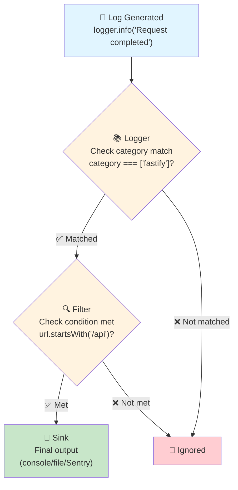
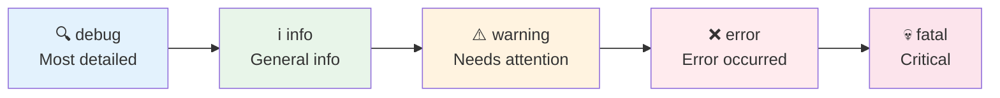

Sonamu uses [LogTape](https://github.com/dahlia/logtape) to provide structured logging. You can configure logging behavior with the `logging` option in `sonamu.config.ts`.

## What is LogTape?

LogTape is a structured logging library for TypeScript. Instead of simple string logs, it records logs as structured data.

### Regular Logging vs Structured Logging

**Regular logging (string):**
```typescript
console.log("User login failed: email=user@example.com, reason=invalid_password");
// → Requires string parsing for analysis
```

**Structured logging (LogTape):**
```typescript
logger.error("User login failed", {
  email: "user@example.com",
  reason: "invalid_password",
});
// → Already structured data, ready for analysis
```

### Benefits of Structured Logging

1. **Easy search/filtering** - Easily find logs matching specific conditions
2. **Analyzable** - Aggregate log data and generate statistics
3. **Type safe** - TypeScript validates log data structure
4. **Flexible output** - Output same log in multiple formats (console, file, external services)

## Core Concepts

### 1. Sink (Output Destination)

Where logs are ultimately recorded.

```typescript
{
  console: getConsoleSink(),        // Terminal output
  file: getFileSink("app.log"),     // File storage
  sentry: sentrySink,                // External service
}
```

**A single log can be recorded to multiple Sinks simultaneously:**
- Console: Real-time monitoring
- File: Permanent storage
- Sentry: Error notifications

### 2. Filter (Filtering Conditions)

Determines which logs to record.

```typescript
{
  "api-only": (record) => record.url.startsWith("/api"),
  "errors": (record) => record.level >= "error",
}
```

**Without Filters, all logs are output, degrading performance and readability.**

### 3. Logger (Logger Configuration)

Connects categories, Sinks, and Filters.

```typescript
{
  category: ["fastify"],           // What category of log?
  sinks: ["console", "file"],      // Where to record?
  filters: ["api-only"],           // What conditions to filter by?
  lowestLevel: "info",             // Starting from what level?
}
```

### Sink-Filter-Logger Relationship



**Example:**
```typescript
// 1. Fastify generates log
logger.info("Request completed", { url: "/api/user" });

// 2. Logger check: Is category ["fastify"]? ✓
// 3. Filter check: Does url start with /api? ✓
// 4. Sink output: Record to console and file
```

## Log Level Selection Guide

Log levels indicate the importance of logs.

### Meaning and Usage of Each Level

**1. debug**
- **Meaning**: Detailed debugging information
- **When to use**: Problem tracking during development
- **Examples**: Function call order, variable values
```typescript
logger.debug("Processing order", { orderId, items });
```

**2. info (default)**
- **Meaning**: General operational information
- **When to use**: Confirming normal operation
- **Examples**: HTTP requests/responses, task completion
```typescript
logger.info("User logged in", { userId });
```

**3. warning**
- **Meaning**: Potential problem warning
- **When to use**: Not an error but needs attention
- **Examples**: Slow responses, retries occurring
```typescript
logger.warn("Slow query detected", { duration: 5000 });
```

**4. error**
- **Meaning**: Recoverable error
- **When to use**: Exception handling, recoverable failures
- **Examples**: Validation failure, API call failure
```typescript
logger.error("Payment failed", { error: "card_declined" });
```

**5. fatal**
- **Meaning**: Critical failure (server shutdown level)
- **When to use**: Unrecoverable serious problems
- **Examples**: DB connection failure, out of memory
```typescript
logger.fatal("Database connection lost", { error });
```

### Recommended Levels by Environment

| Environment | Minimum Level | Reason |
|-------------|---------------|--------|
| Development | `debug` | Need all information |
| Staging | `info` | Check operational info |
| Production | `warning` | Performance consideration |

**Level Hierarchy:**



<Info>
Setting a lower level outputs all higher levels. Example: Setting `lowestLevel: "warning"` outputs warning, error, and fatal.
</Info>

## Why is it Designed This Way?

### 1. Default Values are Safe

Sonamu's default configuration:
```typescript
{
  category: ["fastify"],
  sinks: ["fastify-console"],
  lowestLevel: "info",
  filters: ["fastify-console"],  // /api only, exclude healthcheck
}
```

**Reasons:**
- ✅ Only `/api` paths logged → Excludes unnecessary static file requests
- ✅ `info` level → Not too much, not too little
- ✅ Excludes healthcheck → Excludes repetitive requests from monitoring systems

### 2. Extensible

You can add custom settings on top of default settings:

```typescript
logging: {
  // Keep default settings while
  sinks: {
    errorFile: getFileSink("errors.log"),  // Additional Sink
  },
  loggers: [
    // Additional Logger (default Fastify logger is preserved)
    {
      category: ["app"],
      sinks: ["console"],
      lowestLevel: "debug",
    },
  ],
}
```

### 3. Minimal Performance Impact

Block unnecessary logs early through Filters:

```typescript
// ❌ No Filter: Process all logs → Slow
logger → sink (output all logs)

// ✅ With Filter: Process only needed logs → Fast
logger → filter (block unnecessary logs) → sink (output only needed logs)
```

## Default Configuration

If you omit the `logging` option, default settings are automatically applied.

```typescript
import { defineConfig } from "sonamu";

export default defineConfig({
  // Use defaults when logging is omitted
  server: {
    // ...
  },
});
```

**Default behavior:**
- Logs Fastify requests/responses to console
- Only logs `/api/*` paths (excluding healthcheck)
- Pretty format output (timestamp, category, level)

## logging Options

```typescript
type SonamuLoggingOptions<TSinkId extends string, TFilterId extends string> = {
  fastifyCategory?: readonly string[];
  sinks?: Record<TSinkId, Sink>;
  filters?: Record<TFilterId, FilterLike>;
  loggers?: LoggerConfig<TSinkId, TFilterId>[];
};
```

### Disable Logging

```typescript
export default defineConfig({
  logging: false,  // Disable all logging
  
  server: {
    // ...
  },
});
```

## fastifyCategory

Specifies the category to use for Fastify HTTP logging.

**Type**: `readonly string[]`

**Default**: `["fastify"]`

```typescript
export default defineConfig({
  logging: {
    fastifyCategory: ["myapp", "http"],  // Custom category
  },
  
  server: {
    // ...
  },
});
```

**Category format**: `["a", "b", "c"]` array represents hierarchy

**Log output example:**
```
[2025-01-09 12:34:56] [myapp.http] INFO: [GET:200] /api/user/list - Request completed
```

## sinks

Add destinations (sinks) for log output.

**Type**: `Record<string, Sink>`

```typescript
import { defineConfig } from "sonamu";
import { getConsoleSink, getFileSink } from "@logtape/logtape";

export default defineConfig({
  logging: {
    sinks: {
      console: getConsoleSink(),
      file: getFileSink("logs/app.log"),
    },
  },
  
  server: {
    // ...
  },
});
```

<Warning>
The name `"fastify-console"` is the default sink automatically generated by Sonamu. Adding with this name will overwrite the default sink.
</Warning>

## filters

Add conditions for selective log filtering.

**Type**: `Record<string, FilterLike>`

```typescript
import { defineConfig } from "sonamu";
import type { LogRecord } from "@logtape/logtape";

export default defineConfig({
  logging: {
    filters: {
      "errors-only": (record: LogRecord) => record.level >= "error",
    },
  },
  
  server: {
    // ...
  },
});
```

<Warning>
The name `"fastify-console"` is the default filter automatically generated by Sonamu. Adding with this name will overwrite the default filter.
</Warning>

## loggers

Configure which sinks and filters to use per category.

**Type**: `LoggerConfig[]`

```typescript
import { defineConfig } from "sonamu";
import { getConsoleSink } from "@logtape/logtape";

export default defineConfig({
  logging: {
    sinks: {
      console: getConsoleSink(),
    },
    
    loggers: [
      {
        category: ["fastify"],
        sinks: ["console"],
        lowestLevel: "info",
      },
    ],
  },
  
  server: {
    // ...
  },
});
```

<Note>
If there's a logger configuration for the category set in `fastifyCategory`, Sonamu won't add the default logger.
</Note>

## Basic Examples

### Minimal Configuration (Using Defaults)

```typescript
import { defineConfig } from "sonamu";

export default defineConfig({
  server: {
    listen: { port: 1028 },
  },
});
```

### Disable Logging

```typescript
import { defineConfig } from "sonamu";

export default defineConfig({
  logging: false,
  
  server: {
    listen: { port: 1028 },
  },
});
```

### Custom Category

```typescript
import { defineConfig } from "sonamu";

export default defineConfig({
  logging: {
    fastifyCategory: ["app", "server", "http"],
  },
  
  server: {
    listen: { port: 1028 },
  },
});
```

## Default Behavior Details

Sonamu automatically configures logging as follows:

### 1. Fastify Sink Auto-Generation

```typescript
// Auto-generated "fastify-console" sink
{
  type: "console",
  formatter: prettyFormatter({
    timestamp: "time",
    categoryWidth: 20,
    categoryTruncate: "middle",
  }),
}
```

**Features:**
- Shows HTTP method and response code: `[GET:200]`
- Shows request URL: `/api/user/list`
- Colors distinguish levels

### 2. Fastify Filter Auto-Generation

```typescript
// Auto-generated "fastify-console" filter
(record) => {
  // Only paths starting with /api, excluding healthcheck
  return request.url.startsWith("/api") && 
         request.url !== "/api/healthcheck";
}
```

### 3. Logger Auto-Generation

```typescript
// Auto-generated logger
{
  category: ["fastify"],  // Or user-specified fastifyCategory
  sinks: ["fastify-console"],
  lowestLevel: "info",
  filters: ["fastify-console"],
}
```

### 4. Meta Logger Disabled

```typescript
// Auto-added logger
{
  category: ["logtape", "meta"],
  lowestLevel: "fatal",  // Hide LogTape internal logs
}
```

## Log Levels

LogTape log levels (in ascending order):

1. **debug** - Detailed debugging information
2. **info** - General information (default)
3. **warning** - Warning
4. **error** - Error
5. **fatal** - Fatal error

## Practical Examples

<Tabs>
  <Tab title="Development" icon="code">
    ```typescript
    import { defineConfig } from "sonamu";

    export default defineConfig({
      logging: {
        fastifyCategory: ["fastify"],
        loggers: [
          {
            category: ["fastify"],
            sinks: ["fastify-console"],
            lowestLevel: "debug",  // Check all logs
            filters: ["fastify-console"],
          },
        ],
      },
      
      server: {
        listen: { port: 1028 },
      },
    });
    ```

    **Features:**
    - `debug` level to check all details
    - Console output for real-time viewing
    - Fast feedback loop
  </Tab>

  <Tab title="Staging" icon="flask">
    ```typescript
    import { defineConfig } from "sonamu";
    import { getConsoleSink, getFileSink } from "@logtape/logtape";

    export default defineConfig({
      logging: {
        sinks: {
          console: getConsoleSink(),
          file: getFileSink("logs/app.log"),
        },
        
        loggers: [
          {
            category: ["fastify"],
            sinks: ["console", "file"],
            lowestLevel: "info",  // Operational info
          },
        ],
      },
      
      server: {
        listen: { port: 1028 },
      },
    });
    ```

    **Features:**
    - `info` level to collect operational information
    - Dual recording to console + file
    - Testing production environment
  </Tab>

  <Tab title="Production" icon="server">
    ```typescript
    import { defineConfig } from "sonamu";
    import { getConsoleSink, getFileSink } from "@logtape/logtape";

    export default defineConfig({
      logging: {
        sinks: {
          console: getConsoleSink(),
          errorLog: getFileSink("logs/errors.log"),
        },
        
        filters: {
          "errors": (record) => record.level >= "error",
        },
        
        loggers: [
          // Console: warning and above only
          {
            category: ["fastify"],
            sinks: ["console"],
            lowestLevel: "warning",
          },
          // File: errors only
          {
            category: ["fastify"],
            sinks: ["errorLog"],
            filters: ["errors"],
            lowestLevel: "error",
          },
        ],
      },
      
      server: {
        listen: { port: 1028 },
      },
    });
    ```

    **Features:**
    - `warning` level to check only issues
    - Errors saved to separate file
    - Minimal performance impact
  </Tab>
</Tabs>

### Adding File Logging

```typescript
import { defineConfig } from "sonamu";
import { getConsoleSink, getFileSink } from "@logtape/logtape";

export default defineConfig({
  logging: {
    sinks: {
      console: getConsoleSink(),
      file: getFileSink("logs/app.log"),
      errorFile: getFileSink("logs/errors.log"),
    },
    
    filters: {
      "errors-only": (record) => record.level >= "error",
    },
    
    loggers: [
      // Console: all logs
      {
        category: ["fastify"],
        sinks: ["console"],
        lowestLevel: "info",
      },
      // File: all logs
      {
        category: ["fastify"],
        sinks: ["file"],
        lowestLevel: "info",
      },
      // Error file: errors only
      {
        category: ["fastify"],
        sinks: ["errorFile"],
        filters: ["errors-only"],
        lowestLevel: "error",
      },
    ],
  },
  
  server: {
    listen: { port: 1028 },
  },
});
```

### Production Configuration

```typescript
import { defineConfig } from "sonamu";
import { getConsoleSink, getFileSink } from "@logtape/logtape";

export default defineConfig({
  logging: {
    sinks: {
      console: getConsoleSink(),
      errorLog: getFileSink("logs/errors.log"),
    },
    
    filters: {
      "errors": (record) => record.level >= "error",
    },
    
    loggers: [
      // Console: warning and above only
      {
        category: ["fastify"],
        sinks: ["console"],
        lowestLevel: "warning",
      },
      // File: errors only
      {
        category: ["fastify"],
        sinks: ["errorLog"],
        filters: ["errors"],
        lowestLevel: "error",
      },
    ],
  },
  
  server: {
    listen: { port: 1028 },
  },
});
```

## Fastify Logging Auto-Integration

Sonamu automatically integrates Fastify logging with the `@logtape/fastify` package.

```typescript
// Automatically performed internally by Sonamu
import { getLogTapeFastifyLogger } from "@logtape/fastify";

const server = fastify({
  logger: getLogTapeFastifyLogger({
    category: config.logging?.fastifyCategory ?? ["fastify"],
  }),
});
```

**Automatically logged information:**
- HTTP requests (method, URL)
- Response codes
- Response times
- Error stack traces

## Important Notes

### 1. Overwriting Default sink/filter

```typescript
// ❌ Bad example: Losing default settings
logging: {
  sinks: {
    "fastify-console": getConsoleSink(),  // Loses default formatter
  },
}

// ✅ Good example: Use different name
logging: {
  sinks: {
    "my-console": getConsoleSink(),
  },
}
```

### 2. logger Option When Logging is Disabled

```typescript
// ❌ Bad example: Conflict
logging: false,
server: {
  fastify: {
    logger: true,  // Conflicts with logging: false
  },
}

// ✅ Good example: Maintain consistency
logging: false,
server: {
  fastify: {
    // Don't set logger (use default)
  },
}
```

### 3. Category Consistency

```typescript
// ✅ Good example: Consistent category
fastifyCategory: ["app", "http"]

// ❌ Bad example: Meaningless category
fastifyCategory: ["a", "b", "c"]
```

## Next Steps

<CardGroup cols={2}>
  <Card 
    title="Sinks & Filters" 
    icon="filter" 
    href="/configuration/logging/sinks-and-filters"
  >
    Control log output precisely with custom Sinks and Filters
  </Card>
  
  <Card 
    title="Category Logging" 
    icon="folder-tree" 
    href="/configuration/logging/category-logging"
  >
    Manage logs systematically with the category system
  </Card>
  
  <Card 
    title="Fastify Logging" 
    icon="bolt" 
    href="/configuration/logging/fastify-logging"
  >
    Customize HTTP request/response logging
  </Card>
  
  <Card 
    title="LogTape Documentation" 
    icon="book-open" 
    href="https://github.com/dahlia/logtape"
  >
    Learn advanced features in the official LogTape documentation
  </Card>
</CardGroup>
