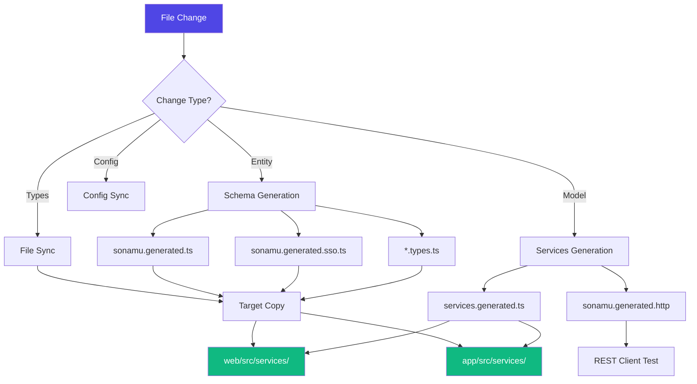

Syncer is Sonamu's automatic generation system. It detects file changes, automatically generates necessary code, and synchronizes to target projects (web, app, etc.).

## What is Syncer?

<CardGroup cols={2}>
  <Card title="File Change Detection" icon="magnifying-glass">
    Track Entity, Model, Types file changes
    
    Efficient checksum-based detection
  </Card>
  <Card title="Auto Code Generation" icon="wand-magic-sparkles">
    Generate types, schemas, API clients
    
    Template-based generation
  </Card>
  <Card title="HMR Support" icon="bolt">
    Real-time reflection during development
    
    File invalidation and reload
  </Card>
  <Card title="Multi-Target Sync" icon="arrows-turn-to-dots">
    Sync to web, app, and other projects
    
    Automatic file copying
  </Card>
</CardGroup>

## Syncer Operation Flow



## Watched File Patterns

File patterns that Syncer tracks for changes:

| File Type | Pattern | Purpose |
|-----------|---------|---------|
| **Entity** | `src/application/**/*.entity.json` | Data structure definition |
| **Types** | `src/application/**/*.types.ts` | Type definitions |
| **Model** | `src/application/**/*.model.ts` | Business logic |
| **Frame** | `src/application/**/*.frame.ts` | Frame logic |
| **Functions** | `src/application/**/*.functions.ts` | Utility functions |
| **Generated** | `src/application/sonamu.generated.ts` | Generated base file |
| **Config** | `src/sonamu.config.ts` | Sonamu configuration |
| **Workflow** | `src/application/**/*.workflow.ts` | Workflow definitions |
| **i18n** | `src/i18n/**/*.ts` | Internationalization files |

<Info>
**File patterns**: Managed in `file-patterns.ts`, change detection via checksum
</Info>

## Manual Synchronization

You can manually sync without the development server.

```bash
# Full sync
pnpm sonamu sync

# Sync only changed files
pnpm sonamu sync --check
```

**Execution result**:
```
🔄 Syncing files...
✅ Generated: sonamu.generated.ts
✅ Generated: sonamu.generated.sso.ts
✅ Copied: web/src/services/user/user.types.ts
✅ Copied: web/src/services/sonamu.generated.ts
✅ Generated: services.generated.ts
✅ Generated: sonamu.generated.http
━━━━━━━━━━━━━━━━━━━━━━━━━━━━━━━━
  All files are synced!
━━━━━━━━━━━━━━━━━━━━━━━━━━━━━━━━
```

## Automatic Synchronization (HMR)

During development server runtime, file changes are automatically detected and synchronized.

```bash
# Start development server
pnpm dev

# File changes are auto-synced
# - user.entity.json change → Type regeneration
# - user.model.ts change → API client regeneration
```

**HMR log example**:
```
🔄 Invalidated:
- src/application/user/user.model.ts (with 5 APIs)
- src/application/user/user.types.ts

✅ Generated: sonamu.generated.sso.ts
✅ Copied: web/src/services/user/user.types.ts
✅ Generated: services.generated.ts

✨ HMR completed in 234ms
```

## Syncer Events

Syncer emits events as an EventEmitter.

```typescript
import { Sonamu } from "sonamu";

// Subscribe to HMR completed event
Sonamu.syncer.eventEmitter.on("onHMRCompleted", () => {
  console.log("✅ HMR completed!");
  // Perform additional tasks...
});
```

**Event types**:

| Event | When Triggered | Use Case |
|-------|----------------|----------|
| `onHMRCompleted` | HMR completion | Trigger follow-up tasks |

## Syncer Actions

Different actions execute based on file change type.

### 1. Entity Change (`handleEntityChange`)

Regenerates schemas when Entity file changes.

**Trigger**: `*.entity.json` file change

**Actions**:
1. Reload EntityManager
2. Generate `*.types.ts` for new Entity
3. Generate schema files:
   - `sonamu.generated.ts`
   - `sonamu.generated.sso.ts`
4. Copy files to targets

```typescript
// Syncer internal logic
async handleEntityChange(diffGroups, diffTypes) {
  await EntityManager.reload();
  
  // Generate new Entity type file
  if (entity.parentId === undefined && !(await exists(typeFilePath))) {
    await generateTemplate("init_types", { entityId });
  }
  
  // Generate schemas
  await this.actionGenerateSchemas();
}
```

### 2. Types/Functions/Generated Change

Copies type files to targets when they change.

**Trigger**: `*.types.ts`, `*.functions.ts`, `*.generated.ts` change

**Actions**:
1. Collect changed file list
2. Copy to each target (`web`, `app`)
3. Transform `sonamu` import to `./sonamu.shared`

```typescript
// Import transformation on copy
// Before (api)
import { BaseModelClass } from "sonamu";

// After (web/app)
import { BaseModelClass } from "./sonamu.shared";
```

<Info>
**sonamu.shared.ts**: Since web/app don't have the sonamu package, common utilities are provided via a shared file.
</Info>

### 3. Model/Frame Change

Regenerates API clients when Model file changes.

**Trigger**: `*.model.ts`, `*.frame.ts` change

**Actions**:
1. Reload Model, Types, APIs
2. Generate API client (`services.generated.ts`)
3. Generate HTTP test file (`sonamu.generated.http`)
4. Regenerate SSR files (`queries.generated.ts`, `entry-server.generated.tsx`)

```typescript
async handleModelOrFrameChange(diffGroups) {
  // Reload modules
  await this.autoloadModels();
  await this.autoloadTypes();
  await this.autoloadApis();
  
  // Generate services
  await this.actionGenerateServices(params);
  await this.actionGenerateHttps();
  
  // Regenerate SSR files
  await generateTemplate("queries", {}, { overwrite: true });
  await generateTemplate("entry_server", {}, { overwrite: true });
}
```

### 4. Config Change

Synchronizes environment variables when config file changes.

**Trigger**: `sonamu.config.ts` change

**Actions**:
1. Create/update `.sonamu.env` file
2. Copy to each target

```env title="web/.sonamu.env"
API_HOST=localhost
API_PORT=3000
```

### 5. Workflow Change

Reloads when workflow file changes.

**Trigger**: `*.workflow.ts` change

**Actions**: Reload and sync workflows

### 6. i18n Change

Regenerates SD file when i18n file changes.

**Trigger**: `src/i18n/**/*.ts` change

**Actions**:
1. Copy Locale files to targets
2. Generate `sd.generated.ts` (api, web, app)

## Checksum-Based Change Detection

Syncer stores file checksums for efficient change detection.

```typescript
// .sonamu-checksums.json
{
  "src/application/user/user.entity.json": "a7f4b3e2c1d5...",
  "src/application/user/user.types.ts": "c3d1e4f5a6b7...",
  "src/application/user/user.model.ts": "e5f6a7b8c9d0..."
}
```

**How it works**:
1. Calculate SHA-256 hash of file content
2. Compare with stored checksum
3. Consider changed if different
4. Update checksum after sync

**Advantages**:
- Fast change detection (no file content comparison needed)
- Accurate change tracking (unaffected by timestamp)
- Handle multiple file changes simultaneously

## Syncer API

Syncer can be used programmatically.

### Manual Synchronization

```typescript
import { Sonamu } from "sonamu";

// Full sync
await Sonamu.syncer.sync();

// Sync specific file
await Sonamu.syncer.syncFromWatcher(
  "change",
  "/path/to/user.entity.json"
);
```

### Template Generation

```typescript
// Create Entity
await Sonamu.syncer.createEntity({
  entityId: "User",
  table: "users",
  props: [
    { name: "id", type: "integer" },
    { name: "email", type: "string" },
  ],
  subsets: {
    A: ["id", "email"],
  },
  enums: {},
  indexes: [],
});

// Generate template
await Sonamu.syncer.generateTemplate(
  "model",
  { entityId: "User" },
  { overwrite: false }
);

// Render custom template
const files = await Sonamu.syncer.renderTemplate(
  "view_list",
  { entityId: "User" }
);
```

### Module Loading

```typescript
// Load types
await Sonamu.syncer.autoloadTypes();
console.log(Sonamu.syncer.types);

// Load Models
await Sonamu.syncer.autoloadModels();
console.log(Sonamu.syncer.models);

// Load APIs
await Sonamu.syncer.autoloadApis();
console.log(Sonamu.syncer.apis);

// Load Workflows
await Sonamu.syncer.autoloadWorkflows();
console.log(Sonamu.syncer.workflows);
```

## Syncer Configuration

You can configure Syncer behavior in `sonamu.config.ts`.

```typescript title="api/src/sonamu.config.ts"
export default {
  sync: {
    // Target projects for synchronization
    targets: ["web", "app"],
  },
  
  // API server settings (used for environment variable generation)
  server: {
    baseUrl: "http://localhost:3000",
    listen: {
      host: "localhost",
      port: 3000,
    },
  },
};
```

## Development Workflow

Typical development flow using Syncer:

<Steps>
<Step title="Start Development Server">
```bash
pnpm dev
```

Syncer watches for file changes.
</Step>

<Step title="Define Entity">
Define Entity in Sonamu UI or modify `.entity.json` file.

**Auto-executed**:
- Generate `*.types.ts`
- Update `sonamu.generated.ts`
- Update `sonamu.generated.sso.ts`
- Copy files to targets
</Step>

<Step title="Write Model">
Write business logic in Model and add `@api` decorator.

**Auto-executed**:
- Update `services.generated.ts`
- Update `sonamu.generated.http`
- Update SSR files
</Step>

<Step title="Frontend Development">
Develop UI using generated API clients and Types.

```typescript
import { useUsers } from "@/services/services.generated";
import type { User } from "@/services/user/user.types";

function UserList() {
  const { data } = useUsers();
  // ...
}
```
</Step>

<Step title="Real-time Reflection">
Modifying Model or Entity reflects immediately via HMR.

Check changes without browser refresh!
</Step>
</Steps>

## Troubleshooting

### When Syncer Doesn't Work

<AccordionGroup>
  <Accordion title="Files Not Being Generated">
    **Check**:
    1. Confirm development server is running
    2. Verify file matches watched patterns
    3. Delete checksum file and retry
    
    ```bash
    rm .sonamu-checksums.json
    pnpm sonamu sync
    ```
  </Accordion>
  
  <Accordion title="Files Not Being Copied to Targets">
    **Check**:
    1. Verify `sync.targets` in `sonamu.config.ts`
    2. Confirm target directory exists
    3. Create `src/services/` directory in target
    
    ```bash
    mkdir -p web/src/services
    mkdir -p app/src/services
    ```
  </Accordion>
  
  <Accordion title="Slow HMR">
    **Optimization methods**:
    1. Use latest Node.js version (v22+)
    2. Use SSD (HDD is slow)
    3. Exclude unnecessary files
    4. Separate TypeScript projects (monorepo)
  </Accordion>
  
  <Accordion title="Import Errors">
    **Cause**: `sonamu` import not transformed to `./sonamu.shared`
    
    **Solution**:
    ```bash
    # Force re-sync
    pnpm sonamu sync --force
    ```
  </Accordion>
</AccordionGroup>

## Next Steps

<CardGroup cols={2}>
  <Card title="When Files Regenerate" icon="clock" href="/en/core-concepts/auto-generation/when-files-regenerate">
    Detailed guide on file regeneration timing
  </Card>
  <Card title="Customizing Generated Code" icon="pen-to-square" href="/en/core-concepts/auto-generation/customizing-generated-code">
    How to customize generated code
  </Card>
  <Card title="Templates" icon="file-code" href="/en/advanced/templates/creating-templates">
    Create custom templates
  </Card>
  <Card title="HMR System" icon="bolt" href="/en/advanced/hmr/understanding-hmr">
    Deep understanding of HMR system
  </Card>
</CardGroup>
