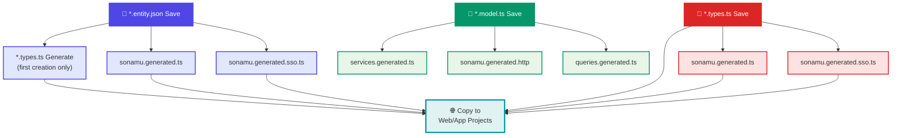

Sonamu automatically regenerates related files based on file changes. This document clearly explains which files are regenerated when you change each file.

## Regeneration Flow Diagram



## On Entity Save

When you save an `.entity.json` file, the following files are regenerated.

### Regenerated Files

<Steps>
<Step title="1. {Entity}.types.ts">
TypeScript types and Zod schemas per Entity

**Location**: `api/src/application/{entity}/{entity}.types.ts`

**Generation condition**: Only when Entity is first created (not auto-regenerated afterwards)

```typescript title="user.types.ts"
// Base type
export type User = {
  id: number;
  email: string;
  // ...
};

// Zod schema
export const User = z.object({
  id: z.number(),
  email: z.string(),
  // ...
});
```

</Step>

<Step title="2. sonamu.generated.ts">
Base types and Enums for the entire project

**Location**: `api/src/application/sonamu.generated.ts`

**Always regenerated**: ✅

```typescript
// All Entity Enums
export const UserRole = z.enum(["admin", "normal"]);

// Subset types
export type UserSubsetKey = "A" | "P" | "SS";
export type UserSubsetMapping = { ... };

// Model exports
export * from "./user/user.model";
```

</Step>

<Step title="3. sonamu.generated.sso.ts">
Subset query functions

**Location**: `api/src/application/sonamu.generated.sso.ts`

**Always regenerated**: ✅

```typescript
export const userSubsetQueries = {
  A: (puri) => puri.table("users").select([...]),
  P: (puri) => puri.table("users").leftJoin(...).select([...]),
};

export const userLoaderQueries = { ... };
```

</Step>

<Step title="4. Target Copy">
Above files are copied to target projects

**Locations**:

- `web/src/services/user/user.types.ts`
- `web/src/services/sonamu.generated.ts`
- `web/src/services/sonamu.generated.sso.ts`
- `app/src/services/...` (same)
  </Step>
  </Steps>

### Trigger Example

<CodeGroup>
```json title="user.entity.json save"
{
  "id": "User",
  "table": "users",
  "props": [
    { "name": "id", "type": "integer" },
    { "name": "email", "type": "string" }
  ],
  "subsets": {
    "A": ["id", "email"]
  },
  "enums": {
    "UserRole": {
      "admin": "Administrator",
      "normal": "Normal User"
    }
  }
}
```

```bash title="Execution result"
✅ Generated: user.types.ts (first creation only)
✅ Generated: sonamu.generated.ts
✅ Generated: sonamu.generated.sso.ts
✅ Copied: web/src/services/user/user.types.ts
✅ Copied: web/src/services/sonamu.generated.ts
✅ Copied: web/src/services/sonamu.generated.sso.ts
```

</CodeGroup>

<Warning>
`{entity}.types.ts` is **only auto-generated when Entity is first created**. It must be manually managed afterwards.

To regenerate an existing `user.types.ts`:

```bash
rm api/src/application/user/user.types.ts
# Re-save Entity
```

</Warning>

## On Model Save

When you save a `.model.ts` file, the following files are regenerated.

### Regenerated Files

<Steps>
<Step title="1. services.generated.ts">
API client functions and TanStack Query hooks

**Locations**:

- `web/src/services/services.generated.ts`
- `app/src/services/services.generated.ts`

**Always regenerated**: ✅

```typescript
// Axios clients
export async function findUserById(id: number): Promise<User> { ... }

// TanStack Query hooks
export function useUserById(id: number) { ... }
export function useSaveUser() { ... }
```

**Generation criteria**: Methods with `@api` decorator in Model

</Step>

<Step title="2. sonamu.generated.http">
HTTP test file for REST Client

**Location**: `api/sonamu.generated.http`

**Always regenerated**: ✅

```http
### User.findById
GET http://localhost:3000/user/findById?id=1

### User.save
POST http://localhost:3000/user/save
Content-Type: application/json

{ "params": [...] }
```

</Step>

<Step title="3. queries.generated.ts">
SSR Query descriptors

**Location**: `api/src/application/queries.generated.ts` (api-only — not copied to targets)

**Always regenerated**: ✅

```typescript
import type { SSRQuery } from "sonamu/ssr";

export namespace UserService {
  export const findById = (id: number): SSRQuery =>
    createSSRQuery("UserModel", "findById", [id], ["User", "findById"]);
}
```

</Step>

</Steps>

<Note>
  `entry-server.generated.tsx` is a static bootstrap asset that does not depend on any input. It is
  created only on the first sync (`IfNotExists`); afterwards it lives outside the change-tracking
  cycle and is not regenerated when a Model changes. Feel free to edit it directly when needed.
</Note>

### Trigger Example

<CodeGroup>
```typescript title="user.model.ts save"
class UserModelClass extends BaseModelClass {
  @api({ httpMethod: "GET", clients: ["axios", "tanstack-query"] })
  async findById(id: number): Promise<User> {
    // ...
  }

@api({ httpMethod: "POST", clients: ["axios", "tanstack-mutation"] })
async save(params: UserSaveParams[]): Promise<number[]> {
// ...
}
}

````

```bash title="Execution result"
🔄 Invalidated:
- src/application/user/user.model.ts (with 2 APIs)

✅ Generated: services.generated.ts
✅ Generated: sonamu.generated.http
✅ Generated: queries.generated.ts

✨ HMR completed in 234ms
````

</CodeGroup>

## On Types Save

When you save a `.types.ts` file, schema files are regenerated and copied to targets.

<Note>
  `.types.ts` files are treated as Single Source of Truth. Changes trigger schema file regeneration,
  same as Entity changes.
</Note>

### Regenerated Files

<Steps>
<Step title="1. sonamu.generated.ts">
Base types and Enums for the entire project

**Location**: `api/src/application/sonamu.generated.ts`

**Always regenerated**: ✅

Zod schemas defined in Types files are reflected in this file.

</Step>

<Step title="2. sonamu.generated.sso.ts">
Subset query functions

**Location**: `api/src/application/sonamu.generated.sso.ts`

**Always regenerated**: ✅

Regenerated together to maintain type consistency with Types changes.

</Step>

<Step title="3. Target Copy">
Modified Types file and regenerated files are copied to target projects

**Locations**:

- `web/src/services/{entity}/{entity}.types.ts`
- `web/src/services/sonamu.generated.ts`
- `web/src/services/sonamu.generated.sso.ts`
- `app/src/services/...` (same)

**Always copied**: ✅

**import transformation**: `sonamu` → `./sonamu.shared`

</Step>
</Steps>

### Trigger Example

<CodeGroup>
```typescript title="user.types.ts modification"
import { z } from "zod";

// Custom type added
export const UserLoginParams = z.object({
email: z.string().email(),
password: z.string().min(8),
});

export type UserLoginParams = z.infer<typeof UserLoginParams>;
```

```bash title="Execution result"
✅ Generated: sonamu.generated.ts
✅ Generated: sonamu.generated.sso.ts
✅ Copied: web/src/services/user/user.types.ts
✅ Copied: web/src/services/sonamu.generated.ts
✅ Copied: web/src/services/sonamu.generated.sso.ts
```

</CodeGroup>

## On Config Save

When you save `sonamu.config.ts`, environment variables are synchronized.

### Regenerated Files

<Steps>
<Step title=".sonamu.env">
Environment variable file containing API server info

**Locations**:

- `web/.sonamu.env`
- `app/.sonamu.env`

**Always regenerated**: ✅

```env
API_HOST=localhost
API_PORT=3000
```

</Step>
</Steps>

### Trigger Example

<CodeGroup>
```typescript title="sonamu.config.ts modification"
export default {
  server: {
    listen: {
      host: "0.0.0.0",  // changed
      port: 4000,       // changed
    },
  },
};
```

```bash title="Execution result"
✅ Updated: web/.sonamu.env
✅ Updated: app/.sonamu.env
```

</CodeGroup>

## On i18n File Save

When you save `src/i18n/**/*.ts`, SD files are regenerated.

### Regenerated Files

<Steps>
<Step title="1. Locale File Copy">
i18n files are copied to targets

**Locations**:

- `web/src/i18n/{locale}.ts`
- `app/src/i18n/{locale}.ts`
  </Step>

<Step title="2. sd.generated.ts">
Sonamu Dictionary file generation

**Locations**:

- `api/src/sd.generated.ts`
- `web/src/sd.generated.ts`
- `app/src/sd.generated.ts`

**Always regenerated**: ✅

```typescript
export const SD = {
  User: "User",
  user: {
    id: "ID",
    email: "Email",
  },
} as const;
```

</Step>
</Steps>

## Regeneration Matrix

A table showing file changes and regeneration relationships at a glance.

| Changed File             | {entity}.types.ts   | sonamu.generated.ts | sonamu.generated.sso.ts | services.generated.ts | sonamu.generated.http | queries.generated.ts | .sonamu.env | sd.generated.ts |
| ------------------------ | ------------------- | ------------------- | ----------------------- | --------------------- | --------------------- | -------------------- | ----------- | --------------- |
| **{entity}.entity.json** | ✅ (first creation) | ✅                  | ✅                      | -                     | -                     | -                    | -           | -               |
| **{entity}.model.ts**    | -                   | -                   | -                       | ✅                    | ✅                    | ✅                   | -           | -               |
| **{entity}.types.ts**    | _copy_              | ✅                  | ✅                      | -                     | -                     | -                    | -           | -               |
| **sonamu.config.ts**     | -                   | -                   | -                       | -                     | -                     | -                    | ✅          | -               |
| **i18n/{locale}.ts**     | -                   | -                   | -                       | -                     | -                     | -                    | -           | ✅              |

**Legend**:

- ✅ = Always regenerated
- ✅ (first creation) = Only on first creation
- _copy_ = Copied to targets
- - = Not regenerated

<Info>
  `entry-server.generated.tsx` is intentionally omitted from the matrix above. It is a bootstrap
  asset that is only generated on the first sync (`IfNotExists`) and lives outside the change
  tracking cycle.
</Info>

## Preventing Regeneration

Modifying generated files will be overwritten on next regeneration.

### ❌ Wrong Way

```typescript title="Directly modifying services.generated.ts"
// ❌ Don't do this!
export async function findUserById(id: number): Promise<User> {
  // Custom logic added
  console.log("Finding user:", id);

  const { data } = await axios.get("/user/findById", { params: { id } });
  return data;
}
// → Gets overwritten on Model change 💥
```

### ✅ Right Way

<Tabs>
<Tab title="Create Separate File">
```typescript title="services/user/user.custom.ts"
import { findUserById } from "../services.generated";

// Create wrapper function
export async function findUserByIdWithLog(id: number) {
console.log("Finding user:", id);
return findUserById(id);
}

````

**Advantage**: Doesn't touch generated files
</Tab>

<Tab title="Use Types File">
```typescript title="api/src/application/user/user.types.ts"
// Add custom types beyond Entity base types
export const UserLoginParams = z.object({
  email: z.string().email(),
  password: z.string().min(8),
});

// This file is not regenerated!
````

**Advantage**: Managed together with Types

</Tab>

<Tab title="Handle in Model">
```typescript title="api/src/application/user/user.model.ts"
@api({ httpMethod: "GET" })
async findByIdWithLog(id: number): Promise<User> {
  this.logger.info("Finding user:", id);
  return this.findById("A", id);
}
```

**Advantage**: Automatically exposed as API

</Tab>
</Tabs>

## Forcing Regeneration

How to force regeneration when files aren't being regenerated.

### Force Re-sync

```bash
# Remove sonamu.lock and run a full sync
pnpm sonamu sync --force
```

`--force` ignores the existing lock and brings every tracked asset back into a consistent state
from scratch. It is exposed for use in git post-merge hooks or CI to re-sync after every pull.

### Specific File Regeneration

```bash
# Re-save Entity file (in Sonamu UI)
# Or modify and save file content

# Re-save Model file
# → services.generated.ts etc. auto-regenerated
```

### Force Overwrite

```typescript
import { Sonamu } from "sonamu";

// Force regeneration with overwrite option
await Sonamu.syncer.generateTemplate(
  "services",
  {},
  { overwrite: true }, // Overwrite existing file
);
```

## Regeneration Optimization

Tips to reduce regeneration time.

<AccordionGroup>
  <Accordion title="Change Only Necessary Files">
    If not changing Model APIs, modifying Entity or Types is sufficient

    - Types/Entity change → Schema regeneration
    - Model change → Services and HTTP file regeneration

  </Accordion>
  
  <Accordion title="Remove Unnecessary Targets">
    Remove unused targets from `sonamu.config.ts`
    
    ```typescript
    export default {
      sync: {
        targets: ["web"],  // Remove app
      },
    };
    ```
  </Accordion>
  
  <Accordion title="Minimize @api Decorators">
    Add `@api` only to necessary methods
    
    - Internal methods don't need `@api`
    - Fewer APIs = faster regeneration
  </Accordion>
  
  <Accordion title="HMR Optimization">
    Use Node.js v22+ and SSD
    
    ```json
    {
      "engines": {
        "node": ">=22.0.0"
      }
    }
    ```
  </Accordion>
</AccordionGroup>

## Next Steps

<CardGroup cols={2}>
  <Card
    title="Customizing Generated Code"
    icon="pen-to-square"
    href="/en/core-concepts/auto-generation/customizing-generated-code"
  >
    Safely customize generated code
  </Card>
  <Card title="Syncer" icon="rotate" href="/en/core-concepts/auto-generation/syncer">
    Deep understanding of Syncer system
  </Card>
  <Card title="Templates" icon="file-code" href="/en/advanced/templates/creating-templates">
    Create custom templates
  </Card>
  <Card title="Testing" icon="flask" href="/en/testing/model-testing/unit-tests">
    Test generated code
  </Card>
</CardGroup>
