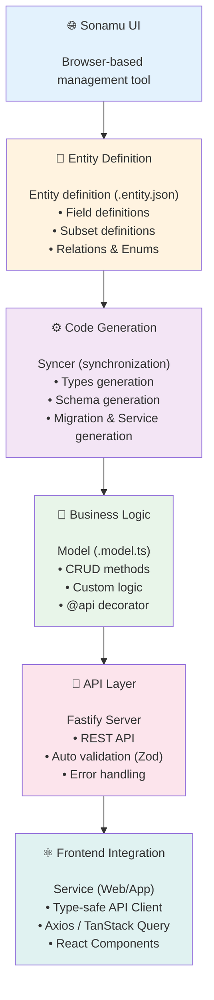
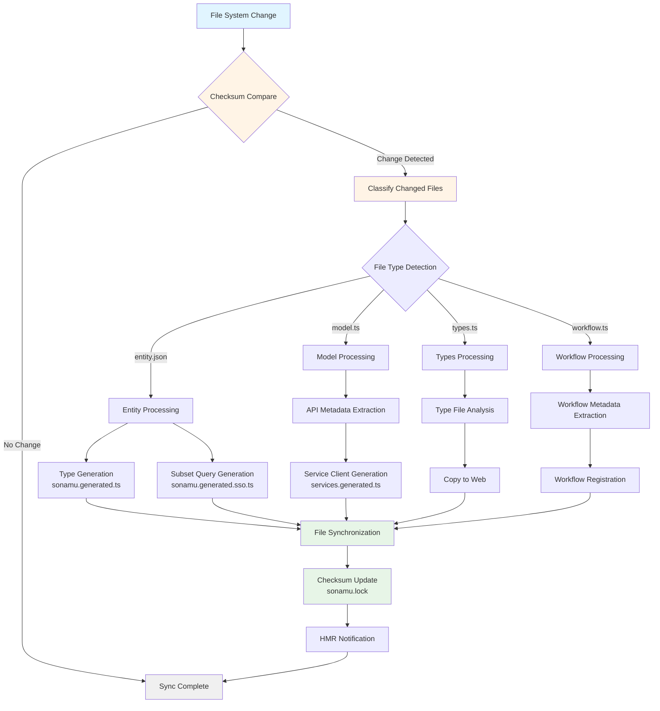

Sonamu is a TypeScript framework that enables **entity-centric full-stack development**. This guide explains Sonamu's overall architecture and core operating principles.

## Sonamu's Philosophy

Sonamu is designed based on the following principles:

<Steps>
<Step title="1. Entity First">
All development starts with **entity definition**. Define the data structure first, and the rest is automatically generated.
</Step>

<Step title="2. Type Safety">
  **Complete type safety** is guaranteed from backend to frontend. Errors can be caught at compile
  time.
</Step>

<Step title="3. Code Generation">
  Repetitive boilerplate code is **automatically generated**. Developers can focus only on business
  logic.
</Step>

<Step title="4. Developer Experience">
Excellent developer experience with **HMR**, **type inference**, **Sonamu UI**, and more.
</Step>
</Steps>

## Overall Architecture

Sonamu operates with 6 layers automatically connected:



## Core Components

### 1. Entity

**Entity** is the starting point of everything in Sonamu.

```json title="user.entity.json"
{
  "entityId": "User",
  "tableName": "users",
  "title": "User",
  "properties": [
    {
      "name": "id",
      "type": "int",
      "isPrimary": true
    },
    {
      "name": "email",
      "type": "varchar"
    },
    {
      "name": "name",
      "type": "varchar"
    }
  ],
  "subsets": {
    "A": ["id", "email", "name", "created_at"],
    "C": ["id", "email", "name"]
  }
}
```

<Check>
  **Role of Entity Definition** - Source of database schema - Basis for TypeScript type generation -
  Definition of API interfaces - Standard for frontend types
</Check>

### 2. Type System

**3 type files** are automatically generated from entity definitions:

<CodeGroup>
```typescript title="user.types.ts (per-entity types)"
// Auto-generated + extensible
import { z } from "zod";
import { UserBaseSchema } from "../sonamu.generated";

// Base type (auto-generated)
export type User = z.infer<typeof UserBaseSchema>;

// Custom types (can be written directly)
export const UserSaveParams = UserBaseSchema.partial({
id: true,
created_at: true,
});
export type UserSaveParams = z.infer<typeof UserSaveParams>;

````

```typescript title="sonamu.generated.ts (all Base schemas)"
// Auto-generated - do not modify!
export const UserBaseSchema = z.object({
  id: z.number(),
  email: z.string(),
  name: z.string(),
  created_at: z.date(),
});

export const UserSubsetKey = z.enum(["A", "C"]);
export type UserSubsetKey = z.infer<typeof UserSubsetKey>;

export type UserSubsetMapping = {
  A: User;
  C: Pick<User, "id" | "email" | "name">;
};
````

```typescript title="sonamu.generated.sso.ts (query definitions)"
// Auto-generated - do not modify!
export const userSubsetQueries = {
  A: `SELECT * FROM users`,
  C: `SELECT id, email, name FROM users`,
};
```

</CodeGroup>

<Note>
  **Three Type Files** 1. `{entity}.types.ts` - Per-entity types (extensible) 2.
  `sonamu.generated.ts` - All Base schemas (auto-generated) 3. `sonamu.generated.sso.ts` - Subset
  queries (auto-generated)
</Note>

### 3. Model (Business Logic)

**Model** handles the business logic of entities.

```typescript title="user.model.ts"
import { api, BaseModelClass } from "sonamu";
import type { UserSubsetKey, UserSubsetMapping } from "../sonamu.generated";
import { userSubsetQueries } from "../sonamu.generated.sso";

class UserModelClass extends BaseModelClass<
  UserSubsetKey,
  UserSubsetMapping,
  typeof userSubsetQueries
> {
  constructor() {
    super("User", userSubsetQueries);
  }

  // CRUD API
  @api({ httpMethod: "GET", clients: ["axios", "tanstack-query"] })
  async findById<T extends UserSubsetKey>(subset: T, id: number): Promise<UserSubsetMapping[T]> {
    const user = await this.getPuri("r").where("id", id).first();
    return user;
  }

  // Custom business logic
  @api({ httpMethod: "POST", clients: ["axios"] })
  async changePassword(userId: number, newPassword: string): Promise<void> {
    await this.getPuri("w")
      .where("id", userId)
      .update({ password: await this.hashPassword(newPassword) });
  }

  private async hashPassword(password: string): Promise<string> {
    // Password hashing logic
    return password;
  }
}

export const UserModel = new UserModelClass();
```

<Check>
  **Model Features** - **Auto REST API generation** with `@api` decorator - **Basic CRUD methods**
  provided by inheriting `BaseModelClass` - Type-safe DB queries with **Puri query builder** - Focus
  only on **business logic**
</Check>

### 4. Syncer (Synchronization System)

**Syncer** is Sonamu's core engine. It detects file changes and automatically generates code.



```typescript
// Main roles of Syncer

1. File change detection (checksum-based)
   - entity.json change → Types regeneration
   - model.ts change → Service regeneration
   - types.ts change → Copy to Web

2. Auto code generation
   - sonamu.generated.ts
   - sonamu.generated.sso.ts
   - {Entity}Service.ts (frontend)

3. File synchronization
   - api/src/application → web/src/services
   - Type file copying
   - sonamu.shared.ts deployment

4. HMR trigger
   - Invalidate changed modules
   - Auto restart API server
```

<Info>
  **When Syncer Runs** - **Auto**: During file changes while `pnpm dev` is running (HMR) -
  **Manual**: When `pnpm sync` command is executed
</Info>

### 5. API Layer (REST API)

The Model's `@api` decorator **automatically generates REST APIs**.

```typescript
// Model method
@api({ httpMethod: "GET", clients: ["axios"] })
async findById(subset: UserSubsetKey, id: number): Promise<User> {
  // ...
}

// ↓ Auto conversion

// REST API endpoint
GET /api/users/:id?subset=A

// Request
curl http://localhost:34900/api/users/1?subset=A

// Response
{
  "id": 1,
  "email": "user@example.com",
  "name": "John Doe",
  "created_at": "2025-01-06T12:00:00Z"
}
```

<Check>
  **What's Auto-Generated** - ✅ REST API routes - ✅ Request parameter validation (Zod) - ✅
  Response types - ✅ Error handling - ✅ API documentation (sonamu.generated.http)
</Check>

### 6. Frontend Service (Frontend Integration)

Model APIs are **automatically generated as frontend Services**.

```typescript title="web/src/services/UserService.ts (auto-generated)"
export class UserService {
  static async findById(subset: UserSubsetKey, id: number): Promise<User> {
    const res = await axios.get(`/api/users/${id}`, {
      params: { subset },
    });
    return res.data;
  }

  static async changePassword(userId: number, newPassword: string): Promise<void> {
    await axios.post("/api/users/changePassword", {
      userId,
      newPassword,
    });
  }
}
```

<Check>
  **Type Safety** Backend types are synchronized directly to the frontend, so type mismatch errors
  can be caught at **compile time**!
</Check>

## Development Flow

Let's see how Sonamu works during actual development:

<Steps>
<Step title="1. Entity Definition (Sonamu UI)">
```json
{
  "entityId": "Post",
  "properties": [
    { "name": "id", "type": "int", "isPrimary": true },
    { "name": "title", "type": "varchar" }
  ]
}
```
**Auto-generated on save:**
- `post.types.ts`
- `sonamu.generated.ts` updated
</Step>

<Step title="2. Migration (Migration tab)">
  ```sql CREATE TABLE posts ( id SERIAL PRIMARY KEY, title VARCHAR(255) NOT NULL ); ``` **On
  execution:** - Table created in database
</Step>

<Step title="3. Write Model (manual or scaffolding)">
```typescript
@api({ httpMethod: "GET" })
async findById(id: number): Promise<Post> {
  return await this.getPuri("r").where("id", id).first();
}
```
**Auto-generated on save:**
- REST API: `GET /api/posts/:id`
- `PostService.ts` (frontend)
- `sonamu.generated.http` updated
</Step>

<Step title="4. Frontend Usage">
```tsx
// Type-safe API call
const post = await PostService.findById(1);
console.log(post.title); // ✅ Type checked
console.log(post.invalid); // ❌ Compile error!
```
**Type safety:**
- Frontend immediately detects errors when backend types change
</Step>
</Steps>

<Frame caption="Development Flow">
  <video
    muted
    loop
    playsInline
    controls
    className="w-full rounded-xl"
    preload="metadata"
    src="https://cf.cartanova.ai/sonamu-docs/introduction1.mp4"
  ></video>
</Frame>

## HMR (Hot Module Replacement)

Sonamu provides a **powerful HMR system**.

### How HMR Works

```typescript
// 1. File change detection
user.model.ts modified → Watcher detects

// 2. Module invalidation
hmr-hook analyzes dependency graph
user.model.ts and dependent modules invalidated

// 3. Regeneration (Syncer)
- UserService.ts regenerated
- API routes re-registered

// 4. Server restart
graceful shutdown → reload
```

<Check>
  **Benefits of HMR** - ✅ **Fast feedback** - Reflected within 1-2 seconds after code change - ✅
  **State preservation** - Database connections, etc. maintained - ✅ **Auto sync** - Frontend
  Service auto-updated
</Check>

<Frame caption="HMR in Action">
  <video
    muted
    loop
    playsInline
    controls
    className="w-full rounded-xl"
    preload="metadata"
    src="/images/introduction3.mp4"
  ></video>
</Frame>

## Auto Generation Mechanism

Let's summarize what Sonamu automatically generates:

### On Entity Definition Change

```
user.entity.json modified
↓
Auto-generated:
✅ user.types.ts (type definitions)
✅ sonamu.generated.ts (Base schemas)
✅ sonamu.generated.sso.ts (Subset queries)
✅ migration SQL (table changes)
```

### On Model File Change

```
user.model.ts modified
↓
Auto-generated:
✅ UserService.ts (frontend)
✅ services.generated.ts (Service integration)
✅ sonamu.generated.http (API documentation)
✅ REST API routes re-registered
```

### On Types File Change

```
user.types.ts modified
↓
Auto-synced:
✅ web/src/services/user.types.ts (copied)
✅ Immediately usable in frontend
```

<Warning>
**Files You Should Never Modify**
- `sonamu.generated.ts` - Overwritten on next sync
- `{Entity}Service.ts` - Overwritten on next sync
- `sonamu.generated.sso.ts` - Overwritten on next sync

These files are always auto-generated, so don't modify them directly!

</Warning>

## Type Safety Flow

Visualizing Sonamu's **End-to-End type safety**:

```typescript
// 1. Entity definition
{
  "name": "email",
  "type": "varchar"
}

↓

// 2. Type generation (auto)
type User = {
  email: string;
}

↓

// 3. Model method (type-safe)
async findByEmail(email: string): Promise<User> {
  return await this.getPuri("r").where("email", email).first();
}

↓

// 4. REST API (auto-generated, type-safe)
GET /api/users/email/:email
Response: User

↓

// 5. Frontend Service (auto-generated, type-safe)
static async findByEmail(email: string): Promise<User> {
  const res = await axios.get(`/api/users/email/${email}`);
  return res.data; // type: User
}

↓

// 6. React Component (type-safe)
const user = await UserService.findByEmail("test@example.com");
console.log(user.email); // ✅ Type checked
console.log(user.invalid); // ❌ Compile error!
```

<Check>
**Type Safety Guaranteed**
1. Entity definition → Type generation
2. Model → API type inference
3. API → Service type synchronization
4. Service → UI type checking

When types change at any stage, it's reflected across the entire chain and errors are caught at compile time!

</Check>

## Key Advantages of Sonamu

### 1. Development Speed Improvement

```
Traditional approach:
1. Design database table
2. Write migration
3. Define backend types
4. Write API controller
5. Register API routes
6. Define frontend types
7. Write API client
⏱️ Total time: 2-3 hours

Sonamu approach:
1. Define entity (Sonamu UI)
2. Scaffolding (auto Model generation)
⏱️ Total time: 10-15 minutes

✅ About 90% time reduction!
```

### 2. Type Safety

```typescript
// ❌ Traditional approach: runtime error
const user = await fetch("/api/users/1").then((r) => r.json());
console.log(user.eamil); // Typo! Only discovered at runtime ⚠️

// ✅ Sonamu: compile error
const user = await UserService.findById("A", 1);
console.log(user.eamil); // Compile error! Discovered immediately ✅
```

### 3. Maintainability

```typescript
// Entity change: email → username
// ❌ Traditional approach:
// 1. Write DB Migration
// 2. Modify backend types
// 3. Modify API
// 4. Modify frontend types
// 5. Modify all API call sites
// ⚠️ Missed spots cause runtime errors!

// ✅ Sonamu:
// 1. Change field name in entity.json
// 2. Migration auto-generated
// 3. All types auto-updated
// 4. Compile errors immediately show where changes are needed
// ✅ Safe changes without missing anything!
```

### 4. Consistency

```typescript
// ✅ Sonamu automatically maintains consistent code style

// All Services follow the same pattern
UserService.findById(...)
PostService.findById(...)
CommentService.findById(...)

// All types have the same structure
type User = z.infer<typeof UserBaseSchema>;
type Post = z.infer<typeof PostBaseSchema>;
type Comment = z.infer<typeof CommentBaseSchema>;
```

## Constraints and Trade-offs

Sonamu's powerful features come with some constraints:

<Warning>
**Constraints to Be Aware Of**

1. **Learning curve**: Need to understand Sonamu's concepts and rules
2. **Cannot modify auto-generated files**: Manual modifications get overwritten
3. **Entity-centric design required**: Must follow the Sonamu way
4. **Complex queries**: Very complex cases may require Raw SQL
   </Warning>

<Check>
**But the advantages far outweigh**

✅ Development speed improvement (90% time reduction)
✅ Type safety guaranteed
✅ Improved maintainability
✅ Code consistency
✅ Team productivity improvement

</Check>

## Next Steps

Now that you understand how Sonamu works, learn about each component in detail:

<CardGroup cols={2}>
  <Card title="Defining Entities" icon="database" href="/en/core-concepts/entity/defining-entities">
    Learn entity structure and configuration options in detail.
  </Card>
  <Card title="Understanding Models" icon="code" href="/en/core-concepts/model/what-is-model">
    Learn the role of Models and how to write business logic.
  </Card>
  <Card
    title="Auto Generation Mechanism"
    icon="wand-magic-sparkles"
    href="/en/core-concepts/auto-generation/what-gets-generated"
  >
    Learn which files are automatically generated.
  </Card>
  <Card title="Type System" icon="shield" href="/en/core-concepts/type-system/entity-types">
    Understand how Sonamu's type safety works.
  </Card>
</CardGroup>
