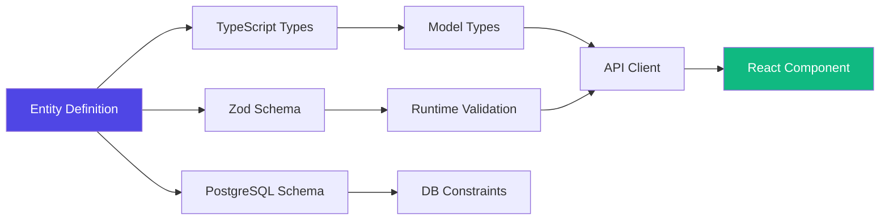

Sonamu provides complete type safety from client to server to database with a single Entity definition. This document explains how types flow through the entire stack.

## Type Flow Overview



<CardGroup cols={2}>
  <Card title="Compile Time" icon="code">
    Type checking with TypeScript - Prevent errors during development
  </Card>
  <Card title="Runtime" icon="play">
    Actual data validation with Zod - Block invalid data
  </Card>
  <Card title="Database" icon="database">
    PostgreSQL constraints - Guarantee data integrity
  </Card>
  <Card title="API Boundary" icon="arrows-left-right">
    Request/Response validation - Safe data exchange
  </Card>
</CardGroup>

## Layer-by-Layer Type Safety

### 1. Entity → TypeScript

Entity definitions are converted to TypeScript types.

<CodeGroup>
```json title="user.entity.json"
{
  "id": "User",
  "props": [
    { "name": "email", "type": "string", "length": 100 },
    { "name": "age", "type": "integer", "nullable": false },
    { "name": "role", "type": "enum", "id": "UserRole" }
  ],
  "enums": {
    "UserRole": {
      "admin": "Administrator",
      "normal": "Normal User"
    }
  }
}
```

```typescript title="user.types.ts (auto-generated)"
export type User = {
  email: string;
  age: number;
  role: UserRole;
};

export type UserRole = "admin" | "normal";
```

</CodeGroup>

**Type safety guaranteed**:

```typescript
// ✅ Compile success
const user: User = {
  email: "john@test.com",
  age: 30,
  role: "admin",
};

// ❌ Compile error
const user: User = {
  email: "john@test.com",
  age: "30", // Error: Type 'string' is not assignable to type 'number'
  role: "guest", // Error: Type '"guest"' is not assignable to type 'UserRole'
};
```

### 2. Entity → Zod Schema

Entity definitions are converted to Zod schemas for runtime validation.

<CodeGroup>
```typescript title="user.types.ts (auto-generated)"
export const User = z.object({
  email: z.string().max(100),
  age: z.number().int(),
  role: UserRole,
});
```

```typescript title="Runtime validation"
// ✅ Validation success
const result = User.safeParse({
  email: "john@test.com",
  age: 30,
  role: "admin",
});
console.log(result.success); // true

// ❌ Validation failure
const result = User.safeParse({
  email: "john@test.com",
  age: "30", // String not allowed
  role: "guest", // Invalid role
});
console.log(result.success); // false
console.log(result.error); // ZodError with details
```

</CodeGroup>

### 3. Entity → PostgreSQL

Entity definitions are converted to PostgreSQL table schemas.

<CodeGroup>
```json title="user.entity.json"
{
  "props": [
    { "name": "email", "type": "string", "length": 100 },
    { "name": "age", "type": "integer", "nullable": false }
  ],
  "indexes": [
    { "type": "unique", "columns": [{ "name": "email" }] }
  ]
}
```

```sql title="Generated migration"
CREATE TABLE users (
  email VARCHAR(100) NOT NULL,
  age INTEGER NOT NULL,
  CONSTRAINT users_email_unique UNIQUE (email)
);
```

</CodeGroup>

**Database constraints**:

```sql
-- ✅ Insert success
INSERT INTO users (email, age) VALUES ('john@test.com', 30);

-- ❌ Failure: NULL not allowed
INSERT INTO users (email, age) VALUES ('jane@test.com', NULL);

-- ❌ Failure: UNIQUE violation
INSERT INTO users (email, age) VALUES ('john@test.com', 25);
```

## API Layer Type Safety

### Model → API Client

Model methods are converted to type-safe API clients.

<CodeGroup>
```typescript title="user.model.ts"
@api({ httpMethod: "POST" })
async save(params: UserSaveParams[]): Promise<number[]> {
  // Implementation...
}
```

```typescript title="services.generated.ts (auto-generated)"
export async function saveUser(params: UserSaveParams[]): Promise<number[]> {
  const { data } = await axios.post("/user/save", { params });
  return data;
}
```

```tsx title="Usage in component"
import { saveUser } from "@/services/services.generated";
import type { UserSaveParams } from "@/services/user/user.types";

// ✅ Type safe
const params: UserSaveParams[] = [{ email: "john@test.com", age: 30, role: "admin" }];
await saveUser(params);

// ❌ Compile error
await saveUser([
  { email: "john@test.com", age: "30" }, // Type error
]);
```

</CodeGroup>

### Request Validation

API requests are automatically validated with Zod schemas.

```typescript title="In Fastify router"
// Auto-generated by Sonamu
fastify.post("/user/save", async (request, reply) => {
  // Automatic validation
  const params = UserSaveParams.array().parse(request.body.params);

  // Use safely with validated types
  const result = await UserModel.save(params);
  return result;
});
```

**On validation failure**:

```json
// Request
POST /user/save
{
  "params": [
    { "email": "invalid-email", "age": "30" }
  ]
}

// Response (400 Bad Request)
{
  "error": "Validation failed",
  "issues": [
    {
      "path": ["params", 0, "email"],
      "message": "Invalid email"
    },
    {
      "path": ["params", 0, "age"],
      "message": "Expected number, received string"
    }
  ]
}
```

### Response Types

API responses are also type-safe.

<CodeGroup>
```typescript title="user.model.ts"
@api({ httpMethod: "GET" })
async findById(id: number): Promise<User> {
  return this.findById("A", id);
}
```

```typescript title="services.generated.ts"
export async function findUserById(id: number): Promise<User> {
  const { data } = await axios.get("/user/findById", { params: { id } });
  return data;
}
```

```tsx title="Component"
const user = await findUserById(1);
// user: User (type auto-inferred)

console.log(user.email); // ✅ string
console.log(user.name); // ❌ Property 'name' does not exist
```

</CodeGroup>

## TanStack Query Type Safety

TanStack Query hooks also provide complete type safety.

<CodeGroup>
```typescript title="services.generated.ts"
export function useUserById(id: number) {
  return useQuery({
    queryKey: ["User", "findById", id],
    queryFn: () => findUserById(id),
  });
}

export function useSaveUser() {
  return useMutation({
    mutationFn: (params: UserSaveParams[]) => saveUser(params),
  });
}
```

```tsx title="Component"
function UserProfile({ userId }: { userId: number }) {
  // Type auto-inferred
  const { data, isLoading, error } = useUserById(userId);
  // data: User | undefined
  // isLoading: boolean
  // error: Error | null

  if (isLoading) return <div>Loading...</div>;
  if (error) return <div>Error: {error.message}</div>;

  return (
    <div>
      <h1>{data.email}</h1> {/* ✅ data is User type */}
      <p>Age: {data.age}</p>
    </div>
  );
}

function UserForm() {
  const { mutate, isPending } = useSaveUser();

  const handleSubmit = (e: React.FormEvent<HTMLFormElement>) => {
    e.preventDefault();
    const formData = new FormData(e.currentTarget);

    // ✅ Type-safe call
    mutate(
      [
        {
          email: formData.get("email") as string,
          age: Number(formData.get("age")),
          role: "normal",
        },
      ],
      {
        onSuccess: (ids) => {
          // ids: number[]
          console.log("Created user IDs:", ids);
        },
      },
    );
  };

  return <form onSubmit={handleSubmit}>...</form>;
}
```

</CodeGroup>

## Subset Type Safety

Subset queries also provide complete type inference.

<CodeGroup>
```typescript title="user.model.ts"
async findMany<T extends UserSubsetKey>(
  subset: T,
  params?: UserListParams
): Promise<ListResult<UserListParams, UserSubsetMapping[T]>> {
  const { qb } = this.getSubsetQueries(subset);
  
  // Type is automatically determined based on subset
  return this.executeSubsetQuery({ subset, qb, params });
}
```

```typescript title="Usage"
// Type is automatically determined based on subset
const users = await UserModel.findMany("A", params);
// users: { rows: UserA[]; total: number }

const profiles = await UserModel.findMany("P", params);
// profiles: { rows: UserP[]; total: number }

const summaries = await UserModel.findMany("SS", params);
// summaries: { rows: UserSS[]; total: number }
```

</CodeGroup>

## Full Stack Type Flow Example

Shows how types flow in actual CRUD operations.

<Steps>
<Step title="1. Entity Definition">
```json title="user.entity.json"
{
  "id": "User",
  "props": [
    { "name": "email", "type": "string", "length": 100 },
    { "name": "age", "type": "integer" },
    { "name": "role", "type": "enum", "id": "UserRole" }
  ],
  "subsets": {
    "A": ["id", "email", "age", "role"]
  }
}
```

**Generated**: TypeScript types, Zod schemas, PostgreSQL schemas

</Step>

<Step title="2. Model Implementation">
```typescript title="user.model.ts"
class UserModelClass extends BaseModelClass<...> {
  @api({ httpMethod: "POST" })
  async save(params: UserSaveParams[]): Promise<number[]> {
    // Type-safe implementation
    params.forEach(p => wdb.ubRegister("users", p));
    return wdb.ubUpsert("users");
  }
}
```

**Generated**: API client, TanStack Query hooks

</Step>

<Step title="3. Frontend Usage">
```tsx title="UserForm.tsx"
import { useSaveUser } from "@/services/services.generated";
import { UserSaveParams } from "@/services/user/user.types";

function UserForm() {
const { mutate } = useSaveUser();

const handleSubmit = (values: UserSaveParams) => {
mutate([values]); // ✅ Type checked
};

return <form>...</form>;
}

````

**Validation**: Compile time (TypeScript) + Runtime (Zod)
</Step>

<Step title="4. API Request">
```typescript
// Request (auto-serialized)
POST /user/save
{
  "params": [
    { "email": "john@test.com", "age": 30, "role": "admin" }
  ]
}

// Auto Zod validation
const params = UserSaveParams.array().parse(request.body.params);
````

**Validation**: Runtime validation with Zod schema

</Step>

<Step title="5. Database Save">
```sql
-- Auto-generated query
INSERT INTO users (email, age, role)
VALUES ('john@test.com', 30, 'admin')
RETURNING id;

-- PostgreSQL constraint checks
-- - email: VARCHAR(100) NOT NULL
-- - age: INTEGER NOT NULL
-- - role: CHECK (role IN ('admin', 'normal'))

````

**Validation**: PostgreSQL constraints
</Step>

<Step title="6. Response Return">
```typescript
// Response
{ "data": [1] }  // number[]

// Type inference in frontend
const ids = await saveUser([...]);
// ids: number[]
````

**Type inference**: API client guarantees return type

</Step>
</Steps>

## Preventing Type Mismatches

Sonamu's E2E type safety prevents common type mismatch issues.

<AccordionGroup>
  <Accordion title="API Response Type Mismatch">
    **Problem**: API returns different type than expected
    
    **Sonamu Solution**:
    ```typescript
    // Explicit return type in Model
    @api()
    async findById(id: number): Promise<User> {
      return this.findById("A", id);
    }
    
    // API client has same type
    export async function findUserById(id: number): Promise<User> {
      // ...
    }
    
    // Compile error on type mismatch
    ```
  </Accordion>
  
  <Accordion title="Request Parameter Mismatch">
    **Problem**: Client sends wrong parameters
    
    **Sonamu Solution**:
    ```typescript
    // Share same type definition
    export const UserSaveParams = z.object({...});
    
    // Used in Model
    async save(params: UserSaveParams[]): Promise<number[]>
    
    // Used in API client
    export async function saveUser(params: UserSaveParams[]): Promise<number[]>
    
    // Auto-validation on server
    const validated = UserSaveParams.array().parse(request.body.params);
    ```
  </Accordion>
  
  <Accordion title="Enum Value Mismatch">
    **Problem**: Hardcoded string doesn't match Enum
    
    **Sonamu Solution**:
    ```typescript
    // ❌ Wrong way
    const role = "guest";  // Compiles but runtime error
    
    // ✅ Correct way
    import { UserRole } from "./sonamu.generated";
    const role: UserRole = "admin";  // Type checked
    ```
  </Accordion>
  
  <Accordion title="Missing Nullable Handling">
    **Problem**: Using nullable field without null check
    
    **Sonamu Solution**:
    ```typescript
    type User = {
      bio: string | null;  // Nullable explicit
    };
    
    // ❌ Compile error
    const length = user.bio.length;
    
    // ✅ Forced null check
    const length = user.bio?.length ?? 0;
    ```
  </Accordion>
</AccordionGroup>

## Type Safety Verification

How to verify that type safety is working properly.

### Compile Time Verification

```typescript
// Create type test file
import { expectType } from "tsd";
import type { User, UserSaveParams } from "./user.types";

// Type check
expectType<User>({
  id: 1,
  email: "test@test.com",
  age: 30,
  role: "admin",
});

// ❌ This code should cause compile error
expectType<User>({
  id: 1,
  email: "test@test.com",
  age: "30", // Type error
});
```

### Runtime Verification

```typescript
import { describe, it, expect } from "vitest";
import { User, UserSaveParams } from "./user.types";

describe("User type validation", () => {
  it("should validate correct user", () => {
    const result = User.safeParse({
      email: "test@test.com",
      age: 30,
      role: "admin",
    });

    expect(result.success).toBe(true);
  });

  it("should reject invalid user", () => {
    const result = User.safeParse({
      email: "invalid-email",
      age: "30",
      role: "guest",
    });

    expect(result.success).toBe(false);
  });
});
```

## Next Steps

<CardGroup cols={2}>
  <Card
    title="Zod Validation"
    icon="shield-check"
    href="/en/core-concepts/type-system/zod-validation"
  >
    Detailed Zod validation guide
  </Card>
  <Card title="Entity Types" icon="database" href="/en/core-concepts/type-system/entity-types">
    Understanding Entity type conversion
  </Card>
  <Card
    title="Generated Types"
    icon="file-lines"
    href="/en/core-concepts/type-system/generated-types"
  >
    Using generated types
  </Card>
  <Card title="Testing" icon="flask" href="/en/testing/model-testing/unit-tests">
    Writing type-safe tests
  </Card>
</CardGroup>
