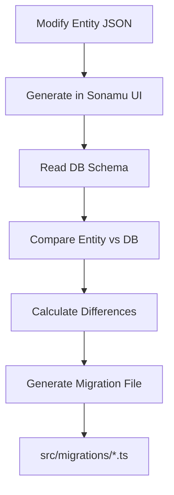
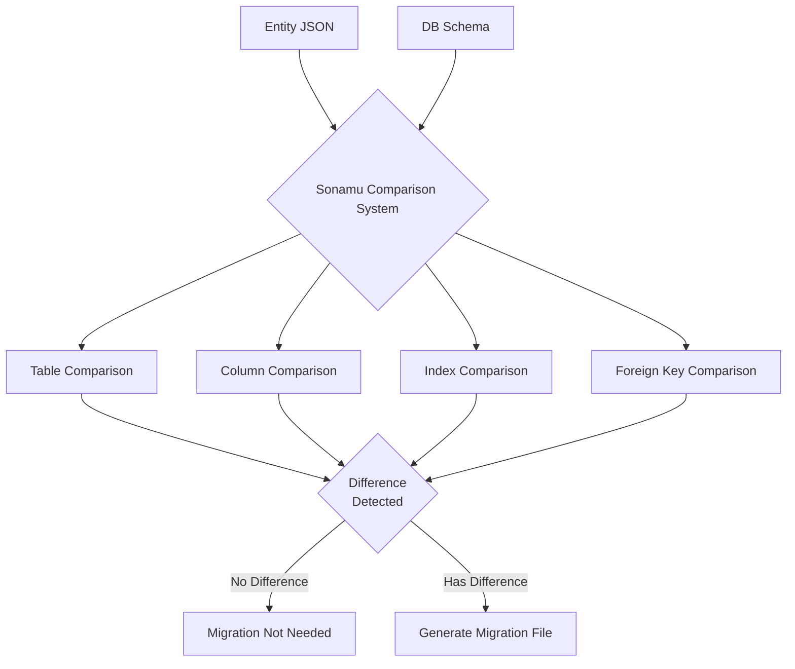

Sonamu **automatically generates** database migrations based on Entity definitions.

## Migration Overview

<CardGroup cols={2}>
  <Card title="Auto Generation" icon="wand-magic-sparkles">
    Entity → Migration No manual writing needed
  </Card>
  <Card title="Version Control" icon="code-branch">
    Timestamp-based Sequential execution guaranteed
  </Card>
  <Card title="Up/Down" icon="arrows-up-down">
    Apply and rollback Bidirectional support
  </Card>
  <Card title="Knex-based" icon="database">
    Standard Knex API Compatibility guaranteed
  </Card>
</CardGroup>

## Migration Generation Flow



## From Entity to Migration

### 1. Entity Definition

```json
// user.entity.json
{
  "id": "User",
  "table": "users",
  "props": [
    { "name": "id", "type": "integer" },
    { "name": "email", "type": "string", "length": 255 },
    { "name": "username", "type": "string", "length": 255 },
    { "name": "role", "type": "enum", "id": "UserRole" }
  ]
}
```

### 2. Auto-Generated Migration

```typescript
// 20251209160747_create__users.ts
import type { Knex } from "knex";

export async function up(knex: Knex): Promise<void> {
  await knex.schema.createTable("users", (table) => {
    table.increments().primary();
    table.string("email", 255).notNullable();
    table.string("username", 255).notNullable();
    table.text("role").notNullable();

    table.unique(["email"], "users_email_unique");
  });
}

export async function down(knex: Knex): Promise<void> {
  return knex.schema.dropTable("users");
}
```

<Info>
  Migration filename: `{timestamp}_{action}_{table_name}.ts` - Timestamp: `YYYYMMDDHHmmss` format -
  Action: `create`, `alter`, `foreign`, `drop`, etc. - Table name: underscore-separated
</Info>

## Migration File Structure

### up Function - Apply Changes

```typescript
export async function up(knex: Knex): Promise<void> {
  // Apply changes to database
  await knex.schema.createTable("users", (table) => {
    // Table definition
  });
}
```

### down Function - Rollback Changes

```typescript
export async function down(knex: Knex): Promise<void> {
  // Undo changes
  return knex.schema.dropTable("users");
}
```

<Warning>
**The down function is required!**

You must define the reverse operation of up for rollbacks.

</Warning>

## Generated Migration Types

### CREATE TABLE

```typescript
// 20251209160747_create__users.ts
export async function up(knex: Knex): Promise<void> {
  await knex.schema.createTable("users", (table) => {
    table.increments().primary();
    table.string("email", 255).notNullable();
    table.string("username", 255).notNullable();
    table.text("role").notNullable();
  });
}

export async function down(knex: Knex): Promise<void> {
  return knex.schema.dropTable("users");
}
```

### ALTER TABLE - Add Column

```typescript
// 20251211150026_alter_departments_add1.ts
export async function up(knex: Knex): Promise<void> {
  await knex.schema.alterTable("departments", (table) => {
    table.string("code", 10).notNullable();
  });
}

export async function down(knex: Knex): Promise<void> {
  await knex.schema.alterTable("departments", (table) => {
    table.dropColumns("code");
  });
}
```

### ALTER TABLE - Drop Column

```typescript
// 20251216132209_alter_projects_drop1.ts
export async function up(knex: Knex): Promise<void> {
  await knex.schema.alterTable("projects", (table) => {
    table.dropColumns("old_field");
  });
}

export async function down(knex: Knex): Promise<void> {
  await knex.schema.alterTable("projects", (table) => {
    // Rollback: re-add column
    table.string("old_field", 100).nullable();
  });
}
```

### Add FOREIGN KEY

```typescript
// 20251209160751_foreign__employees__user_id_department_id.ts
export async function up(knex: Knex): Promise<void> {
  return knex.schema.alterTable("employees", (table) => {
    table.foreign("user_id").references("users.id").onUpdate("CASCADE").onDelete("CASCADE");

    table
      .foreign("department_id")
      .references("departments.id")
      .onUpdate("CASCADE")
      .onDelete("SET NULL");
  });
}

export async function down(knex: Knex): Promise<void> {
  return knex.schema.alterTable("employees", (table) => {
    table.dropForeign(["user_id"]);
    table.dropForeign(["department_id"]);
  });
}
```

## Database Comparison

Sonamu detects differences by comparing the current DB schema with Entities:

### Comparison Targets

1. **Tables**: existence, name
2. **Columns**: type, length, nullable, default
3. **Indexes**: unique, index, composite indexes
4. **Foreign Keys**: referenced table, onUpdate, onDelete
5. **Constraints**: CHECK, DEFAULT, etc.

### Difference Detection

```typescript
// Entity: email length 100 → 255 changed
{
  "name": "email",
  "type": "string",
  "length": 255  // Changed
}

// Generated Migration
export async function up(knex: Knex): Promise<void> {
  await knex.raw(
    `ALTER TABLE users ALTER COLUMN email TYPE varchar(255)`
  );
}
```



## Migration Execution Order

### 1. Timestamp-based Sorting

```
20251209160740_create__companies.ts       (1st)
20251209160741_create__departments.ts     (2nd)
20251209160742_create__employees.ts       (3rd)
20251209160750_foreign__departments.ts    (4th)
20251209160751_foreign__employees.ts      (5th)
```

### 2. Dependency Consideration

```typescript
// Correct order
1. CREATE TABLE companies
2. CREATE TABLE departments (has company_id but no FK yet)
3. CREATE TABLE employees
4. ADD FOREIGN KEY departments.company_id → companies.id
5. ADD FOREIGN KEY employees.department_id → departments.id
```

<Warning>
**Foreign keys are generated as separate migrations!**

CREATE TABLE only creates columns;
foreign key constraints are added later in separate migrations.

</Warning>

## Execution Tracking

### knex_migrations Table

Knex tracks executed migrations:

```sql
SELECT * FROM knex_migrations;
```

| id  | name                                    | batch | migration_time      |
| --- | --------------------------------------- | ----- | ------------------- |
| 1   | 20251209160740_create\_\_companies.ts   | 1     | 2025-12-09 16:10:00 |
| 2   | 20251209160741_create\_\_departments.ts | 1     | 2025-12-09 16:10:00 |
| 3   | 20251209160742_create\_\_employees.ts   | 1     | 2025-12-09 16:10:00 |

- **batch**: Group executed together (rollback unit)
- **migration_time**: Execution time

## Entity Type to Migration Mapping

### Basic Types

| Entity Type | DB Type       | Migration                                |
| ----------- | ------------- | ---------------------------------------- |
| `string`    | `varchar(n)`  | `table.string(name, length)`             |
| `integer`   | `integer`     | `table.integer(name)`                    |
| `boolean`   | `boolean`     | `table.boolean(name)`                    |
| `date`      | `timestamptz` | `table.timestamp(name, { useTz: true })` |
| `json`      | `jsonb`       | `table.jsonb(name)`                      |
| `uuid`      | `uuid`        | `table.uuid(name)`                       |

### Relation Types

```json
// Entity
{
  "type": "relation",
  "name": "user",
  "with": "User",
  "relationType": "BelongsTo"
}

// Migration
table.integer("user_id").nullable();

// Foreign Key (separate migration)
table.foreign("user_id")
  .references("users.id")
  .onUpdate("CASCADE")
  .onDelete("SET NULL");
```

### Indexes

```json
// Entity
{
  "indexes": [
    { "type": "unique", "column": "email" },
    { "type": "index", "columns": ["username", "created_at"] },
    {
      "type": "unique",
      "name": "users_email_active_unique",
      "columns": ["email"],
      "where": "deleted_at IS NULL"
    }
  ]
}

// Migration
table.unique(["email"], "users_email_unique");
table.index(["username", "created_at"], "users_username_created_at_index");
await knex.raw(
  `CREATE UNIQUE INDEX users_email_active_unique ON users (email) WHERE deleted_at IS NULL`,
);
```

`where` is a raw SQL predicate for creating a PostgreSQL partial index. Sonamu compares the
predicate from DB introspection with the one in entity.json, and does not generate an additional
migration if the conditions are equivalent.

## Advanced Features

### Generated Columns

```typescript
// 20251211150026_alter_departments_add1.ts
export async function up(knex: Knex): Promise<void> {
  await knex.raw(
    `ALTER TABLE "departments" 
     ADD COLUMN "code" varchar(10) 
     GENERATED ALWAYS AS ('DEP-' || LPAD(id::text, 3, '0')) 
     STORED NOT NULL`,
  );
}
```

### Full-text Search Index

```typescript
export async function up(knex: Knex): Promise<void> {
  // tsvector column
  await knex.raw(
    `ALTER TABLE "posts" 
     ADD COLUMN "search_vector" tsvector 
     GENERATED ALWAYS AS (to_tsvector('english', title || ' ' || content)) 
     STORED`,
  );

  // GIN index
  await knex.raw(
    `CREATE INDEX posts_search_vector_idx 
     ON posts USING GIN(search_vector)`,
  );
}
```

### Vector Search Index

```typescript
export async function up(knex: Knex): Promise<void> {
  // vector column
  await knex.raw(`ALTER TABLE "documents" ADD COLUMN "embedding" vector(1536)`);

  // HNSW index
  await knex.raw(
    `CREATE INDEX documents_embedding_hnsw_idx 
     ON documents USING hnsw (embedding vector_cosine_ops)`,
  );
}
```

## Next Steps

<CardGroup cols={2}>
  <Card title="Creating Migrations" icon="plus" href="/en/database/migrations/creating-migrations">
    Generate in Sonamu UI
  </Card>
  <Card title="Running Migrations" icon="play" href="/en/database/migrations/running-migrations">
    migrate run command
  </Card>
  <Card title="Rolling Back" icon="rotate-left" href="/en/database/migrations/rolling-back">
    Undo changes
  </Card>
  <Card title="Entity Definition" icon="cube" href="/en/core-concepts/entity/defining-entities">
    Understanding Entity structure
  </Card>
</CardGroup>
