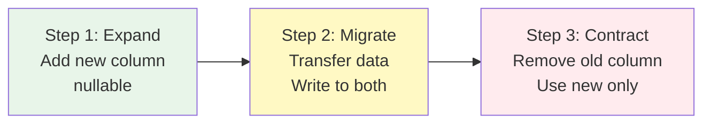
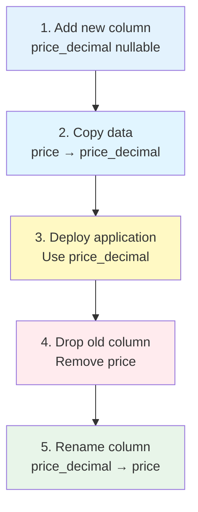
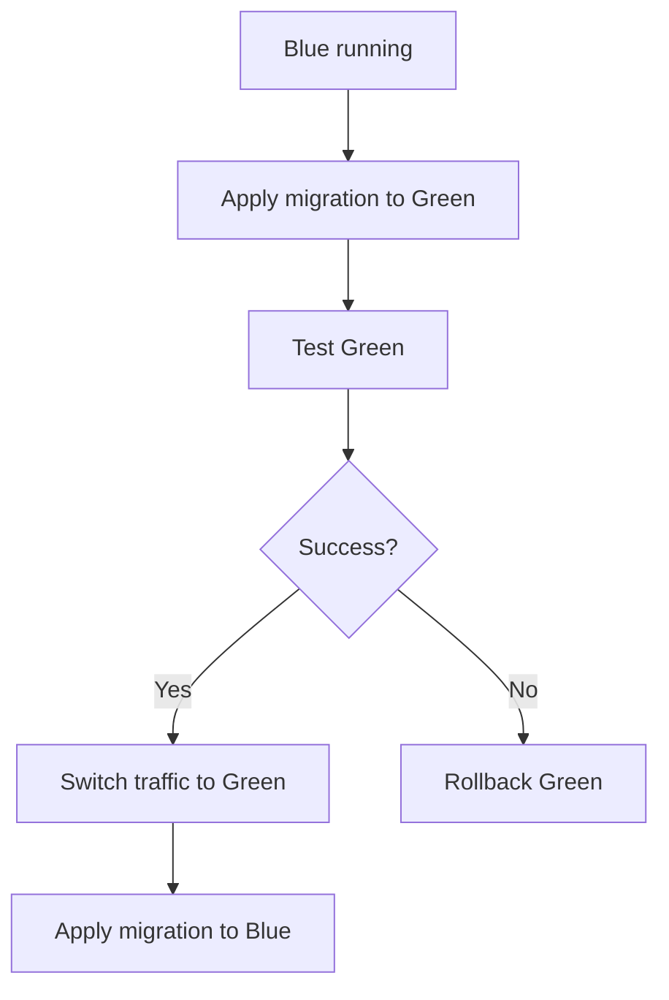

Strategies for safely changing database schemas in production environments.

## Core Principles

<CardGroup cols={2}>
  <Card title="Zero Downtime" icon="circle-check">
    No-downtime deployment
    
    Maintain compatibility
  </Card>
  <Card title="Backward Compatible" icon="arrow-left">
    Backward compatibility
    
    Gradual changes
  </Card>
  <Card title="Rollback Ready" icon="rotate-left">
    Rollback capability
    
    Always prepared
  </Card>
  <Card title="Test First" icon="vial">
    Test first
    
    Staging verification
  </Card>
</CardGroup>

## Zero-Downtime Deployment Patterns

### Pattern 1: Expand-Contract

Add new structure → Migrate → Remove old structure



**Step 1: Expand** - Add new column
```typescript
// Migration 1: Add new column (nullable)
export async function up(knex: Knex): Promise<void> {
  await knex.schema.alterTable("users", (table) => {
    table.string("email_verified", 20).nullable();  // New column
  });
}

// Application: Write to both
await knex("users").update({
  is_verified: true,
  email_verified: "verified",  // Also write to new column
});
```

**Step 2: Migrate (Data Migration)**
```typescript
// Migration 2: Transfer data
export async function up(knex: Knex): Promise<void> {
  await knex.raw(`
    UPDATE users 
    SET email_verified = CASE 
      WHEN is_verified THEN 'verified'
      ELSE 'unverified'
    END
    WHERE email_verified IS NULL
  `);
}
```

**Step 3: Contract** - Remove old column
```typescript
// Migration 3: Remove old column
export async function up(knex: Knex): Promise<void> {
  await knex.schema.alterTable("users", (table) => {
    table.dropColumns("is_verified");  // Remove old column
  });
}
```

<Info>
**Expand-Contract benefits**:
- Zero-downtime deployment possible
- Rollback possible anytime
- No data loss
</Info>

### Pattern 2: Gradual Migration

```typescript
// Phase 1: Add new column (nullable)
export async function up(knex: Knex): Promise<void> {
  await knex.schema.alterTable("users", (table) => {
    table.jsonb("settings").nullable();
  });
}

// Phase 2: Deploy application (start using settings)

// Phase 3: Data migration (background)
async function migrateSettings() {
  const users = await knex("users")
    .whereNull("settings")
    .limit(100);
  
  for (const user of users) {
    await knex("users")
      .where("id", user.id)
      .update({
        settings: { theme: "light", language: "ko" },
      });
  }
}

// Phase 4: Add NOT NULL constraint
export async function up(knex: Knex): Promise<void> {
  await knex.raw(
    `ALTER TABLE users ALTER COLUMN settings SET NOT NULL`
  );
}
```

## Avoiding Dangerous Changes

### ❌ Dangerous: Direct Column Drop

```typescript
// 🚨 Dangerous: Immediate data loss
export async function up(knex: Knex): Promise<void> {
  await knex.schema.alterTable("users", (table) => {
    table.dropColumns("old_field");
  });
}
```

### ✅ Safe: Gradual Drop

```typescript
// Step 1: Make column nullable
export async function up(knex: Knex): Promise<void> {
  await knex.raw(
    `ALTER TABLE users ALTER COLUMN old_field DROP NOT NULL`
  );
}

// Step 2: Stop using in application

// Step 3: Drop after waiting period
export async function up(knex: Knex): Promise<void> {
  await knex.schema.alterTable("users", (table) => {
    table.dropColumns("old_field");
  });
}
```

### ❌ Dangerous: Immediate NOT NULL

```typescript
// 🚨 Dangerous: Existing null data causes error
export async function up(knex: Knex): Promise<void> {
  await knex.schema.alterTable("users", (table) => {
    table.string("phone", 20).notNullable();  // Existing rows are null
  });
}
```

### ✅ Safe: nullable → migration → NOT NULL

```typescript
// Step 1: Add as nullable
export async function up(knex: Knex): Promise<void> {
  await knex.schema.alterTable("users", (table) => {
    table.string("phone", 20).nullable();
  });
}

// Step 2: Set default values
await knex("users")
  .whereNull("phone")
  .update({ phone: "000-0000-0000" });

// Step 3: Add NOT NULL
export async function up(knex: Knex): Promise<void> {
  await knex.raw(
    `ALTER TABLE users ALTER COLUMN phone SET NOT NULL`
  );
}
```

## Data Type Changes

### Safe Type Change Sequence

```typescript
// Step 1: Add new column
export async function up(knex: Knex): Promise<void> {
  await knex.schema.alterTable("products", (table) => {
    table.decimal("price_decimal", 10, 2).nullable();
  });
}

// Step 2: Copy data
await knex.raw(`
  UPDATE products 
  SET price_decimal = price::decimal(10,2)
`);

// Step 3: Application change (use price_decimal)

// Step 4: Drop old column
export async function up(knex: Knex): Promise<void> {
  await knex.schema.alterTable("products", (table) => {
    table.dropColumns("price");
  });
  
  // Rename column
  await knex.raw(
    `ALTER TABLE products RENAME COLUMN price_decimal TO price`
  );
}
```



## Index Strategies

### Concurrent Index Creation

```typescript
// ❌ Wrong: Table lock
export async function up(knex: Knex): Promise<void> {
  await knex.schema.alterTable("users", (table) => {
    table.index(["email"], "users_email_index");
  });
}

// ✅ Correct: Use CONCURRENTLY
export async function up(knex: Knex): Promise<void> {
  await knex.raw(`
    CREATE INDEX CONCURRENTLY users_email_index 
    ON users(email)
  `);
}
```

<Warning>
**CONCURRENTLY caveats**:
- Runs outside transaction
- Takes longer
- Leaves INVALID index on failure
</Warning>

### Index Creation Monitoring

```sql
-- Check progress
SELECT
  schemaname,
  tablename,
  indexname,
  pg_size_pretty(pg_relation_size(indexrelid)) AS index_size
FROM pg_stat_user_indexes
WHERE indexrelname = 'users_email_index';

-- Check for INVALID indexes
SELECT *
FROM pg_indexes
WHERE indexdef LIKE '%INVALID%';
```

## Foreign Key Strategies

### Adding FK to Large Tables

```typescript
// Step 1: Add NOT VALID constraint (fast)
export async function up(knex: Knex): Promise<void> {
  await knex.raw(`
    ALTER TABLE employees 
    ADD CONSTRAINT fk_employees_user_id 
    FOREIGN KEY (user_id) 
    REFERENCES users(id) 
    NOT VALID
  `);
}

// Step 2: Validate constraint (background)
export async function up(knex: Knex): Promise<void> {
  await knex.raw(`
    ALTER TABLE employees 
    VALIDATE CONSTRAINT fk_employees_user_id
  `);
}
```

<Info>
**NOT VALID + VALIDATE benefits**:
- Skips existing data validation (fast)
- Only validates new data immediately
- Full validation later in background
</Info>

## Large Data Migration

### Batch Processing

```typescript
export async function up(knex: Knex): Promise<void> {
  const batchSize = 1000;
  let offset = 0;
  
  while (true) {
    const users = await knex("users")
      .whereNull("normalized_email")
      .limit(batchSize)
      .offset(offset);
    
    if (users.length === 0) break;
    
    for (const user of users) {
      await knex("users")
        .where("id", user.id)
        .update({
          normalized_email: user.email.toLowerCase(),
        });
    }
    
    offset += batchSize;
    console.log(`Processed ${offset} users`);
  }
}
```

### Background Worker

```typescript
// Only add column in migration
export async function up(knex: Knex): Promise<void> {
  await knex.schema.alterTable("users", (table) => {
    table.string("normalized_email").nullable();
  });
}

// Data migration in separate script
// scripts/migrate-emails.ts
async function migrateEmails() {
  const queue = new Queue("email-migration");
  
  const users = await knex("users").whereNull("normalized_email");
  
  for (const user of users) {
    await queue.add({
      userId: user.id,
      email: user.email,
    });
  }
}
```

## Deployment Strategies

### Blue-Green Deployment



### Rolling Deployment

```typescript
// Version N: Old schema compatible
app.get("/users/:id", async (req, res) => {
  const user = await knex("users")
    .select("id", "email", "is_verified")  // Old column
    .where("id", req.params.id)
    .first();
  
  res.json(user);
});

// Migration: Add new column

// Version N+1: Compatible with both schemas
app.get("/users/:id", async (req, res) => {
  const user = await knex("users")
    .select("id", "email", "is_verified", "email_verified")  // Both
    .where("id", req.params.id)
    .first();
  
  res.json({
    ...user,
    verified: user.email_verified || (user.is_verified ? "verified" : "unverified"),
  });
});

// Migration: Remove old column

// Version N+2: New schema only
app.get("/users/:id", async (req, res) => {
  const user = await knex("users")
    .select("id", "email", "email_verified")  // New column only
    .where("id", req.params.id)
    .first();
  
  res.json(user);
});
```

## Testing Strategies

### Migration Testing

```typescript
// migration.test.ts
describe("20251220143200_alter_users_add1", () => {
  beforeEach(async () => {
    await knex.migrate.latest();
  });
  
  afterEach(async () => {
    await knex.migrate.rollback(null, true);
  });
  
  test("up: phone column added", async () => {
    const hasColumn = await knex.schema.hasColumn("users", "phone");
    expect(hasColumn).toBe(true);
  });
  
  test("down: phone column removed", async () => {
    await knex.migrate.down();
    const hasColumn = await knex.schema.hasColumn("users", "phone");
    expect(hasColumn).toBe(false);
  });
  
  test("reversibility: up → down → up", async () => {
    await knex.migrate.down();
    await knex.migrate.up();
    
    const hasColumn = await knex.schema.hasColumn("users", "phone");
    expect(hasColumn).toBe(true);
  });
});
```

### Data Migration Testing

```typescript
test("data migration", async () => {
  // Given: Old schema data
  await knex("users").insert([
    { email: "test@test.com", is_verified: true },
    { email: "test2@test.com", is_verified: false },
  ]);
  
  // When: Run migration
  await knex.migrate.up();
  
  // Then: Verify data
  const users = await knex("users").select("*");
  
  expect(users[0].email_verified).toBe("verified");
  expect(users[1].email_verified).toBe("unverified");
});
```

## Monitoring

### Migration Performance Tracking

```typescript
export async function up(knex: Knex): Promise<void> {
  const startTime = Date.now();
  
  await knex.schema.alterTable("users", (table) => {
    table.string("phone", 20).nullable();
  });
  
  const duration = Date.now() - startTime;
  
  // Logging
  console.log(`Migration completed in ${duration}ms`);
  
  // Send metrics
  await sendMetric("migration.duration", duration, {
    migration: "alter_users_add1",
  });
}
```

### Long-Running Query Monitoring

```sql
-- Check running migration queries
SELECT 
  pid,
  now() - query_start AS duration,
  state,
  query
FROM pg_stat_activity
WHERE state = 'active'
AND query LIKE 'ALTER TABLE%'
ORDER BY duration DESC;
```

## Checklist

### Before Migration Execution

- [ ] Staging environment test completed
- [ ] Production backup completed
- [ ] Rollback plan established
- [ ] Downtime plan (if needed)
- [ ] Team notification
- [ ] Monitoring prepared

### During Migration Execution

- [ ] Error log monitoring
- [ ] Performance metrics check
- [ ] Application health check
- [ ] User feedback check

### After Migration Execution

- [ ] Data integrity verification
- [ ] Application functionality test
- [ ] Performance check
- [ ] Documentation update
- [ ] Rollback test (staging)

## Real-world Examples

### Example 1: Adding Column to Large Table

```typescript
// Adding indexed column to 100M row table

// Step 1: Add column (1 second)
await knex.schema.alterTable("posts", (table) => {
  table.integer("user_id").nullable();
});

// Step 2: Populate data in background (30 minutes)
// Batch processing in separate worker

// Step 3: Create index CONCURRENTLY (15 minutes)
await knex.raw(`
  CREATE INDEX CONCURRENTLY posts_user_id_idx 
  ON posts(user_id)
`);

// Step 4: NOT NULL constraint (1 second)
await knex.raw(`
  ALTER TABLE posts 
  ALTER COLUMN user_id SET NOT NULL
`);
```

### Example 2: Renaming Column

```typescript
// Step 1: Add new column
await knex.schema.alterTable("products", (table) => {
  table.string("product_name", 200).nullable();
});

// Step 2: Copy data
await knex.raw(`
  UPDATE products 
  SET product_name = name
`);

// Step 3: Deploy application (use product_name)

// Step 4: Drop old column
await knex.schema.alterTable("products", (table) => {
  table.dropColumns("name");
});
```

## Next Steps

<CardGroup cols={2}>
  <Card title="Creating Migrations" icon="plus" href="/en/database/migrations/creating-migrations">
    Generate in Sonamu UI
  </Card>
  <Card title="Running Migrations" icon="play" href="/en/database/migrations/running-migrations">
    migrate run command
  </Card>
  <Card title="Rolling Back" icon="rotate-left" href="/en/database/migrations/rolling-back">
    Undo changes
  </Card>
  <Card title="How It Works" icon="gear" href="/en/database/migrations/how-migrations-work">
    Understanding auto-generation
  </Card>
</CardGroup>
