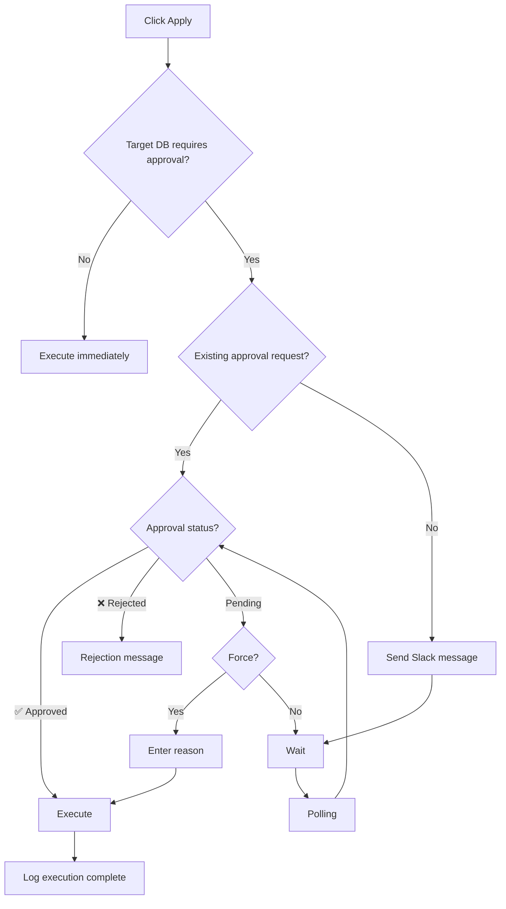

This feature requires manager (CTO/team lead) approval when applying migrations to the Production DB. It sends a Slack message and treats it as approved when a ✅ emoji is added.

## Goals

<CardGroup cols={2}>
  <Card title="Conscious Deployment" icon="shield-check">
    Recognize Production migrations as "non-routine separate tasks"
  </Card>
  <Card title="Force Option" icon="bolt">
    Can force proceed without approval (with reason logged)
  </Card>
  <Card title="Duplicate Prevention" icon="check-double">
    Skip re-request if same migration combination already approved
  </Card>
  <Card title="Failure Handling" icon="wrench">
    Comment out config to restore original behavior during Slack outages
  </Card>
</CardGroup>

## Configuration

### sonamu.config.ts

```typescript
export default defineConfig({
  // ... existing config

  slackConfirm: {
    targets: ["production"], // DB keys requiring approval
    botToken: process.env.SLACK_BOT_TOKEN ?? "",
    channelId: process.env.SLACK_CHANNEL_ID ?? "", // e.g., "C01234567"
  },
});
```

### Environment Variables

```bash
SLACK_BOT_TOKEN=xoxb-...
SLACK_CHANNEL_ID=C01234567
```

<Info>
  Commenting out the `slackConfirm` block will restore the original behavior (immediate execution
  without approval).
</Info>

## Slack App Setup

### 1. Create App

1. [Slack API](https://api.slack.com/apps) → Create New App
2. Select "From scratch"
3. App Name: "Sonamu Migration" (or your preferred name)
4. Select Workspace

### 2. Add Bot Token Scopes

Go to OAuth & Permissions → Scopes → Bot Token Scopes and add:

| Scope             | Purpose                                |
| ----------------- | -------------------------------------- |
| `chat:write`      | Send messages, post reasons in threads |
| `reactions:read`  | Check emojis                           |
| `reactions:write` | Add ✅ on force                        |

### 3. Install and Configure

1. Click Install to Workspace
2. Copy Bot User OAuth Token (`xoxb-...`)
3. In your channel, run `/invite @botname`
4. Get Channel ID (right-click channel name → "Copy link" → `C...` part in URL)

## Approval Flow



### Approval Request Message

```
🗄️ *Production Migration Approval Request*

*Requestor:* user@example.com
*Target DB:* production
*Time:* 2025. 1. 15. 3:30:00 PM

*Pending Migrations:*
• 20251220143022_create__users.ts
• 20251220143100_create__posts.ts

✅ Approve  ❌ Reject
```

## Usage

### Normal Approval

1. Click Apply for Production target migration in Sonamu UI
2. Approval request message sent to Slack channel
3. Manager clicks ✅ emoji
4. Migration executes automatically

### Force Proceed

When you need to proceed without waiting for approval:

1. Click "Force Proceed" button while waiting
2. Enter reason
3. Migration executes (force reason logged to Slack)

<Warning>
  Force proceeding logs the reason to the Slack thread. This can be tracked later for audit
  purposes.
</Warning>

### Rejection Handling

When manager clicks ❌ emoji, the migration is rejected.

## Local File Storage

Approval request information is stored locally to prevent re-requests for the same migration combination.

### Storage Location

```
src/migrations/.slack-confirm-{hash}
```

### Filename Convention

- `{hash}` = MD5 hash of sorted migration names (12 characters)
- Example: `.slack-confirm-a1b2c3d4e5f6`

### File Contents

```
{channel_id}:{message_ts}
```

Example: `C01234567:1705412345.000100`

## Slack API Reference

### APIs Used

| API                            | Purpose                        |
| ------------------------------ | ------------------------------ |
| `chat.postMessage`             | Send approval request message  |
| `reactions.get`                | Check emojis (Tier 3, 50+/min) |
| `reactions.add`                | Add ✅ on force                |
| `chat.postMessage` (thread_ts) | Log to thread                  |

### Rate Limit

- `reactions.get` is a Tier 3 API allowing 50+ calls per minute
- When limit is exceeded, responses are delayed rather than blocked
- Polling interval is set to 2 seconds, which is safe

## Test Scenarios

| Scenario          | Behavior                                                    |
| ----------------- | ----------------------------------------------------------- |
| Normal flow       | Apply → Slack message → Wait → ✅ → Execute                 |
| Existing approval | Apply → Check existing ts → ✅ exists → Execute immediately |
| Rejection         | Apply → Wait → ❌ → Rejection message                       |
| Force             | Apply → Wait → Force → Enter reason → Execute               |
| No config         | Same as original behavior (immediate execution)             |
| Non-target DB     | DBs not in targets execute without approval                 |

## Next Steps

<CardGroup cols={2}>
  <Card title="Running Migrations" icon="play" href="/en/database/migrations/running-migrations">
    Basic execution methods
  </Card>
  <Card title="Rolling Back" icon="rotate-left" href="/en/database/migrations/rolling-back">
    Undo via Sonamu UI or Migrator
  </Card>
  <Card title="Strategies" icon="chess" href="/en/database/migrations/migration-strategies">
    Safe migration strategies
  </Card>
  <Card title="How It Works" icon="gear" href="/en/database/migrations/how-migrations-work">
    Understanding auto-generation
  </Card>
</CardGroup>
