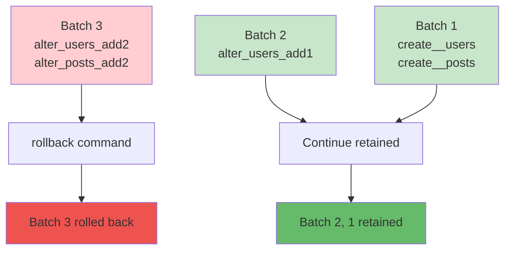

Rollback migrations to restore the database to a previous state.

## Rollback Commands

<CardGroup cols={2}>
  <Card title="rollback" icon="rotate-left">
    Rollback recent batch Multiple at once
  </Card>
  <Card title="rollback --all" icon="arrows-rotate">
    Rollback all migrations Return to initial state
  </Card>
  <Card title="down" icon="arrow-down">
    One at a time Step-by-step rollback
  </Card>
  <Card title="status" icon="list-check">
    Check status before rollback Verify batches
  </Card>
</CardGroup>

## Basic Rollback

### Rollback Recent Batch

```bash
pnpm sonamu migrate rollback
```

**Execution Result**:

```
Batch 2 rolled back: 1 migration
✅ 20251220143200_alter_users_add1.ts
```

<Info>`migrate rollback` rolls back all migrations in the most recent batch.</Info>

### Check Current Status

```bash
pnpm sonamu migrate status
```

**Output**:

```
Executed migrations (Batch 1):
  ✅ 20251220143022_create__users.ts
  ✅ 20251220143100_create__posts.ts

Executed migrations (Batch 2):
  ✅ 20251220143200_alter_users_add1.ts  ← This batch gets rolled back

Pending migrations:
  ⏳ 20251220143300_alter_posts_add1.ts
```

## Rollback Methods

### Batch-based Rollback

```bash
# Check status
pnpm sonamu migrate status

# Batch 3 (most recent)
✅ 20251220150000_alter_users_add2.ts
✅ 20251220150100_alter_posts_add2.ts

# Batch 2
✅ 20251220143200_alter_users_add1.ts

# Rollback (Batch 3 only)
pnpm sonamu migrate rollback

# Result: 2 migrations in Batch 3 rolled back
Batch 3 rolled back: 2 migrations
✅ 20251220150000_alter_users_add2.ts
✅ 20251220150100_alter_posts_add2.ts
```

### One at a Time

```bash
pnpm sonamu migrate down
```

**First Run**:

```
Batch 2 rolled back: 1 migration
✅ 20251220143200_alter_users_add1.ts
```

**Second Run**:

```
Batch 1 rolled back: 1 migration
✅ 20251220143100_create__posts.ts
```

### Full Rollback

```bash
pnpm sonamu migrate rollback --all
```

**Execution Result**:

```
Batch 2 rolled back: 1 migration
✅ 20251220143200_alter_users_add1.ts

Batch 1 rolled back: 2 migrations
✅ 20251220143100_create__posts.ts
✅ 20251220143022_create__users.ts

All migrations rolled back successfully
```

<Warning>`rollback --all` deletes all tables! Never use in production.</Warning>

## The down Function

### Basic Structure

```typescript
export async function down(knex: Knex): Promise<void> {
  // Perform reverse operation of up
}
```

### CREATE TABLE Rollback

```typescript
// up: Create table
export async function up(knex: Knex): Promise<void> {
  await knex.schema.createTable("users", (table) => {
    table.increments().primary();
    table.string("email", 255).notNullable();
  });
}

// down: Drop table
export async function down(knex: Knex): Promise<void> {
  return knex.schema.dropTable("users");
}
```

### ALTER TABLE Rollback

```typescript
// up: Add column
export async function up(knex: Knex): Promise<void> {
  await knex.schema.alterTable("users", (table) => {
    table.string("phone", 20).nullable();
  });
}

// down: Drop column
export async function down(knex: Knex): Promise<void> {
  await knex.schema.alterTable("users", (table) => {
    table.dropColumns("phone");
  });
}
```

### FOREIGN KEY Rollback

```typescript
// up: Add foreign key
export async function up(knex: Knex): Promise<void> {
  return knex.schema.alterTable("employees", (table) => {
    table.foreign("user_id").references("users.id").onUpdate("CASCADE").onDelete("CASCADE");
  });
}

// down: Drop foreign key
export async function down(knex: Knex): Promise<void> {
  return knex.schema.alterTable("employees", (table) => {
    table.dropForeign(["user_id"]);
  });
}
```

## Rollback Scenarios

### Scenario 1: Fix Incorrect Migration

```bash
# 1. Run migration
pnpm sonamu migrate run
✅ 20251220143200_alter_users_add1.ts

# 2. Discover problem (wrong column type)

# 3. Rollback
pnpm sonamu migrate rollback

# 4. Fix migration file
vim src/migrations/20251220143200_alter_users_add1.ts

# 5. Run again
pnpm sonamu migrate run
```

### Scenario 2: Production Emergency Rollback

```bash
# 1. Problem discovered after production deployment

# 2. Immediate rollback
NODE_ENV=production pnpm sonamu migrate rollback

# 3. Deploy previous application version

# 4. Fix problem and redeploy
```

### Scenario 3: Partial Rollback

```bash
# Current status
Batch 3: alter_users_add2.ts, alter_posts_add2.ts
Batch 2: alter_users_add1.ts
Batch 1: create__users.ts, create__posts.ts

# Rollback only Batch 3 (keep Batch 2, 1)
pnpm sonamu migrate rollback

# Result
Batch 2: alter_users_add1.ts  ← Retained
Batch 1: create__users.ts, create__posts.ts  ← Retained
```



## Data Preservation

### Data Loss on Rollback

```typescript
// up: Add column
export async function up(knex: Knex): Promise<void> {
  await knex.schema.alterTable("users", (table) => {
    table.string("phone", 20).nullable();
  });
}

// down: Drop column (data loss!)
export async function down(knex: Knex): Promise<void> {
  await knex.schema.alterTable("users", (table) => {
    table.dropColumns("phone"); // ← All phone data deleted
  });
}
```

<Warning>
**Data loss warning!**

Data cannot be recovered when columns/tables are dropped.
Backup is required in production!

</Warning>

### Safe Rollback Pattern

```typescript
// Step 1: Add column (nullable)
export async function up(knex: Knex): Promise<void> {
  await knex.schema.alterTable("users", (table) => {
    table.string("new_phone", 20).nullable();
  });
}

// Step 2: Data migration
await knex("users").update({
  new_phone: knex.raw("old_phone"),
});

// Step 3: Keep old_phone column (rollback preparation)
// → Delete later in separate migration
```

## Non-reversible Cases

### Data Transformation

```typescript
// up: Type change
export async function up(knex: Knex): Promise<void> {
  await knex.raw(
    `ALTER TABLE users 
     ALTER COLUMN age TYPE integer 
     USING age::integer`,
  );
}

// down: Original data cannot be restored
export async function down(knex: Knex): Promise<void> {
  await knex.raw(
    `ALTER TABLE users 
     ALTER COLUMN age TYPE varchar(255)`,
  );
  // "25" → 25 → "25" (loss if original was "025")
}
```

### Data Deletion

```typescript
// up: Delete specific data
export async function up(knex: Knex): Promise<void> {
  await knex("users").where("is_deleted", true).delete();
}

// down: Deleted data cannot be restored
export async function down(knex: Knex): Promise<void> {
  // Cannot restore!
}
```

## Rollback Strategies

### 1. Backup First

```bash
# PostgreSQL backup
pg_dump -U postgres -d mydb > backup_before_rollback.sql

# Rollback
pnpm sonamu migrate rollback

# Restore if issues occur
psql -U postgres -d mydb < backup_before_rollback.sql
```

### 2. Staging Test

```bash
# Test rollback in staging
NODE_ENV=staging pnpm sonamu migrate rollback

# If no issues, production
NODE_ENV=production pnpm sonamu migrate rollback
```

### 3. Incremental Rollback

```bash
# Rollback one at a time
pnpm sonamu migrate down

# Check status
pnpm sonamu migrate status

# Test application

# Next rollback
pnpm sonamu migrate down
```

## Error Handling

### Rollback Failure

```bash
pnpm sonamu migrate rollback
```

**Error**:

```
❌ Error rolling back 20251220143200_alter_users_add1.ts
   Error: column "phone" does not exist
```

**Causes**:

- Migration was only partially applied
- down function doesn't match up
- DB was modified manually

**Solutions**:

1. Manually verify DB state
2. Modify knex_migrations table
3. Fix down function and retry

### Forced Rollback

```sql
-- Remove from knex_migrations
DELETE FROM knex_migrations
WHERE name = '20251220143200_alter_users_add1.ts';

-- Manually undo changes
ALTER TABLE users DROP COLUMN phone;
```

## Rollback Logs

### Verbose Logs

```bash
pnpm sonamu migrate rollback --verbose
```

**Output**:

```
Rolling back migration: 20251220143200_alter_users_add1.ts
SQL: ALTER TABLE "users" DROP COLUMN "phone"
✅ Completed in 23ms

Batch 2 rolled back: 1 migration
```

### Querying Rollback History

```sql
-- Check recently rolled back migrations
SELECT * FROM knex_migrations
WHERE batch = (SELECT MAX(batch) + 1 FROM knex_migrations);
```

## Practical Tips

### 1. Verify down Function

```typescript
// Test: up → down → up
test("migration reversibility", async () => {
  await migration.up(knex);
  await migration.down(knex);
  await migration.up(knex); // Should be runnable again
});
```

### 2. Document Rollback Plan

```markdown
# Rollback Plan

## Migration: 20251220143200_alter_users_add1.ts

### Changes

- Add column: users.phone

### Rollback Impact

- Data loss: users.phone data deleted
- Estimated time: 5 seconds
- Downtime: None (nullable column)

### Rollback Steps

1. `pnpm sonamu migrate rollback`
2. Deploy previous app version
3. Verify phone field not used
```

### 3. Auto-rollback Script

```bash
#!/bin/bash
# auto-rollback.sh

echo "Creating backup..."
pg_dump -U postgres -d mydb > backup.sql

echo "Rolling back..."
pnpm sonamu migrate rollback

if [ $? -eq 0 ]; then
  echo "✅ Rollback successful"
else
  echo "❌ Rollback failed, restoring backup..."
  psql -U postgres -d mydb < backup.sql
fi
```

## Next Steps

<CardGroup cols={2}>
  <Card title="Strategies" icon="chess" href="/en/database/migrations/migration-strategies">
    Safe migration strategies
  </Card>
  <Card title="Running Migrations" icon="play" href="/en/database/migrations/running-migrations">
    Apply with migrate run
  </Card>
  <Card title="Creating Migrations" icon="plus" href="/en/database/migrations/creating-migrations">
    Generate in Sonamu UI
  </Card>
  <Card title="How It Works" icon="gear" href="/en/database/migrations/how-migrations-work">
    Understanding auto-generation
  </Card>
</CardGroup>
