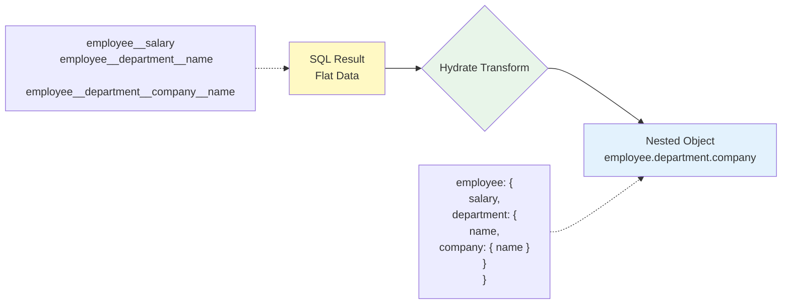

Subsets are defined in the `subsets` object within Entity JSON files.

## Basic Subset Definition

### Entity Structure

```json
{
  "id": "User",
  "table": "users",
  "props": [
    { "name": "id", "type": "integer" },
    { "name": "username", "type": "string" },
    { "name": "email", "type": "string" },
    { "name": "role", "type": "enum", "id": "UserRole" }
  ],
  "subsets": {
    "A": ["id", "username", "email", "role"],
    "SS": ["id", "username"]
  }
}
```

<Frame>
  
</Frame>

### Subset Definition Rules

<CodeGroup>
```json title="Basic Fields"
{
  "subsets": {
    "A": [
      "id",
      "created_at",
      "username",
      "email",
      "role"
    ]
  }
}
```

```json title="Relation Fields (Dot Notation)"
{
  "subsets": {
    "P": ["id", "username", "employee.id", "employee.salary", "employee.department.name"]
  }
}
```

```json title="Multiple Subsets"
{
  "subsets": {
    "L": ["id", "username", "role"],
    "P": ["id", "username", "employee.salary"],
    "SS": ["id", "username"]
  }
}
```

</CodeGroup>

## Selecting Relation Fields

### OneToOne Relations

```json
{
  "props": [
    { "name": "id", "type": "integer" },
    { "name": "username", "type": "string" },
    {
      "type": "relation",
      "name": "employee",
      "with": "Employee",
      "relationType": "OneToOne"
    }
  ],
  "subsets": {
    "P": ["id", "username", "employee.id", "employee.employee_number", "employee.salary"]
  }
}
```

<Info>
  OneToOne relations are **automatically LEFT JOINed**. Selecting `employee.id` will join the
  `employees` table.
</Info>

### Nested Relations (2+ Levels)

```json
{
  "subsets": {
    "P": [
      "id",
      "username",
      "employee.salary",
      "employee.department.name",
      "employee.department.company.name"
    ]
  }
}
```

**SQL Result**:

```sql
SELECT
  users.id,
  users.username,
  employees.salary AS employee__salary,
  departments.name AS employee__department__name,
  companies.name AS employee__department__company__name
FROM users
LEFT JOIN employees ON users.id = employees.user_id
LEFT JOIN departments ON employees.department_id = departments.id
LEFT JOIN companies ON departments.company_id = companies.id
```

**Hydrate Result**:

```typescript
{
  id: 1,
  username: "john",
  employee: {
    salary: "70000",
    department: {
      name: "Engineering",
      company: {
        name: "Tech Corp"
      }
    }
  }
}
```



## Subset Naming Strategy

### General Conventions

```json
{
  "subsets": {
    "A": [...],   // All - all fields (admin detail)
    "L": [...],   // List - for lists (table rows)
    "P": [...],   // Profile - profile (with relations)
    "SS": [...],  // Summary - summary (dropdowns, tags)
    "C": [...]    // Card - Card UI
  }
}
```

<Frame>
  
</Frame>

### Domain-Specific Subsets

```json
{
  "subsets": {
    "AdminList": ["id", "username", "email", "role", "created_at"],
    "UserCard": ["id", "username", "role"],
    "ProfileView": ["id", "username", "bio", "employee.department.name"]
  }
}
```

<Tip>
  **Naming Tips**: - Use short, clear names (A, L, P, etc.) - Maintain consistent conventions within
  your team - Can use meaningful domain-specific names
</Tip>

## Subset Design Principles

### 1. Minimum Fields Principle

```json
// ❌ Bad: Including unnecessary fields
{
  "L": [
    "id", "created_at", "updated_at", "deleted_at",
    "username", "email", "password", "bio",
    "last_login_at", "is_verified"
  ]
}

// ✅ Good: Only fields needed for list
{
  "L": [
    "id",
    "username",
    "role",
    "created_at"
  ]
}
```

### 2. Separate by Purpose

```json
{
  "subsets": {
    // For list views
    "L": ["id", "username", "role", "created_at"],

    // For detail views (with relations)
    "P": ["id", "username", "email", "bio", "employee.salary", "employee.department.name"],

    // For dropdowns
    "SS": ["id", "username"]
  }
}
```

### 3. Performance Considerations

```json
// ✅ Good: JOIN only needed relations
{
  "P": [
    "id",
    "username",
    "employee.department.name"
  ]
}

// ❌ Bad: Unnecessary JOINs
{
  "P": [
    "id",
    "username",
    "employee.id",
    "employee.company.id",
    "employee.projects.id"
  ]
}
```

<Info>
  **Performance Tips**: - Minimize JOINs (only needed relations) - Use L Subset for list views
  (exclude relations) - Use P Subset only for detail views (include relations)
</Info>

<Frame>
  
</Frame>

## Practical Example

### User Entity

```json
{
  "id": "User",
  "table": "users",
  "props": [
    { "name": "id", "type": "integer" },
    { "name": "created_at", "type": "date" },
    { "name": "username", "type": "string" },
    { "name": "email", "type": "string" },
    { "name": "role", "type": "enum", "id": "UserRole" },
    { "name": "bio", "type": "string", "nullable": true },
    {
      "type": "relation",
      "name": "employee",
      "with": "Employee",
      "relationType": "OneToOne",
      "nullable": true
    }
  ],
  "subsets": {
    "A": ["id", "created_at", "username", "email", "role", "bio"],
    "L": ["id", "username", "role", "created_at"],
    "P": ["id", "username", "email", "bio", "employee.salary", "employee.department.name"],
    "SS": ["id", "username"]
  }
}
```

## Code Generation

When you define Subsets, types are automatically generated:

```bash
# Regenerate code after Subset changes
pnpm sonamu sync
```

<Warning>
  After changing Subsets, you **must run Code Generation**. This updates the TypeScript types.
</Warning>

**Generated Types**:

```typescript
// sonamu.generated.ts

export type UserSubsetKey = "A" | "L" | "P" | "SS";

export type UserSubsetMapping = {
  A: {
    id: number;
    created_at: Date;
    username: string;
    email: string;
    role: UserRole;
    bio: string | null;
  };
  L: {
    id: number;
    username: string;
    role: UserRole;
    created_at: Date;
  };
  P: {
    id: number;
    username: string;
    email: string;
    bio: string | null;
    employee: {
      salary: string;
      department: {
        name: string;
      };
    } | null;
  };
  SS: {
    id: number;
    username: string;
  };
};
```

<Frame>
  
</Frame>

## Next Steps

<CardGroup cols={2}>
  <Card title="Using Subsets" icon="code" href="/en/database/subsets/using-subsets">
    Use Subsets in Model
  </Card>
  <Card
    title="Nested Relations"
    icon="diagram-project"
    href="/en/database/subsets/nested-relations"
  >
    Load 1:N with LoaderQuery
  </Card>
  <Card title="Entity Definition" icon="cube" href="/en/core-concepts/entity/defining-entities">
    Understanding Entity structure
  </Card>
  <Card
    title="Code Generation"
    icon="wand-magic-sparkles"
    href="/en/auto-generation/code-generation"
  >
    Automatic code generation
  </Card>
</CardGroup>
