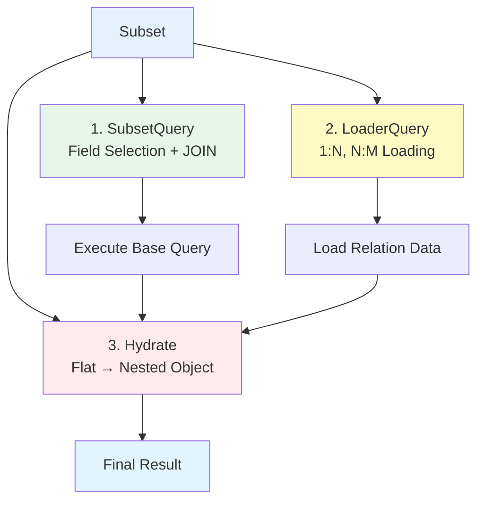
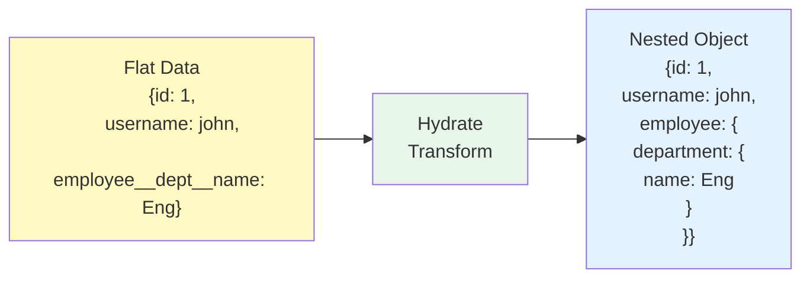

Subsets are **predefined query templates** for retrieving Entity data in various forms.

## Subset Overview

<CardGroup cols={2}>
  <Card title="Flexible Retrieval" icon="table-cells">
    Data formats for each situation
    
    A, P, SS, etc.
  </Card>
  <Card title="Type Safety" icon="shield">
    Compile-time validation
    
    Automatic type inference
  </Card>
  <Card title="Relation Loading" icon="link">
    Integrated JOIN and Loader
    
    1:N, N:M support
  </Card>
  <Card title="Performance Optimization" icon="gauge-high">
    Select only needed fields
    
    Solve N+1 problem
  </Card>
</CardGroup>

## Why Subsets are Needed

### Problem: Limitations of Single Queries

Each API requires different data formats:

```typescript
// ❌ Problem 1: List query - too much data
const users = await db.table("users").selectAll();
// → Fetches all columns (including password, bio, unnecessary info)

// ❌ Problem 2: Detail query - complex relation loading
const user = await db.table("users").where("id", 1).first();
const employee = await db.table("employees").where("user_id", user.id).first();
const department = await db.table("departments").where("id", employee.department_id).first();
// → N+1 problem, code duplication

// ❌ Problem 3: Lack of type safety
type UserList = {
  id: number;
  username: string;
  role: string;
}; // Manual type definition required
```

### Solution: Unify with Subsets

```typescript
// ✅ Subset A: Full information
const admin = await UserModel.findById(1, ["A"]);
// Type: { id, created_at, email, username, role, bio, ... }

// ✅ Subset P: Profile + relations
const profile = await UserModel.findById(1, ["P"]);
// Type: { id, username, employee: { salary, department: { name } } }

// ✅ Subset SS: Summary information
const summary = await UserModel.findById(1, ["SS"]);
// Type: { id, username, role, last_login_at }
```

## Subset Components



### 1. SubsetQuery - Base Query

Field selection defined in Entity:

```json
{
  "subsets": {
    "A": ["id", "username", "email", "role"],
    "P": ["id", "username", "employee.department.name"],
    "SS": ["id", "username"]
  }
}
```

### 2. LoaderQuery - Relation Loading

Loading 1:N, N:M relation data:

```typescript
// Loader definition (auto-generated)
const loaders = {
  employees: {
    as: "employees",
    refId: "department_id",
    qb: (qb, fromIds) => 
      qb.table("employees")
        .whereIn("department_id", fromIds)
        .select({ id: "id", name: "username" }),
  },
};
```

### 3. Hydrate - Result Transformation

Flat data → Nested object:

```typescript
// Flat result (from DB)
{
  id: 1,
  username: "john",
  employee__department__name: "Engineering"
}

// ↓ Hydrate transformation

// Nested object (final result)
{
  id: 1,
  username: "john",
  employee: {
    department: {
      name: "Engineering"
    }
  }
}
```



## Subset Naming Conventions

Common Subset name patterns:

| Subset | Meaning | Usage Example |
|--------|---------|---------------|
| **A** | All | Admin page detail |
| **P** | Profile | User profile view |
| **L** | List | List API, table rows |
| **SS** | Summary | Dropdowns, brief info |
| **C** | Card | Card UI components |

<Info>
Subset names can be freely defined. Use consistent conventions within your team.
</Info>

## Practical Examples

### User List API

```typescript
// GET /users - User list
async list(params: UserListParams) {
  const users = await UserModel.findMany({
    listParams: params,
    subsetKey: "L",  // Use List Subset
  });
  
  // Type: { id: number; username: string; role: string; created_at: Date }[]
  return users.map(user => ({
    id: user.id,
    username: user.username,
    role: user.role,
    createdAt: user.created_at,
  }));
}
```

### User Profile API

```typescript
// GET /users/:id/profile
async getProfile(userId: number) {
  const user = await UserModel.findById(userId, ["P"]);
  
  if (!user) {
    throw new Error("User not found");
  }
  
  // Type: {
  //   id: number;
  //   username: string;
  //   employee: {
  //     salary: string;
  //     department: { name: string }
  //   }
  // }
  
  return {
    id: user.id,
    username: user.username,
    department: user.employee?.department?.name,
    salary: user.employee?.salary,
  };
}
```

## Subset vs Raw Puri

### Using Subset (Recommended)

```typescript
// ✅ Using Subset
const user = await UserModel.findById(1, ["P"]);
// - Type safe
// - Code reuse
// - Easy maintenance
```

### Using Raw Puri

```typescript
// ⚠️ Raw Puri (special cases only)
const user = await UserModel.getPuri("r")
  .table("users")
  .join("employees", "users.id", "employees.user_id")
  .leftJoin("departments", "employees.department_id", "departments.id")
  .select({
    id: "users.id",
    username: "users.username",
    deptName: "departments.name",
  })
  .where("users.id", 1)
  .first();
// - Complex type inference
// - Code duplication
// - Use only for special queries not expressible with Subsets
```

<Tip>
**When to use Raw Puri?**
- Complex queries not expressible with Subsets
- Special cases requiring performance optimization
- One-time data migrations

For typical CRUD, **always use Subsets**.
</Tip>

## Next Steps

<CardGroup cols={2}>
  <Card title="Defining Subsets" icon="pen" href="/en/database/subsets/defining-subsets">
    Create Subsets in Entity
  </Card>
  <Card title="Using Subsets" icon="code" href="/en/database/subsets/using-subsets">
    Use Subsets in Model
  </Card>
  <Card title="Nested Relations" icon="diagram-project" href="/en/database/subsets/nested-relations">
    Load 1:N, N:M with LoaderQuery
  </Card>
  <Card title="Puri Basics" icon="database" href="/en/database/puri/basic-queries">
    Learn Puri query builder
  </Card>
</CardGroup>
