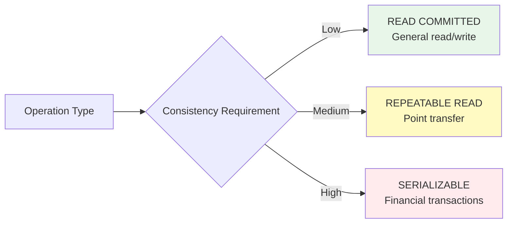
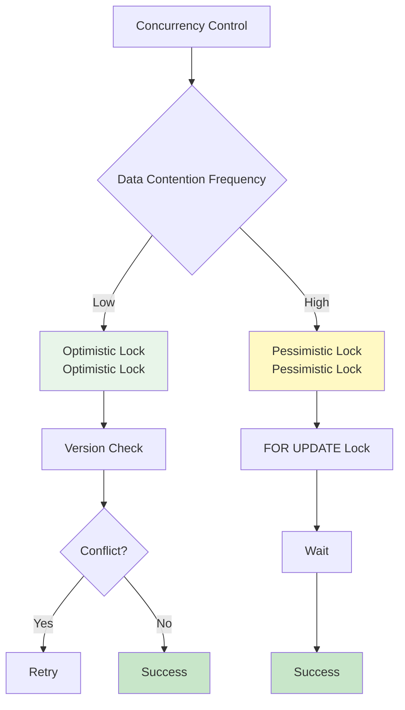

Using transactions correctly ensures data integrity while optimizing performance.

## Core Principles

<CardGroup cols={2}>
  <Card title="ACID Guarantee" icon="shield-check">
    Atomicity, Consistency, Isolation, Durability
    
    Maintain data integrity
  </Card>
  <Card title="Short Transactions" icon="clock">
    Only as needed
    
    Minimize lock waiting
  </Card>
  <Card title="Appropriate Isolation" icon="sliders">
    Match requirements
    
    Balance performance and consistency
  </Card>
  <Card title="Error Handling" icon="triangle-exclamation">
    Clear rollback strategy
    
    Maintain consistent state
  </Card>
</CardGroup>

## Transaction Scope

### ✅ Good Pattern: Short and Clear Scope

```typescript
class OrderModel extends BaseModelClass {
  @transactional()
  async createOrder(
    userId: number,
    items: OrderItem[]
  ): Promise<number> {
    const wdb = this.getPuri("w");
    
    // In transaction: Only data changes
    const orderRef = wdb.ubRegister("orders", {
      user_id: userId,
      status: "pending",
      total_amount: this.calculateTotal(items),
    });
    
    items.forEach((item) => {
      wdb.ubRegister("order_items", {
        order_id: orderRef,
        product_id: item.productId,
        quantity: item.quantity,
        price: item.price,
      });
    });
    
    const [orderId] = await wdb.ubUpsert("orders");
    await wdb.ubUpsert("order_items");
    
    return orderId;
  }
  
  async placeOrder(
    userId: number,
    items: OrderItem[]
  ): Promise<number> {
    // 1. Validation (outside transaction)
    await this.validateUser(userId);
    await this.checkInventory(items);
    
    // 2. Create order (transaction)
    const orderId = await this.createOrder(userId, items);
    
    // 3. Follow-up work (outside transaction)
    await this.sendOrderConfirmation(orderId);
    
    return orderId;
  }
}
```

### ❌ Bad Pattern: Long Transaction

```typescript
class OrderModel extends BaseModelClass {
  @transactional()
  async placeOrderBad(
    userId: number,
    items: OrderItem[]
  ): Promise<number> {
    const wdb = this.getPuri("w");
    
    // ❌ External API call inside transaction
    const user = await this.fetchUserFromExternalAPI(userId);
    
    // ❌ Complex calculation inside transaction
    await this.calculateComplexPricing(items);
    
    // ❌ Email sending inside transaction
    await this.sendEmail(user.email);
    
    // Actual data save
    const [orderId] = await wdb
      .table("orders")
      .insert({ user_id: userId })
      .returning({ id: "id" });
    
    return orderId.id;
  }
}
```

<Warning>
**Do NOT include in transactions**:
- External API calls
- File I/O
- Email/SMS sending
- Complex calculations
- Slow queries
</Warning>

## Choosing Isolation Levels

### Recommended Isolation Levels by Use Case

```typescript
class ExampleModel extends BaseModelClass {
  // General read/write - READ COMMITTED
  @transactional({ isolation: "read committed" })
  async updateProfile(userId: number, bio: string): Promise<void> {
    const wdb = this.getPuri("w");
    await wdb.table("users").where("id", userId).update({ bio });
  }
  
  // Consistency important - REPEATABLE READ (default)
  @transactional({ isolation: "repeatable read" })
  async transferPoints(
    fromUserId: number,
    toUserId: number,
    amount: number
  ): Promise<void> {
    const wdb = this.getPuri("w");
    
    // Ensures consistent data within same transaction
    const fromUser = await wdb.table("users").where("id", fromUserId).first();
    
    if (fromUser.points < amount) {
      throw new Error("Insufficient points");
    }
    
    await wdb.table("users").where("id", fromUserId).decrement("points", amount);
    await wdb.table("users").where("id", toUserId).increment("points", amount);
  }
  
  // Financial transactions - SERIALIZABLE
  @transactional({ isolation: "serializable" })
  async processPayment(
    orderId: number,
    amount: number
  ): Promise<void> {
    const wdb = this.getPuri("w");
    
    // Ensures highest level of isolation
    const order = await wdb.table("orders").where("id", orderId).first();
    
    if (order.status !== "pending") {
      throw new Error("Order already processed");
    }
    
    await wdb.table("orders").where("id", orderId).update({
      status: "paid",
      paid_amount: amount,
      paid_at: new Date(),
    });
  }
}
```



## Error Handling Strategies

### Pattern 1: Clear Handling with Try-Catch

```typescript
class UserModel extends BaseModelClass {
  async createUserSafe(data: UserSaveParams): Promise<Result<number>> {
    try {
      const userId = await this.createUserTransaction(data);
      return { success: true, data: userId };
    } catch (error) {
      if (error instanceof DuplicateEmailError) {
        return { success: false, error: "Email already exists" };
      }
      
      if (error instanceof ValidationError) {
        return { success: false, error: error.message };
      }
      
      // Log and re-throw unexpected errors
      console.error("Unexpected error:", error);
      throw error;
    }
  }
  
  @transactional()
  private async createUserTransaction(data: UserSaveParams): Promise<number> {
    const wdb = this.getPuri("w");
    
    // Duplicate check
    const existing = await wdb.table("users").where("email", data.email).first();
    if (existing) {
      throw new DuplicateEmailError();
    }
    
    // Validation
    if (!this.isValidEmail(data.email)) {
      throw new ValidationError("Invalid email format");
    }
    
    wdb.ubRegister("users", data);
    const [userId] = await wdb.ubUpsert("users");
    return userId;
  }
}

type Result<T> = 
  | { success: true; data: T }
  | { success: false; error: string };
```

### Pattern 2: Recovery with Partial Rollback

```typescript
class OrderModel extends BaseModelClass {
  @transactional()
  async createOrderWithRetry(
    userId: number,
    items: OrderItem[]
  ): Promise<number> {
    const wdb = this.getPuri("w");
    
    // 1. Create order (main transaction)
    const [orderId] = await wdb
      .table("orders")
      .insert({ user_id: userId, status: "pending" })
      .returning({ id: "id" });
    
    // 2. Create order items (partial transaction)
    for (const item of items) {
      try {
        await wdb.transaction(async (trx) => {
          // Check inventory
          const product = await trx
            .table("products")
            .where("id", item.productId)
            .first();
          
          if (!product || product.stock < item.quantity) {
            throw new Error("Insufficient stock");
          }
          
          // Create order item
          await trx.table("order_items").insert({
            order_id: orderId.id,
            product_id: item.productId,
            quantity: item.quantity,
          });
          
          // Decrement stock
          await trx
            .table("products")
            .where("id", item.productId)
            .decrement("stock", item.quantity);
        });
      } catch (error) {
        console.warn(`Failed to add item ${item.productId}:`, error);
        // Skip failed item (partial rollback)
        continue;
      }
    }
    
    return orderId.id;
  }
}
```

## Concurrency Control

### Optimistic Lock

```typescript
class ProductModel extends BaseModelClass {
  @transactional({ isolation: "repeatable read" })
  async updateStockOptimistic(
    productId: number,
    quantity: number
  ): Promise<void> {
    const wdb = this.getPuri("w");
    
    // 1. Get current version
    const product = await wdb
      .table("products")
      .select({ id: "id", stock: "stock", version: "version" })
      .where("id", productId)
      .first();
    
    if (!product) {
      throw new Error("Product not found");
    }
    
    if (product.stock < quantity) {
      throw new Error("Insufficient stock");
    }
    
    // 2. Update with version check
    const updated = await wdb
      .table("products")
      .where("id", productId)
      .where("version", product.version) // Optimistic lock
      .update({
        stock: product.stock - quantity,
        version: product.version + 1,
      });
    
    // 3. Update failed = another transaction modified first
    if (updated === 0) {
      throw new Error("Concurrent modification detected. Please retry.");
    }
  }
}
```

### Pessimistic Lock

```typescript
class AccountModel extends BaseModelClass {
  @transactional({ isolation: "serializable" })
  async transferMoney(
    fromAccountId: number,
    toAccountId: number,
    amount: number
  ): Promise<void> {
    const wdb = this.getPuri("w");
    
    // FOR UPDATE: Acquire row lock
    const fromAccount = await wdb
      .table("accounts")
      .where("id", fromAccountId)
      .forUpdate() // Pessimistic lock
      .first();
    
    const toAccount = await wdb
      .table("accounts")
      .where("id", toAccountId)
      .forUpdate() // Pessimistic lock
      .first();
    
    if (!fromAccount || !toAccount) {
      throw new Error("Account not found");
    }
    
    if (fromAccount.balance < amount) {
      throw new Error("Insufficient balance");
    }
    
    // Safe update with locks held
    await wdb
      .table("accounts")
      .where("id", fromAccountId)
      .decrement("balance", amount);
    
    await wdb
      .table("accounts")
      .where("id", toAccountId)
      .increment("balance", amount);
  }
}
```



## Deadlock Prevention

### Acquire Locks in Consistent Order

```typescript
class TransferModel extends BaseModelClass {
  @transactional()
  async transferBetweenAccounts(
    accountId1: number,
    accountId2: number,
    amount: number
  ): Promise<void> {
    const wdb = this.getPuri("w");
    
    // ✅ Good: Acquire locks in ID order (prevent deadlock)
    const [fromId, toId] = accountId1 < accountId2 
      ? [accountId1, accountId2] 
      : [accountId2, accountId1];
    
    const fromAccount = await wdb
      .table("accounts")
      .where("id", fromId)
      .forUpdate()
      .first();
    
    const toAccount = await wdb
      .table("accounts")
      .where("id", toId)
      .forUpdate()
      .first();
    
    // Balance transfer logic
    // ...
  }
}
```

### Set Timeouts

```typescript
class OrderModel extends BaseModelClass {
  async processOrderWithTimeout(orderId: number): Promise<void> {
    const wdb = this.getPuri("w");
    
    // Timeout setting (5 seconds)
    const timeoutPromise = new Promise((_, reject) =>
      setTimeout(() => reject(new Error("Transaction timeout")), 5000)
    );
    
    const transactionPromise = wdb.transaction(async (trx) => {
      // Transaction logic
      await trx.table("orders").where("id", orderId).update({ status: "processing" });
      // ...
    });
    
    try {
      await Promise.race([transactionPromise, timeoutPromise]);
    } catch (error) {
      console.error("Transaction failed or timed out:", error);
      throw error;
    }
  }
}
```

## Performance Optimization

### Batch Processing

```typescript
class UserModel extends BaseModelClass {
  // ❌ Bad: Transaction per User
  async createUsersBad(users: UserSaveParams[]): Promise<number[]> {
    const ids: number[] = [];
    
    for (const user of users) {
      const id = await this.createUser(user); // Each has transaction
      ids.push(id);
    }
    
    return ids;
  }
  
  // ✅ Good: Batch process in single transaction
  @transactional()
  async createUsersGood(users: UserSaveParams[]): Promise<number[]> {
    const wdb = this.getPuri("w");
    
    users.forEach((user) => {
      wdb.ubRegister("users", user);
    });
    
    const ids = await wdb.ubUpsert("users");
    return ids;
  }
}
```

### Read/Write Separation

```typescript
class ProductModel extends BaseModelClass {
  async updateProductWithReadReplica(
    productId: number,
    data: Partial<Product>
  ): Promise<void> {
    // 1. Query from READ DB (no transaction needed)
    const rdb = this.getPuri("r");
    const product = await rdb
      .table("products")
      .where("id", productId)
      .first();
    
    if (!product) {
      throw new Error("Product not found");
    }
    
    // 2. Validation logic (outside transaction)
    this.validateProductData(data);
    
    // 3. Write to WRITE DB (short transaction)
    const wdb = this.getPuri("w");
    await wdb.transaction(async (trx) => {
      await trx
        .table("products")
        .where("id", productId)
        .update(data);
    });
  }
}
```

## Testing Strategies

### Testing Transaction Rollback

```typescript
import { describe, test, expect } from "vitest";

describe("UserModel.createUser", () => {
  test("should rollback on duplicate email", async () => {
    // Given: Existing User
    const email = "test@example.com";
    await UserModel.createUser({
      email,
      username: "existing",
      password: "pass",
      role: "normal",
    });
    
    // When: Attempt to create with duplicate email
    const promise = UserModel.createUser({
      email, // Duplicate
      username: "new",
      password: "pass",
      role: "normal",
    });
    
    // Then: Error thrown
    await expect(promise).rejects.toThrow("Email already exists");
    
    // Verify rollback: New User was not created
    const users = await UserModel.getPuri("r")
      .table("users")
      .where("email", email)
      .select({ username: "username" });
    
    expect(users).toHaveLength(1);
    expect(users[0].username).toBe("existing");
  });
});
```

### Concurrency Testing

```typescript
describe("ProductModel.updateStock", () => {
  test("should handle concurrent updates correctly", async () => {
    // Given: Stock of 100
    const productId = await createProduct({ stock: 100 });
    
    // When: 10 concurrent purchases of 10 each
    const promises = Array(10).fill(null).map(() =>
      ProductModel.updateStock(productId, 10)
    );
    
    await Promise.all(promises);
    
    // Then: Stock should be 0
    const product = await ProductModel.getPuri("r")
      .table("products")
      .where("id", productId)
      .first();
    
    expect(product.stock).toBe(0);
  });
});
```

## Checklist

### When Designing Transactions

- [ ] Is transaction scope minimized?
- [ ] Are external API calls outside the transaction?
- [ ] Is appropriate isolation level selected?
- [ ] Is error handling clear?
- [ ] Have you considered deadlock possibilities?

### During Code Review

- [ ] Is nested transaction necessary?
- [ ] Is lock order consistent?
- [ ] Are rollback scenarios clear?
- [ ] Have you considered performance impact?
- [ ] Are there test cases?

## Anti-Patterns

### 1. Transaction Overuse

```typescript
// ❌ Bad: Transaction for simple query
@transactional()
async getUser(userId: number): Promise<User> {
  const wdb = this.getPuri("w");
  return wdb.table("users").where("id", userId).first();
}

// ✅ Good: No transaction needed for queries
async getUser(userId: number): Promise<User> {
  const rdb = this.getPuri("r");
  return rdb.table("users").where("id", userId).first();
}
```

### 2. Ignoring Errors

```typescript
// ❌ Bad: Hiding errors with catch
@transactional()
async createUserBad(data: UserSaveParams): Promise<number | null> {
  try {
    const wdb = this.getPuri("w");
    // ...
    return userId;
  } catch (error) {
    console.error(error);
    return null; // Hiding error → no rollback
  }
}

// ✅ Good: Re-throw errors
@transactional()
async createUserGood(data: UserSaveParams): Promise<number> {
  const wdb = this.getPuri("w");
  // Auto-rollback on error
  // ...
  return userId;
}
```

### 3. Unnecessary Nesting

```typescript
// ❌ Bad: Unnecessary nested transaction
@transactional()
async outerTransaction(): Promise<void> {
  const wdb = this.getPuri("w");
  
  await wdb.transaction(async (trx) => {
    // Already inside @transactional, not needed
    // ...
  });
}

// ✅ Good: Keep it simple
@transactional()
async simpleTransaction(): Promise<void> {
  const wdb = this.getPuri("w");
  // Work directly
  // ...
}
```

## Next Steps

<CardGroup cols={2}>
  <Card title="@transactional" icon="at" href="/database/transactions/transactional-decorator">
    Decorator usage
  </Card>
  <Card title="Manual Transactions" icon="hand" href="/database/transactions/manual-transactions">
    Using transaction() directly
  </Card>
  <Card title="UpsertBuilder" icon="database" href="/database/upsert-builder/basic-usage">
    Saving data in transactions
  </Card>
  <Card title="Error Handling" icon="triangle-exclamation" href="/api-development/error-handling">
    API error handling
  </Card>
</CardGroup>
