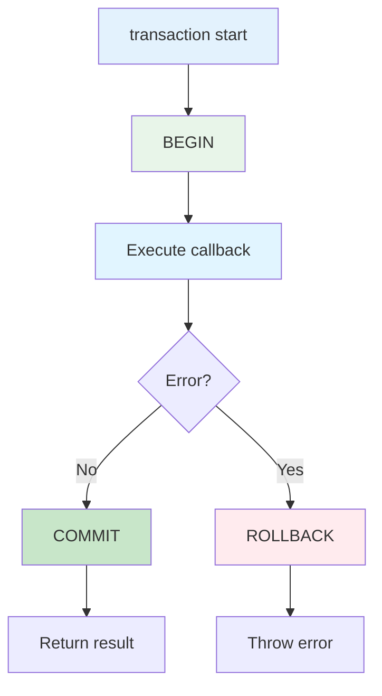
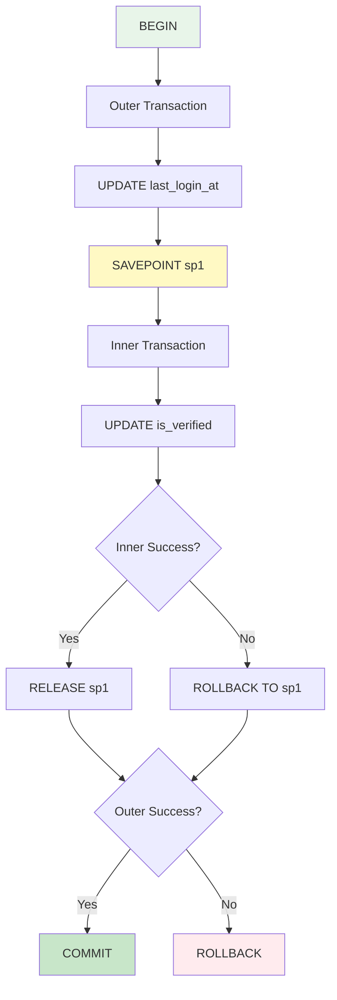

Using the `transaction()` method allows fine-grained control over transactions.

## Manual Transaction Overview

<CardGroup cols={2}>
  <Card title="Fine-Grained Control" icon="sliders">
    Clear transaction boundaries Partial transactions possible
  </Card>
  <Card title="Conditional Rollback" icon="code-branch">
    Rollback based on conditions Validate before commit
  </Card>
  <Card title="Nested Transactions" icon="layer-group">
    Savepoint support Partial rollback support
  </Card>
  <Card title="Explicit Management" icon="hand">
    Clear transaction flow Easier debugging
  </Card>
</CardGroup>

## Basic Usage

### Simple Transaction

```typescript
class UserModel extends BaseModelClass {
  async createUser(data: UserSaveParams): Promise<number> {
    const wdb = this.getPuri("w");

    return wdb.transaction(async (trx) => {
      // Use trx within transaction
      trx.ubRegister("users", data);
      const [userId] = await trx.ubUpsert("users");

      // Auto-commit on success
      return userId;
    });
  }
}
```

<Info>
  When the `transaction()` callback function completes successfully, it automatically COMMITs. If an
  error occurs, it automatically ROLLBACKs.
</Info>

### Transaction Flow



## Practical Examples

### Example 1: Basic Transaction

```typescript
class UserModel extends BaseModelClass {
  async registerUser(userData: UserSaveParams, profileData: { bio: string }): Promise<number> {
    const wdb = this.getPuri("w");

    return wdb.transaction(async (trx) => {
      // 1. Create User
      const [user] = await trx.table("users").insert(userData).returning("id");

      // 2. Update Profile
      await trx.table("users").where("id", user.id).update({ bio: profileData.bio });

      // Auto-commit on success
      return user.id;
    });
  }
}
```

### Example 2: Conditional Rollback

```typescript
class OrderModel extends BaseModelClass {
  async createOrder(userId: number, items: OrderItem[]): Promise<number> {
    const wdb = this.getPuri("w");

    return wdb.transaction(async (trx) => {
      // 1. Check inventory
      for (const item of items) {
        const product = await trx.table("products").where("id", item.productId).first();

        if (!product || product.stock < item.quantity) {
          // Conditional rollback
          throw new Error(`Insufficient stock for product ${item.productId}`);
        }
      }

      // 2. Create order
      const [order] = await trx
        .table("orders")
        .insert({ user_id: userId, status: "pending" })
        .returning("id");

      // 3. Decrement stock
      for (const item of items) {
        await trx.table("products").where("id", item.productId).decrement("stock", item.quantity);
      }

      return order.id;
    });
  }
}
```

### Example 3: With UpsertBuilder

```typescript
class CompanyModel extends BaseModelClass {
  async createOrganization(data: {
    companyName: string;
    departments: string[];
  }): Promise<{ companyId: number; departmentIds: number[] }> {
    const wdb = this.getPuri("w");

    return wdb.transaction(async (trx) => {
      // 1. Register Company
      const companyRef = trx.ubRegister("companies", {
        name: data.companyName,
      });

      // 2. Register Departments
      data.departments.forEach((name) => {
        trx.ubRegister("departments", {
          name,
          company_id: companyRef,
        });
      });

      // 3. Save in order
      const [companyId] = await trx.ubUpsert("companies");
      const departmentIds = await trx.ubUpsert("departments");

      return { companyId, departmentIds };
    });
  }
}
```

## Nested Transactions (Savepoint)

### Basic Nesting

```typescript
class UserModel extends BaseModelClass {
  async complexOperation(userId: number): Promise<void> {
    const wdb = this.getPuri("w");

    return wdb.transaction(async (trx1) => {
      console.log("Outer transaction started");

      // Outer transaction work
      await trx1.table("users").where("id", userId).update({ last_login_at: new Date() });

      // Nested transaction (Savepoint)
      await trx1.transaction(async (trx2) => {
        console.log("Inner transaction started (savepoint)");

        // Inner transaction work
        await trx2.table("users").where("id", userId).update({ is_verified: true });
      });

      console.log("Outer transaction completed");
    });
  }
}
```



### Partial Rollback

```typescript
class UserModel extends BaseModelClass {
  async updateWithPartialRollback(userId: number): Promise<void> {
    const wdb = this.getPuri("w");

    return wdb.transaction(async (trx1) => {
      // 1. Outer transaction work (preserved)
      await trx1.table("users").where("id", userId).update({ last_login_at: new Date() });

      try {
        // 2. Nested transaction (may fail)
        await trx1.transaction(async (trx2) => {
          await trx2.table("users").where("id", userId).update({ is_verified: true });

          // Intentional error
          throw new Error("Inner transaction failed");
        });
      } catch (error) {
        console.log("Inner transaction rolled back");
        // Only inner transaction rolled back, outer continues
      }

      // 3. Continue outer transaction (committed)
      await trx1.table("users").where("id", userId).update({ bio: "Updated after inner rollback" });
    });
  }
}
```

<Info>
  **Benefits of Nested Transactions**: - Independent rollback of partial operations - Structure
  complex business logic - Error isolation possible
</Info>

## Explicit Rollback

### Calling rollback()

```typescript
class OrderModel extends BaseModelClass {
  async createOrderWithValidation(userId: number, items: OrderItem[]): Promise<number | null> {
    const wdb = this.getPuri("w");

    return wdb.transaction(async (trx) => {
      // 1. Create order
      const [order] = await trx
        .table("orders")
        .insert({ user_id: userId, status: "pending" })
        .returning("id");

      // 2. Validation
      const totalAmount = await this.calculateTotal(items);

      if (totalAmount > 1000000) {
        // Explicit rollback
        await trx.rollback();
        return null;
      }

      // 3. Save order details
      for (const item of items) {
        await trx.table("order_items").insert({
          order_id: order.id,
          product_id: item.productId,
          quantity: item.quantity,
        });
      }

      return order.id;
    });
  }

  private async calculateTotal(items: OrderItem[]): Promise<number> {
    // Total calculation logic
    return items.reduce((sum, item) => sum + item.price * item.quantity, 0);
  }
}
```

<Warning>
  Code continues to execute even after calling `rollback()`. You must explicitly `return` or
  `throw`.
</Warning>

## Transaction Isolation Levels

### Setting Isolation Level

```typescript
class UserModel extends BaseModelClass {
  async updateWithIsolation(userId: number): Promise<void> {
    const wdb = this.getPuri("w");

    // Transaction with isolation level
    return wdb.transaction(
      async (trx) => {
        const user = await trx.table("users").where("id", userId).first();

        if (!user) {
          throw new Error("User not found");
        }

        await trx.table("users").where("id", userId).update({ last_login_at: new Date() });
      },
      { isolation: "repeatable read" },
    );
  }
}
```

### Isolation Level Characteristics

| Level            | Dirty Read | Non-repeatable Read | Phantom Read | Performance |
| ---------------- | ---------- | ------------------- | ------------ | ----------- |
| READ UNCOMMITTED | O          | O                   | O            | ⭐⭐⭐⭐⭐  |
| READ COMMITTED   | X          | O                   | O            | ⭐⭐⭐⭐    |
| REPEATABLE READ  | X          | X                   | O            | ⭐⭐⭐      |
| SERIALIZABLE     | X          | X                   | X            | ⭐⭐        |

<Tip>
  **Isolation Level Selection Guide**: - General read/write: READ COMMITTED - Consistency important:
  REPEATABLE READ (default) - Financial transactions: SERIALIZABLE
</Tip>

## Error Handling

### Try-Catch Pattern

```typescript
class UserModel extends BaseModelClass {
  async createUserSafely(data: UserSaveParams): Promise<{
    success: boolean;
    userId?: number;
    error?: string;
  }> {
    const wdb = this.getPuri("w");

    try {
      const userId = await wdb.transaction(async (trx) => {
        // Duplicate check
        const existing = await trx.table("users").where("email", data.email).first();

        if (existing) {
          throw new Error("Email already exists");
        }

        // Create User
        const [user] = await trx.table("users").insert(data).returning("id");

        return user.id;
      });

      return { success: true, userId };
    } catch (error) {
      return {
        success: false,
        error: error instanceof Error ? error.message : "Unknown error",
      };
    }
  }
}
```

### Error Handling Within Transactions

```typescript
class OrderModel extends BaseModelClass {
  async processOrder(orderId: number): Promise<void> {
    const wdb = this.getPuri("w");

    return wdb.transaction(async (trx) => {
      // 1. Get order
      const order = await trx.table("orders").where("id", orderId).first();

      if (!order) {
        throw new Error("Order not found");
      }

      // 2. Validate status
      if (order.status !== "pending") {
        throw new Error(`Cannot process order with status: ${order.status}`);
      }

      try {
        // 3. Process payment (external API)
        await this.processPayment(order);
      } catch (error) {
        // Update order status on payment failure
        await trx.table("orders").where("id", orderId).update({ status: "failed" });

        // Re-throw error (transaction rollback)
        throw error;
      }

      // 4. Complete order
      await trx.table("orders").where("id", orderId).update({ status: "completed" });
    });
  }

  private async processPayment(order: any): Promise<void> {
    // Payment logic
  }
}
```

## Transaction Debugging

### Logging

```typescript
class UserModel extends BaseModelClass {
  async createUserWithLogging(data: UserSaveParams): Promise<number> {
    const wdb = this.getPuri("w");

    console.log("[TRX] Starting transaction");

    return wdb
      .transaction(async (trx) => {
        console.log("[TRX] Inside transaction");

        const [userId] = await trx.table("users").insert(data).returning("id");

        console.log("[TRX] User created:", userId);

        // Check transaction status (for debug)
        await trx.debugTransaction();

        console.log("[TRX] Committing transaction");
        return userId.id;
      })
      .then(
        (result) => {
          console.log("[TRX] Transaction committed successfully");
          return result;
        },
        (error) => {
          console.log("[TRX] Transaction rolled back:", error.message);
          throw error;
        },
      );
  }
}
```

## Performance Optimization

### Minimize Transactions

```typescript
// ❌ Bad: Long transaction
async badPattern(userId: number): Promise<void> {
  const wdb = this.getPuri("w");

  return wdb.transaction(async (trx) => {
    // Unnecessary query (can be done outside transaction)
    const user = await trx.table("users").where("id", userId).first();

    // External API call (unnecessary inside transaction)
    await this.sendEmail(user.email);

    // Actual update
    await trx.table("users").where("id", userId).update({ last_login_at: new Date() });
  });
}

// ✅ Good: Short transaction
async goodPattern(userId: number): Promise<void> {
  const rdb = this.getPuri("r");
  const wdb = this.getPuri("w");

  // 1. Query (READ DB, outside transaction)
  const user = await rdb.table("users").where("id", userId).first();

  if (!user) {
    throw new Error("User not found");
  }

  // 2. External work (outside transaction)
  await this.sendEmail(user.email);

  // 3. Update (short transaction)
  return wdb.transaction(async (trx) => {
    await trx.table("users").where("id", userId).update({ last_login_at: new Date() });
  });
}
```

<Warning>
  **Transaction Optimization Principles**: - Keep transactions as short as possible - External API
  calls outside transactions - Read-only queries don't need transactions - Minimize lock wait time
</Warning>

## @transactional vs Manual Transaction

### Comparison

| Feature              | @transactional | Manual transaction() |
| -------------------- | -------------- | -------------------- |
| Code Simplicity      | ⭐⭐⭐⭐⭐     | ⭐⭐⭐               |
| Fine-Grained Control | ⭐⭐           | ⭐⭐⭐⭐⭐           |
| Partial Transactions | ❌             | ✅                   |
| Conditional Rollback | ⭐⭐           | ⭐⭐⭐⭐⭐           |
| Debugging            | ⭐⭐⭐         | ⭐⭐⭐⭐             |
| Reusability          | ⭐⭐⭐⭐⭐     | ⭐⭐⭐               |

### Selection Guide

```typescript
class UserModel extends BaseModelClass {
  // ✅ @transactional - Simple cases
  @transactional()
  async simpleCreate(data: UserSaveParams): Promise<number> {
    const wdb = this.getPuri("w");
    wdb.ubRegister("users", data);
    const [id] = await wdb.ubUpsert("users");
    return id;
  }

  // ✅ Manual transaction - Complex control
  async complexCreate(data: UserSaveParams): Promise<number | null> {
    const wdb = this.getPuri("w");

    return wdb.transaction(async (trx) => {
      // Conditional work
      if (await this.shouldCreateUser(data)) {
        const [id] = await trx.table("users").insert(data).returning("id");
        return id.id;
      }

      // Rollback if condition not met
      await trx.rollback();
      return null;
    });
  }
}
```

## Next Steps

<CardGroup cols={2}>
  <Card title="@transactional" icon="at" href="/en/database/transactions/transactional-decorator">
    Easy with decorators
  </Card>
  <Card title="Best Practices" icon="star" href="/en/database/transactions/best-practices">
    Transaction usage guide
  </Card>
  <Card title="UpsertBuilder" icon="database" href="/en/database/upsert-builder/basic-usage">
    Saving data in transactions
  </Card>
  <Card title="Puri" icon="search" href="/en/database/puri/basic-queries">
    Using query builder
  </Card>
</CardGroup>
