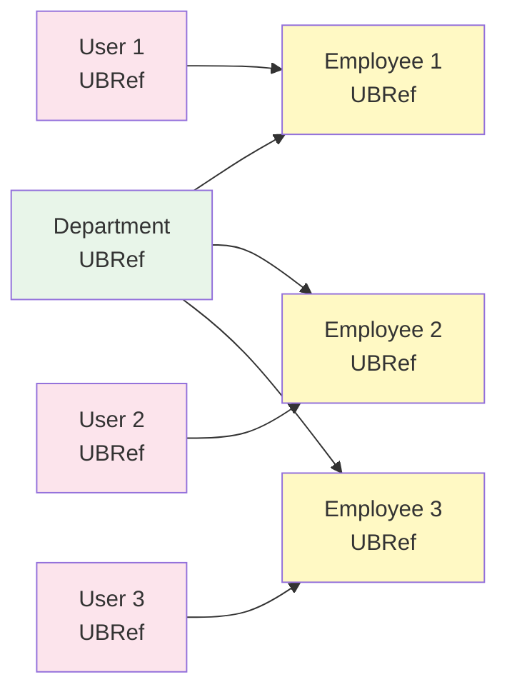
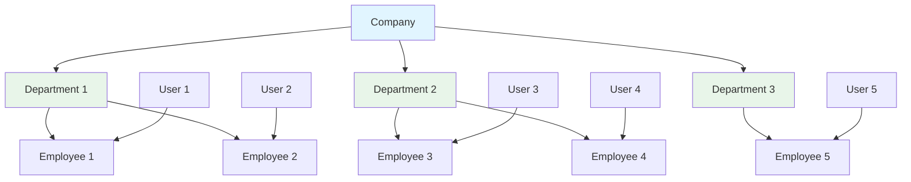

UpsertBuilder can efficiently process large amounts of relational data.

## Batch Operations Overview

<CardGroup cols={2}>
  <Card title="Bulk Registration" icon="database">
    Multiple records at once
    
    Register with loops
  </Card>
  <Card title="Batch Save" icon="bolt">
    Save with single query
    
    Performance optimized
  </Card>
  <Card title="Preserve Relations" icon="link">
    Maintain relationships with UBRef
    
    Auto foreign key handling
  </Card>
  <Card title="Transactions" icon="shield">
    Atomicity guaranteed
    
    All or Nothing
  </Card>
</CardGroup>

## Basic Batch Registration

### Create Multiple Users

```typescript
await db.transaction(async (trx) => {
  // 1. Register multiple Users
  const users = [
    { email: "user1@test.com", username: "user1" },
    { email: "user2@test.com", username: "user2" },
    { email: "user3@test.com", username: "user3" },
  ];
  
  for (const user of users) {
    trx.ubRegister("users", {
      email: user.email,
      username: user.username,
      password: "password",
      role: "normal",
    });
  }
  
  // 2. Batch save
  const userIds = await trx.ubUpsert("users");
  
  console.log(userIds);
  // [1, 2, 3]
});
```

<Info>
`ubUpsert` processes all registered records with a **single INSERT query** for optimized performance.
</Info>

## Batch Registration with Relations

### Create Multiple Employees (Same Department)

```typescript
await db.transaction(async (trx) => {
  // 1. Register Department
  const deptRef = trx.ubRegister("departments", {
    name: "Engineering",
  });
  
  // 2. Register multiple Employees
  const employees = [
    { name: "John", number: "E001", salary: "70000" },
    { name: "Jane", number: "E002", salary: "75000" },
    { name: "Bob", number: "E003", salary: "80000" },
  ];
  
  for (const emp of employees) {
    const userRef = trx.ubRegister("users", {
      email: `${emp.name.toLowerCase()}@test.com`,
      username: emp.name,
      password: "pass",
      role: "normal",
    });
    
    trx.ubRegister("employees", {
      user_id: userRef,
      department_id: deptRef, // ← Same Department
      employee_number: emp.number,
      salary: emp.salary,
    });
  }
  
  // 3. Batch save in order
  const [deptId] = await trx.ubUpsert("departments");
  const userIds = await trx.ubUpsert("users"); // [1, 2, 3]
  const empIds = await trx.ubUpsert("employees"); // [1, 2, 3]
  
  console.log({
    deptId,
    userCount: userIds.length,
    empCount: empIds.length,
  });
});
```



## Batch with Array.map

### Create UBRef Array with Array.map

```typescript
await db.transaction(async (trx) => {
  // 1. Register multiple Users (create UBRef array)
  const userRefs = ["alice", "bob", "charlie"].map((name) =>
    trx.ubRegister("users", {
      email: `${name}@test.com`,
      username: name,
      password: "password",
      role: "normal",
    })
  );
  
  // 2. Register Profile for each User
  userRefs.forEach((userRef, index) => {
    trx.ubRegister("profiles", {
      user_id: userRef,
      bio: `Hello, I'm user ${index + 1}`,
    });
  });
  
  // 3. Save
  const userIds = await trx.ubUpsert("users");
  await trx.ubUpsert("profiles");
  
  console.log({ userCount: userIds.length });
});
```

## Bulk Create Organization Structure

### Company + Departments + Employees

```typescript
await db.transaction(async (trx) => {
  // 1. Company
  const companyRef = trx.ubRegister("companies", {
    name: "Tech Startup",
  });
  
  // 2. Register multiple Departments
  const departments = ["Engineering", "Sales", "Marketing"];
  const deptRefs = departments.map((name) =>
    trx.ubRegister("departments", {
      name,
      company_id: companyRef,
    })
  );
  
  // 3. Assign Employees to each Department
  const employeeData = [
    { dept: 0, name: "John", number: "E001" },
    { dept: 0, name: "Jane", number: "E002" },
    { dept: 1, name: "Alice", number: "E003" },
    { dept: 1, name: "Bob", number: "E004" },
    { dept: 2, name: "Charlie", number: "E005" },
  ];
  
  for (const emp of employeeData) {
    const userRef = trx.ubRegister("users", {
      email: `${emp.name.toLowerCase()}@startup.com`,
      username: emp.name,
      password: "pass",
      role: "normal",
    });
    
    trx.ubRegister("employees", {
      user_id: userRef,
      department_id: deptRefs[emp.dept], // Select Department
      employee_number: emp.number,
    });
  }
  
  // 4. Save in order
  const [companyId] = await trx.ubUpsert("companies");
  const deptIds = await trx.ubUpsert("departments");
  const userIds = await trx.ubUpsert("users");
  const empIds = await trx.ubUpsert("employees");
  
  console.log({
    companyId,
    deptCount: deptIds.length,
    userCount: userIds.length,
    empCount: empIds.length,
  });
});
```



## ManyToMany Batch

### Assign Multiple Employees to Multiple Projects

```typescript
await db.transaction(async (trx) => {
  // 1. Register Projects
  const projects = ["Project A", "Project B", "Project C"];
  const projectRefs = projects.map((name) =>
    trx.ubRegister("projects", {
      name,
      status: "planning",
    })
  );
  
  // 2. Register Employees
  const employees = ["John", "Jane", "Bob"];
  const userRefs = employees.map((name) =>
    trx.ubRegister("users", {
      email: `${name.toLowerCase()}@test.com`,
      username: name,
      password: "pass",
      role: "normal",
    })
  );
  
  const empRefs = userRefs.map((userRef, i) =>
    trx.ubRegister("employees", {
      user_id: userRef,
      employee_number: `E${100 + i}`,
    })
  );
  
  // 3. ManyToMany relationships (all combinations)
  for (const projectRef of projectRefs) {
    for (const empRef of empRefs) {
      trx.ubRegister("projects__employees", {
        project_id: projectRef,
        employee_id: empRef,
      });
    }
  }
  
  // 4. Save
  const projectIds = await trx.ubUpsert("projects");
  const userIds = await trx.ubUpsert("users");
  const empIds = await trx.ubUpsert("employees");
  await trx.ubUpsert("projects__employees");
  
  console.log({
    projectCount: projectIds.length,
    empCount: empIds.length,
    relationCount: projectIds.length * empIds.length,
  });
  // { projectCount: 3, empCount: 3, relationCount: 9 }
});
```

## Batch Create from Data Files

### Bulk Registration from CSV/JSON Data

```typescript
// Data file (employees.json)
const employeeData = [
  {
    email: "john@test.com",
    username: "john",
    department: "Engineering",
    employeeNumber: "E001",
    salary: "70000",
  },
  {
    email: "jane@test.com",
    username: "jane",
    department: "Engineering",
    employeeNumber: "E002",
    salary: "75000",
  },
  // ... more data
];

async function importEmployees(data: typeof employeeData) {
  return await db.transaction(async (trx) => {
    // 1. Extract unique Departments
    const uniqueDepts = [...new Set(data.map((d) => d.department))];
    
    // 2. Register Departments
    const deptRefMap = new Map<string, any>();
    for (const deptName of uniqueDepts) {
      const deptRef = trx.ubRegister("departments", {
        name: deptName,
      });
      deptRefMap.set(deptName, deptRef);
    }
    
    // 3. Register Employees
    for (const emp of data) {
      const userRef = trx.ubRegister("users", {
        email: emp.email,
        username: emp.username,
        password: "default_password",
        role: "normal",
      });
      
      const deptRef = deptRefMap.get(emp.department);
      
      trx.ubRegister("employees", {
        user_id: userRef,
        department_id: deptRef,
        employee_number: emp.employeeNumber,
        salary: emp.salary,
      });
    }
    
    // 4. Save
    await trx.ubUpsert("departments");
    await trx.ubUpsert("users");
    await trx.ubUpsert("employees");
    
    return { importedCount: data.length };
  });
}

// Usage
await importEmployees(employeeData);
```

## Performance Optimization

### Single Transaction

```typescript
// ✅ Good: Single transaction
await db.transaction(async (trx) => {
  for (let i = 0; i < 1000; i++) {
    trx.ubRegister("users", { ... });
  }
  await trx.ubUpsert("users");
});

// ❌ Bad: Multiple transactions
for (let i = 0; i < 1000; i++) {
  await db.transaction(async (trx) => {
    trx.ubRegister("users", { ... });
    await trx.ubUpsert("users");
  });
}
```

### Chunk Processing

Process large data in chunks:

```typescript
async function importLargeDataset(data: any[], chunkSize = 100) {
  for (let i = 0; i < data.length; i += chunkSize) {
    const chunk = data.slice(i, i + chunkSize);
    
    await db.transaction(async (trx) => {
      for (const item of chunk) {
        trx.ubRegister("users", item);
      }
      await trx.ubUpsert("users");
    });
    
    console.log(`Processed ${i + chunk.length} / ${data.length}`);
  }
}

// Process 10,000 items in chunks of 100
await importLargeDataset(largeDataset, 100);
```

## Practical Examples

### Seed Data Creation

```typescript
async function seedDatabase() {
  await db.transaction(async (trx) => {
    // 1. Companies
    const companies = ["Tech Corp", "Startup Inc", "BigCo"];
    const companyRefs = companies.map((name) =>
      trx.ubRegister("companies", { name })
    );
    
    // 2. Departments (3 per Company)
    const deptNames = ["Engineering", "Sales", "Marketing"];
    const deptRefs: any[] = [];
    
    for (const companyRef of companyRefs) {
      for (const deptName of deptNames) {
        const ref = trx.ubRegister("departments", {
          name: deptName,
          company_id: companyRef,
        });
        deptRefs.push(ref);
      }
    }
    
    // 3. Users + Employees (5 per Department)
    for (let i = 0; i < deptRefs.length; i++) {
      for (let j = 0; j < 5; j++) {
        const index = i * 5 + j;
        const userRef = trx.ubRegister("users", {
          email: `user${index}@test.com`,
          username: `user${index}`,
          password: "password",
          role: "normal",
        });
        
        trx.ubRegister("employees", {
          user_id: userRef,
          department_id: deptRefs[i],
          employee_number: `E${1000 + index}`,
        });
      }
    }
    
    // 4. Save
    await trx.ubUpsert("companies");
    await trx.ubUpsert("departments");
    await trx.ubUpsert("users");
    await trx.ubUpsert("employees");
    
    console.log("Seed data created!");
    console.log({
      companies: companies.length,
      departments: deptRefs.length,
      employees: deptRefs.length * 5,
    });
  });
}
```

### Team Reorganization

```typescript
async function reorganizeTeams(
  projectId: number,
  newMemberIds: number[]
) {
  await db.transaction(async (trx) => {
    // 1. Remove existing members
    await trx
      .table("projects__employees")
      .where("project_id", projectId)
      .delete();
    
    // 2. Add new members
    for (const empId of newMemberIds) {
      trx.ubRegister("projects__employees", {
        project_id: projectId,
        employee_id: empId,
      });
    }
    
    await trx.ubUpsert("projects__employees");
    
    return { newMemberCount: newMemberIds.length };
  });
}

// Usage
await reorganizeTeams(1, [5, 10, 15, 20]);
```

## Error Handling

### Partial Failure Handling

```typescript
async function importEmployeesWithValidation(data: any[]) {
  const results = {
    success: [] as number[],
    failed: [] as { index: number; error: string }[],
  };
  
  for (let i = 0; i < data.length; i++) {
    try {
      await db.transaction(async (trx) => {
        const userRef = trx.ubRegister("users", {
          email: data[i].email,
          username: data[i].username,
          password: "pass",
          role: "normal",
        });
        
        trx.ubRegister("employees", {
          user_id: userRef,
          employee_number: data[i].employeeNumber,
        });
        
        await trx.ubUpsert("users");
        const [empId] = await trx.ubUpsert("employees");
        
        results.success.push(empId);
      });
    } catch (error) {
      results.failed.push({
        index: i,
        error: error.message,
      });
    }
  }
  
  return results;
}
```

## Next Steps

<CardGroup cols={2}>
  <Card title="Advanced Patterns" icon="wand-magic-sparkles" href="/en/database/upsert-builder/advanced-patterns">
    Complex data structures
  </Card>
  <Card title="Relational Data" icon="link" href="/en/database/upsert-builder/relations">
    Handle relationships with UBRef
  </Card>
  <Card title="Basic Usage" icon="play" href="/en/database/upsert-builder/basic-usage">
    UpsertBuilder basics
  </Card>
  <Card title="Transactions" icon="arrows-rotate" href="/en/database/transactions">
    Transaction guide
  </Card>
</CardGroup>
