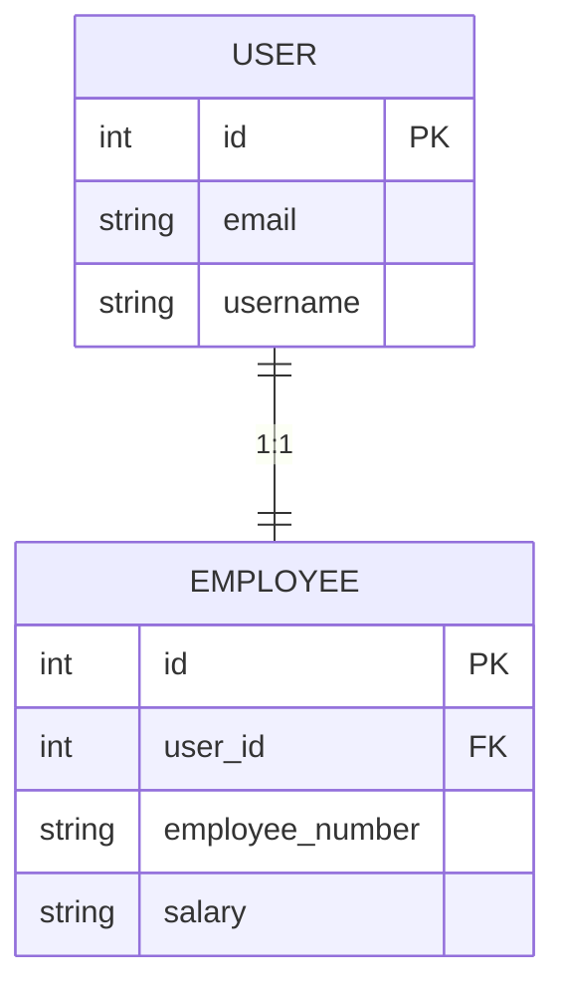
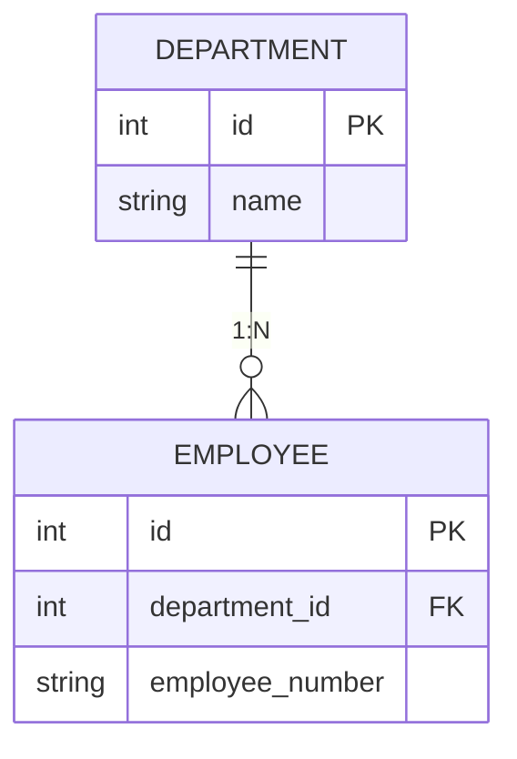
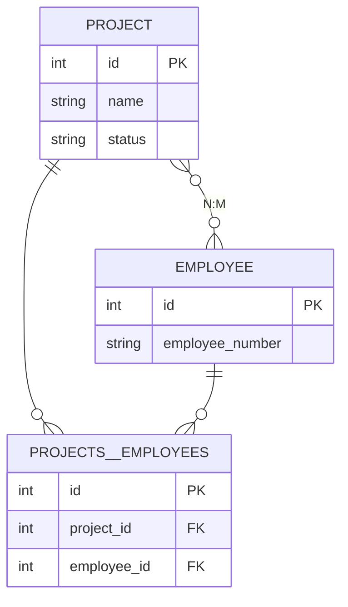
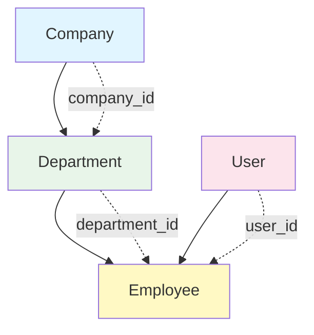

Using UBRef allows you to easily save relational data without knowing foreign key IDs in advance.

## Relationship Patterns Overview

<CardGroup cols={2}>
  <Card title="OneToOne" icon="arrow-right">
    1:1 relationship User → Employee
  </Card>
  <Card title="OneToMany" icon="arrow-right-to-bracket">
    1:N relationship Department → Employees
  </Card>
  <Card title="ManyToMany" icon="diagram-project">
    N:M relationship Projects ↔ Employees
  </Card>
  <Card title="Hierarchical" icon="sitemap">
    Self-referencing Department → Parent
  </Card>
</CardGroup>

## OneToOne Relationship

When User and Employee have a 1:1 relationship:

```typescript
await db.transaction(async (trx) => {
  // 1. Register User
  const userRef = trx.ubRegister("users", {
    email: "john@test.com",
    username: "john",
    password: "hashed_password",
    role: "normal",
  });

  // 2. Register Employee (references User)
  trx.ubRegister("employees", {
    user_id: userRef, // ← Use UBRef
    employee_number: "E001",
    salary: "70000",
  });

  // 3. Save
  const [userId] = await trx.ubUpsert("users");
  const [employeeId] = await trx.ubUpsert("employees");

  console.log({ userId, employeeId });
  // { userId: 1, employeeId: 1 }
});
```



## OneToMany Relationship

When Department has multiple Employees:

```typescript
await db.transaction(async (trx) => {
  // 1. Register Department
  const deptRef = trx.ubRegister("departments", {
    name: "Engineering",
  });

  // 2. Register multiple Employees (referencing same Department)
  const employees = [
    { name: "John", number: "E001" },
    { name: "Jane", number: "E002" },
    { name: "Bob", number: "E003" },
  ];

  for (const emp of employees) {
    const userRef = trx.ubRegister("users", {
      email: `${emp.name.toLowerCase()}@test.com`,
      username: emp.name,
      password: "pass",
      role: "normal",
    });

    trx.ubRegister("employees", {
      user_id: userRef,
      department_id: deptRef, // ← Same deptRef used
      employee_number: emp.number,
    });
  }

  // 3. Save
  const [deptId] = await trx.ubUpsert("departments");
  const userIds = await trx.ubUpsert("users"); // [1, 2, 3]
  const empIds = await trx.ubUpsert("employees"); // [1, 2, 3]

  console.log({
    deptId,
    userCount: userIds.length,
    empCount: empIds.length,
  });
  // { deptId: 1, userCount: 3, empCount: 3 }
});
```



## ManyToMany Relationship

When Project and Employee have N:M relationship (using junction table):

```typescript
await db.transaction(async (trx) => {
  // 1. Register Project
  const projectRef = trx.ubRegister("projects", {
    name: "New Feature",
    status: "in_progress",
  });

  // 2. Register Employees
  const emp1Ref = trx.ubRegister("users", {
    email: "dev1@test.com",
    username: "dev1",
    password: "pass",
    role: "normal",
  });

  const emp2Ref = trx.ubRegister("users", {
    email: "dev2@test.com",
    username: "dev2",
    password: "pass",
    role: "normal",
  });

  trx.ubRegister("employees", {
    user_id: emp1Ref,
    employee_number: "E100",
  });

  trx.ubRegister("employees", {
    user_id: emp2Ref,
    employee_number: "E101",
  });

  // 3. Register join table (Project ↔ Employee)
  const employee1Ref = trx.ubRegister("employees", {
    user_id: emp1Ref,
    employee_number: "E100",
  });

  const employee2Ref = trx.ubRegister("employees", {
    user_id: emp2Ref,
    employee_number: "E101",
  });

  trx.ubRegister("projects__employees", {
    project_id: projectRef, // ← Project UBRef
    employee_id: employee1Ref, // ← Employee UBRef
  });

  trx.ubRegister("projects__employees", {
    project_id: projectRef,
    employee_id: employee2Ref,
  });

  // 4. Save
  const [projectId] = await trx.ubUpsert("projects");
  const userIds = await trx.ubUpsert("users");
  const empIds = await trx.ubUpsert("employees");
  await trx.ubUpsert("projects__employees");

  console.log({
    projectId,
    userCount: userIds.length,
    empCount: empIds.length,
  });
});
```



<Info>
  **ManyToMany Save Order**: 1. Save both main tables first (projects, employees) 2. Save junction
  table later (projects__employees)
</Info>

## Hierarchical Structure (Self-Referencing)

When Department references a parent Department:

```typescript
await db.transaction(async (trx) => {
  // 1. Headquarters (top level)
  const headquartersRef = trx.ubRegister("departments", {
    name: "Headquarters",
    parent_id: null, // Top level
  });

  // 2. Development Team (under Headquarters)
  const devTeamRef = trx.ubRegister("departments", {
    name: "Development Team",
    parent_id: headquartersRef, // ← Parent reference
  });

  // 3. Backend Team (under Development Team)
  trx.ubRegister("departments", {
    name: "Backend Team",
    parent_id: devTeamRef, // ← Parent reference
  });

  // 4. Frontend Team (under Development Team)
  trx.ubRegister("departments", {
    name: "Frontend Team",
    parent_id: devTeamRef, // ← Parent reference
  });

  // 5. Save (can be done at once)
  const deptIds = await trx.ubUpsert("departments");

  console.log({ deptCount: deptIds.length });
  // { deptCount: 4 }
});
```

**Result Structure**:

```
Headquarters (id: 1, parent_id: null)
└── Development Team (id: 2, parent_id: 1)
    ├── Backend Team (id: 3, parent_id: 2)
    └── Frontend Team (id: 4, parent_id: 2)
```

<Warning>
  Self-referencing refers to the same table, so it can be saved with **one ubUpsert**. However,
  circular references are not possible.
</Warning>

## Complex Relationships

Company → Department → Employee → User full chain:

```typescript
await db.transaction(async (trx) => {
  // 1. Company
  const companyRef = trx.ubRegister("companies", {
    name: "Tech Corp",
  });

  // 2. Department (references Company)
  const deptRef = trx.ubRegister("departments", {
    name: "Engineering",
    company_id: companyRef,
  });

  // 3. User
  const userRef = trx.ubRegister("users", {
    email: "john@test.com",
    username: "john",
    password: "pass",
    role: "normal",
  });

  // 4. Employee (references User, Department)
  trx.ubRegister("employees", {
    user_id: userRef,
    department_id: deptRef,
    employee_number: "E001",
    salary: "70000",
  });

  // 5. Save in dependency order
  await trx.ubUpsert("companies");
  await trx.ubUpsert("departments");
  await trx.ubUpsert("users");
  await trx.ubUpsert("employees");
});
```



## Practical Examples

### Create Project (Team Assignment)

```typescript
async createProjectWithTeam(data: {
  projectName: string;
  description: string;
  memberEmails: string[];
}) {
  return await this.getPuri("w").transaction(async (trx) => {
    // 1. Register Project
    const projectRef = trx.ubRegister("projects", {
      name: data.projectName,
      description: data.description,
      status: "planning",
    });

    // 2. Find existing Employees
    const employees = await trx
      .table("employees")
      .join("users", "employees.user_id", "users.id")
      .select({
        emp_id: "employees.id",
        email: "users.email",
      })
      .whereIn("users.email", data.memberEmails);

    // 3. Register Project ↔ Employee relationships
    for (const emp of employees) {
      trx.ubRegister("projects__employees", {
        project_id: projectRef,
        employee_id: emp.emp_id, // Use existing ID
      });
    }

    // 4. Save
    const [projectId] = await trx.ubUpsert("projects");
    await trx.ubUpsert("projects__employees");

    return { projectId, memberCount: employees.length };
  });
}
```

### Create Organization Structure

```typescript
async createOrganization(data: {
  companyName: string;
  departments: Array<{
    name: string;
    parentName?: string;
  }>;
}) {
  return await this.getPuri("w").transaction(async (trx) => {
    // 1. Company
    const companyRef = trx.ubRegister("companies", {
      name: data.companyName,
    });

    // 2. Department reference map
    const deptRefs = new Map<string, any>();

    // 3. Register Departments
    for (const dept of data.departments) {
      const parentRef = dept.parentName
        ? deptRefs.get(dept.parentName)
        : null;

      const deptRef = trx.ubRegister("departments", {
        name: dept.name,
        company_id: companyRef,
        parent_id: parentRef,
      });

      deptRefs.set(dept.name, deptRef);
    }

    // 4. Save
    const [companyId] = await trx.ubUpsert("companies");
    const deptIds = await trx.ubUpsert("departments");

    return {
      companyId,
      departmentCount: deptIds.length,
    };
  });
}

// Usage
await createOrganization({
  companyName: "Tech Startup",
  departments: [
    { name: "Headquarters" },
    { name: "Development Team", parentName: "Headquarters" },
    { name: "Backend Team", parentName: "Development Team" },
    { name: "Frontend Team", parentName: "Development Team" },
  ],
});
```

### User Invitation (User + Profile + Settings)

```typescript
async inviteUser(data: {
  email: string;
  username: string;
  bio?: string;
  theme?: string;
}) {
  return await this.getPuri("w").transaction(async (trx) => {
    // 1. User
    const userRef = trx.ubRegister("users", {
      email: data.email,
      username: data.username,
      password: "temp_password", // Send change link via email
      role: "normal",
      is_verified: false,
    });

    // 2. Profile
    trx.ubRegister("profiles", {
      user_id: userRef,
      bio: data.bio || "",
    });

    // 3. Settings
    trx.ubRegister("user_settings", {
      user_id: userRef,
      theme: data.theme || "light",
      language: "en",
    });

    // 4. Save
    const [userId] = await trx.ubUpsert("users");
    await trx.ubUpsert("profiles");
    await trx.ubUpsert("user_settings");

    return userId;
  });
}
```

## UBRef vs Actual ID

### Using UBRef (New Records)

```typescript
// ✅ Use UBRef for newly created records
const userRef = trx.ubRegister("users", { ... });

trx.ubRegister("employees", {
  user_id: userRef, // ← UBRef
});
```

### Using Actual ID (Existing Records)

```typescript
// ✅ Use actual ID for existing records
const existingDeptId = 5;

trx.ubRegister("employees", {
  user_id: userRef, // UBRef (new)
  department_id: existingDeptId, // Actual ID (existing)
});
```

### Mixed Usage

```typescript
await db.transaction(async (trx) => {
  // New User
  const userRef = trx.ubRegister("users", { ... });

  // Existing Department ID
  const existingDeptId = 10;

  // Mixed
  trx.ubRegister("employees", {
    user_id: userRef, // UBRef
    department_id: existingDeptId, // Actual ID
  });

  await trx.ubUpsert("users");
  await trx.ubUpsert("employees");
});
```

## Next Steps

<CardGroup cols={2}>
  <Card
    title="Batch Operations"
    icon="layer-group"
    href="/en/database/upsert-builder/batch-operations"
  >
    Bulk data registration
  </Card>
  <Card
    title="Advanced Patterns"
    icon="wand-magic-sparkles"
    href="/en/database/upsert-builder/advanced-patterns"
  >
    Complex data structures
  </Card>
  <Card title="Basic Usage" icon="play" href="/en/database/upsert-builder/basic-usage">
    UpsertBuilder basics
  </Card>
  <Card title="Transactions" icon="arrows-rotate" href="/en/database/transactions">
    Transaction guide
  </Card>
</CardGroup>
