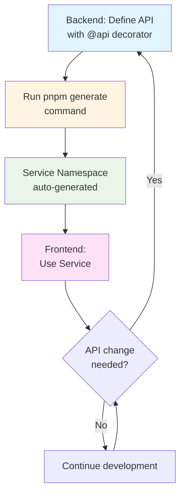

Understand how Sonamu automatically generates type-safe client Services from backend APIs.

## Auto-generated Service Overview

<CardGroup cols={2}>
  <Card title="Type Safety" icon="shield-check">
    Synced with backend
    
    Compile-time validation
  </Card>
  <Card title="Namespace Based" icon="cube">
    Static functions
    
    Concise calls
  </Card>
  <Card title="TanStack Query" icon="arrows-rotate">
    Auto-generated React Hooks
    
    Caching and revalidation
  </Card>
  <Card title="Subset Support" icon="layer-group">
    Only needed fields
    
    Performance optimization
  </Card>
</CardGroup>

## Why Auto-generation?

### Problem: Limitations of Manual API Clients

In traditional frontend development, you **manually write client code** to call backend APIs.

**Manual client example**:
```typescript
// ❌ Manual writing - many problems
async function getUser(userId: number) {
  const response = await axios.get(`/api/user/${userId}`);
  return response.data;
}

async function updateUser(userId: number, data: any) {
  const response = await axios.put(`/api/user/${userId}`, data);
  return response.data;
}
```

**Problems with this approach**:
1. **Lack of type safety**: Overuse of `any` type, runtime errors occur
2. **Cannot track backend changes**: Frontend doesn't know when API changes
3. **Duplicate code**: Similar code repeated for every API
4. **Prone to mistakes**: URL typos, wrong parameters, etc.
5. **Hard to maintain**: Need to modify all call sites when API changes

### Solution: Benefits of Auto-generation

Sonamu analyzes the `@api` decorator from the backend to **automatically generate type-safe clients**.

**Auto-generated client example**:
```typescript
// ✅ Auto-generated - type safe (Namespace based)
export namespace UserService {
  // Query only needed fields with Subset
  export async function getUser<T extends UserSubsetKey>(
    subset: T,
    id: number
  ): Promise<UserSubsetMapping[T]> {
    return fetch({
      method: "GET",
      url: `/api/user/findById?${qs.stringify({ subset, id })}`,
    });
  }
  
  export async function updateUser(
    id: number,
    params: { username?: string; email?: string }
  ): Promise<User> {
    return fetch({
      method: "PUT",
      url: `/api/user/update`,
      data: { id, ...params },
    });
  }
}
```

**Benefits**:
1. ✨ **Complete type safety**: Backend types are directly reflected in frontend
2. ✨ **Immediate error detection**: API changes detected at compile time
3. ✨ **Auto-completion**: IDE automatically suggests API parameters and response types
4. ✨ **Namespace based**: Clean structure, easy imports
5. ✨ **Single source of truth**: Backend is the only source for API specs

<Info>
**Single Source of Truth** is the principle where all information in the system derives from one source. In Sonamu, the `@api` decorator in the backend is the only API specification, and the frontend follows it.
</Info>

## Service Generation Process

### Step 1: Backend API Definition

Define APIs with the `@api` decorator in the backend.

```typescript
// backend/models/user.model.ts
import { BaseModelClass, api } from "sonamu";
import type { UserSubsetKey, UserSubsetMapping } from "../sonamu.generated";
import { userLoaderQueries, userSubsetQueries } from "../sonamu.generated.sso";

class UserModelClass extends BaseModelClass<
  UserSubsetKey,
  UserSubsetMapping,
  typeof userSubsetQueries,
  typeof userLoaderQueries
> {
  constructor() {
    super("User", userSubsetQueries, userLoaderQueries);
  }
  
  /**
   * Get user profile
   */
  @api({ httpMethod: "GET" })
  async getProfile(userId: number): Promise<{
    user: {
      id: number;
      email: string;
      username: string;
      createdAt: Date;
    };
  }> {
    const rdb = this.getPuri("r");
    const user = await rdb
      .table("users")
      .where("id", userId)
      .first();
    
    return { user };
  }
  
  /**
   * Update user profile
   */
  @api({ httpMethod: "PUT", guards: ["user"] })
  async updateProfile(params: {
    username?: string;
    bio?: string;
  }): Promise<{
    user: {
      id: number;
      username: string;
      bio: string;
    };
  }> {
    // Implementation...
  }
}
```

This API definition is **the starting point for everything**. Type information, parameters, and response format are all defined here.

### Step 2: TypeScript AST Parsing

Sonamu uses the TypeScript compiler API to analyze the code.

**Analysis process**:
```typescript
// Sonamu internal operation (pseudo code)
const sourceFile = ts.createSourceFile(
  "user.model.ts",
  fileContent,
  ts.ScriptTarget.Latest
);

// Find methods with @api decorator
const apiMethods = findDecorators(sourceFile, "api");

for (const method of apiMethods) {
  const apiInfo = {
    name: method.name.text,                    // "getProfile"
    httpMethod: getDecoratorOption("httpMethod"), // "GET"
    path: `/api/user/${method.name.text}`,    // "/api/user/getProfile"
    parameters: extractParameters(method),     // [{ name: "userId", type: "number" }]
    returnType: extractReturnType(method),     // Promise<{ user: User }>
  };
  
  // Generate Service code
  generateServiceMethod(apiInfo);
}
```

**Key concepts**:
- **AST (Abstract Syntax Tree)**: Represents code as a tree structure
- **Type extraction**: Obtains accurate type information from TypeScript's type system
- **Metadata collection**: Collects all information including decorator options, Guards, comments

### Step 3: Namespace Service Generation

Based on collected information, **Namespace-based Services** are generated.

**Generated code (services.generated.ts)**:
```typescript
import qs from "qs";

// Subset type definitions
export type UserSubsetKey = "A" | "B" | "C";

// Subset type mapping
export type UserSubsetMapping = {
  A: { id: number; email: string; username: string };           // Basic fields
  B: { id: number; email: string; username: string; bio: string }; // + bio
  C: User; // All fields (including createdAt, updatedAt, etc.)
};

/**
 * User Service Namespace
 * 
 * Namespace responsible for all User-related API calls.
 */
export namespace UserService {
  /**
   * Get user (with Subset support)
   * 
   * @param subset - Field range to query ("A" | "B" | "C")
   * @param id - User ID
   * @returns Type-safe user info according to Subset
   */
  export async function getUser<T extends UserSubsetKey>(
    subset: T,
    id: number
  ): Promise<UserSubsetMapping[T]> {
    // Serialize query parameters with qs.stringify
    return fetch({
      method: "GET",
      url: `/api/user/findById?${qs.stringify({ subset, id })}`,
    });
  }
  
  /**
   * Update user profile
   * 
   * @param params - Fields to update
   * @returns Updated user info
   */
  export async function updateProfile(params: {
    username?: string;
    bio?: string;
  }): Promise<{
    user: {
      id: number;
      username: string;
      bio: string;
    };
  }> {
    return fetch({
      method: "PUT",
      url: "/api/user/updateProfile",
      data: params, // POST/PUT sends as body
    });
  }
}
```

**Benefits of Namespace structure**:
- **Simplicity**: Simpler than classes (no `new` required)
- **Static methods**: No state management needed
- **Tree-shaking**: Unused functions excluded from bundle
- **Easy import**: `import { UserService } from "./services.generated"`

### Step 4: TanStack Query Hook Generation

Hooks that can be used directly in React are also auto-generated.

```typescript
// services.generated.ts (continued)
import { useQuery, queryOptions } from "@tanstack/react-query";

export namespace UserService {
  // ... functions above
  
  /**
   * TanStack Query Options
   * 
   * Reusable options including queryKey and queryFn.
   */
  export const getUserQueryOptions = <T extends UserSubsetKey>(
    subset: T,
    id: number
  ) =>
    queryOptions({
      queryKey: ["User", "getUser", subset, id],
      queryFn: () => getUser(subset, id),
    });
  
  /**
   * React Hook (TanStack Query)
   * 
   * Hook that provides auto caching, revalidation, and loading states.
   */
  export const useUser = <T extends UserSubsetKey>(
    subset: T,
    id: number,
    options?: { enabled?: boolean }
  ) =>
    useQuery({
      ...getUserQueryOptions(subset, id),
      ...options,
    });
}
```

**Benefits of TanStack Query integration**:
- Auto caching
- Auto revalidation
- Auto loading/error state management
- Conditional fetching support
- Optimistic updates support

## Structure of Generated Services

### fetch Utility Function

Common fetch function used by all Services.

```typescript
// sonamu.shared.ts
import axios, { AxiosRequestConfig } from "axios";
import { z } from "zod";

/**
 * Common fetch function
 * 
 * All API calls go through this function.
 * Wraps Axios to handle errors and transform responses.
 */
export async function fetch(options: AxiosRequestConfig) {
  try {
    const res = await axios({
      ...options,
    });
    return res.data;
  } catch (e: unknown) {
    // Convert Axios error to SonamuError
    if (axios.isAxiosError(e) && e.response && e.response.data) {
      const d = e.response.data as {
        message: string;
        issues: z.ZodIssue[];
      };
      throw new SonamuError(e.response.status, d.message, d.issues);
    }
    throw e;
  }
}

/**
 * Sonamu Error class
 * 
 * Includes HTTP status code and Zod validation issues.
 */
export class SonamuError extends Error {
  isSonamuError: boolean;

  constructor(
    public code: number,        // HTTP status code (401, 403, 422, etc.)
    public message: string,     // Error message
    public issues: z.ZodIssue[] // Zod validation issues
  ) {
    super(message);
    this.isSonamuError = true;
  }
}

/**
 * Error type guard
 */
export function isSonamuError(e: any): e is SonamuError {
  return e && e.isSonamuError === true;
}
```

**Role of fetch function**:
- **Wraps Axios calls**: Passes `options` to Axios
- **Auto response extraction**: Returns `res.data` directly
- **Error conversion**: Axios error → `SonamuError`
- **Zod issue handling**: Type-safe handling of validation errors

**AxiosRequestConfig parameters**:
```typescript
{
  method: "GET" | "POST" | "PUT" | "DELETE",
  url: string,
  params?: Record<string, any>,  // GET query parameters
  data?: any,                     // POST/PUT body
  headers?: Record<string, string>,
}
```

### Subset System

Sonamu's unique Subset system.

**What is Subset?**

A system that defines multiple variants (subsets) of an entity to **query only needed fields**.

```typescript
// Subset definition (auto-generated)
export type UserSubsetKey = "A" | "B" | "C";

export type UserSubsetMapping = {
  A: { id: number; email: string; username: string },           // Basic info
  B: { id: number; email: string; username: string; bio: string }, // + bio
  C: User, // All fields (including createdAt, updatedAt, deletedAt, etc.)
};

// Usage example
const basicUser = await UserService.getUser("A", 123);  
// Type: { id: number; email: string; username: string }

const fullUser = await UserService.getUser("C", 123);   
// Type: User (all fields)
```

**Benefits of Subset**:
1. **Performance**: Query only needed fields to reduce network cost
2. **Type safety**: Returns accurate type for each Subset
3. **Explicitness**: Clearly express what data is needed in code
4. **Database optimization**: Include only necessary columns in SELECT clause

**Subset naming convention**:
- **A**: Basic fields (id, core info)
- **B**: Intermediate fields (A + additional info)
- **C**: All fields (all columns, including timestamps)

## Type Safety in Practice

### Compile-time Validation

When backend API changes, **errors occur immediately at compile time**.

**Backend change**:
```typescript
// Backend changes username -> displayName
@api({ httpMethod: "PUT" })
async updateProfile(params: {
  displayName?: string;  // Changed from username
  bio?: string;
}): Promise<{ user: User }> {
  // ...
}
```

**Frontend error**:
```typescript
// After pnpm generate, Service types are auto-updated

// ❌ Compile error!
await UserService.updateProfile({
  username: "newname",  // Error: 'username' does not exist in type
});

// ✅ Works after fix
await UserService.updateProfile({
  displayName: "newname",  // OK
});
```

This **brings runtime errors to compile time** to prevent bugs in advance.

### IDE Auto-completion

Thanks to type information, IDE provides powerful auto-completion.

```typescript
// When typing...
UserService.up  // IDE suggests "updateProfile"

// When entering parameters...
await UserService.updateProfile({
  // IDE suggests all possible fields:
  // - displayName?: string
  // - bio?: string
});

// Subset also auto-completes
await UserService.getUser(
  "A" // IDE suggests "A" | "B" | "C"
  , 123
);
```

## Development Workflow

### Backend-First Development

Sonamu's auto-generation encourages **Backend-First** development.

**Typical workflow**:



**Benefits**:
- Clear contract between backend and frontend
- Prevents bugs from type mismatch at source
- Auto-generated API documentation (Service is the documentation)
- Improved collaboration efficiency

### Regeneration During Development

Services must be regenerated whenever API changes.

```bash
# Regenerate Services
pnpm generate

# Or auto-regenerate with watch mode
pnpm generate:watch
```

<Warning>
**Cautions**:
- **Never manually modify** generated Service files (`services.generated.ts`)
- If modifications needed, modify backend and regenerate
- Team decides whether to add generated files to `.gitignore`
  - If added: Each person generates locally
  - If not added: Shared via Git (reduces build time)
</Warning>

## Practical Usage Examples

### Basic Usage

```typescript
import { UserService } from "@/services/services.generated";

// Query only basic info with Subset "A"
const user = await UserService.getUser("A", 123);
console.log(user.username); // OK
console.log(user.bio); // ❌ Compile error (bio not in Subset A)

// Query including bio with Subset "B"
const userWithBio = await UserService.getUser("B", 123);
console.log(userWithBio.bio); // OK

// Update profile
await UserService.updateProfile({
  username: "newname",
  bio: "Hello, World!",
});
```

### Usage in React (TanStack Query Hook)

```typescript
import { UserService } from "@/services/services.generated";

function UserProfile({ userId }: { userId: number }) {
  // Use auto-generated Hook
  const { data: user, isLoading, error } = UserService.useUser("A", userId);
  
  if (isLoading) return <div>Loading...</div>;
  if (error) return <div>Error: {error.message}</div>;
  if (!user) return <div>User not found</div>;
  
  return (
    <div>
      <h1>{user.username}</h1>
      <p>{user.email}</p>
    </div>
  );
}
```

### Conditional Fetching

```typescript
function UserProfile({ userId }: { userId: number | null }) {
  const { data: user } = UserService.useUser(
    "A", 
    userId!, // TypeScript non-null assertion
    { enabled: userId !== null } // Don't call if userId is null
  );
  
  if (!userId) return <div>Please select a user</div>;
  
  return <div>{user?.username}</div>;
}
```

## Advanced Features

### qs.stringify Usage

Uses `qs` library to serialize query parameters for GET requests.

```typescript
import qs from "qs";

// Complex objects also converted to query string
const queryString = qs.stringify({ 
  subset: "A", 
  id: 123,
  filters: { status: "active" } 
});
// "subset=A&id=123&filters[status]=active"

// Used in Service
export async function getUser<T extends UserSubsetKey>(
  subset: T,
  id: number
): Promise<UserSubsetMapping[T]> {
  return fetch({
    method: "GET",
    url: `/api/user/findById?${qs.stringify({ subset, id })}`,
  });
}
```

**Why use qs**:
- Nested object support (`filters[status]=active`)
- Array serialization support (`ids[]=1&ids[]=2`)
- Matches backend's parsing method

### Error Handling

Handle SonamuError in a type-safe manner.

```typescript
import { UserService } from "@/services/services.generated";
import { isSonamuError } from "@/lib/sonamu.shared";

try {
  await UserService.updateProfile({
    username: "newname",
  });
} catch (error) {
  if (isSonamuError(error)) {
    // Sonamu error
    console.log("Status:", error.code);
    console.log("Message:", error.message);
    console.log("Validation Issues:", error.issues);
    
    // Handle Zod validation errors
    error.issues.forEach((issue) => {
      console.log(`${issue.path.join(".")}: ${issue.message}`);
    });
  } else {
    // General error
    console.error(error);
  }
}
```

### Query Options Reuse

```typescript
import { UserService } from "@/services/services.generated";
import { useQueryClient } from "@tanstack/react-query";

function SomeComponent() {
  const queryClient = useQueryClient();
  
  async function handleUpdate() {
    // Invalidate cache after update
    await UserService.updateProfile({ username: "newname" });
    
    // Invalidate specific query with Query Options
    queryClient.invalidateQueries(
      UserService.getUserQueryOptions("A", 123)
    );
  }
}
```

### Prefetching

```typescript
import { UserService } from "@/services/services.generated";
import { useQueryClient } from "@tanstack/react-query";

function UserList({ userIds }: { userIds: number[] }) {
  const queryClient = useQueryClient();
  
  // Preload on hover
  function handleMouseEnter(userId: number) {
    queryClient.prefetchQuery(
      UserService.getUserQueryOptions("A", userId)
    );
  }
  
  return (
    <ul>
      {userIds.map((id) => (
        <li
          key={id}
          onMouseEnter={() => handleMouseEnter(id)}
        >
          User {id}
        </li>
      ))}
    </ul>
  );
}
```

## Cautions

<Warning>
**Cautions when using Services**:
1. **Never manually modify** generated Service files (`services.generated.ts`)
2. **Subset parameter required**: Must specify subset like `getUser("A", id)`
3. It's a Namespace so **no `new` needed**: Call `UserService.getUser()` directly
4. TanStack Query Hooks should only be called **inside components**
5. Use `isSonamuError()` type guard for error handling
6. Use `qs.stringify()` for complex object serialization
</Warning>

## Next Steps

<CardGroup cols={2}>
  <Card title="Using Services" icon="code" href="/frontend-integration/generated-services/using-services">
    How to use generated Services
  </Card>
  <Card title="TanStack Query Hook" icon="arrows-rotate" href="/frontend-integration/generated-services/tanstack-query">
    Using in React
  </Card>
  <Card title="Creating APIs" icon="at" href="/api-development/creating-apis/api-decorator">
    @api decorator
  </Card>
  <Card title="Subset System" icon="layer-group" href="/core-concepts/entity-system/subset-system">
    Subset system
  </Card>
</CardGroup>
