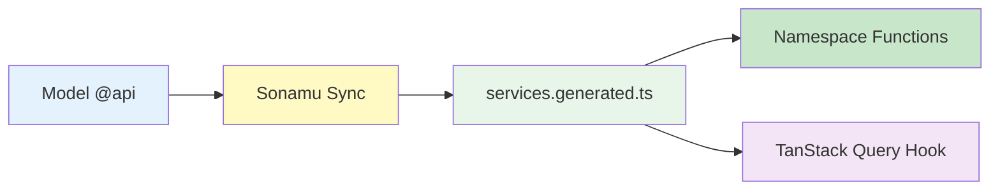

Learn how to call APIs type-safely using the generated Namespace Services.

## Service Usage Overview

<CardGroup cols={2}>
  <Card title="Namespace Calls" icon="cube">
    UserService.getUser() Concise syntax
  </Card>
  <Card title="Type Safe" icon="shield-check">
    Auto-completion Compile validation
  </Card>
  <Card title="Subset Support" icon="layer-group">
    Only needed fields Performance optimization
  </Card>
  <Card title="TanStack Query" icon="arrows-rotate">
    useUser Hook Auto caching
  </Card>
</CardGroup>

## Basic Usage

### Service Import

Generated Services are exported as Namespaces from `services.generated.ts`.

```typescript
// ✅ Correct import method
import { UserService, PostService } from "@/services/services.generated";
```

**Benefits of single file import**:

1. **Consistency**: All Services managed in one place
2. **Easy import**: No need to find file paths
3. **Auto update**: Auto-synced on `pnpm generate`
4. **Clear naming**: Grouped by Namespace, no conflicts

### Basic API Calls

Call Service static functions directly.

```typescript
import { UserService } from "@/services/services.generated";

// Get user (only basic info with Subset "A")
const user = await UserService.getUser("A", 123);
console.log(user.username); // Type safe!

// Update user
await UserService.updateProfile({
  username: "newname",
  bio: "Hello, World!",
});
```

**Features**:

- Async call with `await`
- Response is auto-parsed (handled inside fetch function)
- Types fully guaranteed
- **Subset parameter required** (for getUser, etc.)

<Info>
  **Namespace-based structure**: - ❌ Class instance: No need for `new UserService()` - ✅ Static
  function: Call `UserService.getUser()` directly - All functions work independently
</Info>

### Understanding the Subset System

Sonamu's core feature, the Subset system.

```typescript
// Subset "A": Basic info
const basicUser = await UserService.getUser("A", 123);
console.log(basicUser.id); // ✅ OK
console.log(basicUser.username); // ✅ OK
console.log(basicUser.bio); // ❌ Compile error (not in Subset A)

// Subset "B": Including bio
const userWithBio = await UserService.getUser("B", 123);
console.log(userWithBio.bio); // ✅ OK

// Subset "C": All fields
const fullUser = await UserService.getUser("C", 123);
console.log(fullUser.createdAt); // ✅ OK
```

**Why use Subset**:

1. **Performance**: Query only needed fields to reduce network cost
2. **Type safety**: Returns accurate type for each Subset
3. **Explicitness**: Clearly express what data is needed in code

## Using in React

### TanStack Query Hook (Recommended)

The easiest way is to use auto-generated TanStack Query Hooks.

```typescript
import { UserService } from "@/services/services.generated";

function UserProfile({ userId }: { userId: number }) {
  // Use auto-generated Hook
  const { data: user, error, isLoading } = UserService.useUser("A", userId);

  if (isLoading) return <div>Loading...</div>;
  if (error) return <div>Error: {error.message}</div>;
  if (!user) return <div>User not found</div>;

  return (
    <div>
      <h1>{user.username}</h1>
      <p>{user.email}</p>
    </div>
  );
}
```

**Benefits of TanStack Query Hooks**:

- Auto caching (reuses same userId)
- Auto revalidation (on focus, reconnection)
- Auto loading/error state management
- Auto duplicate request removal

### Function Component (useEffect)

You can also call directly without using Hooks.

```typescript
import { useState, useEffect } from "react";
import { UserService } from "@/services/services.generated";
import type { User } from "@/services/services.generated";

function UserProfile({ userId }: { userId: number }) {
  const [user, setUser] = useState<User | null>(null);
  const [loading, setLoading] = useState(true);
  const [error, setError] = useState<string | null>(null);

  useEffect(() => {
    async function fetchUser() {
      try {
        setLoading(true);
        // Get all fields with Subset "C"
        const userData = await UserService.getUser("C", userId);
        setUser(userData);
      } catch (err) {
        setError(err instanceof Error ? err.message : "Failed to load user");
      } finally {
        setLoading(false);
      }
    }

    fetchUser();
  }, [userId]);

  if (loading) return <div>Loading...</div>;
  if (error) return <div>Error: {error}</div>;
  if (!user) return <div>User not found</div>;

  return (
    <div>
      <h1>{user.username}</h1>
      <p>{user.email}</p>
    </div>
  );
}
```

<Info>
  **Recommended**: Use TanStack Query Hooks when possible. They provide auto caching, revalidation,
  and state management, making code much more concise.
</Info>

### Event Handlers

Call APIs based on user actions.

```typescript
import { useState } from "react";
import { UserService } from "@/services/services.generated";

function EditProfile({ userId }: { userId: number }) {
  const [username, setUsername] = useState("");
  const [bio, setBio] = useState("");
  const [saving, setSaving] = useState(false);

  async function handleSubmit(e: React.FormEvent) {
    e.preventDefault();

    try {
      setSaving(true);

      await UserService.updateProfile({
        username,
        bio,
      });

      alert("Profile updated!");
    } catch (error) {
      alert("Failed to update profile");
      console.error(error);
    } finally {
      setSaving(false);
    }
  }

  return (
    <form onSubmit={handleSubmit}>
      <input
        type="text"
        value={username}
        onChange={(e) => setUsername(e.target.value)}
        placeholder="Username"
      />

      <textarea
        value={bio}
        onChange={(e) => setBio(e.target.value)}
        placeholder="Bio"
      />

      <button type="submit" disabled={saving}>
        {saving ? "Saving..." : "Save"}
      </button>
    </form>
  );
}
```

## Using Services in SSR

Sonamu supports SSR based on Vite + React. For SSR, use the SSR-specific Services automatically generated in `queries.generated.ts`.

### What are SSR Services?

Separate from frontend Services (`services.generated.ts`), **SSR-specific Services** are automatically generated on the backend.

```typescript
// api/src/application/queries.generated.ts (auto-generated)
import type { SSRQuery } from "sonamu/ssr";

export namespace UserService {
  // Returns SSRQuery object (no HTTP request)
  export const getUser = <T extends UserSubsetKey>(subset: T, id: number): SSRQuery =>
    createSSRQuery("UserModel", "findById", [subset, id], ["User", "getUser"]);

  export const me = (): SSRQuery => createSSRQuery("UserModel", "me", [], ["User", "me"]);
}
```

### Using in registerSSR

Use these Services when registering SSR routes.

```typescript
// api/src/ssr/routes.ts
import { registerSSR } from "sonamu/ssr";
import { UserService, CompanyService } from "../application/queries.generated";

// Company detail page SSR
registerSSR({
  path: "/companies/:companyId",
  preload: (params) => [
    // Call Service method → Returns SSRQuery object
    UserService.me(),
    CompanyService.getCompany("A", Number(params.companyId)),
  ],
});
```

### Frontend Service vs SSR Service

| Item              | Frontend Service                         | SSR Service                                |
| ----------------- | ---------------------------------------- | ------------------------------------------ |
| **File Location** | `web/src/services/services.generated.ts` | `api/src/application/queries.generated.ts` |
| **Return Value**  | `Promise<Data>` (HTTP request)           | `SSRQuery` (object)                        |
| **Used In**       | Browser (React components)               | Backend (`registerSSR`)                    |
| **HTTP Request**  | ✅ Real API call                         | ❌ Direct backend Model execution          |

```typescript
// Frontend Service (browser)
const user = await UserService.getUser("A", 123); // HTTP GET /api/user/findById

// SSR Service (backend)
const query = UserService.getUser("A", 123); // Returns SSRQuery object
// → Sonamu directly executes UserModel.findById("A", 123)
```

<Info>
  **Key Difference**: SSR Services execute backend Model methods directly without HTTP requests,
  eliminating network overhead.
</Info>

### Learn More

For detailed information about SSR, see the following documents.

<CardGroup cols={2}>
  <Card title="Data Preloading" icon="database" href="/en/frontend-integration/ssr/preloading-data">
    Preload data on the server with registerSSR
  </Card>
  <Card title="SSR Setup" icon="server" href="/en/frontend-integration/ssr/ssr-setup">
    Understand the SSR system
  </Card>
</CardGroup>

### Understanding the Service Creation Mechanism

Services are **Namespace-based static function collections**.

#### Services are Namespaces, Not Classes

```typescript
// services.generated.ts (auto-generated)

// ❌ Not a class
// class UserService { ... }

// ✅ It's a Namespace
export namespace UserService {
  // Static functions
  export async function getUser<T extends UserSubsetKey>(
    subset: T,
    id: number,
  ): Promise<UserSubsetMapping[T]> {
    return fetch({
      method: "GET",
      url: `/api/user/getUser?${qs.stringify({ subset, id })}`,
    });
  }

  export async function save(spa: UserSaveParams[]): Promise<number[]> {
    return fetch({
      method: "POST",
      url: `/api/user/save`,
      data: { spa },
    });
  }

  // TanStack Query Hook
  export const useUser = <T extends UserSubsetKey>(subset: T, id: number) =>
    useQuery({
      queryKey: ["User", "getUser", subset, id],
      queryFn: () => getUser(subset, id),
    });
}
```

**Namespace Characteristics**:

- **Stateless**: No instance creation needed
- **Static calls**: Call `UserService.getUser()` directly
- **Type-safe**: Full type inference via TypeScript Namespaces
- **Tree-shakable**: Unused functions are excluded from the bundle

#### Services Have No Dependency Injection (DI)

Services are **pure functions**, so no dependencies are injected:

```typescript
// ❌ No DI (not a class)
// new UserService(dependencies)

// ✅ Direct call
const user = await UserService.getUser("A", 123);
```

**How is Context passed?**

Services **pass Context via HTTP requests**:

```typescript
// Service internals (simplified)
export async function getUser(subset: string, id: number) {
  return fetch({
    method: "GET",
    url: `/api/user/getUser?subset=${subset}&id=${id}`,
    // Context is passed via HTTP headers
    headers: {
      Authorization: `Bearer ${getToken()}`,
      Cookie: document.cookie, // Session information
    },
  });
}
```

On the backend, **Context is automatically extracted from the HTTP request**:

```typescript
// Backend Model
class UserModelClass extends BaseModelClass {
  @api({ httpMethod: "GET" })
  async getUser(subset: string, id: number) {
    // Context is automatically parsed from the HTTP request
    const context = Sonamu.getContext();

    console.log(context.user); // Authenticated user
    console.log(context.session); // Session information
    console.log(context.ip); // Client IP

    // Authorization checks possible
    if (!context.user) {
      throw new UnauthorizedError();
    }

    return this.findById(id, [subset]);
  }
}
```

#### Service Creation Process



**Creation Steps**:

1. **Backend**: Write `@api` decorator on Model
2. **Sonamu Sync**: Run `pnpm sonamu sync`
3. **Auto-generation**: `services.generated.ts` file created
4. **Namespace Functions**: Each API method converted to Namespace function
5. **Hook Generation**: GET methods automatically generate `useQuery` Hooks

#### Where Are Model Instances?

**Created directly in Server Components**:

```typescript
// Server Component
export default async function UserPage() {
  // ✅ Instantiate Model directly on the server
  const userModel = new UserModel();
  const user = await userModel.findById(1, ["A"]);

  return <div>{user.username}</div>;
}
```

**Why is `new UserModel()` safe?**

- Models are **stateless**, so creating new instances each time is safe
- The constructor only initializes Subset queries
- Context is dynamically retrieved via `Sonamu.getContext()`

```typescript
// Model internals
class UserModelClass extends BaseModelClass {
  constructor() {
    super("User", userSubsetQueries, userLoaderQueries);
    // No state stored
  }

  async findById(id: number, subsets: string[]) {
    // Context is dynamically retrieved here
    const context = Sonamu.getContext();

    // Execute DB query
    return this.getPuri("r", subsets).where("id", id).first();
  }
}
```

#### Service vs Model Comparison

| Item              | Service (Frontend)      | Model (Backend)        |
| ----------------- | ----------------------- | ---------------------- |
| **Type**          | Namespace               | Class Instance         |
| **Call Style**    | `UserService.getUser()` | `userModel.findById()` |
| **State**         | Stateless               | Stateless              |
| **Dependencies**  | None                    | BaseModelClass         |
| **Context**       | Passed via HTTP headers | `Sonamu.getContext()`  |
| **Usage Context** | Client Component        | Server Component / API |
| **Creation**      | Auto-generated          | Developer-written      |

<Warning>
  **Cautions when creating Model instances**: 1. **Server Components only**: Models cannot be imported
  in Client Components 2. **Create each time**: Singleton pattern unnecessary (stateless) 3. **Context
  access**: `Sonamu.getContext()` automatically retrieves from request context
</Warning>

<Info>
  **Recommended patterns**: - **Client Component**: Use Service - **Server Component**: Use Model
  directly - **API endpoint**: `@api` decorator on Model
</Info>

### Client Components

Services can be freely used in Client Components.

```typescript
// app/users/[id]/edit-button.tsx
"use client";

import { useState } from "react";
import { UserService } from "@/services/services.generated";

export function EditButton({ userId }: { userId: number }) {
  const [editing, setEditing] = useState(false);

  async function handleEdit() {
    setEditing(true);

    try {
      await UserService.updateProfile({
        username: "newname",
      });

      alert("Updated!");
    } catch (error) {
      alert("Failed!");
    } finally {
      setEditing(false);
    }
  }

  return (
    <button onClick={handleEdit} disabled={editing}>
      {editing ? "Saving..." : "Edit"}
    </button>
  );
}
```

## Error Handling

### SonamuError Handling

Handle errors from Service calls in a type-safe manner.

```typescript
import { UserService } from "@/services/services.generated";
import { isSonamuError } from "@/lib/sonamu.shared";

async function updateUser() {
  try {
    await UserService.updateProfile({
      username: "newname",
    });
  } catch (error) {
    if (isSonamuError(error)) {
      // Sonamu error (type safe)
      console.log("Status:", error.code);
      console.log("Message:", error.message);

      // Zod validation errors
      error.issues.forEach((issue) => {
        console.log(`${issue.path.join(".")}: ${issue.message}`);
      });

      // Handle by HTTP status code
      if (error.code === 401) {
        // Auth error
        console.log("Please login");
      } else if (error.code === 403) {
        // Permission error
        console.log("Permission denied");
      } else if (error.code === 422) {
        // Validation error
        console.log("Invalid data:", error.issues);
      }
    } else {
      // General error
      console.log("Network error:", error);
    }
  }
}
```

### Error Handling in React

```typescript
import { isSonamuError } from "@/lib/sonamu.shared";

function EditProfile({ userId }: { userId: number }) {
  const [error, setError] = useState<string | null>(null);
  const [validationErrors, setValidationErrors] = useState<Record<string, string>>({});

  async function handleSubmit(data: any) {
    setError(null);
    setValidationErrors({});

    try {
      await UserService.updateProfile(data);
    } catch (err) {
      if (isSonamuError(err)) {
        setError(err.message);

        // Map Zod validation errors by field
        const fieldErrors: Record<string, string> = {};
        err.issues.forEach((issue) => {
          const field = issue.path.join(".");
          fieldErrors[field] = issue.message;
        });
        setValidationErrors(fieldErrors);
      } else {
        setError("An unexpected error occurred");
      }
    }
  }

  return (
    <div>
      {error && <div className="error-message">{error}</div>}

      <form onSubmit={(e) => {
        e.preventDefault();
        handleSubmit({/* data */});
      }}>
        <div>
          <input name="username" />
          {validationErrors.username && (
            <span className="error">{validationErrors.username}</span>
          )}
        </div>
      </form>
    </div>
  );
}
```

## Advanced Patterns

### Parallel Requests

Call multiple APIs simultaneously to improve performance.

```typescript
import { UserService, PostService } from "@/services/services.generated";

async function loadUserDashboard(userId: number) {
  // ❌ Sequential execution (slow)
  const user = await UserService.getUser("A", userId);
  const posts = await PostService.getPostsByUser(userId);
  const comments = await PostService.getCommentsByUser(userId);

  return { user, posts, comments };
}

async function loadUserDashboardFast(userId: number) {
  // ✅ Parallel execution (fast)
  const [user, posts, comments] = await Promise.all([
    UserService.getUser("A", userId),
    PostService.getPostsByUser(userId),
    PostService.getCommentsByUser(userId),
  ]);

  return { user, posts, comments };
}
```

**Performance comparison**:

- Sequential: 300ms + 200ms + 150ms = 650ms
- Parallel: max(300ms, 200ms, 150ms) = 300ms

### Subset Optimization

Choose appropriate Subset for the situation.

```typescript
// List view: Only basic info
const users = await UserService.getUsers("A");

users.map((user) => (
  <div key={user.id}>
    {user.username} - {user.email}
  </div>
));

// Detail view: All info
const fullUser = await UserService.getUser("C", userId);

<div>
  <h1>{fullUser.username}</h1>
  <p>{fullUser.bio}</p>
  <p>Created: {fullUser.createdAt}</p>
</div>
```

### TanStack Query Utilization

#### Conditional Fetching

```typescript
function UserProfile({ userId }: { userId: number | null }) {
  const { data: user } = UserService.useUser(
    "A",
    userId!,
    { enabled: userId !== null } // Don't call if userId is null
  );

  if (!userId) return <div>Please select a user</div>;
  if (!user) return <div>Loading...</div>;

  return <div>{user.username}</div>;
}
```

#### Cache Invalidation

```typescript
import { useQueryClient } from "@tanstack/react-query";
import { UserService } from "@/services/services.generated";

function EditProfile({ userId }: { userId: number }) {
  const queryClient = useQueryClient();

  async function handleUpdate(data: any) {
    await UserService.updateProfile(data);

    // Invalidate specific query
    queryClient.invalidateQueries(UserService.getUserQueryOptions("A", userId));

    // Or invalidate all User queries
    queryClient.invalidateQueries({
      queryKey: ["User"],
    });
  }
}
```

#### Prefetching

```typescript
function UserList({ userIds }: { userIds: number[] }) {
  const queryClient = useQueryClient();

  // Preload on hover
  function handleMouseEnter(userId: number) {
    queryClient.prefetchQuery(
      UserService.getUserQueryOptions("A", userId)
    );
  }

  return (
    <ul>
      {userIds.map((id) => (
        <li
          key={id}
          onMouseEnter={() => handleMouseEnter(id)}
        >
          User {id}
        </li>
      ))}
    </ul>
  );
}
```

## Practical Example

### Complete CRUD Flow

```typescript
import { useState } from "react";
import { UserService } from "@/services/services.generated";
import { isSonamuError } from "@/lib/sonamu.shared";

function UserManagement() {
  // List query (Subset A)
  const { data: users, refetch } = UserService.useUsers("A");

  // Create
  async function handleCreate(data: { username: string; email: string }) {
    try {
      await UserService.create(data);
      refetch(); // Refresh list
      alert("Created!");
    } catch (error) {
      if (isSonamuError(error)) {
        alert(error.message);
      }
    }
  }

  // Update
  async function handleUpdate(id: number, data: { username: string }) {
    try {
      await UserService.update(id, data);
      refetch();
      alert("Updated!");
    } catch (error) {
      if (isSonamuError(error)) {
        alert(error.message);
      }
    }
  }

  // Delete
  async function handleDelete(id: number) {
    if (!confirm("Are you sure?")) return;

    try {
      await UserService.delete(id);
      refetch();
      alert("Deleted!");
    } catch (error) {
      if (isSonamuError(error)) {
        alert(error.message);
      }
    }
  }

  return (
    <div>
      <h1>Users</h1>
      {users?.map((user) => (
        <div key={user.id}>
          {user.username}
          <button onClick={() => handleUpdate(user.id, { username: "new" })}>
            Edit
          </button>
          <button onClick={() => handleDelete(user.id)}>
            Delete
          </button>
        </div>
      ))}
    </div>
  );
}
```

## Cautions

<Warning>
  **Cautions when using Services**: 1. **Never manually modify** generated Service files
  (`services.generated.ts`) 2. **Subset parameter required**: Must specify subset for getUser, etc.
  3. In Server Components, **call backend model directly** instead of Service 4. Use
  `isSonamuError()` **type guard** for error handling 5. TanStack Query Hooks should only be called
  **inside components** 6. `await` keyword required (all Service functions are async) 7. It's a
  Namespace so **no `new` needed**: Call `UserService.getUser()` directly
</Warning>

## Next Steps

<CardGroup cols={2}>
  <Card
    title="How Services Work"
    icon="diagram-project"
    href="/en/frontend-integration/generated-services/how-services-work"
  >
    Understanding auto-generation
  </Card>
  <Card
    title="TanStack Query Hook"
    icon="arrows-rotate"
    href="/en/frontend-integration/generated-services/tanstack-query"
  >
    Easier with React
  </Card>
  <Card title="Authentication" icon="shield-halved" href="/en/api-development/authentication/setup">
    Authentication system
  </Card>
  <Card
    title="Error Handling"
    icon="triangle-exclamation"
    href="/en/api-development/validation/error-handling"
  >
    Error handling patterns
  </Card>
</CardGroup>
