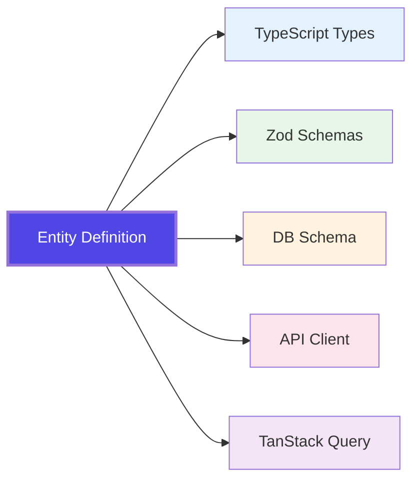

TypeScript has a powerful type system. However, many frameworks fail to fully leverage this strength.

Sonamu is designed with TypeScript's type system at its core.

## Core Philosophy: Single Source of Truth

**Define one Entity, and TypeScript handles the rest.**

<Frame caption="🎬 Full flow: Entity creation → Migration execution → Auto-generation of types/schemas/APIs → Frontend Service generation">
  <video
    muted
    loop
    playsInline
    controls
    className="w-full rounded-xl"
    preload="metadata"
    src="https://cf.cartanova.ai/sonamu-docs/introduction1.mp4"
  ></video>
</Frame>



Define an Entity in one place, and the entire system stays synchronized. No need to manually align types, document API specs, or write frontend clients.

## Backend and Frontend Type Synchronization

Typically, when building backend APIs and using them on the frontend, type synchronization is difficult. With Sonamu, backend changes are immediately reflected on the frontend, **catching errors at compile time**.

<Tabs>
  <Tab title="Manual Approach">
    ```typescript
    // Backend API
    router.get('/api/users/:id', async (req, res) => {
      const user = await db.users.findById(req.params.id);
      res.json(user);
    });
    
    // Frontend client (manually written)
    async function getUser(id: number): Promise<any> {  // ← any!
      const res = await fetch(`/api/users/${id}`);
      return res.json();
    }
    
    const user = await getUser(123);
    console.log(user.username);  // Potential runtime error
    ```
  </Tab>
  
  <Tab title="Sonamu Approach">
    ```typescript
    // Backend Model
    @api({ httpMethod: "GET", clients: ["axios", "tanstack-query"], resourceName: "User" })
    async findById<T extends UserSubsetKey>(subset: T, id: number): Promise<UserSubsetMapping[T]> {
      return this.getPuri("r").table("users").where("id", id).first();
    }

    @api({ httpMethod: "POST", clients: ["axios", "tanstack-mutation"] })
    async save(spa: UserSaveParams[]): Promise<number[]> {
      // ...
    }

    // Frontend Service (auto-generated)
    export namespace UserService {
      // GET request function
      export async function getUser<T extends UserSubsetKey>(
        subset: T,
        id: number,
      ): Promise<UserSubsetMapping[T]> {
        return fetch({
          method: "GET",
          url: `/api/user/findById?${qs.stringify({ subset, id })}`
        });
      }

      // React Query Hook for GET
      export const useUser = <T extends UserSubsetKey>(
        subset: T,
        id: number,
        options?: { enabled?: boolean },
      ) => useQuery({ queryKey: ["User", "getUser", subset, id], queryFn: () => getUser(subset, id), ...options });

      // POST request function
      export async function save(spa: UserSaveParams[]): Promise<number[]> {
        return fetch({
          method: "POST",
          url: `/api/user/save`,
          data: { spa }
        });
      }

      // React Query Hook for POST
      export const useSaveMutation = () =>
        useMutation({ mutationFn: (params: { spa: UserSaveParams[] }) => save(params.spa) });
    }

    // Usage in components
    const user = await UserService.getUser("A", 123);      // Direct call
    const { data: user } = UserService.useUser("A", 123);  // Hook call
    console.log(user.username);    // ✅ Type checked
    console.log(user.nonExistent); // ❌ Compile error
    ```

  </Tab>
</Tabs>

<Frame caption="📸 Compile error shown when accessing non-existent property in Sonamu approach">
  
</Frame>

---

## Frontend Integration

When you define a backend API, frontend Services and TanStack Query Hooks are automatically generated.

<Frame caption="🎬 Write backend @api method → Frontend Service auto-generated → Use useQuery">
  <video
    autoPlay
    muted
    loop
    playsInline
    controls
    className="w-full rounded-xl"
    src="/images/introduction3.mp4"
  ></video>
</Frame>

```tsx
// Backend: Define API with @api decorator
@api({ httpMethod: "GET" })
async getProfile(userId: number): Promise<User> {
  return this.getPuri("r").table("users").where("id", userId).first();
}

// Frontend: Use auto-generated Hook
function UserProfile({ userId }: { userId: number }) {
  const { data: user, isLoading } = UserService.useUser("A", userId);

  if (isLoading) return <div>Loading...</div>;
  return <div>{user.username}</div>; // ✅ Perfect type safety
}
```

### Optimization with Subsets

Query only the fields you need to reduce network costs and improve performance. Exact TypeScript types are automatically generated for each Subset.

```typescript
// List view: minimal info only
const users = await UserService.findMany("A", { page: 1 });
// { id, email, username }

// Detail view: full info
const user = await UserService.findById("C", userId);
// { id, email, username, bio, createdAt, updatedAt, ... }
```

**Key Features**:

- ✅ Backend changes detected immediately via compile errors
- ✅ Clean structure with Namespace-based organization
- ✅ TanStack Query auto-integration (caching, revalidation, optimistic updates)
- ✅ Accurate type inference per Subset

<CardGroup cols={2}>
  <Card
    title="Using Services"
    icon="code"
    href="/en/frontend-integration/generated-services/using-services"
  >
    Leverage auto-generated Services
  </Card>
  <Card
    title="TanStack Query"
    icon="arrows-rotate"
    href="/en/frontend-integration/generated-services/tanstack-query"
  >
    Data fetching with React Hooks
  </Card>
</CardGroup>

---

## Testing

Sonamu includes powerful built-in tools for testing.

### Fixture System

Easily create and reuse test data.

```typescript
// Define Fixtures
export const UserFixtures = {
  admin: {
    email: "admin@test.com",
    username: "admin",
    role: "admin",
  },
  user: {
    email: "user@test.com",
    username: "user",
    role: "user",
  },
};

// Use in tests
test("Admin can view all users", async () => {
  const admin = await createUser(UserFixtures.admin);
  // ...
});
```

### Naite: Test Data Tracking & Visualization

Track and visualize all data changes during test execution. Debugging becomes much easier.

<Frame caption="📸 Naite Viewer screen - UI that visually shows database changes during test execution">
  <video
    muted
    loop
    playsInline
    controls
    className="w-full rounded-xl"
    preload="metadata"
    src="https://cf.cartanova.ai/sonamu-docs/introduction4.mp4"
  ></video>
</Frame>

```typescript
test("User creation flow", async () => {
  Naite.t("Initial state", { userCount: 0 });

  const user = await UserModel.create({
    email: "test@test.com",
    username: "testuser",
  });

  Naite.t("After user creation", { userCount: 1, userId: user.id });

  await UserModel.delete(user.id);

  Naite.t("After deletion", { userCount: 0 });
});
```

### Automatic Transaction Rollback

Each test runs in an isolated Transaction and automatically rolls back. Test isolation is guaranteed and no data cleanup is needed.

```typescript
test("Create user", async () => {
  await UserModel.create({ email: "test@test.com", ... });
  // Auto rollback after test ends → DB remains clean
});

test("Next test starts with clean DB", async () => {
  const users = await UserModel.findMany();
  expect(users).toHaveLength(0); // ✅ No data from previous test
});
```

### Context-Based Permission Testing

Test while authenticated as a specific user.

```typescript
testAs(
  { id: 1, role: "admin" },
  "Admin can delete all posts",
  async () => {
    await PostModel.delete(123);
    // Context.user is set to admin
  }
);

testAs(
  { id: 2, role: "user" },
  "Regular user can only delete their own posts",
  async () => {
    await expect(PostModel.delete(999)).rejects.toThrow("Permission denied");
  }
);
```

**Key Features**:

- ✅ Reuse test data with Fixtures
- ✅ Visualize data changes with Naite
- ✅ Isolated tests with automatic Transaction rollback
- ✅ Simplified permission testing with testAs

<CardGroup cols={2}>
  <Card
    title="Fixture System"
    icon="box"
    href="/en/testing/writing-tests/test-helpers"
  >
    Test data management
  </Card>
  <Card title="Naite Guide" icon="chart-line" href="/en/testing/naite">
    Data tracking & visualization
  </Card>
</CardGroup>

---

## AI Ready

Sonamu natively supports features for the AI era.

### Vector Search (pgvector)

Define AI embedding search as an Entity field and you're done. Native support for pgvector.

<Frame caption="🎬 Define vector field in Entity → Auto-generate migration → Implement vector search API">
  <video
    autoPlay
    muted
    loop
    playsInline
    controls
    className="w-full rounded-xl"
    src="/images/introduction5.mp4"
  ></video>
</Frame>

```typescript
// Define vector field in Entity
{
  "name": "embedding",
  "type": "vector",
  "dimensions": 1536
}

// Vector search (using raw SQL)
const results = await DocumentModel.getPuri("r").raw(`
  SELECT
    id, title, content,
    1 - (embedding <=> ?) AS similarity
  FROM documents
  WHERE embedding IS NOT NULL
  ORDER BY embedding <=> ?
  LIMIT 10
`, [
  JSON.stringify(queryEmbedding),
  JSON.stringify(queryEmbedding)
]);
```

### AI SDK Integration

Seamlessly integrates with Vercel AI SDK. Streaming responses are simple.

```typescript
@api({ httpMethod: "POST" })
async chat(message: string): Promise<StreamingResponse> {
  const result = await streamText({
    model: openai("gpt-4"),
    messages: [{ role: "user", content: message }],
  });

  return result.toTextStreamResponse();
}
```

### SSE (Server-Sent Events)

Easily use SSE for real-time streaming.

```typescript
import { Sonamu } from "sonamu";
import { z } from "zod";

@api({ httpMethod: "GET" })
async streamEvents() {
  const { createSSE } = Sonamu.getContext();

  const events = z.object({
    type: z.literal("message"),
    data: z.string(),
  });

  return createSSE(events)(async (emit) => {
    for (let i = 0; i < 10; i++) {
      await emit({ type: "message", data: `Event ${i}` });
      await sleep(1000);
    }
  });
}
```

### AI Agent Integration

Create Entities in natural language using AI chat in Sonamu UI.

<Frame caption="🎬 Type 'Create an e-commerce order system' in Sonamu UI → 4 Entities auto-generated">
  <video
    muted
    loop
    playsInline
    controls
    className="w-full rounded-xl"
    src="https://cf.cartanova.ai/sonamu-docs/introduction6.mp4"
  ></video>
</Frame>

```
💬 "Create an e-commerce order system. I need tables for users, products, orders, and order items."

→ 4 Entities are automatically generated including relationships.
```

**Key Features**:

- ✅ Native pgvector support (vector search)
- ✅ Seamless AI SDK integration (streaming)
- ✅ Real-time events with SSE
- ✅ Auto-generate Entities with AI Agent

<CardGroup cols={2}>
  <Card
    title="Vector Search"
    icon="magnifying-glass"
    href="/en/advanced-features/vector-search/pgvector-setup"
  >
    Implement embedding search
  </Card>
  <Card title="SSE Streaming" icon="signal-stream" href="/en/advanced-features/sse">
    Real-time event transmission
  </Card>
</CardGroup>

---

## Production Ready

Sonamu includes powerful features built for production environments.

### BentoCache: Multi-Layer Caching

Easily use memory + Redis multi-layer caching.

```typescript
import { Sonamu } from "sonamu";

// L1 (memory) + L2 (Redis) caching
const user = await Sonamu.cache.getOrSet(
  `user:${userId}`,
  async () => {
    return await UserModel.findById("C", userId);
  },
  { ttl: "5m" } // 5 minute cache
);
```

### Cache-Control: Response Caching

Set HTTP response caching strategies simply with decorators.

```typescript
@api({
  httpMethod: "GET",
  cacheControl: { maxAge: 3600, sMaxAge: 7200 }
})
async getPublicData(): Promise<PublicData[]> {
  return await this.getPuri("r")
    .table("public_data")
    .where("public", true);
}
```

### i18n: Type-Safe Internationalization

Entity title, prop.desc, and enumLabels are automatically extracted to the dictionary. Manage translations with the type-safe `SD()` function, and non-existent keys are caught at compile time.

```typescript
import { SD } from "../i18n/sd.generated";

SD("common.save")         // "저장" (ko) / "Save" (en)
SD("error.typo")          // ❌ Compile error: key not found

SD("entity.User")         // "User" - Auto-extracted Entity title
SD("entity.User.email")   // "Email" - Auto-extracted prop.desc
SD.enumLabels("UserRole")["admin"]  // "Administrator"
```

### Workflow: Complex Business Logic Management

Systematically manage complex multi-step business logic.

```typescript
import { workflow } from "sonamu";

export const processOrder = workflow(
  {
    name: "process-order",
    version: "1.0",
  },
  async ({ input, step }) => {
    // Step 1: Validation
    await step
      .define({ name: "validate" }, async () => validateOrder(input))
      .run();

    // Step 2: Payment
    const payment = await step
      .define({ name: "charge" }, async () => chargePayment(input))
      .run();

    // Step 3: Create Order
    const order = await step
      .define({ name: "create-order" }, async () =>
        createOrderRecord(input, payment)
      )
      .run();

    // Step 4: Send Email
    await step
      .define({ name: "send-email" }, async () => sendConfirmationEmail(order))
      .run();

    return order;
  }
);

// Execute
await Sonamu.workflows.run(processOrder, orderData);
```

### Built-in Performance Optimization

N+1 problem auto-resolution, query optimization, and HMR (Hot Module Replacement) are provided by default.

```typescript
// N+1 auto-resolved in relation queries
const posts = await PostModel.findMany("A", {
  relations: ["author", "tags"], // Optimized with DataLoader pattern
});
```

**Key Features**:

- ✅ Multi-layer caching with BentoCache (memory + Redis)
- ✅ HTTP response caching with Cache-Control
- ✅ Type-safe internationalization with i18n
- ✅ Complex business logic management with Workflow
- ✅ N+1 problem auto-resolution

<CardGroup cols={2}>
  <Card
    title="BentoCache"
    icon="layer-group"
    href="/en/advanced-features/caching/bentocache"
  >
    Multi-layer caching strategies
  </Card>
  <Card
    title="i18n"
    icon="language"
    href="/en/advanced-features/i18n/overview"
  >
    Internationalization system
  </Card>
</CardGroup>

---

## Simple Example

The complete flow from defining an Entity to using it.

> **Note:** Auto-generated files
>
> - `api/src/application/sonamu.generated.ts` - All types, schemas, Enums
> - `web/src/services/sonamu.generated.ts` - Frontend types (synchronized)
> - `web/src/services/services.generated.ts` - All Service methods
> - `web/src/services/{entity}/{entity}.types.ts` - Custom types (manually written)

### 1. Define Entity

<Frame caption="🎬 Defining User Entity in Sonamu UI">
  <video
    autoPlay
    muted
    loop
    playsInline
    controls
    className="w-full rounded-xl"
    preload="metadata"
    src="https://cf.cartanova.ai/sonamu-docs/introduction7.mp4"
  ></video>
</Frame>

```json
{
  "id": "User",
  "table": "users",
  "props": [
    { "name": "email", "type": "string", "length": 255 },
    { "name": "username", "type": "string", "length": 100 },
    { "name": "role", "type": "enum", "id": "UserRole" }
  ]
}
```

### 2. Run Migration and Sync

Save Entity → Run Migration → `pnpm sync`:

✅ TypeScript types (`sonamu.generated.ts`)  
✅ Zod schemas (BaseSchema, BaseListParams)  
✅ DB migrations  
✅ Frontend Service (`services.generated.ts`)  
✅ TanStack Query Hooks

### 3. Write Business Logic in Model

```typescript
@api({ httpMethod: "POST" })
@transactional()
async register(params: {
  email: string;
  username: string;
  password: string;
}): Promise<{ user: User }> {
  const wdb = this.getPuri("w");

  wdb.ubRegister("users", {
    email: params.email,
    username: params.username,
    password: await bcrypt.hash(params.password, 10),
    role: "user",
  });

  const [userId] = await wdb.ubUpsert("users");
  const user = await this.findById("C", userId);

  return { user };
}
```

### 4. Use Immediately in React

```tsx
import { useTypeForm } from "@sonamu-kit/react-components/lib";
import { Input, Button } from "@sonamu-kit/react-components/components";
import { UserService } from "@/services/services.generated";
import { UserSaveParams } from "@/services/user/user.types";

function RegisterForm() {
  const { register, submit } = useTypeForm(UserSaveParams, {
    email: "",
    username: "",
    password: "",
  });

  const saveMutation = UserService.useSaveMutation();

  const handleSubmit = submit(async (form) => {
    saveMutation.mutate(
      { spa: [form] },
      {
        onSuccess: ([userId]) => {
          console.log("Registered:", userId); // ✅ Type safe
        },
      },
    );
  });

  return (
    <div>
      <Input placeholder="Email" {...register("email")} />
      <Input placeholder="Username" {...register("username")} />
      <Input type="password" placeholder="Password" {...register("password")} />
      <Button onClick={handleSubmit}>Register</Button>
    </div>
  );
}
```

<Frame caption="🎬 Complete flow: Entity definition → Migration → Model writing → Usage in React">
  <video
    muted
    loop
    playsInline
    controls
    className="w-full rounded-xl"
    preload="metadata"
    src="https://cf.cartanova.ai/sonamu-docs/introduction1.mp4"
  ></video>
</Frame>

---

## Who Is This Framework For

<CardGroup cols={2}>
  <Card title="Productivity-Focused Developers" icon="rocket">
    Those who want to focus on business logic without wasting time on repetitive tasks
  </Card>

{" "}

<Card title="Teams That Trust Type Safety" icon="shield-check">
  Teams that prefer compile errors over runtime errors and maximize IDE assistance
</Card>

{" "}

<Card title="Backend Developers Collaborating with Frontend" icon="handshake">
  Those who want to escape the dual work of API spec documentation and client writing
</Card>

  <Card title="Startups Needing Rapid Prototyping" icon="gauge-high">
    Teams that want to build MVPs quickly while minimizing technical debt
  </Card>
</CardGroup>

---

## Getting Started

3 minutes is all you need.

```bash
# Create project
pnpm create sonamu my-project

# Start development server
cd my-project/api
pnpm dev

# Open Sonamu UI
open http://localhost:1028/sonamu-ui
```

<CardGroup cols={2}>
  <Card title="Quick Start" icon="rocket" href="/en/getting-started/quick-start">
    Create your first API in 5 minutes
  </Card>

{" "}

<Card title="Installation" icon="download" href="/en/getting-started/installation">
  Detailed installation guide
</Card>

{" "}

<Card title="Core Concepts" icon="book" href="/en/core-concepts/how-sonamu-works">
  Understand how Sonamu works
</Card>

  <Card
    title="Development Workflow"
    icon="diagram-project"
    href="/en/getting-started/development-workflow"
  >
    Learn the development workflow
  </Card>
</CardGroup>

---

## Community

<Card
  title="GitHub"
  icon="github"
  href="https://github.com/cartanova-ai/sonamu"
>
  Issue reports and contributions
</Card>

---

**With Sonamu, developing in TypeScript becomes enjoyable.**
