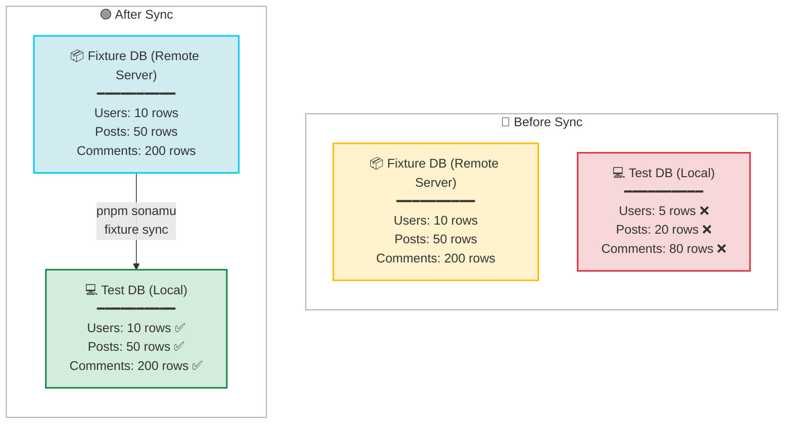

Learn how to sync Fixture DB data to Test DB to prepare the test environment.

## Fixture Sync Overview

<CardGroup cols={2}>
  <Card title="Complete Copy" icon="copy">
    All data Schema + Records
  </Card>
  <Card title="Clean Start" icon="broom">
    Test DB initialization Consistent environment
  </Card>
  <Card title="Fast Execution" icon="bolt">
    pg_dump + pg_restore Efficient copy
  </Card>
  <Card title="Auto Execution" icon="gear">
    Auto after import Manual also available
  </Card>
</CardGroup>

## pnpm sonamu fixture sync

Copies all data from Fixture DB to Test DB.

### Basic Usage

```bash
pnpm sonamu fixture sync
```

This command:

1. Completely initializes Test DB
2. Dumps Fixture DB
3. Restores to Test DB

## How It Works

### Internal Implementation

```typescript
// sonamu/src/testing/fixture-manager.ts
async function sync() {
  const fixtureConn = Sonamu.dbConfig.fixture.connection;
  const testConn = Sonamu.dbConfig.test.connection;

  // 1. Terminate Test DB connections
  execSync(`psql -h ${testConn.host} -p ${testConn.port} -U ${testConn.user} 
    -d postgres -c "
      SELECT pg_terminate_backend(pg_stat_activity.pid)
      FROM pg_stat_activity
      WHERE datname = '${testConn.database}'
        AND pid <> pg_backend_pid();
    "`);

  // 2. Recreate Test DB
  execSync(`psql -h ${testConn.host} -U ${testConn.user} -d postgres 
    -c "DROP DATABASE IF EXISTS \\"${testConn.database}\\""`);

  execSync(`psql -h ${testConn.host} -U ${testConn.user} -d postgres 
    -c "CREATE DATABASE \\"${testConn.database}\\""`);

  // 3. Fixture DB → Test DB copy
  const dumpCmd = `pg_dump -h ${fixtureConn.host} -p ${fixtureConn.port} 
    -U ${fixtureConn.user} -d ${fixtureConn.database} -Fc`;

  const restoreCmd = `pg_restore -h ${testConn.host} -p ${testConn.port} 
    -U ${testConn.user} -d ${testConn.database} --no-owner --no-acl`;

  execSync(`${dumpCmd} | PGPASSWORD="${testConn.password}" ${restoreCmd}`);
}
```

### Execution Process

```bash
$ pnpm sonamu fixture sync

# 1. Terminate existing connections
Terminating existing connections to myapp_test...

# 2. Recreate Test DB
DROP DATABASE IF EXISTS "myapp_test"
CREATE DATABASE "myapp_test"

# 3. Dump Fixture DB
pg_dump -h fixture-db.example.com -d myapp_fixture -Fc

# 4. Restore to Test DB
pg_restore -h localhost -d myapp_test --no-owner --no-acl

✅ Sync complete!
```

## Usage Scenarios

### 1. After Fixture Changes

```bash
# Add new data to Fixture
pnpm sonamu fixture import User 10 11 12

# Sync runs automatically
# But manual is also possible:
pnpm sonamu fixture sync
```

### 2. Test DB Initialization

```bash
# When Test DB is polluted
# (e.g., manually added data)
pnpm sonamu fixture sync

# Reset to clean Fixture data
```

### 3. Team Synchronization

```bash
# Team member A adds data to Fixture
# (saved to remote Fixture DB)

# Team member B syncs to local Test DB
pnpm sonamu fixture sync
```

## Database Comparison



## pg_dump Options

### -Fc (Format Custom)

Dumps in binary format for speed and efficiency.

```bash
# -Fc: Custom format (compressed binary)
pg_dump -d myapp_fixture -Fc
```

**Benefits**:

- Compressed, smaller size
- Selective restore possible with `pg_restore`
- Fast speed

### --no-owner --no-acl

Excludes owner and permission information.

```bash
pg_restore -d myapp_test --no-owner --no-acl
```

**Reason**:

- Users may differ between local and remote
- Prevents permission conflicts

## Auto vs Manual

### Auto Sync

Sync is automatically called when running `pnpm sonamu fixture import`:

```typescript
async function fixture_import(entityId: string, recordIds: number[]) {
  await setupFixtureManager();

  // 1. Import
  await FixtureManager.importFixture(entityId, recordIds);

  // 2. Sync (auto)
  await FixtureManager.sync();
}
```

```bash
$ pnpm sonamu fixture import User 1 2 3

# After import completes, automatically:
✅ Import complete! Syncing to test DB...
# Sync runs...
```

### Manual Sync

Run directly when needed:

```bash
# Reset Test DB to Fixture DB state
pnpm sonamu fixture sync
```

## Workflow

### Typical Development Flow

```bash
# 1. Import necessary data from production
pnpm sonamu fixture import User 1 2 3
# → Sync runs automatically

# 2. Run tests
pnpm test

# 3. Import additional data if needed
pnpm sonamu fixture import Post 10 11 12
# → Sync runs automatically

# 4. Re-run tests
pnpm test
```

### Fixture Sharing Flow

```bash
# Team member A
pnpm sonamu fixture import User 100 101 102
# → Saved to Fixture DB (remote)

# Team member B
pnpm sonamu fixture sync
# → Copy from Fixture DB to local Test DB

# Team member B can now test with same data
```

## Performance Optimization

### 1. Local Fixture DB

Sync is faster when running Fixture DB locally:

```json
// sonamu.config.json
{
  "db": {
    "fixture": {
      "client": "pg",
      "connection": {
        "host": "localhost", // Local
        "database": "myapp_fixture"
      }
    },
    "test": {
      "client": "pg",
      "connection": {
        "host": "localhost",
        "database": "myapp_test"
      }
    }
  }
}
```

### 2. Minimal Data

Keep only necessary data in Fixture:

```bash
# ✅ Correct: Only what's needed
pnpm sonamu fixture import User 1 2 3

# ❌ Wrong: Too much data
pnpm sonamu fixture import User $(seq 1 1000)
```

## Best Practices

### 1. Regular Sync

```bash
# Sync to latest Fixture every morning
pnpm sonamu fixture sync

# Run tests
pnpm test
```

### 2. CI/CD Integration

```yaml
# .github/workflows/test.yml
name: Test

on: [push, pull_request]

jobs:
  test:
    runs-on: ubuntu-latest
    steps:
      - uses: actions/checkout@v2

      - name: Setup PostgreSQL
        run: |
          docker run -d -p 5432:5432 \
            -e POSTGRES_PASSWORD=postgres \
            postgres:14

      - name: Initialize Fixture
        run: pnpm sonamu fixture init

      - name: Sync Fixture
        run: pnpm sonamu fixture sync

      - name: Run Tests
        run: pnpm test
```

### 3. Add Scripts

```json
// package.json
{
  "scripts": {
    "test:setup": "pnpm sonamu fixture sync",
    "test": "pnpm test:setup && vitest"
  }
}
```

```bash
# Auto sync before test
pnpm test
```

## Troubleshooting

### Connection Failed

```bash
Error: connection to server at "fixture-db.example.com" failed
```

**Solution**:

- Check network connection
- Check Fixture DB server status
- Check firewall settings

### Permission Error

```bash
Error: must be owner of database myapp_test
```

**Solution**:

```sql
-- Change Test DB owner
ALTER DATABASE myapp_test OWNER TO current_user;
```

### DB In Use

```bash
Error: database "myapp_test" is being accessed by other users
```

**Solution**:

```sql
-- Terminate all connections
SELECT pg_terminate_backend(pg_stat_activity.pid)
FROM pg_stat_activity
WHERE datname = 'myapp_test'
  AND pid <> pg_backend_pid();
```

Or:

```bash
# Stop application and try again
pnpm sonamu fixture sync
```

## Cautions

<Warning>
  **Cautions when syncing fixtures**: 1. **Test DB initialization**: All existing data will be
  deleted 2. **Permissions required**: DROP/CREATE permissions for Test DB 3. **Connection
  termination**: Will fail if tests are running 4. **Network**: Takes time if Fixture DB is remote
  5. **Data size**: Sync is slow if Fixture is large
</Warning>

## Next Steps

<CardGroup cols={2}>
  <Card title="Test DB" icon="database" href="/en/testing/fixtures/test-database">
    Test DB setup
  </Card>
  <Card title="Creating Fixtures" icon="plus" href="/en/testing/fixtures/creating-fixtures">
    Writing fixture.ts
  </Card>
  <Card title="Loading Fixtures" icon="download" href="/en/testing/fixtures/loading-fixtures">
    Import production data
  </Card>
  <Card title="Writing Tests" icon="vial" href="/en/testing/writing-tests/test-structure">
    Understanding test structure
  </Card>
</CardGroup>
