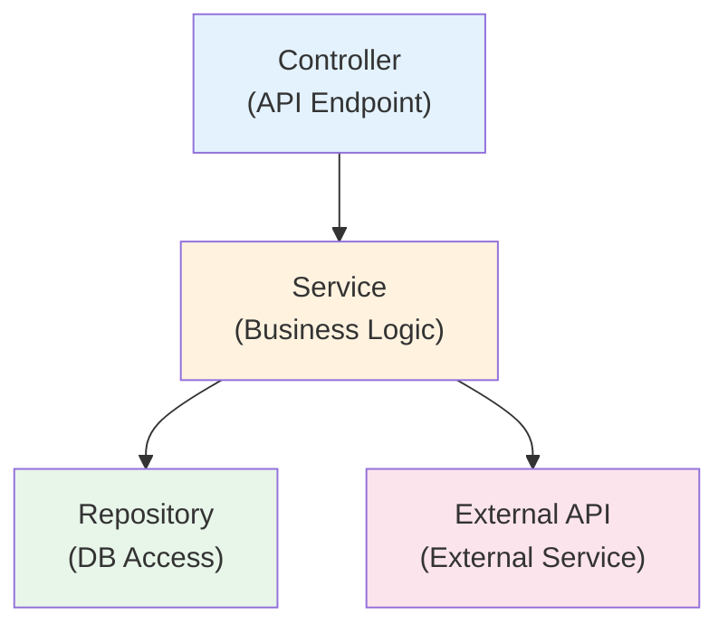

Learn how to write independent tests by mocking external dependencies like APIs, file systems, and timers.

## What is API Mocking?

In testing, **Mocking** refers to providing fake behavior for external dependencies (APIs, file systems, time, etc.) **without actually executing them**. This enables:

- Tests run regardless of external service outages
- Fast tests without network calls
- Stable tests with predictable results
- Avoiding costly operations (payments, SMS, etc.)

## Types of Mocking

Sonamu supports three types of mocking:

<CardGroup cols={3}>
  <Card title="Vitest Mock" icon="flask">
    Vitest's built-in mocking features
  </Card>
  <Card title="Naite Mock" icon="database">
    Dynamic mocking with Naite
  </Card>
  <Card title="Manual Mock" icon="code">
    Manually implemented mock objects
  </Card>
</CardGroup>

## Using Vitest Mock

### Module Mocking

Replace external module behavior with fakes:

```typescript
import { test, vi } from "vitest";
import axios from "axios";

// Replace entire axios module with Mock
vi.mock("axios");

test("external API call", async () => {
  // Set mock function return value
  vi.mocked(axios.get).mockResolvedValue({
    data: { id: 1, name: "John" },
  });
  
  const result = await userService.fetchUser(1);
  
  expect(result.name).toBe("John");
  expect(axios.get).toHaveBeenCalledWith("/api/users/1");
});
```

### Function Spy

Track actual function calls:

```typescript
import { test, vi } from "vitest";
import { emailService } from "../services/email.service";

test("verify email sending", async () => {
  // Create Spy to track function calls
  const sendSpy = vi.spyOn(emailService, "send").mockResolvedValue(true);
  
  await userService.register({ email: "user@example.com" });
  
  // Verify email send function was called
  expect(sendSpy).toHaveBeenCalledWith({
    to: "user@example.com",
    subject: "Welcome!",
  });
  
  // Clean up Spy
  sendSpy.mockRestore();
});
```

### Timer Mocking

Control time-related functions:

```typescript
import { test, vi } from "vitest";

test("setTimeout test", async () => {
  // Use fake timers
  vi.useFakeTimers();
  
  let executed = false;
  setTimeout(() => {
    executed = true;
  }, 1000);
  
  // Before 1 second
  expect(executed).toBe(false);
  
  // Advance time by 1 second
  vi.advanceTimersByTime(1000);
  
  // After 1 second
  expect(executed).toBe(true);
  
  // Restore to real timers
  vi.useRealTimers();
});
```

<Info>
**bootstrap() and timers**: Sonamu's `bootstrap()` function automatically calls `vi.useRealTimers()` in `afterEach` to restore timers. No need to call it separately.
</Info>

### Date Mocking

Fix the current time:

```typescript
import { test, vi } from "vitest";

test("check today's date", () => {
  // Fix to January 1, 2025
  vi.setSystemTime(new Date("2025-01-01T00:00:00Z"));
  
  const today = new Date();
  expect(today.getFullYear()).toBe(2025);
  expect(today.getMonth()).toBe(0);  // 0 = January
  
  // Restore system time
  vi.useRealTimers();
});
```

## Using Naite Mock

Use Naite's special key patterns to create mocks dynamically.

### File System Mocking

#### Creating Virtual Files

Register virtual files with the `mock:fs/promises:virtualFileSystem` key:

```typescript
import { test } from "sonamu/test";
import { Naite } from "sonamu";
import { access, constants } from "fs/promises";
import { expect } from "vitest";

test("virtual file system", async () => {
  const filePath = "/tmp/my-virtual-file.txt";
  
  // 1. File doesn't actually exist
  await expect(
    access(filePath, constants.F_OK)
  ).rejects.toThrow();
  
  // 2. Register virtual file with Naite
  Naite.t("mock:fs/promises:virtualFileSystem", filePath);
  
  // 3. Now behaves as if file "exists"
  await expect(
    access(filePath, constants.F_OK)
  ).resolves.toBeUndefined();
  
  // 4. Delete Mock
  Naite.del("mock:fs/promises:virtualFileSystem");
  
  // 5. No longer exists
  await expect(
    access(filePath, constants.F_OK)
  ).rejects.toThrow();
});
```

#### Practical Example: File Upload Test

```typescript
import { test } from "sonamu/test";
import { Naite } from "sonamu";
import { fileService } from "../services/file.service";
import { expect } from "vitest";

test("check file existence", async () => {
  const uploadPath = "/uploads/user/123/profile.jpg";
  
  // Register virtual file
  Naite.t("mock:fs/promises:virtualFileSystem", uploadPath);
  
  // Test file service
  const exists = await fileService.checkExists(uploadPath);
  expect(exists).toBe(true);
  
  // Clean up Mock
  Naite.del("mock:fs/promises:virtualFileSystem");
});

test("check multiple files", async () => {
  const files = [
    "/uploads/file1.pdf",
    "/uploads/file2.pdf",
    "/uploads/file3.pdf",
  ];
  
  // Register multiple files
  for (const file of files) {
    Naite.t("mock:fs/promises:virtualFileSystem", file);
  }
  
  // Batch check
  const results = await fileService.checkMultiple(files);
  expect(results.every(r => r.exists)).toBe(true);
  
  // Clean up
  Naite.del("mock:fs/promises:virtualFileSystem");
});
```

### How Naite Mock Works

Naite detects special key patterns (`mock:*`) to intercept corresponding behavior:

```typescript
// Sonamu internal (pseudocode)
async function access(path: string) {
  // Check mock:fs/promises:virtualFileSystem in Naite
  const mocked = Naite.get("mock:fs/promises:virtualFileSystem")
    .result()
    .includes(path);
  
  if (mocked) {
    // If virtual file is registered, succeed
    return Promise.resolve();
  }
  
  // Check actual file system
  return realAccess(path);
}
```

## Implementing Manual Mock

Implement Mock classes directly for complex external services.

### Creating Mock Class

```typescript
// __mocks__/payment.service.ts
export class MockPaymentService {
  private payments: Map<string, any> = new Map();
  
  async charge(amount: number, userId: number) {
    const paymentId = `mock_${Date.now()}`;
    
    this.payments.set(paymentId, {
      id: paymentId,
      amount,
      userId,
      status: "success",
      createdAt: new Date(),
    });
    
    return {
      success: true,
      paymentId,
    };
  }
  
  async getPayment(paymentId: string) {
    return this.payments.get(paymentId) ?? null;
  }
  
  async refund(paymentId: string) {
    const payment = this.payments.get(paymentId);
    if (!payment) {
      throw new Error("Payment not found");
    }
    
    payment.status = "refunded";
    return { success: true };
  }
  
  // Test helper
  clear() {
    this.payments.clear();
  }
}
```

### Using Mock

```typescript
import { test, beforeEach } from "vitest";
import { MockPaymentService } from "./__mocks__/payment.service";
import { orderService } from "../services/order.service";

let mockPayment: MockPaymentService;

beforeEach(() => {
  mockPayment = new MockPaymentService();
  // Replace real service with Mock
  orderService.paymentService = mockPayment as any;
});

test("order payment", async () => {
  const order = await orderService.create({
    userId: 1,
    items: [{ productId: 1, quantity: 2 }],
    totalAmount: 50000,
  });
  
  // Execute Mock payment
  const result = await orderService.processPayment(order.id);
  
  expect(result.success).toBe(true);
  expect(result.paymentId).toBeDefined();
  
  // Verify payment recorded in Mock
  const payment = await mockPayment.getPayment(result.paymentId);
  expect(payment?.amount).toBe(50000);
  expect(payment?.status).toBe("success");
});

test("payment failure scenario", async () => {
  // Configure Mock to throw error
  mockPayment.charge = async () => {
    throw new Error("Card declined");
  };
  
  const order = await orderService.create({
    userId: 1,
    items: [{ productId: 1, quantity: 1 }],
    totalAmount: 10000,
  });
  
  await expect(
    orderService.processPayment(order.id)
  ).rejects.toThrow("Card declined");
});
```

## Practical Examples

### External API Call Mocking

```typescript
import { test, vi } from "vitest";
import axios from "axios";
import { weatherService } from "../services/weather.service";

vi.mock("axios");

test("fetch weather info", async () => {
  // Mock API response
  vi.mocked(axios.get).mockResolvedValue({
    data: {
      temperature: 25,
      condition: "Sunny",
      humidity: 60,
    },
  });
  
  const weather = await weatherService.getCurrentWeather("Seoul");
  
  expect(weather.temperature).toBe(25);
  expect(weather.condition).toBe("Sunny");
  expect(axios.get).toHaveBeenCalledWith(
    expect.stringContaining("Seoul")
  );
});

test("API error handling", async () => {
  // Simulate network error
  vi.mocked(axios.get).mockRejectedValue(
    new Error("Network Error")
  );
  
  await expect(
    weatherService.getCurrentWeather("Seoul")
  ).rejects.toThrow("Failed to fetch weather information");
});
```

### SMS Sending Mocking

```typescript
import { test, vi } from "vitest";
import { smsService } from "../services/sms.service";
import { userService } from "../services/user.service";

test("registration SMS sending", async () => {
  // Mock SMS send function
  const sendSpy = vi
    .spyOn(smsService, "send")
    .mockResolvedValue({ success: true, messageId: "mock_123" });
  
  await userService.register({
    phone: "010-1234-5678",
    name: "John Doe",
  });
  
  // Verify SMS was sent
  expect(sendSpy).toHaveBeenCalledWith({
    to: "010-1234-5678",
    message: expect.stringContaining("verification code"),
  });
  
  sendSpy.mockRestore();
});
```

### File Upload Mocking

```typescript
import { test } from "sonamu/test";
import { Naite } from "sonamu";
import { imageService } from "../services/image.service";
import { expect } from "vitest";

test("image upload and processing", async () => {
  const originalPath = "/tmp/upload/original.jpg";
  const thumbnailPath = "/tmp/upload/thumbnail.jpg";
  
  // Register virtual file
  Naite.t("mock:fs/promises:virtualFileSystem", originalPath);
  
  // Image processing (thumbnail creation)
  await imageService.createThumbnail(originalPath, thumbnailPath);
  
  // Assume thumbnail is also virtually created
  Naite.t("mock:fs/promises:virtualFileSystem", thumbnailPath);
  
  // Verify both files exist
  const exists = await imageService.checkBothExist(
    originalPath,
    thumbnailPath
  );
  expect(exists).toBe(true);
  
  // Clean up
  Naite.del("mock:fs/promises:virtualFileSystem");
});
```

### Environment Variable Mocking

```typescript
import { test, vi } from "vitest";
import { configService } from "../services/config.service";

test("API key configuration", () => {
  // Mock environment variables
  vi.stubEnv("API_KEY", "test_key_12345");
  vi.stubEnv("API_URL", "https://test.api.com");
  
  const config = configService.load();
  
  expect(config.apiKey).toBe("test_key_12345");
  expect(config.apiUrl).toBe("https://test.api.com");
  
  // Restore environment variables
  vi.unstubAllEnvs();
});
```

## Mocking Strategy

### Layer-based Mocking



**Mocking by test level**:

1. **Unit test**: Mock all dependencies
   ```typescript
   test("Service unit test", async () => {
     // Mock both Repository and External API
     const mockRepo = { findById: vi.fn() };
     const mockApi = { fetch: vi.fn() };
     
     const service = new UserService(mockRepo, mockApi);
     await service.getUser(1);
   });
   ```

2. **Integration test**: Mock only external dependencies
   ```typescript
   test("Service + Repository integration test", async () => {
     // Mock only External API, use real DB
     vi.mock("axios");
     
     const user = await userService.getUser(1);
   });
   ```

3. **E2E test**: Minimize mocking
   ```typescript
   test("full flow test", async () => {
     // Only mock costly operations (payment, SMS, etc.)
     vi.spyOn(paymentService, "charge").mockResolvedValue({
       success: true,
     });
     
     const response = await request(app).post("/api/orders");
   });
   ```

### Mock Data Management

Manage test mock data in separate files:

```typescript
// __fixtures__/users.ts
export const mockUsers = {
  admin: {
    id: 1,
    username: "admin",
    role: "admin",
    email: "admin@example.com",
  },
  user: {
    id: 2,
    username: "user",
    role: "user",
    email: "user@example.com",
  },
  guest: {
    id: 3,
    username: "guest",
    role: "guest",
    email: "guest@example.com",
  },
};

// __fixtures__/api-responses.ts
export const mockApiResponses = {
  weather: {
    success: {
      temperature: 25,
      condition: "Sunny",
    },
    error: {
      error: "API_ERROR",
      message: "Failed to fetch weather information",
    },
  },
  payment: {
    success: {
      success: true,
      transactionId: "txn_12345",
    },
    failure: {
      success: false,
      error: "INSUFFICIENT_FUNDS",
    },
  },
};
```

Usage:

```typescript
import { mockUsers } from "./__fixtures__/users";
import { mockApiResponses } from "./__fixtures__/api-responses";

test("admin permission test", async () => {
  vi.mocked(userService.findById).mockResolvedValue(mockUsers.admin);
  
  const hasPermission = await authService.checkAdmin(1);
  expect(hasPermission).toBe(true);
});

test("weather API success", async () => {
  vi.mocked(axios.get).mockResolvedValue({
    data: mockApiResponses.weather.success,
  });
  
  const weather = await weatherService.get("Seoul");
  expect(weather.temperature).toBe(25);
});
```

## Cautions

<Warning>
**Cautions when mocking**:

1. **Avoid excessive mocking**: Too many mocks can diverge from actual behavior. Only mock what's necessary.

2. **Clean up mocks**: Not cleaning mocks in `afterEach` can affect other tests.
   ```typescript
   afterEach(() => {
     vi.restoreAllMocks();
     Naite.del("mock:*");
   });
   ```

3. **Match mock and real behavior**: If mock behavior differs from the real service, tests may pass but fail in production.

4. **Type safety**: Specify types for mocks to prevent runtime errors.
   ```typescript
   // ❌ No type
   vi.mocked(service.method).mockResolvedValue({});
   
   // ✅ With type
   vi.mocked(service.method).mockResolvedValue({
     id: 1,
     name: "test",
   } as User);
   ```

5. **Naite Mock scope**: `mock:*` keys work globally, so always delete them at test end.
</Warning>

## Next Steps

<CardGroup cols={2}>
  <Card title="runWithMockContext" icon="circle" href="/en/testing/mocking/run-with-mock-context">
    Testing with Mock Context
  </Card>
  <Card title="Database Mocking" icon="database" href="/en/testing/mocking/database-mocking">
    Isolating DB tests with transactions
  </Card>
  <Card title="Naite Logging" icon="pen" href="/en/testing/naite/recording-logs">
    Recording and tracking test logs
  </Card>
  <Card title="Bootstrap" icon="gear" href="/en/testing/getting-started/bootstrap">
    Test environment initialization
  </Card>
</CardGroup>
